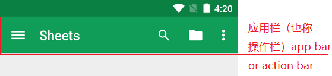
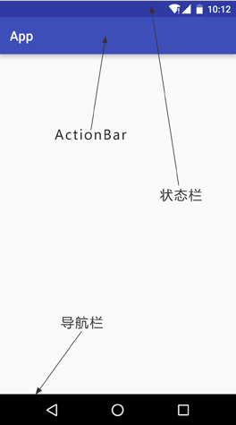

# Android APP页面组件简介

## 系统栏(System bars)

系统栏(System bars)是专用于显示通知、传达设备状态和进行设备导航的屏幕区域。通常，系统栏由状态栏（status bars）和导航栏（navigation bar）组成，它会与您的应用同时显示（如图 1 所示，区域1为状态栏，区域2为导航栏）。如果应用显示沉浸式内容（例如电影或图片），则可以暂时调暗系统栏图标以减少对用户的干扰，也可以暂时隐藏系统栏以让用户畅享完全沉浸式体验。

## 应用栏（也称为“操作栏”）

app bar (also called the action bar) 是应用 Activity 中最重要的设计元素之一，因为它为用户提供了熟悉的视觉结构和交互元素。使用应用栏可让您的应用与其他 Android 应用保持一致，从而让用户能够快速掌握如何操作您的应用并获得出色的体验。

 

如上图，可以看到，有状态栏(status bar)、标题栏(action bar, toolbar)、导航栏(navigation bar) 等,

### 状态栏 (status bar)

是指手机最顶上，显示中国移动、安全卫士、电量、网速等等，在手机的顶部。下拉就会出现通知栏。

### 导航栏 (navigation bar)

是手机最下面的返回，HOME，菜单（menu/recent）三个键。

### 系统栏 (system bar)

等于状态栏 + 导航栏

### 应用栏(app bar, action bar)

应用栏也称操作栏，一般是把标题栏(Toolbar) 设置为应用栏

### 标题栏 (action bar, toolbar)

是指一个APP程序最上部的titleBar，从名字就知道它显然就是一个应用程序一个页面的标题了，例如打开QQ消息主页，最上面显示消息那一栏就是标题栏。

#### 一般来说，APP实现沉浸式有三种需求：沉浸式状态栏，隐藏导航栏，APP全屏

沉浸式状态栏，是指状态栏与标题栏颜色相匹配

隐藏导航栏，是指将导航栏隐藏，去掉下面的黑条

APP全屏，是指将状态栏与导航栏都隐藏，例如很多游戏界面，都是APP全屏。

Reference：[控制系统界面可见度](https://developer.android.google.cn/training/system-ui)

[Android 状态栏, 标题栏, 导航栏，系统栏，应用栏的区别和解释](https://blog.csdn.net/cleverGump/article/details/85602372)

[添加应用栏](https://developer.android.google.cn/training/appbar)
