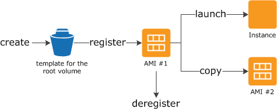

### Amazon 系统映像(Amazon Machine Images，AMI)

An Amazon Machine Image (AMI) provides the information required to launch an instance, which is a virtual server in the cloud. You specify an AMI when you launch an instance, and you can launch as many instances from the AMI as you need. You can also launch instances from as many different AMIs as you need.

Amazon 系统映像 (AMI) 提供启动实例 (云中的虚拟服务器) 所需的信息。您在启动实例时指定 AMI，且可以从该 AMI 启动所需任意数量的实例。您还可以根据需要从任意多个不同的 AMI 启动实例。

An AMI includes the following:

* A template for the root volume for the instance (for example, an operating system, an application server, and applications)
* Launch permissions that control which AWS accounts can use the AMI to launch instances
* A block device mapping that specifies the volumes to attach to the instance when it's launched

AMI 包括以下内容：

* 一个用于实例 (例如，操作系统、应用程序服务器和应用程序) 根卷的模板
* 控制可以使用 AMI 启动实例的 AWS 账户的启动许可信息
* 一个指定在实例启动时要附加到实例的卷的块储存设备映射。

Using an AMI

The following diagram summarizes the AMI lifecycle. After you create and register an AMI, you can use it to launch new instances. (You can also launch instances from an AMI if the AMI owner grants you launch permissions.) You can copy an AMI to the same region or to different regions. When you are finished launching instance from an AMI, you can deregister the AMI.

使用 AMI

上图总结了 AMI 生命周期。创建并注册一个 AMI 之后，您可以将其用于启动新实例。(如果 AMI 拥有者向您授予启动许可，则您也可以使用此 AMI 启动实例。)您可以将 AMI 复制到同一区域或不同区域。当您完成从 AMI 启动实例时，可以取消注册 AMI。

You can search for an AMI that meets the criteria for your instance. You can search for AMIs provided by AWS or AMIs provided by the community. For more information, see [AMI Types](http://docs.aws.amazon.com/en_us/AWSEC2/latest/UserGuide/ComponentsAMIs.html) and [Finding a Linux AMI](http://docs.aws.amazon.com/en_us/AWSEC2/latest/UserGuide/finding-an-ami.html).

您可以搜索符合您实例条件的 AMI。您可以搜索 AWS 提供的 AMI 或社区提供的 AMI。有关更多信息，请参阅 [AMI 类型](http://docs.aws.amazon.com/zh_cn/AWSEC2/latest/UserGuide/ComponentsAMIs.html) 和 [查找 Linux AMI](http://docs.aws.amazon.com/zh_cn/AWSEC2/latest/UserGuide/finding-an-ami.html)。

When you are connected to an instance, you can use it just like you use any other server. For information about launching, connecting, and using your instance, see [Amazon EC2 Instances](http://docs.aws.amazon.com/en_us/AWSEC2/latest/UserGuide/Instances.html).

连接到某个实例之后，您可以像使用任何其他服务器那样使用该实例。有关启动、连接和使用实例的信息，请[参阅 Amazon EC2 实例](http://docs.aws.amazon.com/zh_cn/AWSEC2/latest/UserGuide/Instances.html)。

Creating Your Own AMI

You can customize the instance that you launch from a public AMI and then save that configuration as a custom AMI for your own use. Instances that you launch from your AMI use all the customizations that you've made.

创建您自己的 AMI

可以自定义从公用 AMI 启动的实例，然后将配置保存为自定义 AMI 以供自己使用。从 AMI 启动的实例将使用您的所有自定义项。

The root storage device of the instance determines the process you follow to create an AMI. The root volume of an instance is either an Amazon EBS volume or an instance store volume. For information, see [Amazon EC2 Root Device Volume](http://docs.aws.amazon.com/en_us/AWSEC2/latest/UserGuide/RootDeviceStorage.html).

实例的根存储设备确定创建 AMI 所遵循的过程。实例的根卷是 Amazon EBS 卷或实例存储卷。有关信息，请[参阅 Amazon EC2 根设备卷](http://docs.aws.amazon.com/zh_cn/AWSEC2/latest/UserGuide/RootDeviceStorage.html)。

To create an Amazon EBS-backed AMI, see [Creating an Amazon EBS-Backed Linux AMI](http://docs.aws.amazon.com/en_us/AWSEC2/latest/UserGuide/creating-an-ami-ebs.html). To create an instance store-backed AMI, see [Creating an Instance Store-Backed Linux AMI](http://docs.aws.amazon.com/en_us/AWSEC2/latest/UserGuide/creating-an-ami-instance-store.html).

要创建由 Amazon EBS 支持的 AMI，请参阅[创建 Amazon EBS 支持的 Linux AMI](http://docs.aws.amazon.com/zh_cn/AWSEC2/latest/UserGuide/creating-an-ami-ebs.html)。要创建由实例存储支持的 AMI，请参阅[创建由实例存储支持的 Linux AMI](http://docs.aws.amazon.com/zh_cn/AWSEC2/latest/UserGuide/creating-an-ami-instance-store.html)。

To help categorize and manage your AMIs, you can assign custom tags to them. For more information, see [Tagging Your Amazon EC2 Resources](http://docs.aws.amazon.com/en_us/AWSEC2/latest/UserGuide/Using_Tags.html).

您可以为 AMI 分配自定义标签，以帮助您对 AMI 进行分类和管理。有关更多信息，请参阅 [标记 Amazon EC2 资源](http://docs.aws.amazon.com/zh_cn/AWSEC2/latest/UserGuide/Using_Tags.html)。

Reference: [Amazon Machine Images (AMI)](http://docs.aws.amazon.com/en_us/AWSEC2/latest/UserGuide/AMIs.html)
[Amazon 系统映像 (AMI)](http://docs.aws.amazon.com/zh_cn/AWSEC2/latest/UserGuide/AMIs.html)