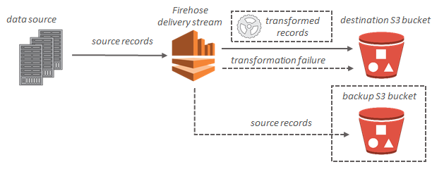

### What Is Amazon Kinesis Data Firehose?

Amazon Kinesis Data Firehose is a fully managed service for delivering real-time streaming data to destinations such as Amazon Simple Storage Service (Amazon S3), Amazon Redshift, Amazon Elasticsearch Service (Amazon ES), and Splunk. Kinesis Data Firehose is part of the Kinesis streaming data platform, along with [Kinesis Streams](http://docs.aws.amazon.com/streams/latest/dev/introduction.html) and [Amazon Kinesis Data Analytics](http://docs.aws.amazon.com/kinesisanalytics/latest/dev/what-is.html). With Kinesis Data Firehose, you don't need to write applications or manage resources. You configure your data producers to send data to Kinesis Data Firehose, and it automatically delivers the data to the destination that you specified. You can also configure Kinesis Data Firehose to transform your data before delivering it.

#### How it Works


Amazon Kinesis Data Firehose is the easiest way to load streaming data into data stores and analytics tools. It can capture, transform, and load streaming data into Amazon S3, Amazon Redshift, Amazon Elasticsearch Service, and Splunk, enabling near real-time analytics with existing business intelligence tools and dashboards you’re already using today. It is a fully managed service that automatically scales to match the throughput of your data and requires no ongoing administration. It can also batch, compress, and encrypt the data before loading it, minimizing the amount of storage used at the destination and increasing security.

With Amazon Kinesis Data Firehose, you only pay for the amount of data you transmit through the service. There is no minimum fee or setup cost.

#### Key Concepts

As you get started with Kinesis Data Firehose, you'll benefit from understanding the following concepts:

##### Kinesis Data Firehose delivery stream

The underlying entity of Kinesis Data Firehose. You use Kinesis Data Firehose by creating a Kinesis Data Firehose delivery stream and then sending data to it. 

##### record

The data of interest that your data producer sends to a Kinesis Data Firehose delivery stream. A record can be as large as 1,000 KB.

##### data producer

Producers send records to Kinesis Data Firehose delivery streams. For example, a web server that sends log data to a Kinesis Data Firehose delivery stream is a data producer. You can also configure your Kinesis Data Firehose delivery stream to automatically read data from an existing Kinesis stream, and load it into destinations. 

##### buffer size and buffer interval

Kinesis Data Firehose buffers incoming streaming data to a certain size or for a certain period of time before delivering it to destinations. `Buffer Size` is in MBs and `Buffer Interval` is in seconds.

#### A Sample Data Flow
For Amazon S3 destinations, streaming data is delivered to your S3 bucket. If data transformation is enabled, you can optionally back up source data to another Amazon S3 bucket.



#### Amazon Kinesis Data Firehose Pricing

With Amazon Kinesis Data Firehose, you pay only for the volume of data you transmit through the service. There are no set up fees or upfront commitments. You are billed for the volume of data transmitted through Kinesis Data Firehose, and usage charges associated with Amazon S3, Amazon Redshift, Amazon Elasticsearch Service, and Splunk.

##### Data Ingested

Pricing is based on volume of data ingested into Amazon Kinesis Data Firehose, which is calculated as the number of data records you send to the service, times the size of each record rounded up to the nearest 5KB. For example, if your data records are 42KB each, Kinesis Data Firehose will count each record as 45KB of data ingested.

使用 Amazon Kinesis Data Firehose，您只需为通过该服务传输的数据量付费。无设置费用，也无预先承诺。您只需为通过 Kinesis Data Firehose 传输的数据量，以及与关联的Amazon S3、Amazon Redshift、Amazon Elasticsearch Service 或 Splunk的使用费付费。

##### 注入的数据

定价的依据是注入 Amazon Kinesis Data Firehose 的数据量，具体计算方式为发送至该服务的数据记录数量，乘以每条记录大小向上取整最近 5KB 的数值。例如，如果每条数据记录的大小为 42KB，则 Kinesis Data Firehose 会将其计为 45KB 的注入数据。

```
Pricing by Region
Region: Asia Pacific (Tokyo)
                        Data Ingested, per GB
First 500 TB / month    $0.036
Next 1.5 PB / month     $0.031
Next 3 PB / month       $0.025
```

#### Amazon Kinesis Data Firehose Limits

Amazon Kinesis Data Firehose has the following limits.

- By default, each account can have up to 20 Kinesis Data Firehose delivery streams per Region. This limit can be increased using the Amazon Kinesis Data Firehose Limits form.

- When Direct PUT is configured as the data source, each Kinesis Data Firehose delivery stream accepts by default a maximum of 2,000 transactions/second, 5,000 records/second, and 5 MB/second. You can submit a limit increase request using the Amazon Kinesis Data Firehose Limits form. The three limits scale proportionally. For example, if you increase the throughput limit to 10 MB/second, the other two limits increase to 4,000 transactions/second and 10,000 records/second.

> Important

> If the increased limit is much higher than the running traffic, it causes very small delivery batches to destinations, which is inefficient and can result in higher costs at the destination services. Be sure to increase the limit only to match current running traffic, and increase the limit further if traffic increases.

> Note

> When Kinesis Data Streams is configured as the data source, this limit doesn't apply, and Kinesis Data Firehose scales up and down with no limit.

- Each Kinesis Data Firehose delivery stream stores data records for up to 24 hours in case the delivery destination is unavailable.

- The maximum size of a record sent to Kinesis Data Firehose, before base64-encoding, is 1000 KB.

- The PutRecordBatch operation can take up to 500 records per call or 4 MB per call, whichever is smaller. This limit cannot be changed.

- The following operations can provide up to 5 transactions per second: CreateDeliveryStream, DeleteDeliveryStream, DescribeDeliveryStream, ListDeliveryStreams, and UpdateDestination.

- The buffer sizes hints range from 1 MB to 128 MB for Amazon S3 delivery, and 1 MB to 100 MB for Amazon Elasticsearch Service delivery. The size threshold is applied to the buffer before compression.

- The buffer interval hints range from 60 seconds to 900 seconds.

- For Kinesis Data Firehose to Amazon Redshift delivery, only publicly accessible Amazon Redshift clusters are supported.

- The retry duration range is from 0 seconds to 7200 seconds for Amazon Redshift and Amazon ES delivery.

- Kinesis Data Firehose doesn't currently support Elasticsearch 6.0. Data delivery from Kinesis Data Firehose to Elasticsearch 6.0 fails.

From: [What Is Amazon Kinesis Data Firehose?](http://docs.aws.amazon.com/firehose/latest/dev/what-is-this-service.html)

[Amazon Kinesis Data Firehose Pricing](https://aws.amazon.com/cn/kinesis/data-firehose/pricing/)

[Amazon Kinesis Data Firehose Limits](https://docs.aws.amazon.com/firehose/latest/dev/limits.html)