# 什么是 Kubernetes？

Kubernetes 是一种可移植且可扩展的开放源代码平台，可用于自动进行部署、缩放和管理容器化的工作负载。 Kubernetes 不考虑复杂的容器管理，并为我们提供声明性配置，以便在不同的计算环境中协调容器。 与平台即服务 (PaaS) 和基础结构即服务 (IaaS) 产品/服务相比，此业务流程平台提供了相同的易用性和灵活性。

借助 Kubernetes，你可以将数据中心视为一台大型计算机。 无需担心部署容器的方式和位置，只需按需部署和缩放应用程序。

但是，这种观点可能稍微有些误导性，因为需谨记以下几个方面：

- Kubernetes 不是完整的 PaaS 产品/服务。 它在容器级别运行，并且仅提供一组常用 PaaS 功能。

- Kubernetes 不是一个整体。 它不是安装的单个应用程序。 部署、缩放、负载均衡、日志记录和监视等方面都是可选的。 由你负责寻找最适合自己需求的解决方案来解决这些方面的问题。

- Kubernetes 不限制可运行的应用程序类型。 如果应用程序可以在容器中运行，也就可以在 Kubernetes 上运行。 开发人员需要了解微服务体系结构等概念，以便充分利用容器解决方案。

- Kubernetes 不提供中间件、数据处理框架、数据库、缓存，也不提供群集存储系统。 所有这些项都作为容器或其他服务产品的一部分运行。

- Kubernetes 部署配置为群集。 一个群集包含至少一台主计算机以及一台或多台辅助角色计算机。 对于生产部署，首选主配置是具有 3 到 5 个复制主机的多主高可用性部署。 这些计算机可以是物理硬件，也可以是 VM。 这些辅助角色计算机被称为节点或代理节点。

# Kubernetes 体系结构

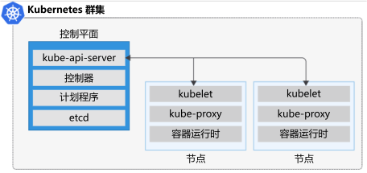

Kubernetes 群集中的 Kubernetes 控制平面运行一个服务集合，该集合管理 Kubernetes 中的业务流程功能。
Kubernetes 依赖于在控制平面上运行的若干管理服务。 这些服务管理群集组件通信、工作负载计划以及群集状态持久化等方面。
Kubernetes 群集中的节点是计算工作负载运行的位置。 每个节点都通过 API 服务器与控制平面通信，以通知它节点上的状态改变。

以下服务构成了 Kubernetes 群集的控制平面：

- API 服务器
- 后备存储(etcd)
- 计划程序
- 控制器管理器
- 云控制器管理器

### 什么是 API 服务器？

你可以将 API 服务器视为 Kubernetes 群集中控制平面的前端。 Kubernetes 中的组件之间的所有通信都是通过此 API 完成的。

例如，用户可以使用名为 kubectl 的命令行应用针对 Kubernetes 群集的 API 服务器运行命令。 提供此 API 的组件称为 kube-apiserver，你可以部署此组件的多个实例，以支持在群集中进行缩放。

此 API 公开一个 RESTful API，通过该 API 可以发布命令或基于 YAML 的配置文件。 YAML 是编程语言的可读数据序列化标准。 使用 YAML 文件可定义 Kubernetes 群集中所有对象的预期状态。

### 什么是后备存储？

后备存储是一个持久性存储，Kubernetes 群集使用它来保存 Kubernetes 群集的完整配置。 Kubernetes 使用名为 etcd 的可靠的高可用性分布式键值存储。 此键值存储存储当前状态以及群集中所有对象的所需状态。

在生产 Kubernetes 群集中，Kubernetes 的官方指导意见是安排三到五个 etcd 数据库的复制实例，以实现高可用性。

> 注意：etcd 不负责数据备份。 你要负责确保有一个有效的备份计划来备份 etcd 数据。

###  什么是计划程序？

计划程序是负责在所有节点间分配工作负载的组件。 计划程序监视群集中是否有新创建的容器，并将它们分配给节点。

### 什么是控制器管理器？

控制器管理器通过 API 服务器启动和监视为群集配置的控制器。

Kubernetes 利用控制器跟踪群集中对象的状态。 在监视和响应群集中的事件的过程中，每个控制器都在非终止循环中运行。 例如，有一些控制器用于监视节点、容器和终结点。

控制器与 API 服务器通信，以确定对象的状态。 如果对象的当前状态与所需状态不一致，则控制器将采取措施来确保所需状态。

假设群集中运行的三个容器中有一个停止响应并终止。 在这种情况下，控制器决定是否需要启动新容器来确保应用始终可用。 如果所需状态是在任何时间都运行三个容器，则会安排运行一个新的容器。

### 什么是云控制器管理器？

群集在云环境中运行时，云控制器管理器会与群集中的基础云技术集成。 例如，这些服务可以是负载均衡器、队列和存储。


## 在节点上运行的服务

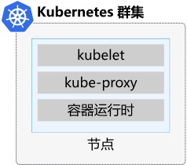

有几个在 Kubernetes 节点上运行的服务，用于控制工作负载的运行方式。

- kubelet
- kube-proxy
- 容器运行时

### 什么是 kubelet？

kubelet 是一个代理，在群集的每个节点上运行，并监视 API 服务器的工作请求。 它确保请求的工作单元正在运行并一切正常。

kubelet 监视节点，并确保每个节点上安排的容器按预期运行。 kubelet 仅管理由 Kubernetes 创建的容器。 在当前节点无法运行工作时，它不负责将工作重新安排到其他节点上运行。

### 什么是 kube-proxy？

kube-proxy 组件负责本地群集网络，并在每个节点上运行。 它确保每个节点都具有唯一的 IP 地址。 它还实行使用 iptables 和 IPVS 处理流量的路由和负载平衡的规则。

此代理本身不提供 DNS 服务。 建议使用基于 CoreDNS 的 DNS 群集加载项（默认安装）。

### 什么是容器运行时？

容器运行时是在 Kubernetes 群集上运行容器的基础软件。 运行时负责提取、启动和停止容器映像。 Kubernetes 支持多种容器运行时，包括但不限于 Docker、rkt、CRI-O、containerd 和 frakti。 对多种容器运行时类型的支持都是基于容器运行时接口 (CRI) 实现的。 CRI 是一种插件设计，允许 kubelet 与可用容器运行时通信。

### Kubernetes pod

Pod 表示在 Kubernetes 中运行的应用的单个实例。 在 Kubernetes 上运行的工作负载是容器化应用。 与 Docker 环境不同，不能直接在 Kubernetes 上运行容器。 请将容器打包到称为 Pod 的 Kubernetes 对象中。 Pod 是 Kubernetes 中可创建的最小对象。

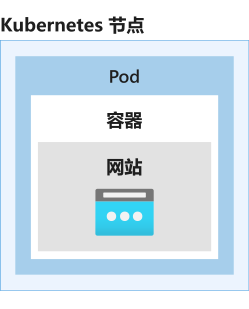

单个 Pod 可容纳一组容器（可以是一个或多个容器）。 但是，Pod 通常不包含同一个应用的多个实例。

Pod 包含有关共享存储和网络配置的信息，以及有关如何运行其打包容器的规范。 使用 Pod 模板定义在群集中运行的 Pod 的相关信息。 Pod 模板是 YAML 编码文件，可重复使用并包含在其他对象中以用于管理 Pod 部署。

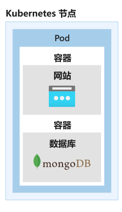


## Kubernetes Pod 的生命周期

Kubernetes Pod 独特的生命周期会影响部署、运行和更新 Pod 的方式。 首先，将 Pod YAML 清单提交到群集。 提交清单文件并保存到群集后，它会定义所需的 Pod 状态。 计划程序将 Pod 安排到正常的节点，正常的节点具有足够的资源来运行 Pod。下图中展示了 Pod 的生命周期。

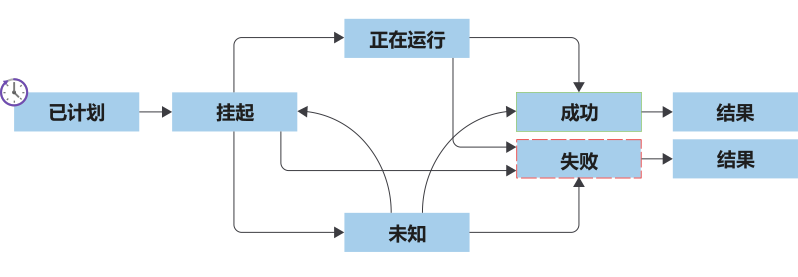


Pod 生命周期包含以下各个阶段：

KUBERNETES POD 的生命周期

|状态 |	描述 |
|-----|-----------------------------------------------------------|
|挂起的 |计划 Pod 运行后，容器运行时将下载容器映像并启动 Pod 的所有容器。|
|运行	|Pod 中的所有资源准备就绪后，Pod 会转变为运行状态。|
|成功	|Pod 完成其预期任务并成功运行后，Pod 会转变为成功状态。|
|失败	|Pod 可能因多种原因而失败。 Pod 中的容器可能已失败，导致所有其他容器终止。 或者可能在准备 Pod 容器期间未找到映像。 在这些情况下，Pod 可能转变为失败状态。 Pod 可从挂起状态或运行状态转变为失败状态。 特定的失败还可以将一个 Pod 变回挂起状态。
|未知	|如果无法确定 Pod 的状态，则该 Pod 处于未知状态。|


Pod 会一直保存在群集上，直到控制器、控制平面或用户显式地删除它们。 删除 Pod 并将其替换为新的 Pod 后，根据 Pod 清单，这个新的 Pod 就是该 Pod 的一个全新实例。

群集不会保存 Pod 的状态或动态分配到的配置。 例如，它不会保存 Pod 的 ID 或 IP 地址。 这一点会影响部署 Pod 的方式以及应用的设计方式。 例如，你不能依赖于 Pod 预先分配到的 IP 地址。


## Pod 部署选项

使用 kubectl 时，有几个选项可用于管理 Kubernetes 群集中 Pod 的部署。 选项包括：

- Pod 模板
- 复制控制器
- 副本集
- 部署

### 什么是部署？

部署创建的管理对象比副本集创建的高一级，并使你能在群集中部署和管理 Pod 的更新。

假设你的群集中部署了五个应用实例。 有 5 个 Pod 在运行 1.0.0 版应用。

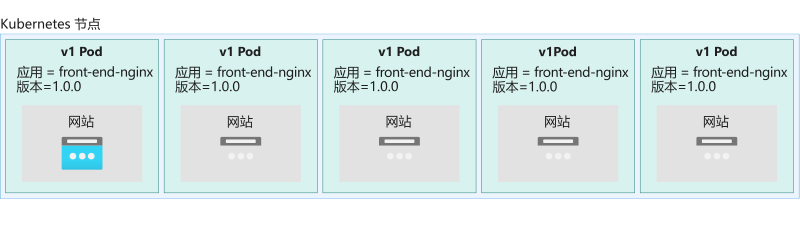

如果决定手动更新应用，可以删除所有 Pod，然后启动运行 2.0.0 版应用的新 Pod。 采用此策略，应用将出现停机。

你更需要做的是执行滚动更新，在这个过程中，先使用新版应用启动 Pod，再删除运行较早应用版本的 Pod。 滚动更新将一次启动一个 Pod，而不是一次性关闭所有旧的 Pod。 部署遵循在描述副本集相关信息的部分中配置的副本数。 这将在使用新 Pod 替换旧 Pod 时维持副本集中指定的 Pod 数量。


默认情况下，部署提供用于更新 Pod 的滚动更新策略。 你还可以使用重新创建策略。 在启动新的 Pod 之前，此策略将终止 Pod。

部署还提供了可使用 kubectl 执行的回滚策略。

部署利用基于 YAML 的定义文件，便于管理。 请记住，通过部署，你可以将所有更改应用到群集。 例如，可以部署新版的应用、更新标签，以及运行 Pod 的其他副本。

使用 kubectl run 命令部署 Pod 时，kubectl 使用简单的语法来自动创建部署。 此命令创建具有所需副本集和 Pod 的部署。 但该命令不会创建定义文件。 最佳做法是使用部署定义文件管理所有部署，并使用版本控制系统跟踪更改。

## Kubernetes 网络

假设你的群集有一个控制平面和两个节点。 将节点添加到 Kubernetes 时，IP 地址会被自动分配到内部专用网络范围内的每个节点。 例如，假设本地网络范围为 192.168.1.0/24。

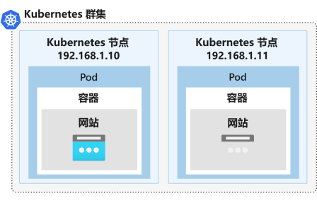

部署的每个 Pod 将分配获得 IP 地址池中的一个 IP。 例如，假设你的配置使用的网络范围是 10.32.0.0/12。

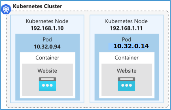

默认情况下，使用不同 IP 地址范围的 Pod 和节点不能互相通信。

若要进一步复杂化，请记住，Pod 是暂时性的。 Pod 的 IP 地址是临时的，不能用于重新连接到新创建的 Pod。 此配置会影响应用与其内部组件通信的方式，以及你和服务与其进行外部交互的方式。

为了简化通信，Kubernetes 要求以如下方式配置网络：

- 在没有网络地址转换 (NAT) 的情况下，Pod 之间可以进行跨节点的通信。
- 即使没有 NAT，节点也能与所有 Pod 相互通信。
- 节点上的代理可以与所有节点和 Pod 通信。

Kubernetes 提供了几个网络选项，在安装后可用于配置网络， 例如 Antrea、Cisco Application Centric Infrastructure (ACI)、Cilium、Flannel、Kubenet、VMware NSX-T 和 Weave Net。

云服务提供商也会提供他们自己的网络解决方案。 例如，Azure Kubernetes 服务 (AKS) 支持 Azure 虚拟网络容器网络接口 (CNI)、Kubenet、Flannel、Cilium 和 Antrea。

部署 AKS 群集时，有两个可供选择的网络模型。 第一个模型是 Kubenet 网络，第二个模型是 Azure 容器网络接口 (CNI) 网络。

### 什么是 Kubenet 网络？

Kubenet 网络是 Kubernetes 中的默认网络模型。 使用 kubenet 网络时，系统会向节点分配 Azure 虚拟网络子网中的 IP 地址。 Pod 会从逻辑上不同的地址空间接收一个 IP 地址，用于访问 Azure 虚拟网络的节点子网。

然后系统会配置网络地址转换 (NAT)，以便 Pod 可以访问 Azure 虚拟网络上的资源。 流量的源 IP 地址将转换为节点的主 IP 地址，然后在节点上进行配置。 请注意，相应 Pod 会接收“隐藏”在节点 IP 后的 IP 地址。

### 什么是 Azure 容器网络接口 (CNI) 网络？

使用 Azure 容器网络接口 (CNI)，可将 AKS 群集连接到现有的虚拟网络资源和配置。 在网络模型中，每个 Pod 都从子网中获取 IP 地址，并且可以直接访问。 这些 IP 地址在网络空间中必须为唯一地址，并且必须提前计算。某些功能在使用时，需要使用 Azure 容器网络接口网络配置来部署 AKS 群集。


## Kubernetes 服务

Kubernetes 服务是为 Pod 提供稳定网络的 Kubernetes 对象。 使用 Kubernetes 服务可以实现节点间、Pod 间以及群集内外应用用户间的相互通信。

Kubernetes 在服务创建时会为其分配 IP 地址，就像节点或 Pod 一样。 这些地址是从服务群集的 IP 范围中分配的。 例如，10.96.0.0/12。 服务还会分配获得一个基于服务名称的 DNS 名称和一个 IP 端口。

在无人机跟踪应用中，网络通信如下所示：

- 网站和 RESTful API 可供群集外的用户访问。

- 前端和 RESTful API 可以分别访问内存中缓存和消息队列服务，但外部用户不能访问。

- 消息队列需要访问数据处理服务，但不需要访问外部用户。

- 内存中缓存和数据处理服务可以访问 NoSQL 数据库，但是外部用户不能访问。

为了支持这些场景，可以配置三种类型的服务用于公开应用组件。

|类型 |	描述 |
|-----|-----------------------------------------------------------|
|ClusterIP	|这是分配给服务的地址，让群集内的一组服务可以访问该服务。 例如，应用的前端和后端组件之间的通信。|
|NodePort	|这是 Kubernetes 控制平面分配给服务的节点端口，介于 30000 和 32767 之间。 例如，clusters01 上的 192.169.1.11。 然后，使用要公开的 Pod 上的目标端口配置该服务。 例如，在其中一个前端上运行的 Pod 上配置端口 80。 现在可以通过节点 IP 和端口地址访问前端。|
|LoadBalancer	|此负载均衡器可实现在运行应用并向公用网络访问公开 Pod 的节点间分配负载。 使用云服务提供商时，通常会配置负载均衡器。 在这种情况下，来自外部负载均衡器的流量会定向到运行应用的 Pod。|


## 如何对 Pod 进行分组

按 IP 地址管理 Pod 并不实际。 控制器重新创建 Pod IP 地址时，这些地址会更改，并且运行的 Pod 数量不受限制。

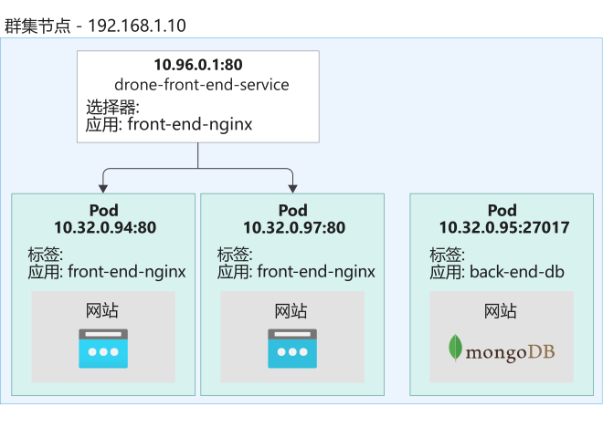

利用服务对象，你可以使用选择器标签来找到和管理群集中的特定 Pod。 在服务定义中设置选择器标签，以匹配 Pod 定义文件中定义的 Pod 标签。

## 什么是 Kubernetes 标签？

使用 Kubernetes 标签可对 Kubernetes 对象进行逻辑分组。 这些标签使系统可以查询群集中与具有特定名称的标签匹配的对象。

## 使用 AKS 配置多个节点并使缩放为零

借助 Azure Kubernetes 服务，你可创建不同的节点池，从而将特定工作负载与每个节点池中运行的节点进行匹配。 通过将工作负载与节点进行匹配的过程，可规划计算消耗量并优化成本。


### 什么是节点池？

节点池描述 AKS 群集中具有相同配置的一组节点。 这些节点包含运行应用程序的基础VM(指定VM后，当前版本的AKS不支持修改VM的大小，仅支持修改VM的数量)。 可以在 AKS 托管 Kubernetes 群集上创建两种类型的节点池：

- 系统节点池

> System node pool must use VM sku with more than 2 cores and 4GB memory.


- 用户节点池


> AKS nodepools don't support resize in place, so the supported way to do this is to create a new nodepool with a new target and delete the previous one. This needs to be done through the AKS portal.
> https://github.com/Azure/AKS/issues/1556


## 系统节点池

系统节点池承载关键系统 Pod，它们是构成群集的控制平面。 系统节点池只允许将 Linux 用作节点 OS，并且只运行基于 Linux 的工作负载。 系统节点池中的节点保留用于系统工作负载，通常不用于运行自定义工作负载。 每个 AKS 群集都必须至少包含一个具有至少一个节点的系统节点池，并且必须为节点定义基础 VM 大小。


## 用户节点池

用户节点池支持你的工作负载，你可将 Windows 或 Linux 指定为节点操作系统。 你还可以定义节点的基础 VM 大小并运行特定的工作负载。

添加节点池

```
az aks nodepool add --cluster-name aks-fp2-dev --name nodepool1 --resource-group rg-akscluster-sase-dev --node-vm-size Standard_D3_v2
```

### 创建Spot节点池（预览）

因为AKS对Spot节点池的支持还在预览版阶段，所以你只能在Azure Cli中配置Spot节点池。

```
az aks nodepool add \
    --resource-group $RESOURCE_GROUP \
    --cluster-name $AKS_CLUSTER_NAME \
    --name batchprocpl2 \
    --enable-cluster-autoscaler \
    --max-count 3 \
    --min-count 1 \
    --priority Spot \
    --eviction-policy Delete \
    --spot-max-price -1 \
    --node-vm-size Standard_DS2_v2 \
    --no-wait
```

## 节点池中的节点数

最多可在节点池中配置 100 个节点。 但是，你选择配置的节点数取决于每个节点运行的 Pod 数。

例如在系统节点池中，必须将单个节点上运行的最大 Pod 数设置为 30 (默认值为110)。 这个最小值可保证有足够的空间运行对群集运行状况至关重要的系统 Pod。 当 Pod 数超过此最小值时，池中需要新节点来调度其他工作负载。 因此，系统节点池中需要至少一个节点。 对于生产环境，系统节点池的建议节点计数至少为 3。

用户节点池设计用于运行自定义工作负载，不需要 30 个 Pod。 用户节点池允许你将池的节点数设置为零。


## 在 AKS 群集中管理应用程序需求

AKS 中用于增加或减少 Kubernetes 群集中计算资源数量的功能被称为“缩放”。可通过以下两种方式之一缩放 AKS 托管群集上的工作负载。 第一种方法是按需手动缩放 Pod 数或节点数。 可使用水平 Pod 自动缩放程序来缩放 Pod 数，使用群集自动缩放程序来缩放节点数。

### 如何手动缩放节点池

如果运行的工作负载以特定时间间隔在特定时间段内执行，则要控制节点成本，一种方法是手动缩放节点池大小。

可使用 az aks nodepool scale 命令将节点池缩放为零节点。 请注意，`--node-count` 参数设置为零（仅User类型的节点池）。 下面是该命令的示例：

```
az aks nodepool scale \
    --resource-group resourceGroup \
    --cluster-name aksCluster \
    --name gpunodepool \
    --node-count 0
```

### 如何自动缩放群集

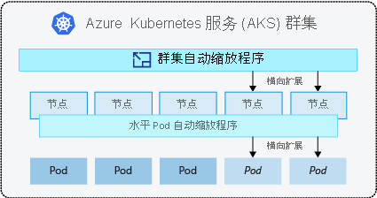

AKS 使用 Kubernetes 群集自动缩放程序自动缩放工作负载。 可使用两个选项来缩放群集：

- 水平 Pod 自动缩放程序

- 群集自动缩放程序

Refence: [自动缩放群集以满足 Azure Kubernetes 服务 (AKS) 中的应用程序需求](https://docs.microsoft.com/zh-cn/azure/aks/cluster-autoscaler)

### 水平 Pod 自动缩放程序

可使用 Kubernetes 水平 Pod 自动缩放程序监视群集上的资源需求并自动缩放工作负载副本数。

Kubernetes 指标服务器会从 AKS 群集上运行的控制器、节点和容器中收集内存和处理器指标。 要访问此信息，一种方法是使用指标 API。 水平 Pod 自动缩放程序每 30 秒检查一次指标 API，以确定应用程序是否需要其他实例来满足所需的要求。

假设你的公司还有一项批处理服务用于计划无人机飞行路线。 你会发现，该服务会收到铺天盖地的请求，并开始积压大量交付，从而导致延迟，令客户感到失望。 增加批处理服务的副本数可及时处理订单。

要解决此问题，请配置水平 Pod 自动缩放程序，按需增加服务副本的数目。 当批处理请求减少时，它会缩减副本计数。

但是，水平 Pod 自动缩放程序只在群集已配置的节点池中的可用节点上缩放 Pod。

> 注意：若要使水平 Pod 自动缩放程序正常工作，必须从部署中删除所有显式副本计数。 请牢记，进行任何更改后都需要重新部署。


### 群集自动缩放程序

当水平 Pod 自动缩放程序无法在节点池中现有节点上调度其他 Pod 时，将触发资源约束。 使用群集自动缩放程序可缩放群集节点池中的节点数。 群集自动缩放程序会检查定义的指标，并根据所需的计算资源来增加或缩减节点数。

群集自动缩放程序与水平 Pod 自动缩放程序一起使用。

群集自动缩放程序会监视纵向扩展和纵向缩减事件，并允许 Kubernetes 群集在资源需求变化时更改节点池中的节点计数。

可以用不同的缩放规则配置每个节点池。 例如，你可能只想配置一个节点池来允许自动缩放。 或者，你可将节点池配置为仅缩放到特定的节点数。

> 注意：**在节点池中启用群集自动缩放程序后，无法将节点计数缩放为零。**


# 通过用于 Kubernetes 的 Azure Policy 配置 AKS 资源配额策略

Azure Policy 有助于你强制执行标准并大规模评估云环境是否符合条件。 对公司而言，实施业务规则来定义员工该如何使用组织中的公司软件、硬件和其他资源，这是一种不错的做法。 这些业务规则通常使用策略进行描述，这些策略按照各策略中的规定予以落实、实施和审核。 策略可帮助组织满足监管和法律要求、实施最佳做法和制定组织约定。

## 什么是 Kubernetes 准入控制器？

准入控制器是一种 Kubernetes 插件，用于在请求的 Kubernetes 对象暂留之前，截获针对 Kubernetes API 的已验证和已授权的请求。 例如，假设你部署了一个新的工作负载，而且部署中包含一个具有特定内存要求的 Pod 请求。 准入控制器会截获该部署请求，必须先授权部署，然后再将它保存到群集。

你可将准入控制器视为控制和强制执行使用和设计群集的方式的软件。 它限制了对创建、删除和修改 Kubernetes 对象的请求。

## 什么是准入控制器 Webhook？

准入控制器 Webhook 是一个 HTTP 回调函数，用于接收准入请求，然后对这些请求进行处理。 准入控制器可用作编译的准入插件，或者用作作为运行时配置的 Webhook 运行的已部署扩展。

准入 Webhook 有两种类型：验证型 Webhook 或修改型 Webhook。 首先调用修改型 Webhook，可以更改并应用发送到 API 服务器的对象上的默认值。 验证型 Webhook 验证对象值，可以拒绝请求。

## 什么是开放策略代理 (OPA)？

开放策略代理 (OPA) 是一个开源的通用策略引擎，为你提供了一种用于编写策略的高级声明性语言。 借助这些策略，你可定义监视系统行为方式的规则。

## 什么是 OPA Gatekeeper？

OPA Gatekeeper 是一种开源验证型 Kubernetes 准入控制器 Webhook，可使用开放策略代理强制执行基于自定义资源定义 (CRD) 的策略。

OPA Gatekeeper 的目标是使你能够使用配置而不是硬编码的服务策略规则来自定义准入策略。 由此，你还可全面了解群集，确定违反策略的资源。

你可使用 OPA Gatekeeper 定义组织范围的策略。 例如，你可要求：

- 对所有已配置的 Pod 强制实施最大资源限制，例如 CPU 和内存限制。

- 仅允许从已批准的存储库部署映像。

- 群集中所有命名空间的标签指定每个命名空间的联系点。

- 群集服务具有全局唯一的选择器。

当前版本的 OPA Gatekeeper（版本 3）受 Azure Kubernetes 服务支持。

## 适用于 AKS 的 Azure Policy

Azure Policy 扩展了 OPA Gatekeeper 版本 3，并通过内置策略与 AKS 集成。 这些策略以集中且一致的方式在群集上应用大规模强制和保护措施。

你公司的开发团队希望优化开发并引入开发工具（如 DevSpaces），以简化其 Kubernetes 开发工作流。 你需要确保团队成员遵守其项目的特定资源限制。 你决定采用定义开发命名空间中允许的计算资源、存储资源和对象计数的策略。

若要设置资源限制，可在命名空间级别应用资源配额，并监视资源使用情况以调整策略配额。 使用此策略可在开发团队中保留和限制资源。

## 如何启用用于 AKS 的 Azure Policy 加载项

注册用于 AKS 的 Azure Policy 加载项的功能时，有几个步骤。

> 注意: 与Spot节点一样，用于 AKS 的 Azure Policy 加载项是一项预览功能。 在 Azure 中启用某些预览功能后，默认值可用于订阅中创建的所有 AKS 群集。 在非生产订阅中测试所有预览功能，以避免在生产部署中出现不可预见的负面影响。


# k8s 集群常用命令

### 显示群集节点信息

```
kubectl get nodes
```

你可以获取有关请求的特定资源的详细信息。 例如，假设你需要查找节点的 IP 地址。 若要从 API 服务器中获取额外信息，请运行 -o wide 参数。

```
kubectl get nodes -o wide
```

### 浏览群集上运行的服务

可以运行 kubectl get 命令来查找群集上所运行服务的信息。

```
sudo kubectl get services -o wide
```

Kubernetes 采用名为“命名空间”的概念。 可以使用命名空间在逻辑上将一个群集划分为多个虚拟群集。

若要获取所有命名空间中的全部服务，请传递 --all-namespaces 参数。

```
sudo kubectl get services -o wide --all-namespaces
```

### 在群集上安装 Web 服务器

你可以使用 Pod 清单文件来描述 Pod、副本集和部署以定义工作负载。 因为我们还未详细介绍这些文件，所以要将信息直接传递到 API 服务器，你需要使用 kubectl。

即使使用 kubectl 很方便，但使用清单文件是最佳做法。 使用清单文件可以在群集中轻松地前滚或回滚部署。 这些文件还有助于记录群集的配置。

若要创建 NGINX 部署，请运行 kubectl create deployment 命令。 指定用于创建 Pod 的单个实例的部署名称和容器映像。

```
sudo kubectl create deployment nginx --image=nginx
```


若要获取有关部署的信息，请运行 kubectl get deployments。

```
sudo kubectl get deployments
```

该部署创建了一个 Pod。 若要获取有关群集的 Pod 的信息，请运行 kubectl get pods 命令。

```
sudo kubectl get pods
```

查找 Pod 的地址，请传递 -o wide 参数。

```
sudo kubectl get pods -o wide
```

若要缩放部署中的副本数，请运行 kubectl scale 命令。 指定所需的副本数以及部署的名称。

```
sudo kubectl scale --replicas=3 deployments/nginx
```

## Kubernetes 清单文件

使用 Kubernetes 清单文件，可以以声明方式描述 YAML 格式的工作负载，并简化 Kubernetes 对象管理。

### 清单文件的结构

清单文件的结构因所创建的资源类型而异。 但是，清单文件共享通用说明。 这些说明定义了各个方面，例如要使用的 API 和要创建的工作负载类型。

所有清单文件中的前两个条目都包含两个重要的项：apiVersion 和 kind。 下面是部署文件的一个示例。

```
apiVersion: apps/v1 # Where in the API it resides
kind: Deployment # The kind of workload we're creating
```

`apiVersion` 项定义用于管理将要部署的对象的 API 服务器端点。

`kind` 项定义此部署将创建的工作负载。

所有文件的其他常见项是 `metadata` 和 `name` 项。 所有 Kubernetes 资源都必须具有一个名称。 此名称将在 metadata 中。

```
apiVersion: apps/v1
kind: Deployment
metadata:
  name: contoso-website # This will be the name of the deployment
```

#### 对部署中的对象进行分组

部署利用 label 来查找 Pod 并对其进行分组。 将标签定义为部署清单文件的一部分。

下面是一个示例。 请注意添加到 spec 定义中的 selector 定义中定义的 matchLabels 值。

```
# deployment.yaml
# ...
spec:
  selector:
    matchLabels:
      app: contoso-website
# ...
```

从现在开始，所有文件根据要 Kubernetes 创建的资源类型而具有不同的结构。

### 应用部署文件

使用 kubectl 部署 Kubernetes 部署清单文件。 下面是该命令的示例。

```
kubectl apply -f ./deployment.yaml
```


# 启用对应用程序的网络访问


Azure Kubernetes 服务 (AKS) 群集会阻止从 Internet 到群集的所有入站流量，以确保网络安全。 默认情况下，除了群集内部的人员，其他任何人都无法访问 Kubernetes 中已部署的工作负载。 若要向外部公开应用程序，需要打开特定端口并将其转发给服务。

## Kubernetes 中的网络

容器的网络配置是临时的。 容器的配置及其中的数据在执行之间不具有持久性。 删除容器后，除非将其配置为使用卷，否则所有信息都将丢失。 这同样适用于容器的网络配置以及分配给它的任何 IP 地址。

部署是 Pod 的逻辑分组。 它不被视为物理工作负载，并且未分配 IP 地址。 但是，系统会自动为每个 Pod 分配一个 IP 地址。 销毁 Pod 时，IP 地址将丢失。 此行为使手动网络配置策略变得复杂。

Kubernetes 有两个网络可用性抽象，让你可以公开任何应用，而无需担心基本的基础结构或分配的 Pod IP 地址。

这两个抽象就是服务和入口。 它们共同负责允许来自外部源的流量并将其重定向到群集。

## 什么是 Kubernetes 服务？

Kubernetes 服务是一种工作负载，用于对网络工作负载的 IP 地址进行抽象。 Kubernetes 服务充当负载均衡器，并使用端口转发规则将流量重定向到指定端口的特定端口。

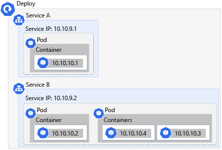

使用 YAML 清单文件以与部署相同的方式定义服务。 服务使用与部署相同的 `selector` 项来选择具有匹配标签的资源并将它们分组到一个 IP 中。

Kubernetes 服务需要四条信息来路由流量。


|信息	|说明|
|------|----|
|目标资源	|目标资源由服务清单文件中的 selector 项定义。 此值将具有给定标签的所有资源选取到单个 IP 地址中。|
|服务端口	|此端口是应用程序的入站端口。 所有请求都发送到此端口，服务会从该端口将请求转发到资源。|
|网络协议	|此值标识服务将为其转发网络数据的网络协议。|
|资源端口	|此值标识接收传入请求的目标资源上的端口。 此端口由服务清单文件中的 targetPort 项定义。|

## Kubernetes 服务类型

服务可以有多种类型。 每种类型都会更改服务所选应用程序的行为。

- ClusterIP：此值仅在内部公开应用程序。 此选项允许服务充当端口转发器，并使服务在群集中可用。 如果省略，则此值为默认值。

- NodePort：此值在外部公开服务。 它为每个节点分配一个响应该服务的静态端口。 通过 `nodeIp:port` 访问时，节点会自动将请求重定向到 ClusterIP 类型的内部服务。 然后，此服务会将请求转发到应用程序。

- LoadBalancer：此值使用 Azure 的负载均衡解决方案在外部公开服务。 创建后，此资源将在 Azure 订阅中启动 Azure 负载均衡器资源。 同样，此类型会自动创建一个 NodePort 服务和一个 ClusterIP 服务，负载均衡器的流量将重定向前者，而后者用于内部转发。

- ExternalName：此值通过 CNAME 记录使用 DNS 解析来映射服务。 使用此服务类型可以将流量定向到位于 Kubernetes 群集外部的服务。


## 什么是入口？

入口公开从群集外部到群集内部服务的 HTTP 和 HTTPS 流量的路由。 入口路由使用入口规则进行定义。 Kubernetes 群集会拒绝所有未定义这些路由的传入流量。

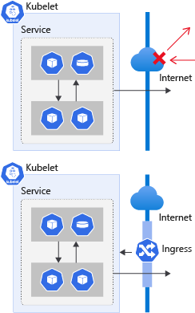

假设要允许客户端通过 http://contoso.com URL 访问网站。 若要使客户端能够访问群集内的应用，群集必须响应网站的 CNAME 并将请求路由到相关的 Pod。


## 如何在 Kubernetes 中使用入口控制器

Kubernetes 使用入口控制器来管理群集中入口的配置，并提供多种功能。 入口控制器：

- 充当反向代理以允许外部 URL。
- 可充当负载均衡器。
- 终止 SSL/TLS 请求。
- 提供基于名称的虚拟托管。

在 AKS 中，入口控制器与 Azure 订阅中的 DNS 区域资源关联。 DNS 区域是系统代表你在群集创建过程中自动创建的。 该链接使群集可以自动生成区域记录，该记录指向公开的应用程序的 IP 地址和端口的 DNS 名称。

在 AKS 中，可通过 HTTP application routing 加载项创建入口控制器。

## 什么是入口规则？

入口规则定义流量的来源以及在群集中将流量定向到的位置。 入口规则在入口部署清单文件中进行定义。

具体而言，是在清单文件的 `rules` 项中进行定义。 每个规则都是一组描述规则的附加值。

例如，假设要允许客户端使用 URL http://example.com/site 访问你的网站， 并希望将流量路由到视频呈现服务网站。 下面是已定义的允许此行为的入口规则示例。

```
rules:
  - host: example.com # A FQDN that describes the host where that rule should be applied
    http:
      paths: # A list of paths and handlers for that host
        - path: /site # Which path is this rule referring to
          backend: # How the ingress will handle the requests
            serviceName: contoso-website # Which service the request will be forwarded to
            servicePort: 80 # Which port in that service
```

此示例定义了一个规则，该规则允许使用地址 example.com 和路径 /site 的所有流量进入群集。 然后，将此流量路由到端口 80 上的 contoso-website 服务。

## 什么是注释？

使用注释可附加工作负载的非标识元数据，例如入口配置。 可以将注释视为内部标签，用于定义资源的特定配置。 例如，你可能想要使用支持名称重写或有效负载限制的特定入口控制器。

下面是指定使用 HTTP 应用程序路由加载项的清单文件中的注释示例。

```
#ingress.yaml
apiVersion: extensions/v1beta1
kind: Ingress
metadata:
  name: contoso-website
  annotations:
    kubernetes.io/ingress.class: addon-http-application-routing # Use the HTTP application routing add-on
```

# 使用 SSH 连接到 Azure Kubernetes 服务 (AKS) 群集节点以进行维护或故障排除

在 Azure Kubernetes 服务 (AKS) 群集的整个生命周期内，可能需要访问 AKS 节点。 进行这种访问的原因包括维护、日志收集或其他故障排除操作。 可以使用 SSH 访问 AKS 节点（包括 Windows Server 节点）。 还可以使用远程桌面协议 (RDP) 连接功能连接到 Windows Server 节点。 出于安全考虑，AKS 节点不会在 Internet 中公开。 若要通过 SSH 连接到 AKS 节点，需使用专用 IP 地址。

默认情况下，在创建 AKS 群集时会获取或生成 SSH 密钥，然后将其添加到节点。不过你也可以指定与创建 AKS 群集时使用的 SSH 密钥不同的 SSH 密钥。若要配置基于虚拟机规模集的 SSH 访问，请找到群集的虚拟机规模集名称，并将 SSH 公钥添加到该规模集。默认情况下，AKS 节点的用户名为 azureuser。


Reference：

[Azure Kubernetes 服务研讨会](https://docs.microsoft.com/zh-cn/learn/modules/aks-workshop/)


[Connect with SSH to Azure Kubernetes Service (AKS) cluster nodes for maintenance or troubleshooting](https://docs.microsoft.com/en-us/azure/aks/ssh)


[Network concepts for applications in Azure Kubernetes Service (AKS)](https://docs.microsoft.com/en-us/azure/aks/concepts-network)


[Create an HTTPS ingress controller and use your own TLS certificates on Azure Kubernetes Service (AKS)](https://docs.microsoft.com/en-us/azure/aks/ingress-own-tls)

