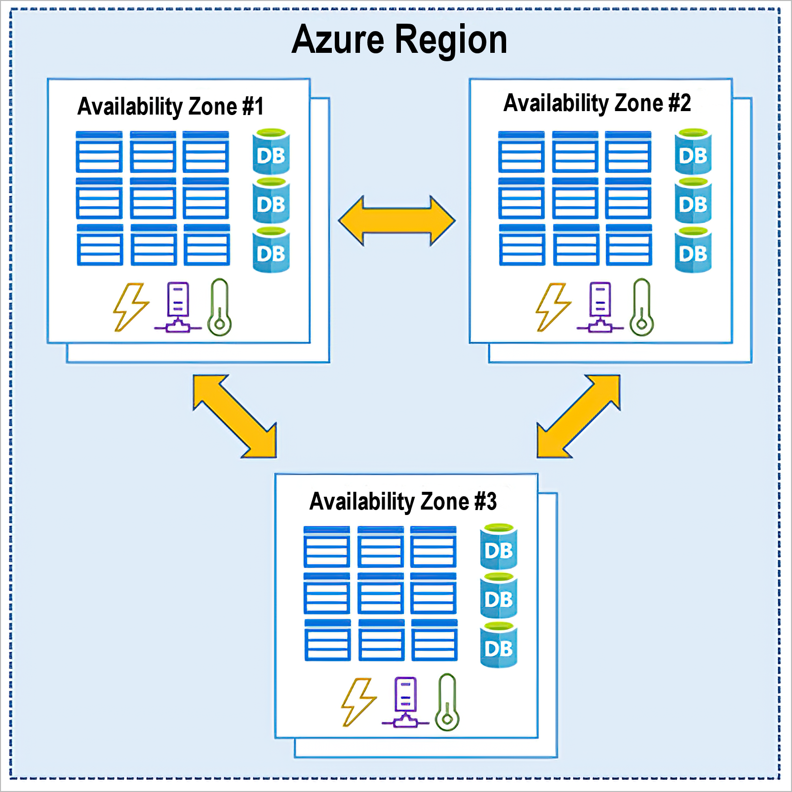
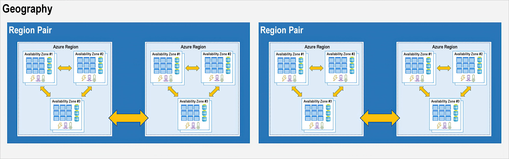

# Azure区域和可用性区域

Azure由遍布全球的数据中心组成。使用服务或创建资源时，会使用其中一个或多个位置的物理设备。这些特定数据中心不会直接向用户公开。Azure 会将它们组织到区域中。
正如你将在本单元后面部分看到的那样，其中的一些区域提供可用性区域，后者是该区域中不同的 Azure 数据中心。

## Azure区域

区域是指地球上的某个地理区域，包含至少一个（但很可能是多个）数据中心，这些数据中心彼此相邻并通过一个低延迟的网络相互连接。

Azure 智能地分配和控制每个区域内的资源，以确保适当平衡工作负载。在 Azure 中部署资源时，通常需要选择要部署资源的区域。查看Azure支持的所有区域，请参照[Azure 地域](https://azure.microsoft.com/zh-cn/global-infrastructure/geographies/)

### 特殊 Azure 区域

在生成应用程序时，出于合规性或法律方面的考虑，可能需要使用特殊的 Azure 区域。 一些示例包括：

- US DoD 中部、US Gov 弗吉尼亚州、US Gov 爱荷华州等区域： 这些区域是适用于美国政府机构和合作伙伴的 Azure 物理和逻辑网络隔离实例。 这些数据中心由甄选出来的美国公民运作，并包括其他合规性认证。
- 中国东部、中国北部等区域： 这些区域在 Microsoft 和 21Vianet 达成唯一合作关系之后可供用户使用，通过这种合作关系，Microsoft 就无需直接维护相关数据中心。

> 区域用于标识资源的位置。 还应注意另外两个术语：地域和可用性区域。

## Azure可用性区域

可用性区域是 Azure 区域中的物理上独立的数据中心。 每个可用性区域都由一个或多个数据中心组成，这些数据中心都配置了独立电源、冷却和网络。 可用性区域被设置为隔离边界。 如果一个区域出现故障，其他区域会继续正常工作。 可用性区域通过高速专用光纤网络相连。

一张关系图，它显示了单个 Azure 区域内相互连接的三个数据中心，代表一个可用性区域。

> 并非每个区域都支持可用性区域。 有关更新列表，[请参阅 Azure 中支持可用性区域的区域](https://docs.microsoft.com/zh-cn/azure/availability-zones/az-region)。

## Azure区域对

在同一地域内，每个 Azure 区域始终与至少距其 300 英里外的（例如美国、欧洲或亚洲）另一区域配对。 此方法适用于跨地域复制资源（例如 VM 存储），有助于减少因自然灾害、社会动乱、电力中断或物理网络中断等事件（同时影响两个区域）造成服务中断的可能性。 例如，如果一个区域对中的某个区域受到自然灾害，则服务会自动故障转移到其区域对中的其他区域。

Azure 中区域对的例子有美国西部与美国东部、东南亚与东亚。

显示地域、区域对、区域和数据中心之间的关系的示意图。“地域”框包含 2 个区域对。每个区域对包含 2 个 Azure 区域。每个区域包含 3 个可用性区域。

区域对的其他优点：

- 如果发生大规模 Azure 服务中断，则优先考虑每个区域对中的一个区域，确保针对该区域对中托管的应用程序尽快恢复至少一个区域。
- 对配对区域逐一进行计划内 Azure 更新，以尽量减少停机时间并降低应用程序中断风险。
- 出于税务和执法管辖权方面的考虑，数据仍以配对的形式驻留在同一地域内（巴西南部除外）。

Reference：https://docs.microsoft.com/zh-cn/learn/modules/azure-architecture-fundamentals/regions-availability-zones

