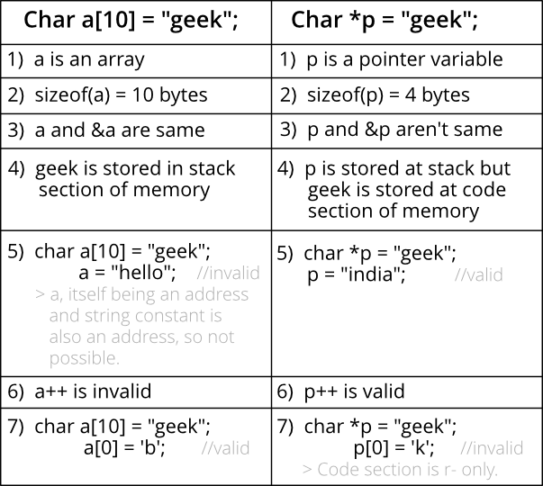

# What’s difference between char s[] and char *s in C?

> https://www.geeksforgeeks.org/whats-difference-between-char-s-and-char-s-in-c/

Consider below two statements in C. What is the difference between the two? 

```
char s[] = "geeksquiz";
char *s  = "geeksquiz";
```

## Below are the key differences:



The statements `char s[] = “geeksquiz”` creates a character array which is like any other array and we can do all array operations. The only special thing about this array is, although we have initialized it with 9 elements, its size is 10 (Compiler automatically adds `\0`) 

```
#include <stdio.h>
int main()
{
    char s[] = "geeksquiz";
    printf("%lu", sizeof(s));
    s[0] = 'j';
    printf("\n%s", s);
    return 0;
}
```

Output: 

```
10
jeeksquiz
```

The statement `char *s = "geeksquiz"` creates a string literal. The string literal is stored in the read-only part of memory by most of the compilers. The C and C++ standards say that string literals have static storage duration, any attempt at modifying them gives undefined behavior. 

`s` is just a pointer and like any other pointer stores address of string literal. 

```
#include <stdio.h>
int main()
{
    char *s = "geeksquiz";
    printf("%lu", sizeof(s));
 
    // Uncommenting below line would cause undefined behaviour
    // (Caused segmentation fault on gcc)
    //  s[0] = 'j'; 
    return 0;
}
```

Output: 

```
8
```

Running above program may generate a warning also “warning: deprecated conversion from string constant to `char*`. This warning occurs because s is not a const pointer, but stores address of the read-only location. The warning can be avoided by the pointer to const.

```
#include <stdio.h>
int main()
{
    const char *s = "geeksquiz";
    printf("%lu", sizeof(s));
    return 0;
}
```

