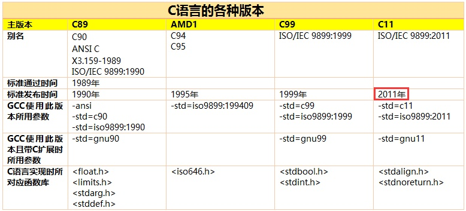

## C语言有没有标准文档？

> 知乎：2013-02-25问题

> 2019.02.09

似Java有官方的JDK API 帮助文档，Python 有PythonDoc。C语言这么多分枝，vc，linux c，这些文档有吗？

### 城市独行客（编辑于2019-01-02）

c语言有标准文档 。ISO国际组织官网能搜索到相关标准号是[ISO/IEC 9899:2018](https://www.iso.org/standard/74528.html)文件，想要下载这些pdf文档居然还要花钱，198的瑞士法郎换成人民币是1300左右。

C语言的虽然标准是有国际标准化组织制定的，但是具体编译器的实现和标准制定还是有所不同的，这个关系就像HTML5标准的制定者W3C和各个浏览器内核的厂商之间的关系。IE里面的有些标签在Chrome里就不能用，实现不同。

比如**GNU GCC**编译器就添加了自己的语法规则，还有嵌入式领域的**Keil C51**编译器（多定义了自己的数据类型），还有基于llvm框架的**Clang**编译器，还有和Visual Studio2015集成的**VC++ Compiler**（包含了微软自定义的内联汇编的语法）都有各自的特殊语法规则，但大体来说每个c语言编译器还是实现了标准文档里面的大部分特性。

所以说了那么多，意思就是去找这些编译器官方文档，才是最权威最实用的。如果用GNU GCC就它的官方网站下载他的文档吧。应该能找到你想要的信息。没必要去读ISO的标准文档。

### 画头像的dada(编辑于2015-11-29)

C语言没有很多分支，只是版本迭代而已，现在C最新版本是C18。

标准文档地址：[cppreference.com](https://en.cppreference.com/w/)。注意上面是C++文档，下面才是C文档。
还可以根据不同版本的C语言，运行给出的例子，爽歪歪。

> **C18** and **C17** are informal names for `ISO/IEC 9899:2018` the most recent standard for the C programming language, published in June 2018. It replaced C11 (`standard ISO/IEC 9899:2011`). Support was scheduled for **GCC 8** and **LLVM Clang 6.0**.

From: [C语言有没有标准文档？](https://www.zhihu.com/question/20725002)

Reference:

[C18 (C standard revision)](https://en.wikipedia.org/wiki/C18_(C_standard_revision))

[Language Standards Supported by GCC](https://gcc.gnu.org/onlinedocs/gcc-8.2.0/gcc/Standards.html#C-Language)