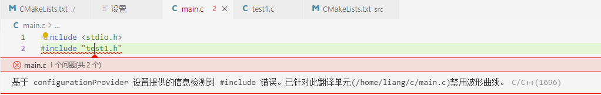

# vs code+cmake开发，头文件显示找不到

> lizy_fish 2020-05-27 

> [vs code+cmake开发，头文件显示找不到](https://blog.csdn.net/lizy_fish/article/details/106376080)

关于采用vscode 打开cmake配置的c++项目时，头文件夹显示找不到（头文件被红色波纹线标记）错误。信息如下：



```
基于 configurationProvider 设置提供的信息检测到 #include 错误。已针对此翻译单元(/home/liang/c/main.c)禁用波形曲线。C/C++(1696)
```

但是项目的`CMake`文件书写又没啥问题，工程可以使用`CMake`顺利编译。


这种情况需要在VisualStudioCode中的settings.json中添加一个配置项，使配置的信息来源与cmake。即：

```
"C_Cpp.default.configurationProvider": "ms-vscode.cmake-tools"
```

配置好后，界面显示如下：


即可解决vscode可以编译通过c++项目，但头文件有红色波浪线的问题。


这里测试项目结构如下：

```
test
├── CMakeLists.txt
├── main.c
└── src
    ├── CMakeLists.txt
    ├── test1.c
    └── test1.h
```

其中，各个文件内容如下：

```
# ./CMakeLists.txt

PROJECT(main)
CMAKE_MINIMUM_REQUIRED(VERSION 2.6) 
ADD_SUBDIRECTORY( src )
AUX_SOURCE_DIRECTORY(. DIR_SRCS)
# INCLUDE_DIRECTORIES(./src)
ADD_EXECUTABLE(main ${DIR_SRCS}  )
TARGET_INCLUDE_DIRECTORIES(main PRIVATE ./src)
TARGET_LINK_LIBRARIES( main Test )
```

```
# ./main.c

#include <stdio.h>
#include "test1.h"
int f(int a)
{
    printf("%d\n", a);
    return a;
}

int main(void)
{
    printf("f(1)+f(2)*f(3)=%d\n", a());
    printf("f(1)+(f(2)*f(3))=%d\n", f(1) + (f(2) * f(3)));
    return 0;
}
```


```
# ./src/CMakeLists.txt

AUX_SOURCE_DIRECTORY(. DIR_TEST1_SRCS)
ADD_LIBRARY ( Test ${DIR_TEST1_SRCS})
```


```
# ./src/test1.h

int a();
```


```
# ./src/test1.c

#include "test1.h"

int a(){
    return 1;
}
```
