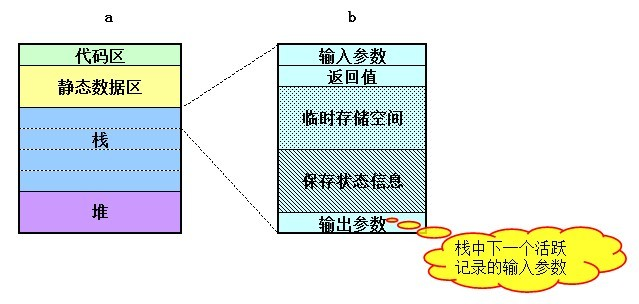

## 递归转非递归

> From: aCloudDeveloper

### 递归的思想

我们一般对递归的印象就是一个函数反复的“自己调用自己”，代码精炼，便于阅读。但是，从本质上来说，递归并不是简单的自己调用自己，而是一种分析和解决问题的方法和思想。简单来说，递归思想就是：**把问题分解成规模更小，但和原问题有着相同解法的问题**。典型的问题有汉诺塔问题，斐波那契数列，二分查找问题，快速排序问题等。PS：其实像我们常见的分治法和动态规划法都是递归思想的经典应用。

既然的递归的思想是把问题分解成规模更小但和原问题有着相同解法的问题，那是不是所有具有这样特性的问题都能用递归来解决呢？答案是否定的。除了这个特性，能用递归解决的问题还必须具有一个特性：**存在一种简单情境，能让递归在简单情境下退出，也就是要有一个递归出口**。

总结一下就是，能用递归解决的问题，必须满足以下两个条件：

- 一个问题能够分解成规模更小，且与原问题有着相同解的问题；
- 存在一个能让递归调用退出的简单出口。

比如，阶乘问题：fact(n) = n*fact(n-1)，当n = 1时，存在简单情境：fact(1) = 1。斐波那契数列问题：fib(n) = fib(n-1) + fib(n-2)，当n = 1和n = 2时，存在简单情境：fib(1) = 1, fib(2) = 1。上述两个问题仅存在一种简单情境，有些问题可能存在两种以上的简单情境（在写代码时务必都要考虑到），比如：二分查找问题：第一种简单情境是需要查找的元素与中值元素相等；第二种简单情境是：待查找的元素没在序列中，则通过比较待查找元素和最后一个划分的元素来确定结果。

### 递归的效率

递归导致一个函数反复调用自己，我们知道函数调用是通过一个工作栈来实现的，在大多数机器上，每次调用函数时大致要做三个工作：调用前先保存寄存器，并在返回时恢复；复制实参；程序必须转向一个新位置执行。其中，具体要保存的内容包括：局部变量、形参、调用函数地址、返回值。那么，如果递归调用N次，就要分配N*局部变量、N*形参、N*调用函数地址、N*返回值。这势必是影响效率的。在C++中，inline函数就是为了改善函数调用所带来的效率问题而做的一种优化。递归就是利用系统的堆栈保存函数当中的局部变量来解决问题的，说白了就是利用堆栈上的一堆指针指向内存中的对象，并且这些对象一直不被释放，直到遇到简单情境时才一一出栈释放，所以总的开销就很大。栈空间都是有限的，如果没有设置好出口，或者调用层级太多，有可能导致栈空间不够，而出现栈溢出的问题。为了防止无穷递归现象，有些语言是规定栈的长度的，比如python语言规定堆栈的长度不能超过1000。还有就是当规模很大的时候，尽量不使用递归，而改为非递归的形式。



与递归相关联的有几个词，分别是循环，迭代和遍历。咋一看，都有重复的意思，但有的好像又不只是重复，具体它们之间有什么区别呢？我的理解是这样的：

- 递归：一个函数反复调用自身的行为，特指函数本身；
- 循环：满足一定条件下，重复执行某些行为，如while结构；
- 迭代：按某种规则执行一个序列中的每一项，如for结构；
- 遍历：按某种规则访问图形结构中每一个节点，特指图形结构。

递归由于效率低的问题，经常要求转换成循环结构的非递归形式。


### 递归转非递归

不可否认，递归便于算法的理解，代码精炼，容易阅读，但递归的效率往往是我们最在意的问题。如果能用循环解决递归问题，就尽可能使用循环；如果用循环解决不了，或者能解决但代码很冗长且晦涩，则尽可能使用递归。另外，有些低级语言（如汇编）一般不支持递归。很多时候我们需要把递归转化成非递归形式，这不仅能让我们加深对递归的理解，而且能提升问题解决的效率。这时候就需要掌握一些转化的技巧，便于我们在用到时信手捏来。

一般来说，递归转化为非递归有两种情况：

第一种情况：将问题可以不借助堆栈结构将递归转化为循环结构，例如斐波那契数列。

第二种情况：借助堆栈将递归转化为非递归（PS：任何递归都可以借助堆栈转化成非递归，第一种情况严格意义上来说不能看做是一种情况）。

其中，第二种情况又可以进一步分为两种转化方法：

第一种方法：借助堆栈模拟递归的执行过程。这种方法几乎是通用的方法，因为递归本身就是通过堆栈实现的，我们只要把递归函数调用的局部变量和相应的状态放入到一个栈结构中，在函数调用和返回时做好push和pop操作，就可以了。

第二种方法：借助堆栈的循环结构算法。这种方法常常适用于某些局部变量有依赖关系，且需要重复执行的场景，例如二叉树的遍历算法，就采用的这种方法。

### 举个例子

Python学习手册书中有一个使用递归求解的例子：计算一个嵌套的子列表结构中所有数字的总和。

例如`x=[1,[2,[3,4],5],6,[7,8]]`，子列表可任意嵌套。简单的循环难以解决这个问题，因为这不是一个线性迭代。嵌套循环语句也不够用，因为子列表可能嵌套到任意的深度并且以任意的形式嵌套。所以，使用递归，可以很方便的解决这个问题。

递归代码如下：

```
def sumtree(l):
  total = 0
  for x in l:
     if not isinstance(x, list):
        total += x
     else:
        total += sumtree(x)
     pass
  return total

a = [1,[2,[3,4],5],6,[7,8]]
print(sumtree(a))
```

非递归的代码如下：

```
def sum(x):
  total = 0
  s = []
  s.append(x)
  while s:
    item = s.pop()
    for i in item:
      if isinstance(i, int):
        total += i
      else:
        s.append(i)
      pass
    pass
  return total

a = [1,[2,[3,4],5],6,[7,8]]
print(sum(a))
```

Reference: 

[漫谈递归转非递归](https://www.cnblogs.com/bakari/p/5349383.html)