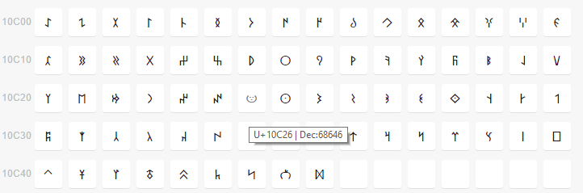
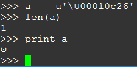
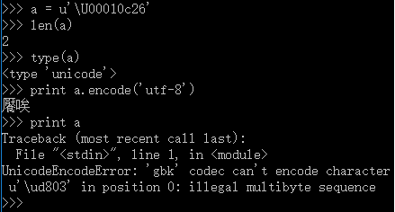
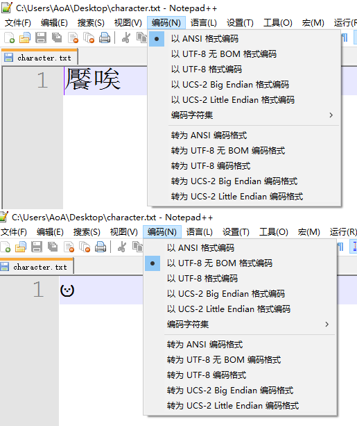

### UTF-16与UCS-2的区别

> From: http://demon.tw/programming/utf-16-ucs-2.html

字符是人们使用的记号，抽象意义上的一个符号。"Universal Multiple-Octet Coded Character Set"，简称 UCS, 俗称 "unicode"。UNICODE字符集中为全世界的每个字符制定一个唯一的码位（数字编号）来进行标识，以满足跨语言、跨平台进行文本转换、处理的要求。

> Characters (letters, numbers, symbols, ideograms, logograms, etc.) from the many languages, scripts, and traditions of the world are represented in the UCS with unique code points

每个UNICODE字符对应“码位”在计算机中如何使用字节进行存储的规定就叫做“编码”方案。

UTF-16和UCS-2都是Unicode的编码方式。

Unicode使用一个确定的名字和一个叫做码位（code point）的整数来定义一个字符。例如©字符被命名为“copyright sign”并且有一个值为U+00A9（0xA9，十进制169）的码位。

Unicode的码空间从U+0000到U+10FFFF，共有1,112,064个码位(code point)可用来映射字符. Unicode的码空间可以划分为17个平面(plane)，每个平面包含216(65,536)个码位。每个平面的码位可表示为从U+xx0000到U+xxFFFF, 其中xx表示十六进制值从00 到10，共计17个平面。

第一个Unicode平面(码位从U+0000至U+FFFF)包含了最常用的字符，该平面被称为基本多语言平面（Basic Multilingual Plane），缩写为BMP。其他平面称为辅助平面(Supplementary Planes)。

**UCS-2** (2-byte Universal Character Set)是一种定长的编码方式，UCS-2仅仅简单的使用一个16位码元来表示码位，也就是说在0到0xFFFF的码位范围内，它和UTF-16基本一致。

**UTF-16** (16-bit Unicode Transformation Format)是UCS-2的拓展，它可以表示BMP以为的字符。UTF-16使用一个或者两个16位的码元来表示码位，这样就可以对0到0x10FFFF的码位进行编码。

例如，在UCS-2和UTF-16中，BMP中的字符U+00A9 copyright sign（©）都被编码为0x00A9。

但是在BMP之外的字符，例如𝌆，只能用UTF-16进行编码，使用两个16为码元来表示：0xD834 0xDF06。这被称作**代理对**，值得注意的是一个代理对仅仅表示一个字符，而不是两个。UCS-2并没有代理对的概念，所以会将0xD834 0xDF06解释为两个字符。

简单的说，UTF-16可看成是UCS-2的父集。在没有辅助平面字符（surrogate code points）前，UTF-16与UCS-2所指的是同一的意思。（严格的说这并不正确，因为在UTF-16中从U+D800到U+DFFF的码位不对应于任何字符，而在使用UCS-2的时代，U+D800到U+DFFF内的值被占用。）但当引入辅助平面字符后，就称为UTF-16了。

 ISO 10646 defines several character encoding forms for the Universal Coded Character Set. The simplest, UCS-2, uses a single code value (defined as one or more numbers representing a code point) between 0 and 65,535 for each character, and allows exactly two bytes (one 16-bit word) to represent that value. UCS-2 thereby permits a binary representation of every code point in the BMP, as long as the code point represents a character. UCS-2 cannot represent code points outside the BMP. (Occasionally, articles about Unicode will mistakenly refer to UCS-2 as "UCS-16". UCS-16 does not exist; the authors who make this error usually intend to refer to UCS-2 or to UTF-16.)

The first amendment to the original edition of the UCS defined UTF-16, an extension of UCS-2, to represent code points outside the BMP. A range of code points in the S (Special) Zone of the BMP remains unassigned to characters. UCS-2 disallows use of code values for these code points, but UTF-16 allows their use in pairs. Unicode also adopted UTF-16, but in Unicode terminology, the high-half zone elements become "high surrogates" and the low-half zone elements become "low surrogates".

Another encoding, UCS-4, uses a single code value between 0 and (theoretically) hexadecimal 7FFFFFFF for each character (although the UCS stops at 10FFFF and ISO/IEC 10646 has stated that all future assignments of characters will also take place in that range). UCS-4 allows representation of each value as exactly four bytes (one 32-bit word). UCS-4 thereby permits a binary representation of every code point in the UCS, including those outside the BMP. As in UCS-2, every encoded character has a fixed length in bytes, which makes it simple to manipulate, but of course it requires twice as much storage as UCS-2.

Currently, the dominant UCS encoding is UTF-8, which is a variable-width encoding designed for backward compatibility with ASCII, and for avoiding the complications of endianness and byte-order marks in UTF-16 and UTF-32. More than half of all Web pages are encoded in UTF-8.


### Python内部的编码机制

Python虽然采用unicode作为默认字符，但语言内部用什么方法表示unicode字符串并没有一致的规定。在编译的时候可以选择用UCS2或者UCS4编码。
默认情况下，在自己win10上安装32位python 2.7x版本发现使用的是UCS2。而在ubuntu 16.04中安装的python 2.7x使用的是UCS4。

sys.maxunicode在上述两个平台上的输出分别如下：

Windowns
```
C:\Users>python
Python 2.7.12 (v2.7.12:d33e0cf91556, Jun 27 2016, 15:19:22) [MSC v.1500 32 bit (Intel)] on win32
Type "help", "copyright", "credits" or "license" for more information.
>>> import sys
>>> print sys.maxunicode
65535
```

Linux
```
python
Python 2.7.12 (default, Nov 19 2016, 06:48:10)
[GCC 5.4.0 20160609] on linux2
Type "help", "copyright", "credits" or "license" for more information.
>>> import sys
>>> print sys.maxunicode
1114111
```

对于非BMP字符[𐰦](https://unicode-table.com/en/blocks/old-turkic/)，windows平台中使用UCS-2编码的Python会认为是两个字符，而linux平台中UCS-4编码的Python认为是一个字符。



linux平台输出结果：



windows平台输出结果：



上述输出符合Python预期的行为，Python使用UCS-2表示一个字符，对于超出BMP的字符，Python会认为是两个字符，但是内部字符串转换函数可以正确处理该字符。例如，在windows UCS-2的Python中BMP字符𐰦可以使用utf-8进行编码，windows控制台中输出的“饜唉”为𐰦对应的utf-8编码。



下面代码运行结果也可以证明上述猜测：
```
# coding:utf-8
import sys
print sys.maxunicode
import json
a=u"饜哀"
print json.dumps({"1":a})
x = a.encode('utf-8',errors='strict')
print x
```

linux平台输出结果：
```
1114111
{"1": "\ud803\udc27"}
𐰧
```

windows平台输出结果：
```
65535
{"1": "\ud803\udc27"}
饜哀
```

### 确定Windows XP到底是UCS-2的还是UTF-16的

一般认为Windows下以16bit表示的Unicode并不是UTF-16，而是UCS-2。但是这并不正确。


UCS-2是一种编码格式，同时也是指以一一对应关系的Unicode实现。在UCS-2中只能表示U+0000到U+FFFF的BMP(Basic Multilingual Plane ) Unicode编码范围，属于定长的Unicode实现，而UTF-16是变长的，类似于UTF-8的实现，但是由于其字节长度的增加，所以BMP部分也做到了一一对应，但是其通过两个双字节的组合可以做到表示全部Unicode，表示范围从U+0000 到 U+10FFFF。关于这一点，我在很多地方都看到混淆了，混的我自己都有点不太肯定自己的说法了，还好在《UTF-16/UCS-2》中还是区别开了，不然我不知道从哪里去寻找一个正确答案。（哪怕在IBM的相关网页上都将UCS-2作为UTF-16的别名列出）

在[《UTF-16/UCS-2》](https://en.wikipedia.org/wiki/UTF-16)文中有以下内容：

> UTF-16 is used for text in the OS API in Microsoft Windows 2000/XP/2003/Vista/CE. Older Windows NT systems (prior to Windows 2000) only support UCS-2. In Windows XP, no code point above U+FFFF is included in any font delivered with Windows for European languages.

很明确的说明了Windows 2000以后内核已经是UTF-16的了。


原文链接：http://blog.csdn.net/vagrxie/article/details/3947054

参考链接：http://zh.wikipedia.org/wiki/UTF-16

http://demon.tw/programming/utf-16-ucs-2.html