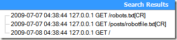
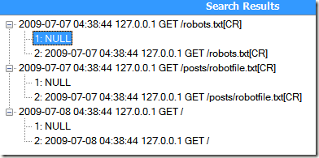
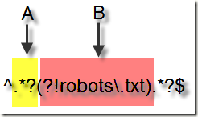
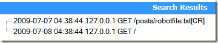

### 使用正则表达式找出不包含特定字符串的条目

> 2009-08-05 ——Kevin Yang

> http://www.imkevinyang.com/2009/08/%E4%BD%BF%E7%94%A8%E6%AD%A3%E5%88%99%E8%A1%A8%E8%BE%BE%E5%BC%8F%E6%89%BE%E5%87%BA%E4%B8%8D%E5%8C%85%E5%90%AB%E7%89%B9%E5%AE%9A%E5%AD%97%E7%AC%A6%E4%B8%B2%E7%9A%84%E6%9D%A1%E7%9B%AE.html

#### 概述

做日志分析工作的经常需要跟成千上万的日志条目打交道，为了在庞大的数据量中找到特定模式的数据，常常需要编写很多复杂的正则表达式。例如枚举出日志文件中不包含某个特定字符串的条目，找出不以某个特定字符串打头的条目，等等。

#### 使用否定式前瞻

正则表达式中有前瞻（Lookahead）和后顾（Lookbehind）的概念，这两个术语非常形象的描述了正则引擎的匹配行为。需要注意一点，正则表达式中的前和后和我们一般理解的前后有点不同。一段文本，我们一般习惯把文本开头的方向称作“前面”，文本末尾方向称为“后面”。但是**对于正则表达式引擎来说，因为它是从文本头部向尾部开始解析的（可以通过正则选项控制解析方向），因此对于文本尾部方向，称为“前”，因为这个时候，正则引擎还没走到那块，而对文本头部方向，则称为“后”，因为正则引擎已经走过了那一块地方**。如下图所示：


所谓的前瞻就是在正则表达式匹配到某个字符的时候，往“尚未解析过的文本”预先看一下，看是不是符合/不符合匹配模式，而后顾，就是在正则引擎已经匹配过的文本看看是不是符合/不符合匹配模式。符合和不符合特定匹配模式我们又称为**肯定式匹配和否定式匹配**。

现代高级正则表达式引擎一般都支持都支持前瞻，对于后顾支持并不是很广泛，因此我们这里采用否定式前瞻来实现我们的需求。

#### 实现

测试数据：

```
2009-07-07 04:38:44 127.0.0.1 GET /robots.txt
2009-07-07 04:38:44 127.0.0.1 GET /posts/robotfile.txt
2009-07-08 04:38:44 127.0.0.1 GET /
```

例如上面这几条简单的日志条目，我们想实现两个目标：

1. 把8号的数据过滤掉

2. 把那些不包含robots.txt字符串的条目给找出来（只要Url中包含robots.txt的都给过滤掉）。

前瞻的语法是：

```
(?!匹配模式)
```

我们先来实现第一个目标——**匹配不以特定字符串开头的条目。**

这里我们因为要排除一段连续的字符串，因此匹配模式非常简单，就是2009-07-08。实现如下：

```
^(?!2009-07-08).*?$
```

用[Expresso](http://www.ultrapico.com/ExpressoDownload.htm)我们可以看到结果确实过滤掉8号的数据。

接下来，我们来实现第二个目标——**排除包含特定字符串的条目**。

按照我们上面写法，我照葫芦画瓢了一下：

```
^.*?(?!robots\.txt).*?$
```

这段正则用大白话描述就是：开头任意字符，然后后面不要跟着robots.txt连续字符串，然后再跟着任意个字符，字符串结尾。

运行测试，结果发现：



没有达到我们想要的效果。这是为什么呢？我们给上面的正则表达式加上两个捕获分组调试一下：

```
^(.*?)(?!robots\.txt)(.*?)$
```

测试结果：



我们看到，第一个分组啥都没有匹配到，而第二个分组却匹配了整个字符串。再回过头来好好分析一下刚才那个正则表达式。实际上，当正则引擎解析到A区域的时候，就已经开始执行B区域的前瞻工作。这个时候发现当A区域为Null的时候匹配成功——`.*`本来就允许匹配空字符，前瞻条件又满足，A区域后面紧跟着的是“2009”字符串，而并不是robots。因此整个匹配过程成功匹配到所有条目。



分析出原因之后我们对上述的正则进行修正，将`.*?`移入前瞻表达式，如下：

```
^(?!.*?robots).*$
```

测试结果:



Bingo!

### 更多相关表达式

`(pattern)`

匹配pattern并获取这一匹配。所获取的匹配可以从产生的Matches集合得到，在VBScript中使用SubMatches集合，在JScript中则使用$0…$9属性。要匹配圆括号字符，请使用`\(`或`\)`。

`(?:pattern)`

非获取匹配，匹配pattern但不获取匹配结果，不进行存储供以后使用。这在使用或字符“(|)”来组合一个模式的各个部分时很有用。例如“industr(?:y|ies)”就是一个比“industry|industries”更简略的表达式。

`(?=pattern)`

非获取匹配，正向肯定预查，在任何匹配pattern的字符串开始处匹配查找字符串，该匹配不需要获取供以后使用。例如，“Windows(?=95|98|NT|2000)”能匹配“Windows2000”中的“Windows”，但不能匹配“Windows3.1”中的“Windows”。预查不消耗字符，也就是说，在一个匹配发生后，在最后一次匹配之后立即开始下一次匹配的搜索，而不是从包含预查的字符之后开始。

`(?!pattern)`

非获取匹配，正向否定预查，在任何不匹配pattern的字符串开始处匹配查找字符串，该匹配不需要获取供以后使用。例如“Windows(?!95|98|NT|2000)”能匹配“Windows3.1”中的“Windows”，但不能匹配“Windows2000”中的“Windows”。

`(?<=pattern)`

非获取匹配，反向肯定预查，与正向肯定预查类似，只是方向相反。例如，“(?<=95|98|NT|2000)Windows”能匹配“2000Windows”中的“Windows”，但不能匹配“3.1Windows”中的“Windows”。
*python的正则表达式没有完全按照正则表达式规范实现，所以一些高级特性建议使用其他语言如java、scala等

`(?<!patte_n)`
非获取匹配，反向否定预查，与正向否定预查类似，只是方向相反。例如“(?<!95|98|NT|2000)
Windows”能匹配“3.1Windows”中的“Windows”，但不能匹配“2000Windows”中的“Windows”。
*python的正则表达式没有完全按照正则表达式规范实现，所以一些高级特性建议使用其他语言如java、scala等

Reference：[正则表达式](https://baike.baidu.com/item/%E6%AD%A3%E5%88%99%E8%A1%A8%E8%BE%BE%E5%BC%8F)