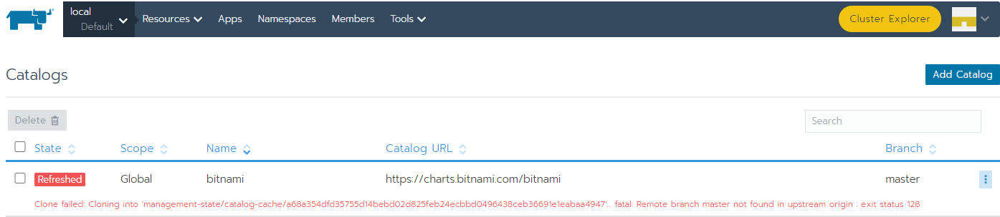

# Rancher添加bitnami helm chart错误

> 2022.09.08

在Rancher中添加bitnami的helm chart，报如下错误：



```
Clone failed: Cloning into 'management-state/catalog-cache/a68a354dfd35755d14bebd02d825feb24ecbbd0496438ceb36691e1eabaa4947'... fatal: Remote branch master not found in upstream origin : exit status 128	
```

bitnami/charts 有人提相同的[issue](https://github.com/bitnami/charts/issues/8433)

```
helm repo add bitnami https://charts.bitnami.com/bitnami
```

```
Error: looks like "https://charts.bitnami.com/bitnami" is not a valid chart repository or cannot be reached: stream error: stream ID 1; INTERNAL_ERROR
```

```
Downloading common from repo https://charts.bitnami.com/bitnami
Save error occurred:  could not find : chart rabbitmq not found in https://charts.bitnami.com/bitnami: looks like "https://charts.bitnami.com/bitnami" is not a valid chart repository or cannot be reached: stream error: stream ID 1; INTERNAL_ERROR
```


临时解决办法如下：

```
helm repo remove bitnami
helm repo add bitnami  https://raw.githubusercontent.com/bitnami/charts/index/bitnami
```

原因是：After some investigation, it seems the root cause is related to CloudFront serving the index.yaml (a pretty fat 14MBs index.yaml with a ton of monthly pulls). Because of that, we're probably reaching CF limits with this volume of traffic.

We are evaluating what is the best way to put the index.yaml on a diet, probably by removing some old versions from the file and keeping just the latest one for a period of time (i.e 6 months). We will post a pinned [GH issue](https://github.com/bitnami/charts/issues/10539) with the final decision to mitigate this issue and any workaround for anyone interested in a previous version of the index.yaml