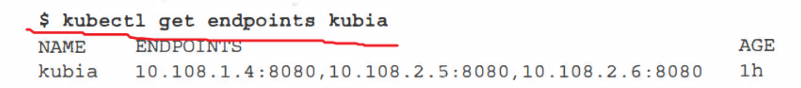

# k8s中的endpoint

endpoint是k8s集群中的一个资源对象，存储在etcd中，用来记录一个service对应的所有pod的访问地址。

service配置selector，endpoint controller才会自动创建对应的endpoint对象；否则，不会生成endpoint对象。

当客户端连接到服务时，服务代理选择这些列表中的ip和port对中的一个，并将传入连接重定向到在该位置监听的服务器。

例如，k8s集群中创建一个名为kubia的service，就会生成一个同名的endpoint对象，其中ENDPOINTS就是service关联的pod的ip地址和端口。

## endpoint controller

endpoint controller是k8s集群控制器的其中一个组件，其功能如下：

- 负责生成和维护所有endpoint对象的控制器
- 负责监听service和对应pod的变化
- 监听到service被删除，则删除和该service同名的endpoint对象
- 监听到新的service被创建，则根据新建service信息获取相关pod列表，然后创建对应endpoint对象
- 监听到service被更新，则根据更新后的service信息获取相关pod列表，然后更新对应endpoint对象
- 监听到pod事件，则更新对应的service的endpoint对象，将podIp记录到endpoint中
