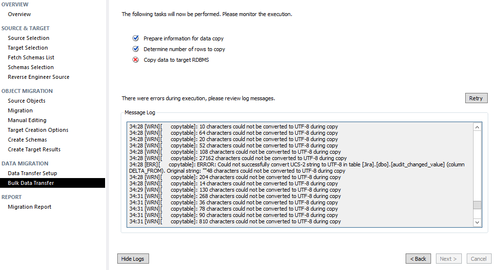
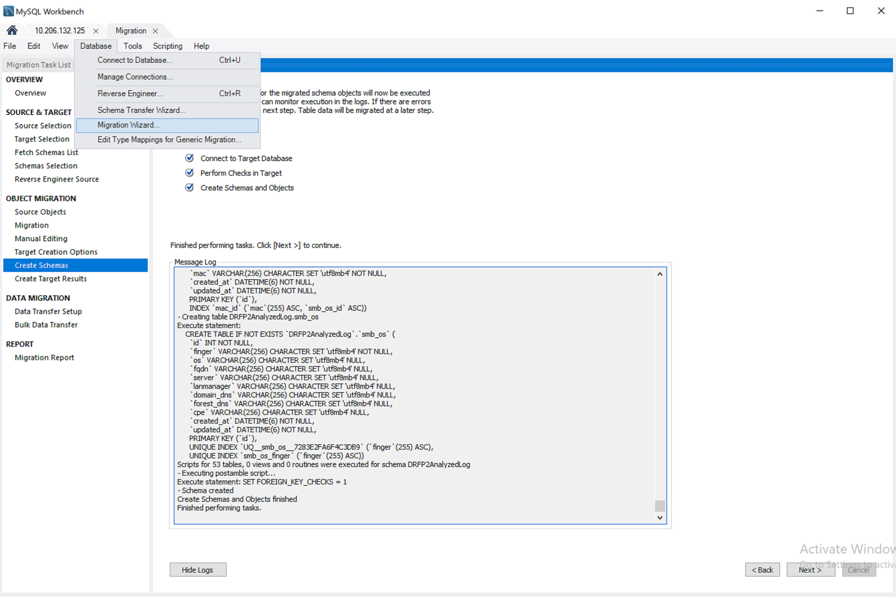
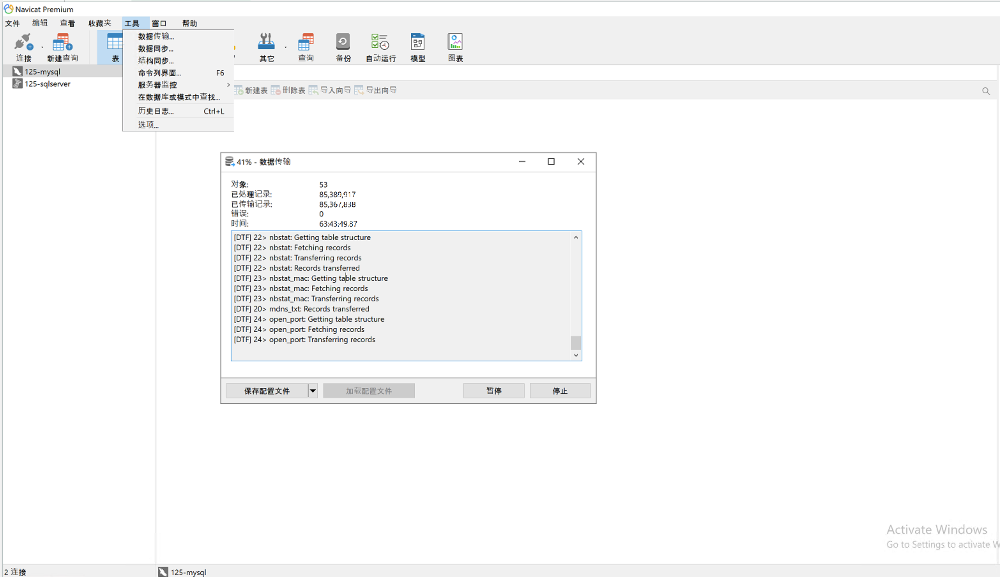
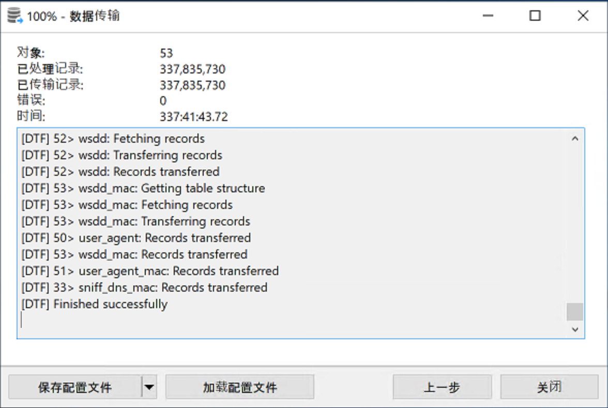

## SQLServer迁移至MySQL

> 2020.09.20

最近需要将一个SQL Server中的数据库迁移至MySQL中，迁移操作可以离线进行。

Google发现可以使用MySQL Workbench进行数据迁移（[Migrate from MS SQL Server to MySQL](https://www.percona.com/blog/2016/06/23/migrate-from-ms-sql-server-to-mysql/)）。

但，实际操作中总是出现字符编码错误，样例信息如下：

虽然帖子中写使用SQL Server的“ODBC (FreeTDS)”驱动可以解决问题，但却没能找到在windows上安装“ODBC (FreeTDS)”的解决方案。

又继续挣扎一段时间，得知，Navicat也可以进行数据库间的数据迁移工作。

测试发现，使用Navicat迁移我们的SQL Server数据库也总是失败。失败主要原因在于：Navicat将SQL Server中的表自动转为MySQL中的表时，某些字段类型自动映射的并不是很合适。

最后决定，使用`MySQL Workbench`进行从SQL Server到MySQL数据库迁移时的表创建操作。然后，再使用`Navicat`将SQL Server的记录迁移到MySQL。

## MySQL Workbench 创建目标数据库和表

## Navicat 仅复制数据到目标数据库

数据复制成功后显示如下（建议复制数据的时候设置多个线程，不然数据复制时间会很久）：

Reference:

[Migrate from MS SQL Server to MySQL](https://www.percona.com/blog/2016/06/23/migrate-from-ms-sql-server-to-mysql/)

[How to fix “Incorrect string value” errors?](https://stackoverflow.com/questions/1168036/how-to-fix-incorrect-string-value-errors)
