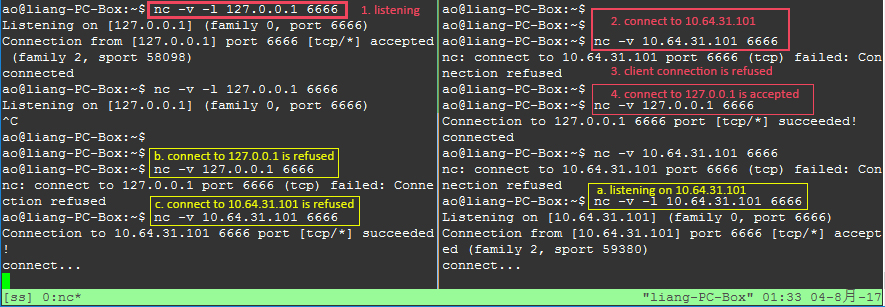

### MySQL bind_address config

The MySQL server listens on a single network socket for TCP/IP connections. This socket is bound to a single address, but it is possible for an address to map onto multiple network interfaces. To specify an address, use the `--bind-address=addr` option at server startup, where `addr` is an IPv4 or IPv6 address or a host name. If addr is a host name, the server resolves the name to an IP address and binds to that address.

> The address you specify in bind tells mysql where to listen. 0.0.0.0 is a special address, which means "bind to every available network".

> Only client software which is able to open a connection to the server using the same address that is in specified in the 'bind' option will be allowed to connect.

> These are all transport-level connections. Remote computers still need to qualify for application-level, which is to say they will still require the correct login credentials and host parameters from `mysql.user`.

For example, my computer network configuration is as following:

```
$ ifconfig
enp0s8    Link encap:Ethernet  HWaddr 08:00:27:77:1e:c4
          inet addr:10.64.31.101  Bcast:10.64.31.255  Mask:255.255.254.0
          inet6 addr: fe80::1bdf:40c4:4df2:3127/64 Scope:Link
          UP BROADCAST RUNNING MULTICAST  MTU:1500  Metric:1
          RX packets:2790165 errors:0 dropped:2 overruns:0 frame:0
          TX packets:508218 errors:0 dropped:0 overruns:0 carrier:0
          collisions:0 txqueuelen:1000
          RX bytes:3526823803 (3.5 GB)  TX bytes:625027605 (625.0 MB)

lo        Link encap:Local Loopback
          inet addr:127.0.0.1  Mask:255.0.0.0
          inet6 addr: ::1/128 Scope:Host
          UP LOOPBACK RUNNING  MTU:65536  Metric:1
          RX packets:53661 errors:0 dropped:0 overruns:0 frame:0
          TX packets:53661 errors:0 dropped:0 overruns:0 carrier:0
          collisions:0 txqueuelen:1
          RX bytes:4506061 (4.5 MB)  TX bytes:4506061 (4.5 MB)

```

Bind to 127.0.0.1 is different from binding to machine's IP(10.64.31.101 in my example) that is hosting the mysql server. Bind to 127.0.0.1 means mysqld only listens on the `lo Link:encap:Local Loopback` interface. All the traffic to the machine's IP(10.64.31.101) will not receive by mysqld. This simply because that you cannot create a tcp connection to mysql host IP if your server is listening on 127.0.0.1.

The following is a test that is done by `nc` command in Linux. You can not create a TCP connection using target IP(10.64.31.101) to 127.0.0.1, when your service is listening on 127.0.0.1



Then, someone may ask the following question.

### Why I could connect to mysql server using command `mysql -u root -h localhost -p` when mysqld only binds to machine's IP(10.64.31.101 in my example). 

This is because that mysql client will use Unix socket instead of TCP socket when your `-h` parameter is `localhost`.

After you create a mysql connection using above commond, you will find the following sample items in `netstat` command output.

```
unix  3      [ ]         STREAM     CONNECTED     2224190  /var/run/mysqld/mysqld.sock
unix  3      [ ]         STREAM     CONNECTED     2224189
```

mysql如果没有 -h 参数，默认会使用 UNIX socket 方式连接服务器，Unix domain socket 的路径在是可配置的，通常情况下是：/tmp/mysql.sock。（如果找不到，看看/etc/mysql.conf的配置，mysql那一部分中默认unix socket的路径，实在不行对mysqld用lsof，对mysql用strace看看丫的究竟open调用打开哪个文件去了） 

如果mysql通过 TCP/IP 方式进来的连接，MYSQL服务器接收到的来源主机是 127.0.0.1；如果是 UNIX socket 方式，MYSQL服务器接收到的来源主机是 localhost。要强制使用TCP/IP连接到本地服务器，那就使用IP地址 127.0.0.1 而不是主机名localhost。 

如果MYSQL服务器开启了 skip_name_resolve，MYSQL服务器就不会把接收到的 IP 地址转化为域名，所以前者的current_user就是 root@'127.0.0.1'，后者的current_user就是 root@'localhost'。

如果按照MYSQL的默认配置，skip_name_resovle 是OFF，MYSQL服务器就会将 127.0.0.1 转换为 localhost，那么前者和后者两种连接的 current_user 都是 root@'localhost'

1. mysql -h 127.0.0.1 的时候，使用TCP/IP连接， mysql server 认为该连接来自于127.0.0.1或者是"localhost.localdomain"

2. mysql -h localhost 的时候，是不使用TCP/IP连接的，而使用Unix socket； 此时，mysql server则认为该client是来自"localhost"

当mysql解析这个127.0.0.1的时候，他会把他当成localhost来使，当连接数据库进行认证的时候，他会从上至下遍历，找到第一条满足条件的host和user数据，然后返回进行密码校验。

> 注：127.0.0.1和localhost设置不同的密码，因为localhost的记录在127.0.0.1之前，所以，127.0.0.1的密码是没用的。

> 要想让127.0.0.1的密码有用，有二种方法：1、将127.0.0.1和localhost的记录互换; 2、开启skip_name_resovle

#### At last, the following is the offical descrption of bind_address (`addr`)vaule.

The server treats different types of addresses as follows:

If the address is *, the server accepts TCP/IP connections on all server host IPv6 and IPv4 interfaces if the server host supports IPv6, or accepts TCP/IP connections on all IPv4 addresses otherwise. Use this address to permit both IPv4 and IPv6 connections on all server interfaces. This value is the default.

If the address is 0.0.0.0, the server accepts TCP/IP connections on all server host IPv4 interfaces.

If the address is ::, the server accepts TCP/IP connections on all server host IPv4 and IPv6 interfaces.

If the address is an IPv4-mapped address, the server accepts TCP/IP connections for that address, in either IPv4 or IPv6 format. For example, if the server is bound to ::ffff:127.0.0.1, clients can connect using --host=127.0.0.1 or --host=::ffff:127.0.0.1.

If the address is a “regular” IPv4 or IPv6 address (such as 127.0.0.1 or ::1), the server accepts TCP/IP connections only for that IPv4 or IPv6 address.

If you intend to bind the server to a specific address, be sure that the mysql.user grant table contains an account with administrative privileges that you can use to connect to that address. Otherwise, you will not be able to shut down the server. For example, if you bind the server to *, you can connect to it using all existing accounts. But if you bind the server to ::1, it accepts connections only on that address. In that case, first make sure that the 'root'@'::1' account is present in the mysql.user table so you can still connect to the server to shut it down.


Reference:

[Server System Variables](https://dev.mysql.com/doc/refman/5.7/en/server-system-variables.html#sysvar_bind_address)

[Server Command Options](https://dev.mysql.com/doc/refman/5.7/en/server-options.html#option_mysqld_bind-address)

[Bind Address and Mysql Server](https://stackoverflow.com/questions/3552680/bind-address-and-mysql-server)

[MySQL: Bind to more than one IP address?](https://serverfault.com/questions/139323/mysql-bind-to-more-than-one-ip-address)

[mysql连接之127.0.0.1和localhost](http://wushank.blog.51cto.com/3489095/1685041/)

[How bad is setting MySQL's bind-address to 0.0.0.0?](https://serverfault.com/questions/257513/how-bad-is-setting-mysqls-bind-address-to-0-0-0-0)

[4.2.2 Connecting to the MySQL Server](https://dev.mysql.com/doc/refman/5.7/en/connecting.html#option_general_socket)