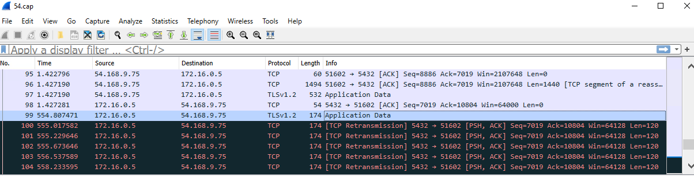
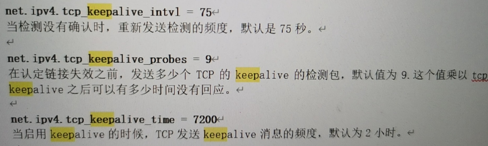

### Postgres JDBC tcpKeepAlive issue

> 2020.12.26

最近从AWS迁移一个Postgresql的数据库到Azure中，迁移后，之前一个运行良好的程序突然就被卡住。进程一直无法结束，等待时间超过一天仍无任何进展，并且程序也不抛出异常。

调试发现，程序卡在一个数据库的update操作上，被卡住的语句如下：

```
SqlSession curSession = DBWrapper.getSqlSessionObject();
curSession.update("generateStatisticsDeviceResultsTmp", dailyTaskParameterList);   // 挂起语句
```

这个update中的语句执行时间会长一些，正常执行需要十分钟左右。查看Postgresql服务器中执行的SQL，可以看到程序启动后，update语句正常执行。持续观察，可以看到客户端与Postgresql服务器的连接状态变为等待ClientRead。

```
select * from pg_stat_activity;

16384,fp2fullbeta,19296,10,postgres,PostgreSQL JDBC Driver,54.168.9.75,,51443,2020-12-25 07:30:13.116109,2020-12-25 07:30:14.628303,2020-12-25 07:37:37.017129,2020-12-25 07:37:37.021656,Client,ClientRead,idle in transaction,807115,,"**UPDATE**SQL**STATEMENT**",client backend
```

Postgresql服务器在此状态等待一段时间后，会主动关闭掉与客户端的链接。但是，此时客户端仍然卡在update语句那里，即不抛出异常，也无法继续后续语句的执行。

明明服务器那边已经关闭了TCP链接，而客户端这边仍然在坚持不懈地等待服务器返回Update语句的执行结果。我们怀疑网络出现了什么问题，分别在服务器端和程序执行端抓包，发现程序在最初的1秒内提交完Update语句，Postgresql服务器返回响应包，然后客户端就开始无限等待服务器执行结果的报文。



Postgresql服务器那边执行完Update语句后，时间已经过去500秒，此时<a href="tcpKeepAlive_res/server-side-packages.cap">服务器端</a>向<a href="tcpKeepAlive_res/client-side-packages.pcapng">客户端</a>发送响应报文，此响应报文无法被客户端接收到，并且可以看到服务器端该报文的重传现象，直到Postgresql服务器认为重试失败，最后关闭掉与客户端的链接。客户端那边一直未收到服务器任何报文Update响应结果的<a href="tcpKeepAlive_res/client-side-packages.pcapng">包</a>，所以处于无限等待状态。

我们猜测问题的原因：Azure与AWS网络中存在一个防火墙，在客户端与服务器端TCP链接空闲500秒的时间内，它主动阻断了客户端与Postgresql服务器端的链接，并且过滤掉了后续的服务器端响应包和重传包。

解决办法：启用客户端或服务器端的tcpKeeepAlive功能应该能解决这个问题。

### 如何配置JDBC的tcpKeepAlive参数

确定方向后，那就需要配置tcpKeepAlive。查询一圈后发现以下两种方式：

> https://jdbc.postgresql.org/documentation/head/connect.html

```
# mybatis connect URL
 <transactionManager type="JDBC"/>
<dataSource type="POOLED">
    <property name="driver" value="org.postgresql.Driver"/>
    <property name="url" value="jdbc:postgresql://0.0.0.0/fp2fullbeta?tcpKeepAlive=true"/>
    <property name="username" value="xxx"/>
    <property name="password" value="xxx"/>
</dataSource>
```

```
# java code
myBatisXmlResourceFile = myBatisXmlResourceFileName;
InputStream inputStream = Resources.getResourceAsStream(myBatisXmlResourceFile);
Properties props = new Properties();
props.setProperty("tcpKeepAlive","true");
sqlSessionFactory = new SqlSessionFactoryBuilder().build(inputStream, props);
```

设置后，发现程序依然会挂。抓包之后，并没有看到客户端发出的keep alive报文。这里问题在于，我们虽然设置了客户端keep alive参数，但并未指定TCP连接空闲多久后发送第一个keep alive包，Linux平台默认参数是7200秒后，发送keep alive包，其实对于我们的程序来说相当于没有keepAlive。

```
$ sudo sysctl -a | grep alive
net.ipv4.tcp_keepalive_intvl = 75
net.ipv4.tcp_keepalive_probes = 9
net.ipv4.tcp_keepalive_time = 7200

$ sudo sysctl -w net.ipv4.tcp_keepalive_time=60

$ sudo sysctl -a | grep alive

net.ipv4.tcp_keepalive_intvl = 75
net.ipv4.tcp_keepalive_probes = 9
net.ipv4.tcp_keepalive_time = 60
```



设置Linux tcpKeepAlive参数后，在运行程序抓包就可以看到正常的keep alive包了，并且程序不再出现挂住无法继续执行的情况。<a href='tcpKeepAlive_res/tcpKeepAlive_normal.cap'>正常的keepAlive包</a>

### 最后，不过话说回来，既然不能直接控制JDBC中tcpKeepAlive包的时间间隔，那不如调整Postgresql服务器端的keep alive包的时间间隔。

```
$ sudo vim /etc/postgresql/11/main/postgresql.conf
tcp_keepalives_idle = 60                # TCP_KEEPIDLE, in seconds;

$ sudo systemctl reload postgresql.service
```

Reference：

[Query hanging in ClientRead and blocking all others](https://dba.stackexchange.com/questions/251937/query-hanging-in-clientread-and-blocking-all-others)

A session that waits for `ClientRead` is done processing the last query and waits for the client to send the next request. The only way that such a session can block anything is if its `state` is `idle in transaction`. All locks are held until the transaction ends, and no locks are held once the transaction finishes.

If sessions remain in state `idle in transaction` for a longer time, that is always an application bug where the application forgot to end the transaction. This is bad, not only for the reason you observe, but also because it keeps autovacuum from doing its essential job.

There are two things you can do:

- Fix the application so that it properly closes transactions. This is the only good solution.

- Prevent the worst from happening by setting `idle_in_transaction_session_timeout` so that these transactions are automatically rolled back by PostgreSQL after a while. This will keep locks from being held indefinitly, but the buggy application will receive an error.


[postgresql是如何处理死连接](https://blog.csdn.net/dbadream/article/details/38422609)

DBAdream 2014-08-07 17:42:56 

在数据库postgresql中， 一个客户端到服务器连接实际上是一个tcp socket连接，tcp连接是虚连接，一方非正常退出（如断电），另一方会继续维持这个连接。
 
举个例子，一个客户端电脑正常连上服务器后，强行拔掉电源造成人为断电，重新启动电脑，再此连上服务器。用SQL语句select * from pg_stat_activily 查看服务器的所有连接，会发现本客户端的连接除了本次外，断电前的连接还在。因为服务器根本不知道客户端的断电行为，还以为那连接正在空闲状态。
 
然而这个死连接不会永远存在，2个小时后，服务器上的这个连接会自动切掉，因为postgresql支持TCP_KEEPLIVE机制。有三个系统变量tcp_keepalives_idle，tcp_keepalives_interval ，tcp_keepalives_count 来设置postgresql如何处理死连接。
 
对于每个连接，postgresql会对这个连接空闲tcp_keepalives_idle秒后，主动发送tcp_keeplive包给客户端，以侦探客户端是否还活着 ，当发送tcp_keepalives_count个侦探包，每个侦探包在tcp_keepalives_interval秒内没有回应，postgresql就认为这个连接是死的。于是切断这个死连接。
 
在postgresql, 这三个参数都设为0将使用操作系统的默认值，在linux下，tcp_keepalives_idle一般是2个小时，也就是2个小时后，服务器才可以自动关掉死连接。在实际应运中，可以自行调整以上参数。


[windows KeepAliveTime Parameters](https://docs.microsoft.com/en-us/previous-versions/windows/it-pro/windows-2000-server/cc957549(v=technet.10)?redirectedfrom=MSDN)

09/10/2008

```
HKLM\SYSTEM\CurrentControlSet\Services\Tcpip\Parameters
```


|Data type|Range|Default value|
|---|---|---|
|REG_DWORD|0x1–0xFFFFFFFF ( milliseconds )|0x6DDD00 ( 7,200,000 milliseconds = 2 hours )|

Determines how often TCP sends keep-alive transmissions. TCP sends keep-alive transmissions to verify that an idle connection is still active.

This entry is used when the remote system is responding to TCP. Otherwise, the interval between transmissions is determined by the value of the KeepAliveInterval entry.

By default, keep-alive transmissions are not sent. The TCP keep-alive feature must be enabled by a program, such as Telnet, or by an Internet browser, such as Internet Explorer.
