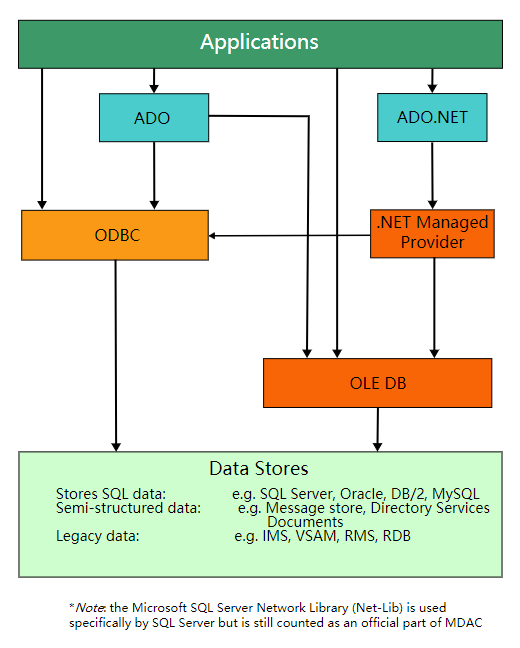
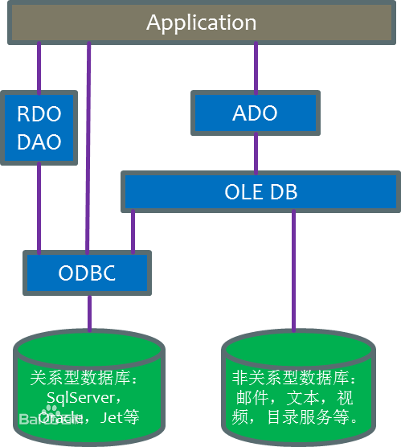

## OLE DB (Object Linking and Embedding, Database)对象链接和嵌入数据库

OLE DB (Object Linking and Embedding, Database, sometimes written as OLEDB or OLE-DB), an API designed by Microsoft, allows accessing data from a variety of sources in a uniform manner. The API provides a set of interfaces implemented using the Component Object Model (COM); it is otherwise unrelated to OLE(Object Linking and Embedding). 

Microsoft originally intended OLE DB as a higher-level replacement for, and successor to, ODBC, extending its feature set to support a wider variety of non-relational databases, such as object databases and spreadsheets that do not necessarily implement SQL.

OLE DB separates the data store from the application that needs access to it through a set of abstractions that include the datasource, session, command, and rowsets. This was done because different applications need access to different types and sources of data, and do not necessarily want to know how to access functionality with technology-specific methods. OLE DB is conceptually divided into **consumers** and **providers**. The consumers are the applications that need access to the data, and the providers are the software components that implement the interface and thereby provides the data to the consumer. OLE DB is part of the Microsoft Data Access Components (MDAC) stack.

OLE DB（OLEDB）是微软的战略性的通向不同的数据源的低级应用程序接口。OLE DB不仅包括微软资助的标准数据接口开放数据库连通性（ODBC）的结构化查询语言（SQL）能力，还具有面向其他非SQL数据类型的通路。

OLE DB作为微软的组件对象模型（COM）的一种设计，OLE DB是一组读写数据的方法（在过去可能被称为渠道）。OLD DB中的对象主要包括数据源对象、阶段对象、命令对象和行组对象。使用OLE DB的应用程序会用到如下的请求序列：初始化OLE 连接到数据源 发出命令 处理结果 释放数据源对象并停止初始化OLE

OLE DB标准中定义的新概念----OLE DB将传统的数据库系统划分为多个逻辑组件，这些组件之间相对独立又相互通信。这种组件模型中的各个部分被冠以不同的名称：数据提供者（Data Provider）。 提供数据存储的软件组件，小到普通的文本文件、大到主机上的复杂数据库，或者电子邮件存储，都是数据提供者的例子。有的文档把这些软件组件的开发商也称为数据提供者。

### OLE-DB的由来

随着数据源日益复杂化，现今的应用程序很可能需要从不同的数据源取得数据，加以处理，再把处理过的数据输出到另外一个数据源中。更麻烦的是这些数据源可能不是传统的关系数据库，而可能是Excel文件，Email，Internet/Intranet上的电子签名信息。Microsoft为了让应用程序能够以统一的方式存取各种不同的数
据源，在1997年提出了UniversalDataAccess(UDA)架构。UDA以COM技术为核心，协助程序员存取企业中各类不同的数据源。UDA以OLE-DB(属于操作系统层次的软件)做为技术的骨架。OLE-DB定义了统一的COM接口做为存取各类异质数据源的标准，并且封装在一组COM对象之中。藉由OLE-DB，程序员就可以使用一致的方式来存取各种数据。但仍然OLEDB是一个低层次的，利用效率不高。

### OLE DB 和ODBC的区别

由于OLEDB和ODBC 标准都是为了提供统一的访问数据接口，所以曾经有人疑惑：OLE DB 是不是替代ODBC 的新标准？答案是否定的(*尽管微软在某段时间内希望OLEDB能够接替ODBC*)。实际上，ODBC 标准的对象是基于SQL 的数据源（SQL-Based Data Source），而OLE DB 的对象则是范围更为广泛的任何数据存储。从这个意义上说，符合ODBC 标准的数据源是符合OLE DB 标准的数据存储的子集。

所以，也有下面这种层次结构图

Reference:

[OLE DB](https://en.wikipedia.org/wiki/OLE_DB)

[Microsoft SQLNCli team blog:
Native Data Access APIs – ODBC and OLE DB – for SQL Server](https://blogs.msdn.microsoft.com/sqlnativeclient/)

[Microsoft OLE DB Driver for SQL Server](https://docs.microsoft.com/en-us/sql/connect/oledb/oledb-driver-for-sql-server?view=sql-server-2017)

[ODBC、OLE DB、 ADO的区别](https://blog.csdn.net/yinjingjing198808/article/details/7665577)

[Connection modules for Microsoft SQL databases](https://docs.microsoft.com/en-us/sql/connect/sql-connection-libraries?view=sql-server-2017)