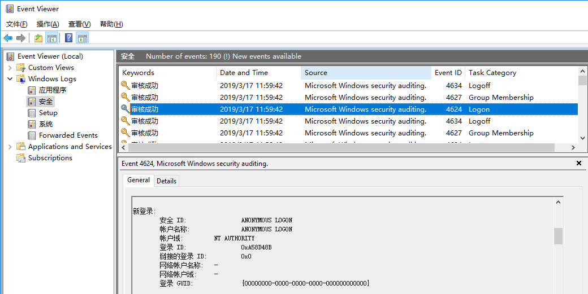
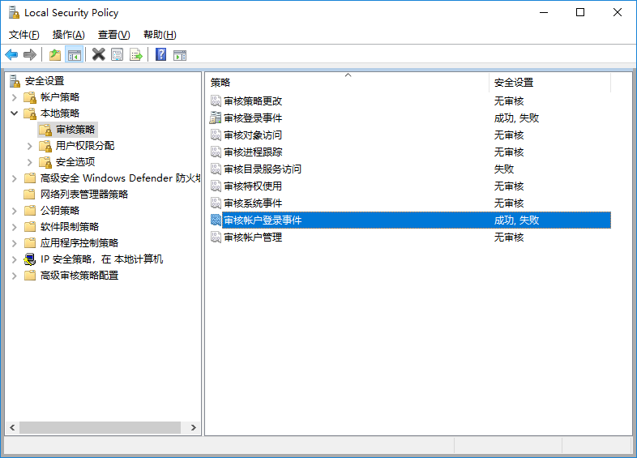

## SQL Server backup to a network share file

> 2019.3.16

### 备份SQL Server数据库至网络磁盘

SQL Server除了可以使用本地磁盘备份数据库外，还支持将数据库直接备份至网络共享文件。

不过，SQL Server将数据库备份至网络磁盘时，存在较多的限制。备份文件必须使用UNC(Universal Naming Convention)命名的方式指定，并且`sqlservr.exe`进程运行的账户必须拥有对备份文件访问的恰当权限。

此处，UNC路径指定的对象一般代表局域网中的共享资源（如，通过NetBIOS, SMB或CIFS协议共享的目录）。在Linux系统中可以使用Samba软件来共享资源，此资源在Windows系统中可以使用UNC路径的方式访问。


#### Back up to a network share file

>FROM: [Backup Devices (SQL Server)](https://docs.microsoft.com/en-us/sql/relational-databases/backup-restore/backup-devices-sql-server?view=sql-server-2017#NetworkShare)

For SQL Server to access a remote disk file, the SQL Server service account must have access to the network share. This includes having the permissions needed for backup operations to write to the network share and for restore operations to read from it. The availability of network drives and permissions depends on the context is which SQL Server service is running:

- To back up to a network drive when SQL Server is running in a domain user account, the shared drive must be mapped as a network drive in the session where SQL Server is running. If you start Sqlservr.exe from command line, SQL Server sees any network drives you have mapped in your login session.

- When you run `Sqlservr.exe` as a service, SQL Server runs in a separate session that has no relation to your login session. The session in which a service runs can have its own mapped drives, although it usually does not.

- You can connect with the network service account by using the computer account instead of a domain user. To enable backups from specific computers to a shared drive, grant access to the computer accounts. As long as the `Sqlservr.exe` process that is writing the backup has access, it is irrelevant whether the user sending the BACKUP command has access.

> IMPORTANT! Backing up data over a network can be subject to network errors; therefore, we recommend that when you are using a remote disk you verify the backup operation after it finishes.

#### Specify a Universal Naming Convention (UNC) name

To specify a network share in a backup or restore command, use the fully qualified universal naming convention (UNC) name of the file for the backup device. A UNC name has the form `\\Systemname\ShareName\Path\FileName.`

For example:

```
SQL

BACKUP DATABASE AdventureWorks2012   
   TO DISK = '\\BackupSystem\BackupDisk1\AW_backups\AdventureWorksData.Bak';  
GO
```

### `sqlservr.exe`进程运行时的用户及其权限

正如上边介绍一样，当`sqlservr.exe`进程运行时的用户身份不同，备份数据库时，`sqlservr.exe`访问远程共享磁盘使用的凭据也会有所差异。数据库备份时，访问网络共享磁盘的凭据仅和`sqlservr.exe`进程运行的用户相关，而与发送备份命令的进程身份无关。

1. 当`sqlservr.exe`默认安装时，其使用虚拟账户（Virtual Accounts）`NT SERVICE\<SERVICENAME>`的权限来访问网络共享磁盘。当SQL Server安装的服务器主机启用域认证时，`NT SERVICE\<SERVICENAME>`使用服务器主机的权限，服务器主机对应的账户格式为`<domain_name>\<computer_name>$`。如果，安装SQL Server的服务器没有接入域，那么当使用`NT SERVICE\<SERVICENAME>`运行`sqlservr.exe`服务时，`sqlservr.exe`访问网络共享磁盘使用的身份为`NT AUTHORITY\ANONYMOUS LOGON`（如下图所示）。

2. 当`sqlservr.exe`服务以某一用户账号（如，域账号）运行时，那么`sqlservr.exe`访问网络共享磁盘时即使用该用户的凭据。



综上，SQL Server备份数据库到网络共享磁盘时，需要设置恰当的访问权限。当出现问题时，可以通过查看SQL Server服务具体使用哪个账户的凭据进行网络访问的，从而快速定位问题。可以通过在本地定义一个共享资源，同时打开“审核策略”来查看SQL Server访问网络共享硬盘的具体凭据信息。

> 自己测试中，无法从公司的域中搜索出代表机器的账号，所以无奈试了试`Domain Computer`这个实体，发现可以代表域中的机器授予权限，如下图。


> 另外，测试发现使用SSMS（SQL Server Management Studio）工具以Windows身份认证方式登录SQL Server服务器时，如果在SSMS中手动执行数据库备份操作，当指定UNC网络共享文件时，其判断UNC资源的权限时会额外使用当前登录Windows系统用户的凭据进行额外的尝试。因此，SSMS此时的判断，并非完全可靠。下图，为`sqlservr.exe`以`NT SERVICE\<SERVICENAME>`账号运行时（且SQL Server服务器未接入域），SSMS使用Windows身份认证的用户凭据进行网络共享文件访问权限的试探情况。


### 查看Windows共享目录的登录和访问日志

> From:[查看共享文件访问日志方法](https://jingyan.baidu.com/article/ed15cb1bb109451be36981d3.html)

在局域网中，经常有文件服务器共享一些文件让局域网用户访问，但是经常出现共享文件被不小心或恶意删除的情况发生，而这个时候往往管理员也无法得知究竟是局域网那个用户做了这种操作。通过Windows的“审核”功能即可记录用户的登录和访问日志，从而可以追踪资源的访问。

在“控制面板” -> “管理工具”中打开“本地安全策略”管理程序。在弹出的“本地安全策略”编辑界面中，依次选择“本地策略” -> “审核策略”。设置“审核账号登录事件”为“成功，失败”。如果需要记录共享对象的访问记录，需要配置“审核对象访问”。如下图，我们仅配置登录事件审计：



如果，需要记录共享对象的访问记录，需要额外在共享的文件夹的属性中，修改“安全”标签下“高级”选项中的“审核”配置。配置完成后，即可在Windows自带的“事件查看器”工具中“Windows log”下的“安全”标签中查看相应的审核日志。

### Virtual accounts

> From: [Service Accounts - Virtual accounts](https://docs.microsoft.com/en-us/windows/security/identity-protection/access-control/service-accounts#a-href-idbkmk-virtualserviceaccountsavirtual-accounts)

Virtual accounts were introduced in Windows Server 2008 R2 and Windows 7, and are managed local accounts that provide the following features to simplify service administration:

- The virtual account is automatically managed.

- The virtual account can access the network in a domain environment.

- No password management is required. For example, if the default value is used for the service accounts during SQL Server setup on Windows Server 2008 R2, a virtual account that uses the instance name as the service name is established in the format NT SERVICE\<SERVICENAME>.

Services that run as virtual accounts access network resources by using the credentials of the computer account in the format `<domain_name>\<computer_name>$`.


Reference: [Manage the Database Engine Services -> Windows Service Accounts & Permissions -> Configure Windows Service Accounts and Permissions](https://docs.microsoft.com/en-us/sql/database-engine/configure-windows/configure-windows-service-accounts-and-permissions?view=sql-server-2017)

[Access Control Overview](https://docs.microsoft.com/en-us/windows/security/identity-protection/access-control/access-control)

[Working With the Universal Naming Convention (UNC Path)](https://www.lifewire.com/unc-universal-naming-convention-818230)

[2.2.57 UNC](https://docs.microsoft.com/en-us/openspecs/windows_protocols/ms-dtyp/62e862f4-2a51-452e-8eeb-dc4ff5ee33cc)