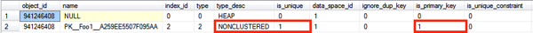
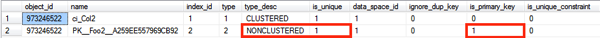
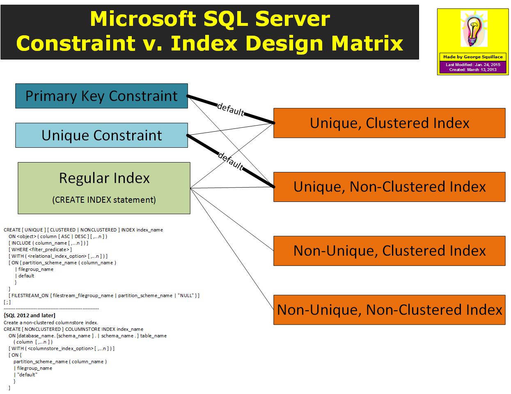

### Primary Key vs. Clustered Index

> June 29, 2015 · Klaus Aschenbrenner 

In today’s blog posting I want to talk about a very important topic in SQL Server that always confuses people when they first work with SQL Server. It is about the difference between the **Primary Key** constraint and the Clustered Index.

##### What is a Primary Key?

Let’s talk first about the Primary Key constraint itself. As the name implies it is just a constraint, and with that constraint you tell SQL Server that you want to have unique values in a specific column or in a specific group of columns. The following listing shows a very simple table definition where the Primary Key constraint is specified on the first column `Col1`.

```
CREATE TABLE Foo
(
    Col1 INT NOT NULL PRIMARY KEY,
    Col2 INT NOT NULL,
    Col3 INT NOT NULL
)
GO
```

Now when you insert records into that table, SQL Server makes sure that you always have unique values in the column `Col1`. If you try to insert a duplicate value, SQL Server returns error message.

```
-- Try to insert a duplicate value
INSERT INTO Foo Values (1, 1, 1), (1, 2, 2)
GO
```

*Msg 2627, Level 14, State 1, Line 9 Violation of PRIMARY KEY constraint ‘PK__Foo__A259EE544224D12A’. Cannot insert duplicate key in object ‘dbo.Foo’. The duplicate key value is (1). The statement has been terminated.*

The Primary Key constraint itself is defined on a logical level – you just tell SQL Server that you want to have unique values in a specific column. But SQL Server also has to enforce that uniqueness on the physical level – in the data structures where you store your table data. In the case of SQL Server, the uniqueness on the physical level is enforced with an index structure – with a **Clustered Index** or **Non-Clustered Index**. Let’s have a more detailed look at this.

##### Enforcement of the Primary Key constraint

When you specify the Primary Key constraint, SQL Server enforces it by default with a `Unique Clustered Index` on the physical level. When you look at `sys.indexes`, you can see that under the covers SQL Server has generated a Unique Clustered Index that is used to enforce the Primary Key constraint.

```
-- SQL Server generates by default a Unique Clustered Index
SELECT * FROM sys.indexes
WHERE object_id = OBJECT_ID('Foo')
GO
```

As I have said, the Unique Clustered Index is created by default. You can also enforce a Primary Key constraint with a Unique Non-Clustered Index as shown in the following listing.

```
-- Enforces the Primary Key constraint with a Unique Non-Clustered Index
CREATE TABLE Foo1
(
    Col1 INT NOT NULL PRIMARY KEY NONCLUSTERED,
    Col2 INT NOT NULL,
    Col3 INT NOT NULL
)
GO
```

When you specify the Primary Key constraint, you can specify the following 2 options:

- CLUSTERED
- NONCLUSTERED

The option `CLUSTERED` is the default one, and therefore you don’t have to specify it. When you look now again at `sys.indexes`, you can see now that you have a heap table in front of you (a table without a Clustered Index), and that SQL Server has generated an additional Unique Non-Clustered Index to enforce the Primary Key constraint.

```
-- SQL Server has generated now a Unique Non-Clustered Index to
-- enforce the Primary Key constraint
SELECT * FROM sys.indexes
WHERE object_id = OBJECT_ID('Foo1')
GO
```



##### Primary Key <> Clustered Index

Therefore it doesn’t mean that a Primary Key and a Clustered Index is always the same in SQL Server. It is the same by default, but you can change this behavior if you want. The Primary Key constraint is always on the logical level, and the index structure is on the physical level to enforce the constraint itself.

The question now is when does it make sense to enforce the Primary Key constraint with a Unique Non-Clustered Index? Back in April 2014 I wrote about a problem in SQL Server that is called [Last Page Insert Latch Contention](https://www.sqlpassion.at/archive/2014/04/15/an-ever-increasing-clustered-key-value-doesnt-scale/): an ever-increasing Clustered Key column like an `INT IDENTITY` column doesn’t really scale in SQL Server.

If you hit that specific problem, it **\*could\*** make more sense to physically cluster/sort your table data on a random value – like a `UNIQUEIDENTIFIER` column. In that case you can still use the Primary Key constraint on the original ever-increasing key column, but enforce it with a Unique Non-Clustered Index, and cluster your table on a random key column. The following listing shows this approach.

```
-- Create the Primary Key constraint on an ever-increasing
-- key column
CREATE TABLE Foo2
(
    Col1 INT NOT NULL PRIMARY KEY NONCLUSTERED,
    Col2 UNIQUEIDENTIFIER NOT NULL,
    Col3 INT NOT NULL
)
GO
 
-- Create the Clustered Index on a random key column
CREATE UNIQUE CLUSTERED INDEX ci_Col2 ON Foo2(Col2)
GO
```

When you look again at `sys.indexes`, you can see now that you have created a Clustered and Non-Clustered Index. But only the Non-Clustered Index is used to enforce the Primary Key constraint.



##### Summary

A Primary Key constraint and a Clustered Index is not really the same in SQL Server. By default SQL Server enforces the Primary Key constraint with a Unique Clustered Index. But if you want you could instead enforce it with a Unique Non-Clustered Index. But that approach wouldn’t really make sense as a default, because you need to have specific problems to justify that approach.



From: [Primary Key vs. Clustered Index](http://www.sqlpassion.at/archive/2015/06/29/primary-key-vs-clustered-index/)