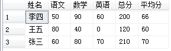
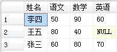
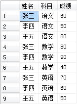
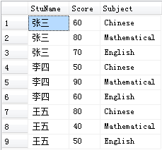

## SQLServer行列转换pivot  unpivot

> https://max.book118.com/html/2017/0528/109787317.shtm

PIVOT用于将列值旋转为列名（即行转列），在SQL Server 2000可以用聚合函数配好CASE语句实现。

pivot的一般语法是： `table_source pivot(聚合函数(列) for 列 in (...) ) AS P`

完整语法：

```
table_source
pivot(
  聚合函数(value_column)
  for pivot_colum
  IN (<column_list>)
)
```

> column_list即是table_source中pivot_colum列中的值又是新转的表的列名。

unpivot用于将列名转为列值（即列转行），在SQL Server 2000可以用UNION语句来实现。

完整语法：

```
table_source
unpivot(
  value_column
  for pivot_column
  in(<column_list>)
)
```

### SQL Server行列转换典型实例

> https://blog.csdn.net/pan_junbiao/article/details/80957274

1、行列转换

创建创建学生成绩表并添加学生成绩信息。

```
/*-创建学生成绩表-*/
CREATE TABLE StuScore 
(
    StuName VARCHAR(20),  --姓名
    Subject VARCHAR(20),  --科目
    Score INT             --成绩   
);

/*-添加学生成绩信息-*/
INSERT INTO StuScore  VALUES('张三','语文',60);
INSERT INTO StuScore  VALUES('张三','数学',80);
INSERT INTO StuScore  VALUES('张三','英语',70);
INSERT INTO StuScore  VALUES('李四','语文',50);
INSERT INTO StuScore  VALUES('李四','数学',90);
INSERT INTO StuScore  VALUES('李四','英语',60);
INSERT INTO StuScore  VALUES('王五','语文',80);
INSERT INTO StuScore  VALUES('王五','数学',40);
```


1.1 使用Case WHEN 实现行转列

```
/*-使用Case WHEN 实现行转列-*/
SELECT StuName AS '姓名',
    MAX(CASE Subject WHEN '语文' THEN Score ELSE 0 END) AS '语文',
    MAX(CASE Subject WHEN '数学' THEN Score ELSE 0 END) AS '数学',
    MAX(CASE Subject WHEN '英语' THEN Score ELSE 0 END) AS '英语',
    SUM(Score) AS '总分',
    AVG(Score) AS '平均分'
FROM StuScore 
GROUP BY StuName
```

执行结果：



1.2 使用PIVOT实现行转列

```
/*-使用PIVOT实现行转列-*/
SELECT PVT.StuName AS '姓名',PVT.语文,PVT.数学,PVT.英语
FROM StuScore
PIVOT(MAX(Score) FOR Subject IN(语文,数学,英语)) AS PVT
```

执行结果：



2、列行转换

创建创建学生成绩表2并添加学生成绩信息。

```
/*-创建学生成绩表2-*/
CREATE TABLE StuScore2
(
    StuName VARCHAR(20),  --姓名
    Chinese INT,          --语文成绩
    Mathematical INT,     --数学成绩
    English INT           --英语成绩   
);
 
/*-添加学生成绩信息-*/
INSERT INTO StuScore2 VALUES('张三',60,80,70);
INSERT INTO StuScore2 VALUES('李四',50,90,60);
INSERT INTO StuScore2 VALUES('王五',80,40,50);
```

2.1 使用UNION实现列转行

```
/*-使用UNION实现列转行-*/
SELECT * FROM (
    SELECT StuName AS '姓名', '语文' AS '科目', Chinese AS '成绩' FROM StuScore2
    UNION ALL 
    SELECT StuName AS '姓名', '数学' AS '科目', Mathematical AS '成绩' FROM StuScore2
    UNION ALL 
    SELECT StuName AS '姓名', '英语' AS '科目', English AS '成绩' FROM StuScore2
) T
```

执行结果：



2.2 使用UNPIVOT实现列转行

```
/*-使用UNPIVOT实现列转行-*/
SELECT * 
FROM StuScore2
UNPIVOT(Score FOR Subject IN(Chinese,Mathematical,English)) T
```

执行结果：



《完》