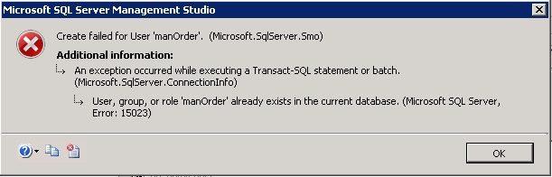

### Solved: Create Failed For User 'UserName' Error

> From: http://www.beansoftware.com/T-SQL-FAQ/create-failed-for-user.aspx

**This kind of error could appear when you restore or migrating database from one to another server.** Although database users and passwords are migrated successfully are existing, they can't open database. If you try to opent database, you get "The database is not accessible" error.

Note that database users and server logins are not the same thing. Although you transferred database and users successfully, SQL Server logins are not transferred. So, as a consequence there are orphaned users on destination SQL Server.

But, if you try to simply map SQL Server login to certain database, you get an error like this:

```
Create failed for user 'manOrder'. (Microsoft.SqlServer.Smo)

Additional Information:
An exception occurred while executing a Transact-SQL statement or batch.
(Microsoft.SqlServer.ConnectionInfo)
    User, group, or role 'manOrder' already exists in the current database. (Microsoft SQL Server, Error: 15023)
```

The error pop up message looks like this:



Create failed for user SQL Server error.
The error looks confusing and could stop you for hours :), but it is simple to solve. T-SQL code could look like this:

```
USE SomeDatabaseName
GO

EXEC sp_change_users_login 'Auto_Fix', 'SomeUserName'
```

If same user is in multiple databases, you have to repeat the process for each database.

One more possible way to solve this problem is to delete user and create it again. But, that could be big task if you have many users and complex user rights. By using of `sp_change_users_login` procedure, you can map orphaned user easily.

Happy coding!


Related articles:

1. [Check If Database Exists Using T-SQL](http://www.beansoftware.com/T-SQL-FAQ/If-Database-Exists.aspx)