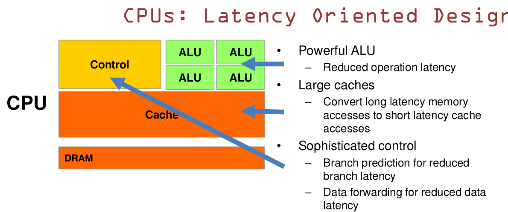

### CPU和GPU的设计区别

CPU和GPU之所以大不相同，是由于其设计目标的不同，它们分别针对了两种不同的应用场景。CPU需要很强的通用性来处理各种不同的数据类型，同时又要逻辑判断又会引入大量的分支跳转和中断的处理。这些都使得CPU的内部结构异常复杂。而GPU面对的则是类型高度统一的、相互无依赖的大规模数据和不需要被打断的纯净的计算环境。

于是CPU和GPU就呈现出非常不同的架构（如下示意图）。图片来自nVidia CUDA文档。其中绿色的是计算单元，橙红色的是存储单元，橙黄色的是控制单元。

GPU采用了数量众多的计算单元和超长的流水线，但只有非常简单的控制逻辑并省去了Cache。而CPU不仅被Cache占据了大量空间，而且还有有复杂的控制逻辑和诸多优化电路，相比之下计算能力只是CPU很小的一部分

从上图可以看出：

Cache, Local memory： CPU > GPU 

Threads(线程数): GPU > CPU

Registers: GPU > CPU  多寄存器可以支持非常多的Thread,thread需要用到register,thread数目大，register也必须得跟着很大才行。

SIMD Unit(单指令多数据流,以同步方式，在同一时间内执行同一条指令): GPU > CPU。 

##### CPU 基于低延时的设计：

CPU有强大的ALU（算术运算单元）,它可以在很少的时钟周期内完成算术计算。

当今的CPU可以达到64bit 双精度。执行双精度浮点源算的加法和乘法只需要1～3个时钟周期。

CPU的时钟周期的频率是非常高的，达到1.532～3gigahertz(千兆HZ, 10的9次方)。

 
大的缓存也可以降低延时。保存很多的数据放在缓存里面，当需要访问的这些数据，只要在之前访问过的，如今直接在缓存里面取即可。

 
复杂的逻辑控制单元。当程序含有多个分支的时候，它通过提供分支预测的能力来降低延时。

数据转发。 当一些指令依赖前面的指令结果时，数据转发的逻辑控制单元决定这些指令在pipeline中的位置并且尽可能快的转发一个指令的结果给后续的指令。这些动作需要很多的对比电路单元和转发电路单元。

##### GPU是基于大的吞吐量设计。

GPU的特点是有很多的ALU和很少的cache. 缓存的目的不是保存后面需要访问的数据的，这点和CPU不同，而是为thread提高服务的。如果有很多线程需要访问同一个相同的数据，缓存会合并这些访问，然后再去访问dram（因为需要访问的数据保存在dram中而不是cache里面），获取数据后cache会转发这个数据给对应的线程，这个时候是数据转发的角色。但是由于需要访问dram，自然会带来延时的问题。

GPU的控制单元（左边黄色区域块）可以把多个的访问合并成少的访问。

GPU的虽然有dram延时，却有非常多的ALU和非常多的thread. 为了平衡内存延时的问题，我们可以中充分利用多的ALU的特性达到一个非常大的吞吐量的效果。尽可能多的分配多的Threads.通常来看GPU ALU会有非常重的pipeline就是因为这样。

所以与CPU擅长逻辑控制，串行的运算。和通用类型数据运算不同，GPU擅长的是大规模并发计算，这也正是密码破解等所需要的。所以GPU除了图像处理，也越来越多的参与到计算当中来。

GPU的工作大部分就是这样，计算量大，但没什么技术含量，而且要重复很多很多次。就像你有个工作需要算几亿次一百以内加减乘除一样，最好的办法就是雇上几十个小学生一起算，一人算一部分，反正这些计算也没什么技术含量，纯粹体力活而已。而CPU就像老教授，积分微分都会算，就是工资高，一个老教授资顶二十个小学生，你要是富士康你雇哪个？GPU就是这样，用很多简单的计算单元去完成大量的计算任务，纯粹的人海战术。这种策略基于一个前提，就是小学生A和小学生B的工作没有什么依赖性，是互相独立的。很多涉及到大量计算的问题基本都有这种特性，比如你说的破解密码，挖矿和很多图形学的计算。这些计算可以分解为多个相同的简单小任务，每个任务就可以分给一个小学生去做。但还有一些任务涉及到“流”的问题。比如你去相亲，双方看着顺眼才能继续发展。总不能你这边还没见面呢，那边找人把证都给领了。这种比较复杂的问题都是CPU来做的。

　　总而言之，CPU和GPU因为最初用来处理的任务就不同，所以设计上有不小的区别。而某些任务和GPU最初用来解决的问题比较相似，所以用GPU来算了。GPU的运算速度取决于雇了多少小学生，CPU的运算速度取决于请了多么厉害的教授。教授处理复杂任务的能力是碾压小学生的，但是对于没那么复杂的任务，还是顶不住人多。当然现在的GPU也能做一些稍微复杂的工作了，相当于升级成初中生高中生的水平。但还需要CPU来把数据喂到嘴边才能开始干活，究竟还是靠CPU来管的。

##### 什么类型的程序适合在GPU上运行？

　　（1）计算密集型的程序。所谓计算密集型(Compute-intensive)的程序，就是其大部分运行时间花在了寄存器运算上，寄存器的速度和处理器的速度相当，从寄存器读写数据几乎没有延时。可以做一下对比，读内存的延迟大概是几百个时钟周期；读硬盘的速度就不说了，即便是SSD, 也实在是太慢了。

　　（2）易于并行的程序。GPU其实是一种SIMD(Single Instruction Multiple Data)架构， 他有成百上千个核，每一个核在同一时间最好能做同样的事情。

From: [Magnum Programm Life](http://www.cnblogs.com/biglucky/p/4223565.html)