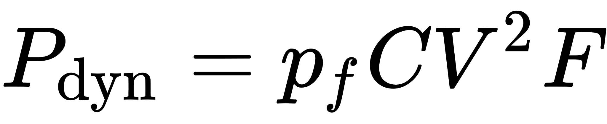
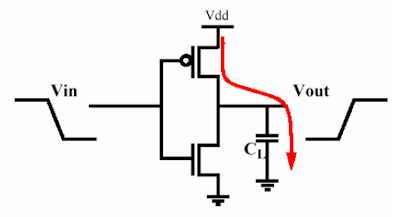
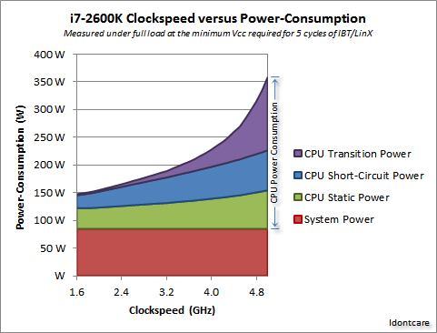

### CPU的瞬时功耗是由什么决定的？

先来阐述一个很常见的现象：当你的电脑闲置的时候，温度不是很高，所以风扇转的很慢。而当你玩大型游戏的时候，因为CPU和显卡都在满功率运作所以会产生大量的热，温度很高，然后风扇转得很快。这个现象说明，电脑在做不同的事情的时候功耗是不同的。

当面对这个问题，一般肯定会希望得到一个比较简单有效的答案。比如，有人讲的CPU的功耗同CPU工作频率的三次方成正比或线性相关，也有人讲CPU的功率由静态功率和动态功率构成，静态功率由芯片设计和制造工艺决定，而动态功率同CPU实际运行时的时钟频率相关。实际上CPU运行时的功率同CPU的频率存在相关性，但是之间数值关系却复杂很多。比如CPU到达一定频率后，为实现继续提升频率的目的，往往会提升Core的电压，从而提高使晶体管的开关速度，这将显著提升CPU的功耗。

作一个不太严谨的比喻cpu就相当于一个超级大型的算盘，算盘上的珠子保持原状并不需要费力气，只有在拨动珠子的时候才费力气。（维持电位不消耗能量，只有电位翻转时消耗能量）待机的时候珠子只有小部分被拨动，费的力气小，所以功耗低。满载的时候珠子大部分都在被拨动，费的力气大，所以功耗高。时钟就相当于打算盘的人的手速，他的手速有多快，决定了最高性能。当人的手速到达一定值后，继续提高手速，那么拨动每个珠子花费的力气也将显著提升，所以相同工艺下，CPU频率越高能耗越高。

另外，现代的CPU的电源管理可以做到根据负载调整频率，调整电压，甚至在低负载的时候关闭一些核心。所以CPU的功率和频率的关系就更加不能简单的用一个公式来表达了。但知乎上Belleve的回答是业界比较认可的CPU核心部件功耗的计算公式。

> 处理器是典型的容性元件，功率主要是动态功率
> 
> 
> 
> C是寄生电容，是制造时候决定的。V为电压，F为主频率，这个运行时也不大会变化。那么和负载相关性最高的就是 pf 翻转概率，处理器闲置（不同处理器是不同的，x86 有个 HLT 可以让 cpu 专门等中断，一些其他架构就得跑死循环了）的时候内部的各种 CMOS 闸状态都不变，寄生电容没有充放电，功耗最低；负载高的时候，CMOS 状态变化频繁，功耗大。这也解释了为什么不同的烤机软件烤出来温度会不一样，因为即使都把流水线占满，翻转概率值仍然是不同的。

Power consumption is about linear with frequency.

> From: stevenvh 2012/8/23

The processor contains millions of complementary FETs as shown. When the input goes low the small capacitance gets charged and it will hold a small amount of energy. A same amount is lost during the charging. When the input goes high again the charge will be drained to ground and be lost. So with each level change \\(n\\) Joules are lost. If the frequency is 1 MHz then this switching occurs \\(10^{6}\\) per second, and \\(n \cdot 10^{6}\\) Joules will be lost per second. If the frequency is 1 GHz that loss will be \\(n \cdot 10^{9}\\) Joules.

Notice that the energy in a capacitor is \\(\frac{C \cdot V^2}{2}\\), so the dissipation varies quadratic with voltage; running the processor at half the voltage will reduce power with 75 %.

This leads to the equation tuğrul also mentions:

$$P = c \cdot V^2 \cdot f + P_S$$

where \\(c\\) is a scaling constant, with the dimension of capacitance (F). \\(P_S\\) is the static power dissipation Martin refers to, which is the power at a zero clock frequency.

> From： Martin Thompson 2012/8/23

To add to the "linear with frequency" point, there is also an additional factor. As that "dynamic power" increases, the temperature of the die will increase and this will also increase the leakage current through the millions of transistors, which will cause more dissipation (termed "static power")

There's a long [Anandtech thread](https://forums.anandtech.com/threads/power-consumption-scaling-with-clockspeed-and-vcc-for-the-i7-2600k.2195927/) taking lots of values and pulling them apart into their static and dynamic contributions which results in the following graph: 

The slight kick up in static power at higher clock speeds is (as I understand it) as a result of the higher die-temperature.

更加详细深入的研究可以参考论文 <a href="imgs/CPU Power Consumption Experiments and Results Analysis of Intel i7-4820K.pdf">CPU Power Consumption Experiments and Results Analysis of Intel i7-4820K</a>

Reference: https://www.zhihu.com/question/49567798

https://www.zhihu.com/question/49567798/answer/116644198

https://www.zhihu.com/question/49567798/answer/116642407

https://physics.stackexchange.com/questions/34766/how-does-power-consumption-vary-with-the-processor-frequency-in-a-typical-comput

[Why has CPU frequency ceased to grow?](https://software.intel.com/en-us/blogs/2014/02/19/why-has-cpu-frequency-ceased-to-grow)

