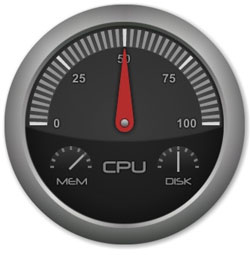
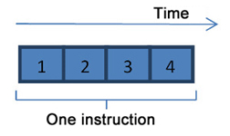
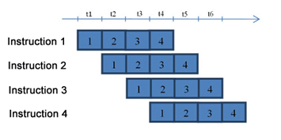
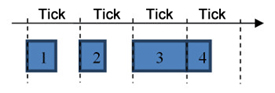
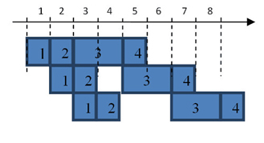
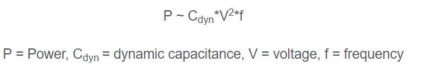
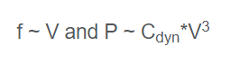

## Why has CPU frequency ceased to grow?

> By [victoria-zhislina (Intel), published on February 19, 2014](https://software.intel.com/en-us/blogs/2014/02/19/why-has-cpu-frequency-ceased-to-grow)

> note:文章未解释为什么提高频率，指令中最长的阶段耗时仍然不变。

All of you probably recall the rapid rate of CPU frequency advancement at the end of the last century and beginning of this one.  Tens of megahertz rapidly transformed into hundreds, and then hundreds of megahertz quickly became a full gigahertz, then a gigahertz and a bit, finally two gigs and a bit.

However, in the last few years, we’ve seen the core CPU frequency growth has slowed. The 10 GHz result is still as unreachable now as it was five years ago. Why the slow down? What is the obstacle for an increasingly expanding rate of frequency?

### "Hot" gigahertz

There is an opinion among experts that increased frequency growth will result in highly significant heat emissions. Others think that you can just turn "a switch" that will increase the frequency – and it will be increased as desired. But there are also strong concerns that the increased frequency will raise the CPU temperature so much that it will cause an actual physical melt down.  Note that many CPU manufactures will not allow a meltdown to happen, as the CPU has internal temperature monitors and will shut down the CPU before any catastrophic failure occurs.

This opinion is expressed by computer users and, moreover, it has been proven by overclockers’ successes, as they speed up the processors two and more times as fast, they need to attach as powerful a cooling system as possible.

We should validate that the "switch" mentioned above actually exists, as well as the heat emission problem, but these are just part of the battle for expanding gigahertz.

### The main brake

Different processor architectures have their own difficulties with overclocking. Specifically here we’ll focus on superscalar architecture including the x86 architecture, which is the most popular among Intel® products.

To address the problems related to frequency growth, it’s important to identify what prevents its development. Depending on architecture research level, there are a variety of limiting parameters. However, there’s one area of research that focuses on one parameter, which means that there is the only one limitation or main brake that needs to be removed in order to increase frequency.

### The conveyor

The main limitation is found in the conveyor level, which is integral to superscalar structure. Functionally, every execution of a processor’s instruction is divided into several steps as illustrated by the diagram below.

These steps follow each other sequentially, and each is executed on a separate computing device.

When execution of a specific step is completed, the computing device can then be used to execute a different instruction.

As you see on the diagram above, the first computing device executes the first step of the first instruction during the `t1` time period. By the beginning of the `t2` period, the first step has been completed and the second step can begin on the second device. The first device is now free and ready to begin the first step of next instruction, and so on. During the `t4` period, different steps of four instructions can be executed.

What does this have to do with frequency?  Actually, different stages can vary in execution time. At the same time, different steps of the same instruction are executed during different clock ticks. Clock tick length (and frequency as well) of the processor should fit the longest step. The diagram below shows the longest step is the third.

There’s no advantage in setting the clock tick length shorter than the longest step, even though it is possible technologically, as no actual processor acceleration will occur.

Suppose that the longest step requires 500 ps (picosecond) for execution. This is the clock tick length when the computer frequency is 2 GHz. Then, we set a clock tick two times shorter, which would be 250 ps, and everything but the frequency remains the same. Now, what was identified as the longest step is executed during two clock ticks, which together takes 500 ps as well. Nothing is gained by making this change while designing such a change becomes much more complicated and heat emission increases.

One could object to this and note that due to shorter clock ticks, the small steps will be executed faster, so the average speed will be greater. However, the following diagram shows that this is not the case.

Initially, the execution will be much faster. But, beginning from the fourth clock tick, the third step and all of the following steps in our example will be delayed. This happens because the third computing device will be free every two clock ticks, not every clock tick. While it is busy with the third step of one instruction, the same step of another instruction cannot be executed. So, our hypothetical processor that uses 250 ps clock ticks will work at the same speed as the 500 ps processor, though nominally its frequency is two times higher.

### The smaller the better

So, from the conveyor point of view, the only way to raise the frequency is to shorten the longest step. If we can reduce the longest step, there is a possibility to decrease the clock tick size up to this step—and, the smaller the clock tick, the higher the frequency.

There are not many ways to influence the step length using available technologies. One of these ways is to develop a more advanced technological process. By reducing the physical size of the components of a processor, the faster it works. This happens because electrical impulses have to travel shorter distances, transistor switch time decreases, etc. Simply stated, everything speeds up uniformly. All steps are shortened uniformly, including the longest one, and the frequency can be increased as a result.

It sounds quite simple, but the way down the nanometer scale is very complicated. Increased frequency depends heavily on the current level of technology and advances cannot move beyond these physical limitations. Nevertheless, processor manufacturers are continuously improving the technological processes, so the core CPU frequency is gradually increasing.

### Cut the patient

Another way to raise the frequency in the example above is to divide-up the longest step into smaller steps. The instructions have been cut already. They have been cut several times successfully. Why not go on? The processor will work even faster!  Much work has been done by the processor architects to make the steps as efficient as possible and thus further dividing the steps into smaller steps will not only create a challenge, it may significantly impact overall CPU efficiency.

Let’s use an analogy to building a house. A house is built floor by floor. We’ll assume a floor is analogous   to an instruction.  We’d like to divide building the floor into several parts. Initially starting with two parts; building of the floor itself and the finishing of that floor. While the finishing is being completed on the previous floor built, we can begin to build another floor, but only if the building and the finishing are performed by different teams. Sounds good.

Now, let’s divide the two existing parts. Let’s split the finishing component into ceiling painting and wall papering. Easy enough. If the painters have finished one floor, they can go to another built floor, even if the paper-hangers haven’t completed their work on the first floor.

And what about the actual building of the floors? For example, we’d like to divide the house building into wall building and ceiling building. We can do that but it isn’t useful to do so. We cannot build the walls of the next floor if the previous floor isn’t built. While we’ve made the division theoretically, we cannot fully employ wall and ceiling teams since at any given time, only one team can be working!

The same problem is true in processors. There are some steps that are dependent on other steps, and it’s very hard to divide such steps as that would require extensive changes in processor architecture, as would be required to build several floors of a house at the same time.

### To flip the switch

Let’s address overclockers now. They raise processor voltage for transistors to switch quicker, all the steps become shorter, and the frequency can be increased. It sounds so easy! But there are huge problems with heat emission. Here is the simplified formula of a processor’s power dissipation:

Don’t worry if you don’t know what dynamic capacitance is—the main thing that’s important here is voltage. It is squared! Looks awful…

The reality is even worse. As stated before, voltage makes transistors work. A transistor is a kind of toggle. It needs to accumulate some charge to switch. The accumulation time is proportional to current, so if the current is big, a charge moves quicker. Current, in turn, is proportional to voltage.  So, the transistor switch speed is proportional to voltage. We need to take into consideration that processor frequency can be raised proportionally to transistor switch speed only. Let’s summarize:

Linear frequency growth causes power dissipation to be increasingly cubed! If the frequency is raised only twice, there will be eight times greater heat that must be accommodated or the processor will melt or shutdown.

It’s obvious that this method of increasing the frequency is not suitable for processor manufacturers because of low efficiency. However, it is used by extreme overclockers.

### Is that all?

There are instances when processor frequency has been increased a bit without voltage changing. It is possible in a very limited range, since processors are designed to work in widely varied conditions (which influences step length), so there is some frequency margin. For example, the longest step might take only 95% of the whole clock tick. This raises the possibility.  But remember, wrong overclocking can harm not only processor but you as well.

There are some other ways to influence the step length which are much less important than what’s been discussed here. For example, temperature influences all electronic parts, but serious effects are seen only when temperature is very low.

In conclusion, the struggle for increased frequency is extremely challenging. However, it is in progress, even though the frequency is increasing very slowly. But, take heart! Now that there are multicore processors, there is no reason why computers shouldn’t begin to work faster, whether due to higher frequency or because of parallel task execution. And with parallel task execution it provides even greater functionality and flexibility!

Original Russian blog with threads:[http://habrahabr.ru/company/intel/blog/194836/](http://habrahabr.ru/company/intel/blog/194836/)

FROM: [Why has CPU frequency ceased to grow?](https://software.intel.com/en-us/blogs/2014/02/19/why-has-cpu-frequency-ceased-to-grow)