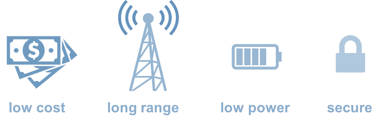
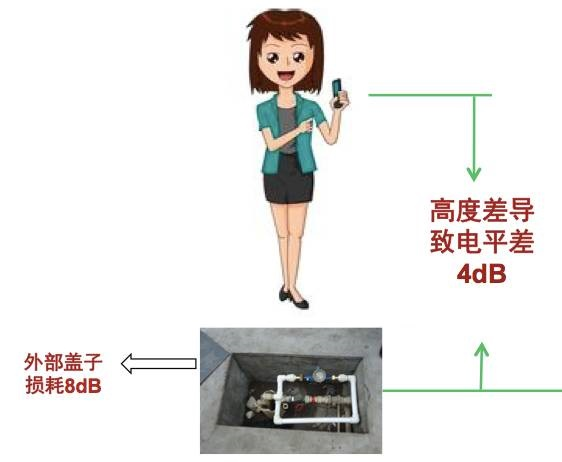
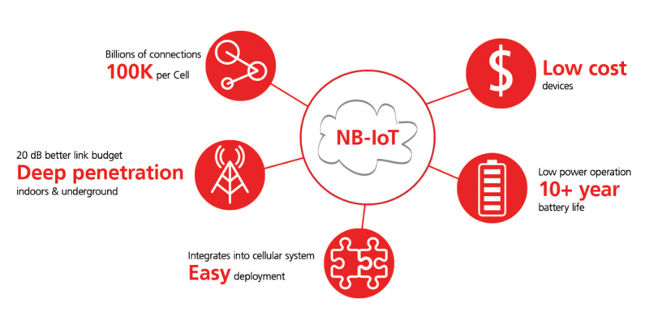
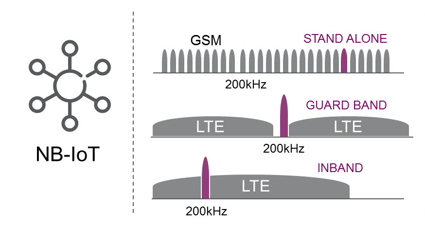

# NB-IoT(Narrow Band Internet of Things)

基于蜂窝的窄带物联网，简称“窄带物联网”。也被叫作低功耗广域网(LPWAN)。

-----

# NB-IoT起源和特点

NB-IoT是IoT领域一个新兴的技术，用于支持低功耗设备在广域网的蜂窝数据连接，也被叫作低功耗广域网(Low Power Wide Area Network，LPWAN)。

- 超强覆盖，相对于原来GPRS系统，增加20dB的信号增益
- 超低功耗，终端节点要能达到10年的电池寿命
- 超低成本，终端芯片的目标定价为1美元，模块定价为2美元
- 超大连接，200kHz小区容量可达100k用户设备

-----

# 适用IoT设备特性

NB-IoT聚焦于终端数量大，移动需求少，数据传输少，时延不敏感的智能设备，比如智能抄表。

-----

# NB-IoT优势

超大连接、超强覆盖、超低功耗、超低成本、易于部署

------

# 超大连接

在同一基站的情况下，NB-IoT可以比现有无线技术提供50-100倍的接入数。一个扇区能够支持10万个连接

------

# 超强覆盖

NB-IoT比LTE提升20dB增益，相当于提升了100倍覆盖区域能力。不仅室内覆盖能力强，对于厂区、地下车库、井盖这类对深度覆盖有要求的应用同样适用。

## CE Level（Coverage Enhancement Level）即覆盖增强等级。

从0到2，CE Level共三个等级，分别对应可对抗144dB、154dB、164dB的信号衰减。

基站与NB-IoT终端之间会根据其所在的CE Level来选择相对应的信息重发次数。

------

# 超低功耗

NB-IoT聚焦小数据量、小速率应用，因此NB-IoT设备功耗可以做到非常小，设备续航时间可以从过去的几个月大幅提升到几年。

------

# 超低成本

NB-IoT无需重新建网，射频和天线基本上都是复用的。

低速率、低功耗、低带宽同样给NB-IoT芯片以及模块带来低成本优势。模块预期价格不超过2美元。

-----

# NB-IoT三种部署方式

NB-IoT构建于蜂窝网络，只消耗大约180KHz的带宽，可直接部署于GSM网络、UMTS网络或LTE网络，以降低部署成本、实现平滑升级。
NB-IoT支持在频段内(In-Band)、保护频段(Guard Band)以及独立(Stand-alone)共三种部署方式。

-----

# 部署方式

## 独立部署（Stand alone operation）

适合用于重耕GSM频段，GSM的信道带宽为200KHz，这刚好为NB-IoT 180KHz带宽辟出空间，且两边还有10KHz的保护间隔

## 保护带部署（Guard band operation）

不占LTE资源，利用LTE边缘保护频带中未使用的180KHz带宽的资源块。

##带内部署（In-band operation）

利用LTE载波中间的任何资源块。