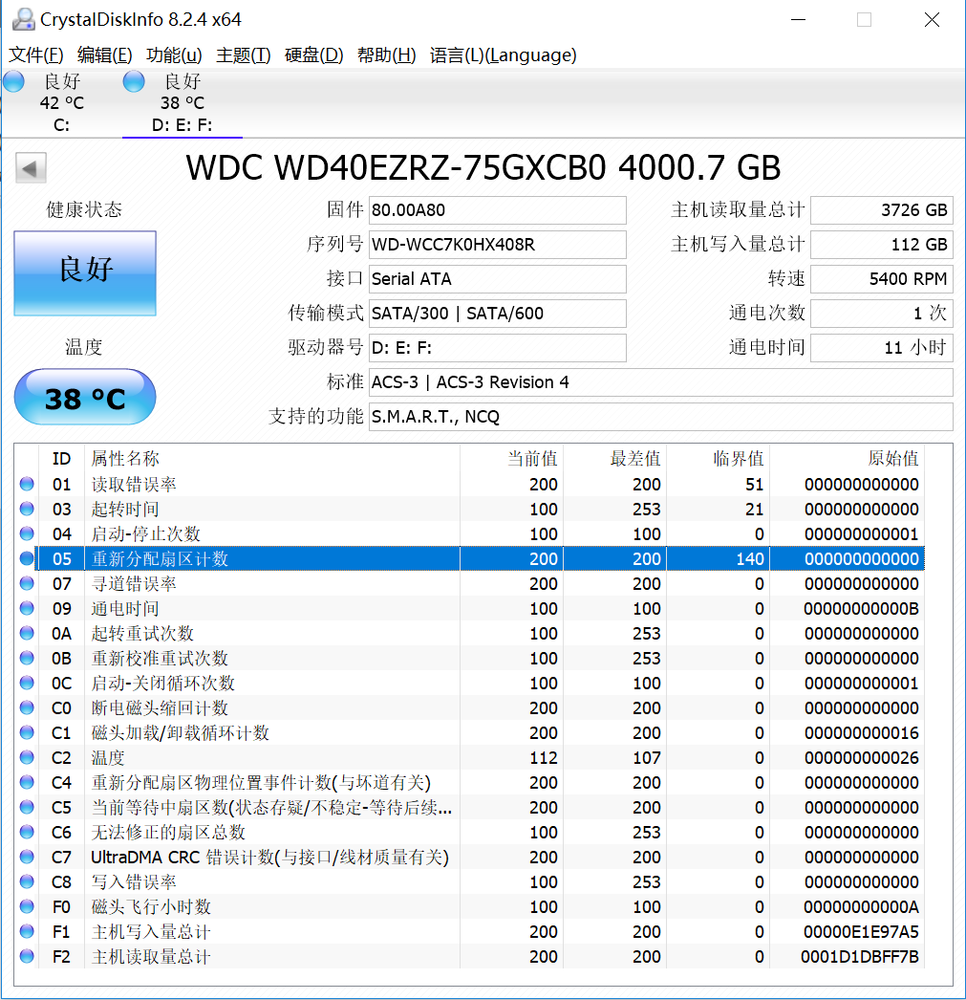

## How to See If Your Hard Drive Is Dying with S.M.A.R.T.

> https://www.howtogeek.com/134735/how-to-see-if-your-hard-drive-is-dying/

Hard drives use S.M.A.R.T. (Self-Monitoring, Analysis, and Reporting Technology) to gauge their own reliability and determine if they’re failing.  You can view your hard drive’s S.M.A.R.T. data and see if it has started to develop problems.

Hard drives don’t live forever, and you often can’t see the end coming. Fortunately, most modern drives support S.M.A.R.T., so they can at least do some basic self-monitoring. Unfortunately, Windows doesn’t have an easy-to-use built-in tool that shows your hard disk’s S.M.A.R.T. data. You can view a very basic S.M.A.R.T. status from the Command Prompt, but to really see this information, you’ll need to grab a third-party app.

### Check S.M.A.R.T. Status with CrystalDiskInfo

[CrystalDiskInfo (free)](https://crystalmark.info/en/software/crystaldiskinfo/) is an easy-to-use, open-source program that can shows the S.M.A.R.T. status details reported by your hard drives.  You can download an installable or portable version—the choice is up to you.

Once you’ve got CrystalDiskInfo running, it’s a pretty straightforward app. The main view shows the S.M.A.R.T. status information for your hard drives. If everything is working properly, you should see the status “Good“ displayed. In the image below, just under the menu bar, you can see that all three drives in our system report a “Good” status and you can even view the temperature of each drive. Other statuses you might see include “Bad” (which usually indicates a drive that’s dead or near death), “Caution” (which indicates a drive that you should most likely be thinking about backing up and replacing), and “Unknown” (which just means that S.M.A.R.T. information could not be obtained).

You can also view a list of detailed information about each drive, but unless you’re a pro—or you’re troubleshooting something very specific—it likely won’t mean much to you. If you’re interested, though, the [Wikipedia page for S.M.A.R.T.](https://en.wikipedia.org/wiki/S.M.A.R.T.) maintains a pretty good list of these attributes, along with how they can be interpreted.

《完》