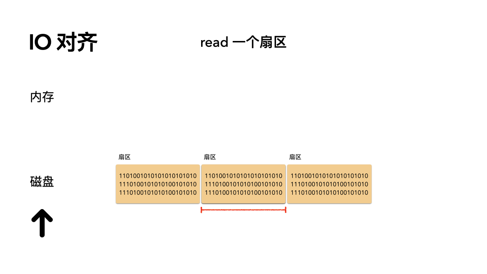
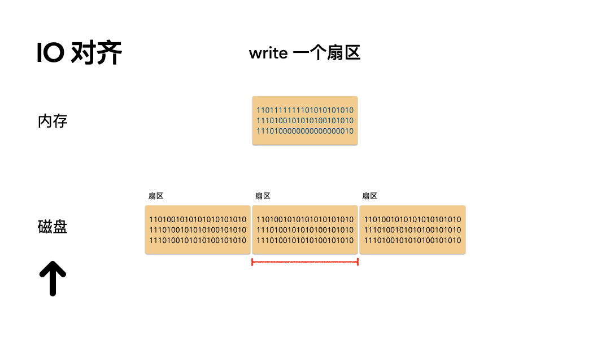
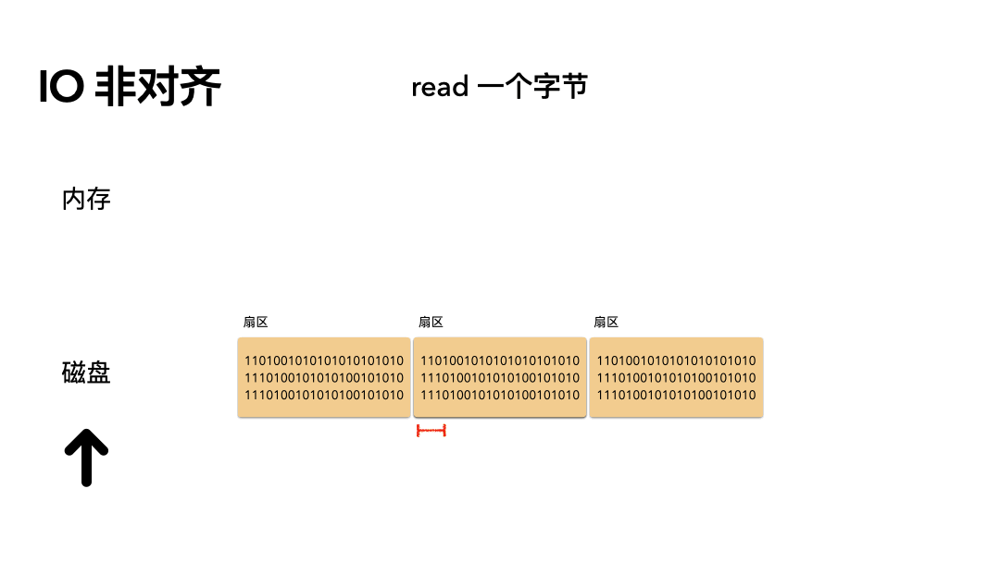
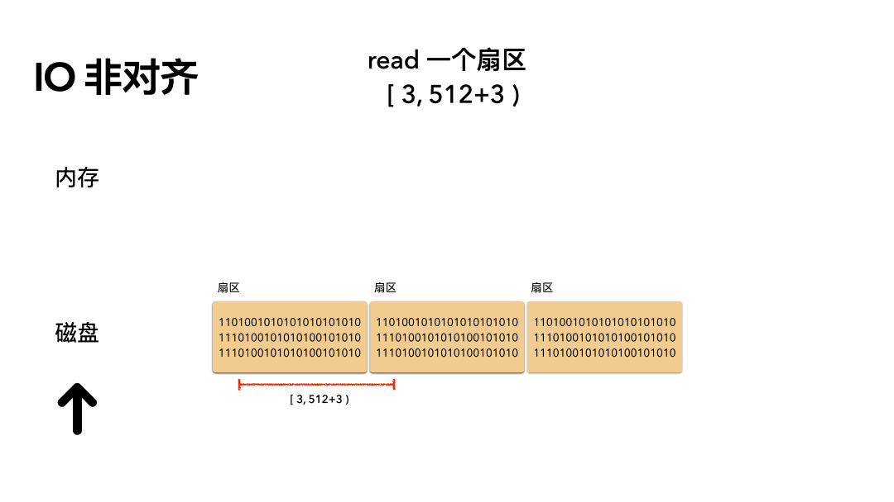
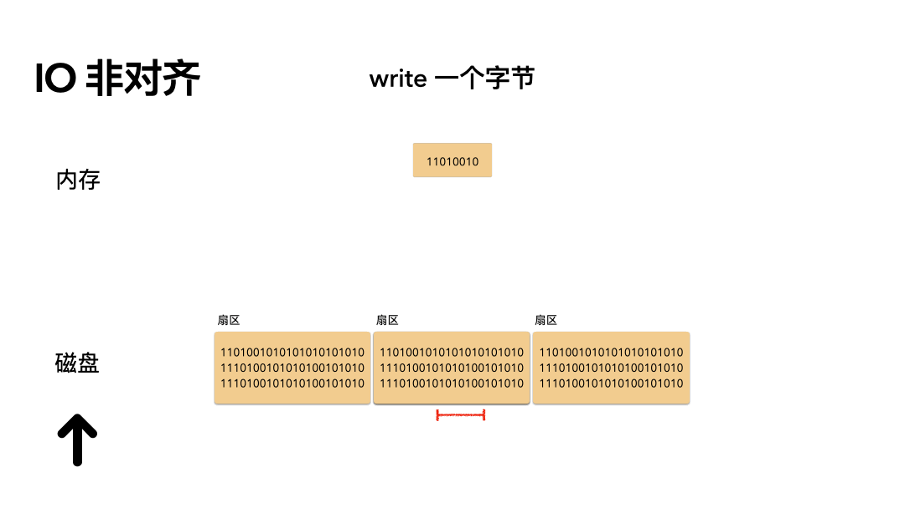
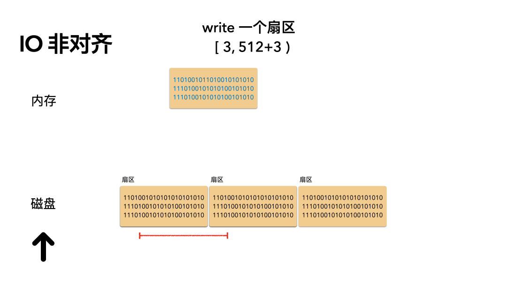

# 存储基础 —— 磁盘 IO 为什么总叫你对齐？

> 奇伢 2021年5月10日

> https://mp.weixin.qq.com/s/AHmV7kB-h7j3IqusUlTlDA

## 存储 IO 重要的一个知识点

### 划重点：存储 IO 要对齐。

资深存储人员为啥总叫你注意 IO 对齐的？机械磁盘 IO 为什么要 512 对齐呢，SSD 盘为啥要 4K 对齐？不对齐又会如何？

### 重要的知识点：

1.  机械盘的 IO 要扇区对齐（绝大部分的扇区是 512 字节大小），磁盘的读写最小单元就是扇区；
2. SSD 盘的 IO 要 4K 对齐，SSD 盘的读写单元是 page，一个 page 为 4K 大小；

如果不对齐，会有问题问题？

1. 性能极差；
2. SSD 寿命缩短；

那你就会想了，出现这个问题的原因又是啥？

本质原因是内部 IO 流量和次数的放大。

那你又会想了，怎么会这样呢，我不就写 1 个字节数据而已嘛，放大个啥？

这个秘密就在于前面提到的，**机械盘和 SSD 盘的 IO 都有最小单元的概念**。机械盘是以扇区为最小的空间单位，SSD 盘则是 4k 的 page 作为 IO 的最小单元。所以当在机械盘上读 1 个字节的数据，本质上是至少读一个扇区，写 1 个字节则更复杂，先要把这个扇区读出来，然后在内存里 update，最后又把这个扇区写回到磁盘。

你可能又有疑问了：为啥机械盘和 SSD 盘都要按照一个单元来管理呢，为啥不 1 字节 1 字节管理呢？如果这样的话，业务读写不就方便了嘛。

**答案是:开销。** 考虑以下两个方面：

- 第一个是存储的开销：数据存储到磁盘上还有 SSD 盘上是会有校验的（比如 ECC 校验），如果每个字节都对应一个校验，存 1T 的数据有 1T 的校验？那这个存储开销无比的大。那如果是现在 512 字节对应一个 1 字节的校验，则开销完全可控；

- 第二个是性能的开销：物理硬件是跟真实世界的设计匹配的，对于机械磁盘的写是利用磁化介质来存储数据，如果磁盘上是1 个字节，甚至 1 个 bit 来独立存储，那磁盘磁头的次数将无比庞大，性能也将无比的下降（每一次都是写数据+校验）。SSD 的写则更复杂，*因为 SSD 由于自身的存储特点，是无法覆盖写的，每次写都是写新位置，旧的位置则是作为垃圾等待后台 GC ，粒度太小则会导致擦写的次数无比的多，性能和寿命都将不可接受；*

所以说，在综合因素的权衡下，硬件对于空间管理会划分固定单元，并对 IO 也提出单元对齐的要求。至于磁盘固定单元为 512 字节，SSD 的 IO 单元为 4K 则是经过综合的科学测试和验证的一个数值而已。

举个不严谨的例子：

在京东上买东西，你买 1 块钱的货，京东要收费 7 块的运费。对你来讲是不是划不来？因为对京东来讲，如果真是单独送你这 1 块钱的东西也划不来。所以京东要你买的东西满 79 元才给你免运费。

如果说真的有个愣头青，每次都单独买 1 块钱的货，买它 100 次，划得来来不？

当然划不来，运费都要 700 了，加上货本身，总费用 800 元（哈哈，可能京东被你折腾的更惨）。

那如果是 1 次买 100 件这个货呢？

你只需要 100 块。

所以，你再思考下为什么磁盘本身一定有固定大小的存储单元，通俗话叫做：量大从优，专业一点叫做：减少边际效应。

## 对齐有哪些方面

对齐其实很简单，只有两个维度：

- 偏移对齐
- 长度对齐

是不是很简单呀。偏移和长度就是我们常说的 `offset`，`length`，对齐通常就是既要保证偏移对齐也要保证长度对齐。

## IO 读写的真实样子

下面以机械盘扇区对齐和非对齐的举例。为了简化，以下例子讨论的的对齐都是偏移和长度双重对齐的。

### 1. 扇区对齐场景

#### 场景：读 512 个字节数据是怎么做的？

步骤如下：

1. 磁头摆到指定偏移；

2. 读取一个扇区的数据到内存；

开销：只需要一次磁盘读 IO。

#### 场景：写 512 个字节数据是怎么做的？

步骤如下：

1. 磁头摆到指定偏移；
2. 覆盖写一个扇区的数据到磁盘；

开销：只需要一次磁盘写 IO。

### 2 扇区非对齐场景

#### 场景：读 1 个字节数据是怎么做的？

步骤如下：

1. 磁头摆到这 1 个字节数据所在扇区位置，对齐到扇区开始的偏移；
2. 读取 1 个完整扇区（ 512 字节）的数据到内存；
3. 从这 512 字节的内存中，copy 出用户要用的 1 个字节，给到用户；

开销：读放大。如果是读 512 字节的数据，但是偏移不对齐，那么可能导致 2 次 IO。

#### 场景：读 512 个字节，但是偏移不对齐？

步骤如下：

1. 磁头摆到这 512 个字节数据所在 2 个扇区位置，对齐到扇区开始的偏移；
2. 读取 2 个完整扇区（1024 Bytes）的数据到内存；
3. 从这 1024 字节的内存中，copy 出用户要用的 512 个字节，给到用户；

开销：读放大。虽然读的是 1 个扇区的数据，但是偏移却没对齐，所以必须要读 2 个扇区，也放大了一倍的流量。

#### 场景：写 1 个字节数据是怎么做的？

写是比较复杂的，用户现在手握 1 个字节的数据，想要写到磁盘，但是磁盘的 IO 单元是扇区，所以本质上是读改写的方式。步骤如下：

1. 先要把这要改动的 1 字节所在的扇区完整的读到内存；

    a. 磁头摆动到扇区偏移；

    b. 读一个扇区，读到内存；

2. 然后在内存中，把这 1 个字节对应的位置的数据修改；

3. 然后重新写回扇区；

    a. 磁盘寻道道扇区偏移；

    b. 覆盖写着一个扇区；

开销：一次磁盘读 IO，内存合并，最后再一次磁盘写 IO。明明是写，却必须要先读，IO 即放大了流量，又放大了次数

所以你看出来了吗，非对齐的 IO 多了很多步骤。存在 IO 流量和次数的放大。这样会极度拖累性能。

本来只需要一次 IO 就能完成的操作，放大了一次，那么性能就至少下降一倍。就这么简单。

#### 场景：写 1 个扇区的数据，但是偏移不对齐会怎么样？

操作步骤：

1. 读 2 个扇区的数据（1024 Bytes）上来；
2. 合并内存中的数据；
3. 把这 2 个新的扇区数据，写到磁盘；

开销：所以，我们看到由于不对齐，读的时候导致多读了一个扇区，写的时候导致多写了 1 个扇区。性能自然是极差的。

## 小伙伴经常忽略的事情？

### 1. IO 的代价比你预期的要大

机械盘来说，随机 iops 就是几百的样子，带宽也就几百兆。一次寻道都是 10ms 级别的。所以磁盘读写数据的代价远比你想象中的大。

这个有多慢？cpu 执行指令都是纳秒和微秒级别的，一次 IO 性能和 cpu 或者内存的操作相差十万百千里。所以，但凡你能省 1 次 IO 都是非常大的性能提升。

而对于 SSD 来说，如果你 IO 不对齐，很有可能峰值能跑 5 万 iops 的盘只能跑 2 万甚至更低。**大家一定要有个意识：IO 能节省就节省，多一次 IO 性能可能慢 1 倍。**

### 2. 为什么我编程的时候从来不需要注意对齐？

这个时候你可能反问了，我读写文件从没考虑过对齐的问题呀？

是的，你是没考虑过，那是因为有一个苦逼帮你把这个活干了，谁呢？

文件系统。这个世界并不简单，只是有人替你负重前行。

绝大部分的程序员都是基于文件系统之上操作磁盘。文件系统则会使用 buffer cache 自动帮用户对齐 IO ，然后再下发磁盘。一旦你想要深入优化 IO 的性能，IO 对齐一定是第一道要考量的坎。

还有一点要特别注意，一个特别重要的环节：文件系统格式化化的时候。

格式化的时候，一定要注意对齐。 格式化文件系统的时候，一定要注意对齐的偏移，不要故意搞成非对齐的偏移，不然一旦文件系统格式化的时候都不对齐，后面谁也救不了，除非你重新格式化文件系统。

举个例子，本来文件系统从偏移磁盘 0 这个位置格式化，你偏不，你偏要从 3 字节偏移的位置开始格式化。那后面的所有的貌似对齐的 IO 偏移都将是不对齐的，性能也自然是下降的。

## 总结

1. IO 对齐是做存储必须要考量的一个因素；
2. IO 对齐的两个核心是：偏移和长度；
3. 非 IO 对齐的请求会导致内部 IO 流量和次数的放到，从而性能下降（SSD 则会因为放到而导致擦写次数过多，更会影响寿命）；
4. 程序员一般很少要主动对齐，因为文件系统帮你 hold 住了一层。但是如果程序员自己不注意，还是会踩坑。比如明明是 SSD 盘，你偏要每次发送 512 字节的 IO 请求，那性能肯定惨不忍睹；
5. 对齐的 IO 简简单单，不对齐的 IO 千奇百怪；

\- EOF \-