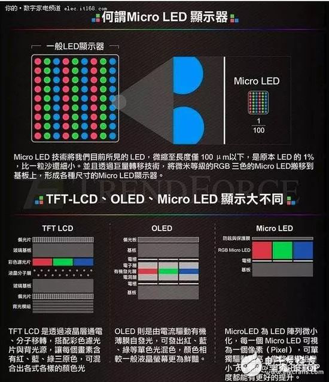

### Mini LED与Micro LED的区别是什么

> 发表于 2019-10-11 08:46:45

> http://m.elecfans.com/article/1089856.html

Mini LED是液晶显示技术(LCD)的改良，属于量变的范畴，远远达不到质变的效果。Mini LED不能改变液晶显示的本质，液晶显示固有的缺陷也是没有办法突破，比如视角问题，柔性问题等等。Mini LED实际并没有改变液晶显示对比度低的问题，Mini LED改变的是动态对比度，并没有改变静态对比度，这一点还是被OLED吊打。但是不能否认的是，Mini LED技术极大的改善了液晶显示的效果，但是也只是更接近OLED而已。

#### 科普：OLED、Mini LED、Micro LED 是怎样的显示技术？

OLED（Organic Light-Emitting Diode），又称为有机电激光显示、有机发光半导体（Organic Electroluminesence Display，OLED）。OLED属于一种电流型的有机发光器件，是通过载流子的注入和复合而致发光的现象，发光强度与注入的电流成正比。OLED在电场的作用下，阳极产生的空穴和阴极产生的电子就会发生移动，分别向空穴传输层和电子传输层注入，迁移到发光层。当二者在发光层相遇时，产生能量激子，从而激发发光分子最终产生可见光。由于OLED早已普及，属于比较成熟的技术，所以这里就不再多描述。

micro-LED技术是在2000年由来自于德州理工大学的Hongxing Jiang和Jingyu Lin两位教授领导的一个研究小组创造。当然，消费者第一次看到使用micro-LED技术产品的屏幕是索尼的55英寸全高清分辨率“Crystal LED Display”产品，它是在2012年正式亮相。当时，这种技术无论是对比度还是色域，都要比竞争对手出色很多。

当然，但是使用这项技术的索尼产品很贵，并且由于产能非常低，基本上没有大批量商业化的可能。但这并没有组织公司和企业继续投资和对micro-LED技术进行改进。业内人士表示，micro-LED技术目前已经非常接近于商业化量产的程度。

#### micro-LED技术简单介绍

micro-LED与OLED有很多相似之处，因此与LCD相比，micro-LED与OLED的对比就显得更加容易理解。首先，从名字上就能看到而这都有LED，因此它们都主要是由发光二极管组成，因此两种技术都是采用自发光的形式，每个红、绿、蓝的亚像素都能自己产生光源，而不像LCD那样需要专门的背光组件。因此，micro-LED显示器同样能够提供极高的对比度和黑位水平，这一点与OLED一样，同时还有一个TFT面板为每个像素提供能量。

Micro LED技术，即LED微缩化和矩阵化技术，简单来说，就是将LED（发光二极管）背光源进行薄膜化、微小化、阵列化，可以让LED单元小于50微米，与OLED一样能够实现每个像素单独寻址，单独驱动发光（自发光）。它的优势在于既继承了无机LED的高效率、高亮度、高可靠度及反应时间快等特点，又具有自发光无需背光源的特性，体积小、轻薄，还能轻易实现节能的效果。

从结构原理上看，Micro LED更简单，效果更好，TFT基板、超微LED晶粒、驱动IC都不是很大的问题，但是它最大的难题就是众所周知的巨量转移，如何将LED做的微小化，这需要晶圆级的工艺水平。比如4K级别的Micro LED屏幕，需要800万个以上的LED高度集成到一起，所以理论上应用到小尺寸屏幕上是极为困难的，同时成本和发热也是极为可观，三星的第一款Micro LED电视选择146英寸也是这方面的原因。

micro-LED与OLED的不同之处就在于其LED部分的材料组成。OLED中的“O”代表有机材料，它指的是在能够产生光的像素堆中使用有机材料。而micro-LED技术则使用的无机氮化镓材料，这种材料常用于普通的LED照明产品中。这种技术可以降低对极化和封装层的要求，能让显示面板更薄。因此micro-LED的组件都很小，宽度不到100μm，比人类的头发还细。

如果从另一个问题来看这个问题，micro-LED就是传统LED通过更小的方式排放在阵列中。实际上LED并不是什么新技术，但在如此小的部件面板上排序阵列才是真正的困难。与其他显示面板技术相反的是，在智能手表和智能手机等小尺寸设备上使用的micro-LED屏幕更容易制造。而事实证明，现在想要增加micro-LED显示面板的面积困难很大。当然，由于焊接精度的要求很高，将更高的分辨率压缩到智能手机屏幕大小，困难也很大。

对面板制造商来说，目前一个尚未解决的问题就是如何将大量的LED转移到控制电路板上。有一个潜在的解决方案是，将LED集中放置到一个更大的阵列中，然后通过焊接完成显示。但这种方法的问题在于，目前选择和制造的精度为±34μm，而这并不符合micro-LED所需要的±1.5μm的精度要求。

还有一种代替的方案就是蚀刻LED阵列与IC连接，或将一个单独的TFT层转移到LED阵列中。这些蚀刻方法避免了芯片焊接的精度问题，但改进了用于满足微型发光元件的小尺寸部件要求，以及对高分辨率的显示方式实现起来也昂贵而且难以实现。目前整个制造业在这个方面的进步很缓慢，因此想要提高产量，还需要继续改进。

在短期内，圆晶体成键似乎是最可行的过程。不过这款产品目前只适用于低像素的面板，比如对分辨率要求不高的智能手表，而并非QHD分辨率的智能手机。制造出高分辨率的micro-LED面板是很多厂商的目标，但这需要不断提高制造精度。

#### 与OLED的优劣对比

尽管面临制造障碍，但micro-LED技术仍然值得期待，因为与OLED相比micro-LED提供了更多的进步。首先究竟是最大亮度时功率的降低，也就是说，在同样低功率条件下，micro-LED能够达到更大的亮度。相比之下，功耗要比LCD低了足足90%，而比OLED也要低50%。对于像智能手机这样续航电量非常宝贵的便携式产品来说，这是一个巨大的吸引力，这意味着降低屏幕的功耗，带来更长的使用时间。与目前的OLED和LCD相比，厂商们可以增加面板的亮度，更好的在阳光直射下使用。

另外，micro-LED的显示寿命也要比OLED更长。OLED烧屏现在依然还是个很大的问题，因为有机材料的使用寿命有限，尤其是蓝色OLED面板。micro-LED则没有这样的顾虑，甚至要比LCD在颜色转换之前持续的时间更长。

而更小的micro-LED尺寸也可以让高分辨率更容易实现，比如4K甚至8K分辨率智能手机或虚拟现实屏幕等。说到虚拟现实技术，OLED面板的响应时间已经降低到了微秒级别，拥有非常不错的响应时间等级。而这让它们成为了虚拟现实应用最理想的选择。而改成micro-LED之后，响应时间又进一步降低到了纳秒级别，更快了1000倍。

micro-LED除了拥有上述优点之外，还在对比度、色域和柔性显示屏领域拥有更大的优势。这些都让micro-LED再与OLED相比时成为了优点，但是micro-LED的制造价格成本也要高很多，甚至是目前LCD或OLED面板的三到四倍。毫无疑问，这会让产品的成本上升不少，甚至还影响整个行业的投资。毕竟目前很多厂商还在不断扩大OLED屏幕的生产线。

### Mini LED是什么？与Micro LED区别在哪？

Mini LED，又名“次毫米发光二极管”，意指晶粒尺寸约在100微米的LED，最早是由晶电所提出。Mini LED是介于传统LED与Micro LED之间，简单来说还是传统LED背光基础上的改良版本。

在制程上相较于Micro LED良率高，具有异型切割特性，搭配软性基板亦可达成高曲面背光的形式，采用局部调光设计，拥有更好的演色性，能带给液晶面板更为精细的HDR分区，且厚度也趋近OLED，可省电达80%，故以省电、薄型化、HDR、异型显示器等背光源应用为诉求，适合应用于手机、电视、车用面板及电竞笔记本电脑等产品上。

相比MicroLED，理论上说Mini LED技术难度更低，更容易实现量产，且可以大量开发液晶显示背光源市场，产品经济性更佳。据业界估算，若采用Mini LED背光设计的液晶电视面板，价格约只有OLED电视面板6~8成，但亮度、画质都与OLED相近，省电效能却又更高。同时一台55英寸的Mini LED背光液晶面板使用4万颗LED，对于LED晶粒厂商产能去化将有正面助益。

总体来说，Micro LED对于画质来说会有质的提升，是下一代的革命性显示技术，但是目前技术方面依然不够成熟。而Mini LED则是LED背光的改良版本，不过依然可以大幅提升现有的液晶画面效果，同时成本相对比较容易控制，也有望成为市场的主流。我们也期望厂商能加快研发步伐，早日带来可以满足普通消费者的Micro LED和Mini LED电视产品。

Reference: https://www.zhihu.com/question/374691011/answer/1038469630
