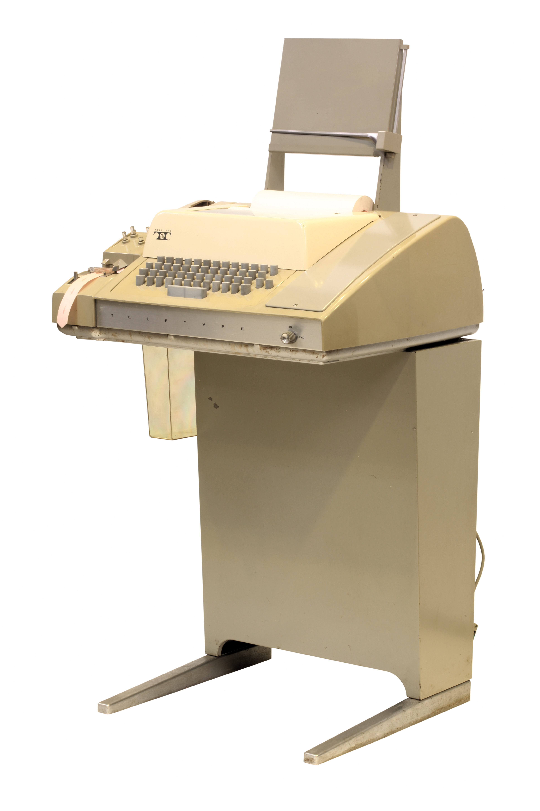
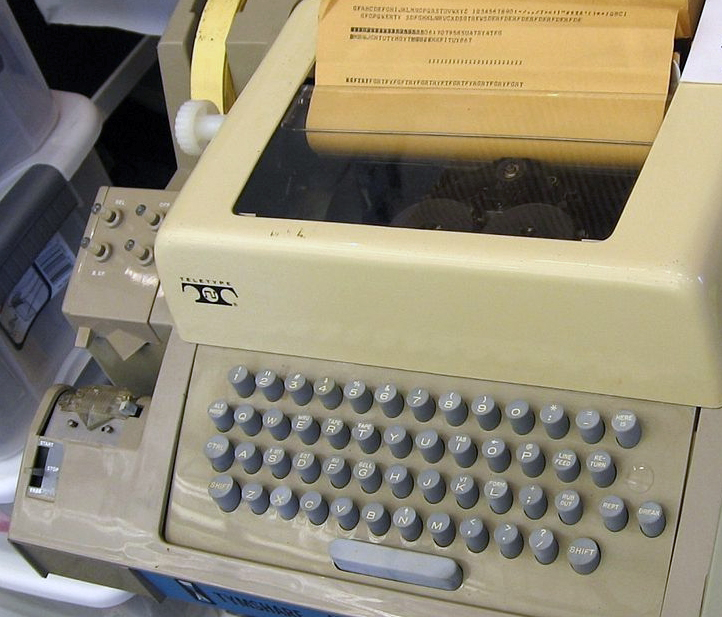
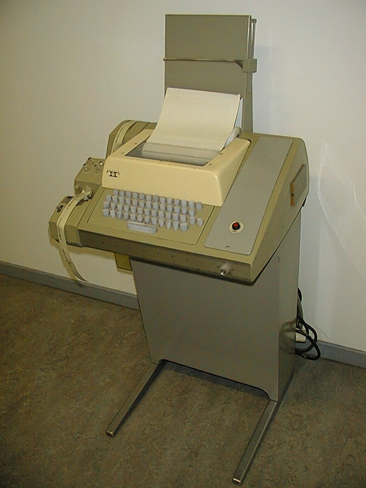

### TeleType Model 33

> From Wikipedia, the free encyclopedia

The **Teletype Model 33** is an electromechanical teleprinter designed for light-duty office. It is less rugged and less expensive than earlier Teletype machines. The [Teletype Corporation](https://en.wikipedia.org/wiki/Teletype_Corporation) introduced the Model 33 as a commercial product in 1963 after being originally designed for the US Navy. There are three versions of the Model 33:

- the Model 33 ASR, (**A**utomatic **S**end and **R**eceive), which has a built-in 8-level punched tape reader and tape punch;
- the Model 33 KSR (**K**eyboard **S**end and **R**eceive), which lacks the paper tape reader and punch;
- the Model 33 RO (**R**eceive **O**nly) which has neither a keyboard nor a reader/punch.

The Model 33 was one of the first products to employ the newly standardized ASCII code. A companion Model 32 used the more established five-level [Baudot code](https://en.wikipedia.org/wiki/Baudot_code). Because of its low price and ASCII-compatibility, the Model 33 was widely used with early minicomputers.

Fig. 1: A Teletype Model 33 ASR teleprinter, with punched tape reader and punch, usable as a computer terminal

#### History

Teletype Corporation's Model 33 terminal, introduced in 1963, was one of the most popular terminals in the data-communications industry. Over a half-million Model 32s and 33s were made by 1975, and the 500,000th was plated with gold and placed on special exhibit. Another 100,000 were made in the next 18 months, and Serial Number 600,000, manufactured in 1976, the [United States Bicentennial](https://en.wikipedia.org/wiki/United_States_Bicentennial) year, was painted red-white-and-blue and shown around the United States during the last part of that year and the year after.

A Model 33 cost about $700, much less than other teleprinters and [computer terminals](https://en.wikipedia.org/wiki/Computer_terminal) at the time, such as the [Friden Flexowriter](https://en.wikipedia.org/wiki/Friden_Flexowriter) and the [IBM 1050](https://en.wikipedia.org/wiki/IBM_1050). Early video terminals, such as the [Tektronix 4010](https://en.wikipedia.org/wiki/Tektronix_4010), did not become available until 1970 and cost around $10,000. However the introduction of integrated circuits and semiconductor memory later that decade allowed the price of [cathode-ray-tube](https://en.wikipedia.org/wiki/Cathode_ray_tube)-based terminals to fall below the price of a Teletype. Teletype machines were gradually replaced in new installations by [dot-matrix printers](https://en.wikipedia.org/wiki/Dot_matrix_printing) and CRT-based terminals in the mid to late 1970s. Basic CRT-based terminals which could only print lines and scroll them are often called [glass teletypes](https://en.wikipedia.org/wiki/Computer_terminal#Dumb_terminals) to distinguish them from more sophisticated devices.

Teletype Corporation discontinued Model 33 production in 1981.

##### Model 33 ASR vis-à-vis ASR-33

While the manufacturer called the Model 33 teleprinter with a tape punch and tape reader a Model 33 ASR, many users, specifically computer users, called this equipment an ASR-33. The earliest known source for this Teletype Corporation equipment naming discrepancy comes from Digital Equipment Corporation documentation. where the September 1963 PDP-4 Brochure calls the Teletype Model 28 KSR a "KSR-28" in the paragraph titled "Printer-Keyboard and Control Type 65". This naming discrepancy continued from the Teletype Model 28 to other Teletype equipment in later DEC documentation. For example, Digital Equipment Corporation's PDP-15 Price List from April 1970 lists a number of Teletype Corporation teletypewriters using this alternate naming convention.

This alternate naming convention was continued as other computer manufacturers published their documentation. For example, Micro Instrumentation and Telemetry Systems sold the Teletype Model 33 ASR as "Teletype ASR-33".

Fig 2. A Teletype Model 33 ASR teleprinter keyboard with punched tape reader and punch. The left-front unit is the tape reader with its three-position START/STOP/FREE lever in the STOP position. A less-common tape reader had a four-position START/AUTO/STOP/FREE lever. In the AUTO position it could be commanded on and off remotely. The tape punch is the unit directly behind the reader. As it exits the machine, the tape passes under a triangular lip that allows the tape to be easily torn by lifting against the sharp edge of the lip.

#### Technical information

The design objective for the Model 33 was a machine that would fit into a small office space, match with other office equipment of the time and operate up to two hours per day on average. Since this machine was designed for light duty use, adjustments that Teletype made in previous teleprinters by turning screws were made by bending metal bars and levers. Many Model 33 parts were not heat treated and hardened. However, the base was die cast, but self-tapping screws were used, along with parts that snapped together without bolting. In another cost saving measure, the paper tape equipment was dependent on the keyboard and page printer mechanisms. Earlier Teletype machine designs, such as the Model 28 ASR, allowed the user to operate the keyboard to punch tape while transmitting a previously punched tape and to punch a tape while printing something else. Independent use of the paper tape punch and reader is not possible with the Model 33 ASR.

The Model 33 used the seven-bit upper-case only ASCII code, also known as [CCITT](https://en.wikipedia.org/wiki/CCITT) International Telegraphic Alphabet No. 5, with one (even) [parity bit](https://en.wikipedia.org/wiki/Parity_bit) and two stop bits. The Model 33 is usually geared to run at maximum speed ten characters per second speed, i.e., 100 words per minute (wpm), but other speeds are available: 60 wpm, 66 wpm, 68.2 wpm, and 75 wpm. There were also many typewheel options. The Teletype Parts Bulletin lists sixty-nine available Model 33 typewheel options.

The Teletype Model 33 contained an answer-back mechanism that was generally used in dial-up networks such as the TWX network. At the beginning of the message, the sending machine could transmit an [enquiry character](https://en.wikipedia.org/wiki/Enquiry_character) or WRU (Who aRe yoU) code, and the recipient machine would automatically initiate a response which was encoded in a rotating drum that could be programmed by breaking off tabs. The answer-back drum in the recipient machine would rotate and send an unambiguous identifying code to the sender, so the sender could verify connection to the correct recipient. The WRU code could also be sent at the end of the message. A correct response would confirm that the connection had remained unbroken during the message transmission. Finally, the sending machine operator would press the disconnect button. Note that the receiving machine did not need operator intervention. Since messages were often sent across multiple time zones to their destination, it was common to send a message to a location where the receiving machine was operating in an office that was closed and unmanned.

The Teletype Model 33, including the stand, is 34 inches (86 cm) high, 22 inches (56 cm) wide and 18.5 inches (47 cm) deep, not including the paper holder. The Teletype Model 33 weighs 75 pounds (34 kg) on the stand, including paper. This machine requires less than 4 amperes at 115 VAC 60 Hz. The recommended operating environment is a temperature of 40 °F to 110 °F (4 °C to 43 °C), a relative humidity of 2 to 95 percent and an altitude of 0 to 10,000 feet (3050 m). The printing paper is an 8.44 inch by 4.5 inch diameter roll and the paper tape is a one inch by 1000 foot roll. Ribbons are 0.5 inch wide by 60 yards long with plastic spools and eyelets for proper ribbon reverse operation.

[TeleType ASR-33 in Action](https://www.youtube.com/watch?v=ZYck5NQB_E4)

<video id="video_1" controls="" preload="none" poster="imgs/TeleType_ASR-33_in_Action_20171105214816.jpg" width="100%">
    <source id="mp4" src="imgs/TeleType_ASR-33_in_Action.mp4" type="video/mp4">
	
Your user agent does not support the HTML5 Video element.

</video>

[Punching, Reading and Duplication on a Model 33 Teletype](https://www.youtube.com/watch?v=OVdoU-BqFHY)

On the side of the model 33 there is a tape punch which lets you create paper tapes from either keyboard input or from an incoming signal. There is also a reader which allows you to print the contents of a tape or send it through an outgoing line. Both the punch and reader can be used together to duplicate paper tapes.

<video id="video_2" controls="" preload="none" poster="imgs/Punching, Reading and Duplication on a Model 33 Teletype.webm_20171105215459.jpg">
    <source id="webm" src="imgs/Punching, Reading and Duplication on a Model 33 Teletype.webm" type="video/webm">
	
Your user agent does not support the HTML5 Video element.

</video>

[Teletype Model 33 ASR](https://www.youtube.com/watch?v=ObgXrIYKQjc)

<video id="video_3" controls="" preload="none" poster="imgs/Teletype Model 33 ASR-Fully functional vintage Teletype Model 33 ASR.webm_20171105215901.jpg">
    <source id="webm2" src="imgs/Teletype Model 33 ASR-Fully functional vintage Teletype Model 33 ASR.webm" type="video/webm">
	
Your user agent does not support the HTML5 Video element.

</video>

#### Communications Interface

The communications module in the Model 33 was known as a Call Control Unit (CCU), and occupied the space to the right of the keyboard and printer. Various CCU types were available. Most operated on the telephone network and included the relevant user controls; variants included rotary, DTMF ("Touch-Tone"), and card-dialing. An acoustic coupler for a then-standard telephone handset was also available. Another CCU type was called "Computer Control Private Line", which operated on a local [20 mA current loop](https://en.wikipedia.org/wiki/Digital_current_loop_interface) (the standard serial protocol for computer terminals before the rise of RS-232). "Private Line" CCUs had a blank panel with no user controls or displays.

#### Related machines

The Model 32 line used the same mechanism and looked identical, except for having a three-row keyboard and, on the ASR model, a five-level paper tape reader and punch, both appropriate for [Baudot code](https://en.wikipedia.org/wiki/Baudot_code).

Teletype also introduced a more expensive ASCII Model 35 for heavy duty use, whose printer mechanism was based on the older, rugged [Model 28](https://en.wikipedia.org/wiki/Teletype_Model_28). The basic Model 35 was mounted in a light gray console that matched the width of the Model 33, while the Model 35 ASR with eight-level mechanical tape punch and reader was installed in a console about twice as wide. The tape reader was mounted separately from the printer-punch mechanism on the left side of the console and behind it was a tray for storing a manual, sheets of paper, or other miscellanea. To the right of the keyboard was a panel that could optionally house a rotary dial or Touch-Tone pushbuttons for dialing a connection to a network via telephone lines. The printer cover in later units also featured sound deadening materials, making the Model 35 somewhat quieter than the Model 33 while printing and punching paper tapes. All versions of the Model 35 had a copy holder on the printer cover, making it more convenient for the operator when transcribing written material.

The Model 38 (ASR-38) was constructed similar to and had all the typing capabilities of a Model 33 ASR with additional features. A two color ribbon and ASCII control codes allowed automatic switching between red and black output while printing. An extended keyboard and typewheel supported upper and lower case printing with some additional special characters. A wider pin-feed platen and typing mechanism allowed printing 132 columns fan fold paper making its output similar to the 132 column page size of the then industry standard IBM 1403 model printers.

More expensive Teletype systems used photo readers that used light sensors to detect the presence or absence of punched holes in the tape. These could work at much higher speeds (hundreds of characters per second). More sophisticated punches were also available that could run at somewhat higher speeds; Teletype's DRPE punch could operate at speeds up to 240 characters per second.

Fig 3. A Model 32 used for Telex service. Note the three row keyboard and narrower, five-level paper tape.

Fig 4. A Model 35 ASR, at the Living Computer Museum in Seattle

#### Historical impact

- ASCII was first used commercially during 1963 as a seven-bit teleprinter code for American Telephone & Telegraph's Teletypewriter eXchange TWX network using Teletype Model 33 teleprinters

- The Teletype Model 33 series was influential in the development and interpretation of ASCII code characters. In particular, the Teletype Model 33 machine assignments for codes 17 (Control-Q, DC1, also known as XON) and 19 (Control-S, DC3, also known as XOFF) became de facto standards.

- The programming language BASIC was designed to be written and edited on a low-speed Teletype Model 33. The slow speed of the Teletype Model 33 influenced the user interface of minicomputer operating systems, including UNIX.

- **A Teletype Model 33 provided Bill Gates' first computing experience**

- In 1965 Stanford University psychology professors Patrick Suppes and Richard C. Atkinson, in the pilot program for computer assisted instruction, experimented with using computers to provide arithmetic and spelling drills via Teletypes and acoustic modems to elementary school students in the Palo Alto Unified School District in California and elsewhere

- **In 1971 Ray Tomlinson chose the @ symbol on his Teletype Model 33 ASR keyboard for use in network email**

- A Teletype Model 33 ASR had a cameo appearance in the 1994 Coen brothers comedy film, The Hudsucker Proxy. However, this was an anachronism, as the film was set in 1958, but this teleprinter was not commercially available until 1963.

- The television program Wall Street Week featured a distinctive theme composed by Donald Swartz entitled "TWX in 12 Bars", which featured percussion supplied by a Teletype Model 33 machine

- **The serial ports in Unix and Linux are named "/dev/tty...", which is short for "Teletype"**

&lt; Done &gt;

From: https://en.wikipedia.org/wiki/Teletype_Model_33

External links:

[Photo of a Model 33 ASR](http://www.columbia.edu/cu/computinghistory/teletype.jpg)

[ASR 33 Teletype Information with movies and sound](http://www.pdp8.net/asr33/asr33.shtml)

