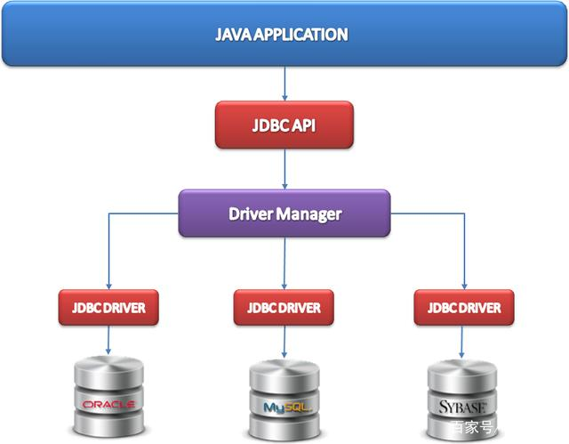
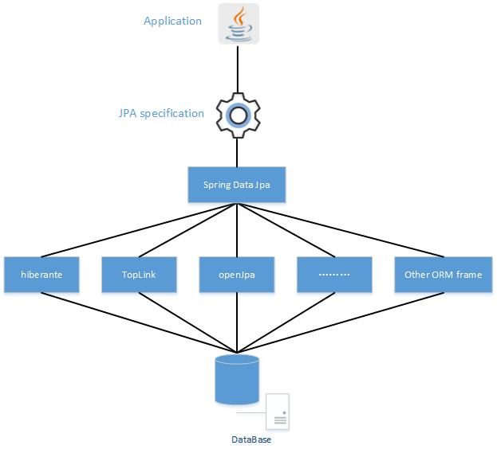

## java持久层怎么选择

> From: [2020年，java持久层怎么选择？](https://www.zhihu.com/question/365286103/answer/974590247)

2020年，java持久层应该用mybatis还是mybatisplus还是springdata jpa还是通用mapper好？

> By: 北冥有鱼
​
到2020了，做持久层的框架有很多，有orm系utils系列。

orm系列的代表有：hibernate，eclipseLink，topLink；

utils系列的代表有：mybatis，dbUtils，jdbcTemplate等；

至于 jpa，它只是一个规范标准，并非具体框架，不等同于 spring-data-jpa；同时 spring-data-jpa 也不是 jpa 的具体实现，它只是 jpa 规范标准的进一步封装。hibernate 是 jpa 最为常见的实现框架，当然其他还有 eclipseLink，topLink。

mybatis 的特点是在对 SQL 优化时，复杂 SQL 的优化可控性高，框架内部调用层次简单，除了部分可以自动生成代码，还会有很多 SQL 需要自行编码。

mybatisplus 是在 mybatis 的基础上再次封装，既然用 mybatis 了，那就没必要再整一层封装了，整了不就跟 spring-data-jpa 差不多了？

spring-data-jpa(hibernate) 的特点是在开发过程中，脱离 SQL 编码开发，当然也支持本地SQL来查询，框架内部调用层次复杂。

以上就可以根据实际的业务进度和业务支撑情况做出选择了。

其实可以在一个项目在同时支持 mybatis 和 spring-data-jpa，复杂SQL走 mybatis，常用SQL走 spring-data-jpa。

## 一文了解JPA、Hibernate、Spring Data JPA之间的爱恨情仇

> https://baijiahao.baidu.com/s?id=1661937038552348304&wfr=spider&for=pc

### 前言

我们都知道Java 持久层框架访问数据库的方式大致分为两种。一种以 SQL 核心，封装一定程度的 JDBC 操作，比如： MyBatis。另一种是以 Java 实体类为核心，将实体类的和数据库表之间建立映射关系，也就是我们说的ORM框架，如：Hibernate、Spring Data JPA。今天咱们就先来了解一下什么是Spring Data JPA?

### JPA是啥

在开始学习Spring Data JPA之前我们首先还是要先了解下什么是JPA，因为Spring Data JPA是建立的JPA的基础之上的，那到底什么是JPA呢？

我们都知道不同的数据库厂商都有自己的实现类，后来统一规范也就有了数据库驱动，Java在操作数据库的时候，底层使用的其实是JDBC，而JDBC是一组操作不同数据库的规范。我们的Java应用程序，只需要调用JDBC提供的API就可以访问数据库了，而JPA也是类似的道理。

**JPA全称为Java Persistence API（Java持久层API）**，它是Sun公司在JavaEE 5中提出的Java持久化规范。它为Java开发人员提供了一种对象/关联映射工具，来管理Java应用中的关系数据，JPA吸取了目前Java持久化技术的优点，旨在规范、简化Java对象的持久化工作。很多ORM框架都是实现了JPA的规范，如：Hibernate、EclipseLink。

需要注意的是JPA统一了Java应用程序访问ORM框架的规范

### JPA为我们提供了以下规范：

1. ORM映射元数据：JPA支持XML和注解两种元数据的形式，元数据描述对象和表之间的映射关系，框架据此将实体对象持久化到数据库表中

2. JPA 的API：用来操作实体对象，执行CRUD操作，框架在后台替我们完成所有的事情，开发人员不用再写SQL了

3. JPQL查询语言：通过面向对象而非面向数据库的查询语言查询数据，避免程序的SQL语句紧密耦合。

### Hibernate是啥

Hibernate是Java中的对象关系映射解决方案。对象关系映射或ORM框架是将应用程序数据模型对象映射到关系数据库表的技术。Hibernate 不仅关注于从 Java 类到数据库表的映射，也有 Java 数据类型到 SQL 数据类型的映射。

### Hibernate 和 JPA是什么关系呢

上面我们介绍到JPA是Java EE 5规范中提出的Java持久化接口，而Hibernate是一个ORM框架

JPA和Hibernate的关系：

JPA是一个规范，而不是框架

Hibernate是JPA的一种实现，是一个框架

### Spring Data是啥

Spring Data是Spring 社区的一个子项目，主要用于简化数据（关系型&非关系型）访问，其主要目标是使得数据库的访问变得方便快捷。

它提供很多模板操作

- Spring Data Elasticsearch

- Spring Data MongoDB

- Spring Data Redis

- Spring Data Solr

强大的 Repository 和定制的数据储存对象的抽象映射

对数据访问对象的支持

### Spring Data JPA又是啥

Spring Data JPA是在实现了JPA规范的基础上封装的一套 JPA 应用框架，虽然ORM框架都实现了JPA规范，但是在不同的ORM框架之间切换仍然需要编写不同的代码，而使用Spring Data JPA能够方便大家在不同的ORM框架之间进行切换而不需要更改代码。Spring Data JPA旨在通过将统一ORM框架的访问持久层的操作，来提高开发人的效率。

### Spring Data JPA给我们提供的主要的类和接口

Repository 接口：

Repository

CrudRepository

JpaRepository

Repository 实现类：

SimpleJpaRepository

QueryDslJpaRepository

以上这些类和接口就是我们以后在使用Spring Data JPA的时候需要掌握的。

### Spring Data JPA和Hibernate的关系

Hibernate其实是JPA的一种实现，而Spring Data JPA是一个JPA数据访问抽象。也就是说Spring Data JPA不是一个实现或JPA提供的程序，它只是一个抽象层，主要用于减少为各种持久层存储实现数据访问层所需的样板代码量。但是它还是需要JPA提供实现程序，其实Spring Data JPA底层就是使用的 Hibernate实现。

### 小结：

Hibernate是JPA的一种实现，是一个框架

Spring Data JPA是一种JPA的抽象层，底层依赖Hibernate

### 总结：

这里主要给介绍了JPA、Hibernate、以及Spring Data JPA的概念以及三者的关系，让我们对这些常用的持久层规范和框架有一个清晰的认识。这样以后我们再接触到其他的同类ORM框架或者其他持久层框架的时候就能更加的游刃有余。
