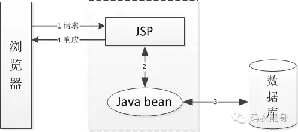
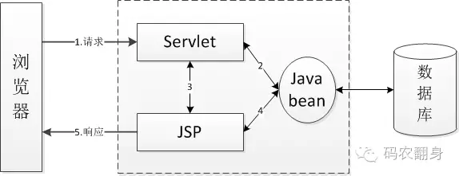
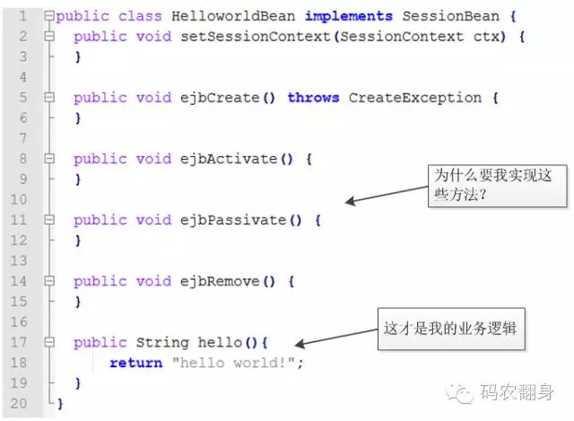
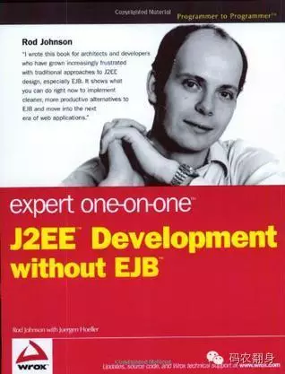

# Java框架之Java Bean

> 2017-12-08 11:26  南北12345678 

> https://www.cnblogs.com/mike-mei/p/8004573.html

## 目录

[Java 帝国之Java bean (上）](https://mp.weixin.qq.com/s?__biz=MzAxOTc0NzExNg==&mid=2665513115&idx=1&sn=da30cf3d3f163d478748fcdf721b6414#rd)

[Java 帝国之Java bean（下）](https://mp.weixin.qq.com/s?__biz=MzAxOTc0NzExNg==&mid=2665513118&idx=1&sn=487fefb8fa7efd59de6f37043eb21799##)

--------

链接 知乎 https://www.zhihu.com/question/19773379 总结

符合一定规范的编写的Java类，不是一种技术，而是一种规范。大家对于这种规范，总结了很多开发技巧，工具函数。

1、所有属性为private
2、提供默认构造方法
3、提供getter和setter
4、实现serializable接口

在java1996年发布,当年12月即发布了java bean1.00-A,有什么用呢?通过统一的规范可以设置对象的值(get,set方法),这是最初的java bean;

- 在实际企业开发中,需要实现事务,安全,分布式,javabean就不好用了.sun公司就开始往上面堆功能,这里java bean就复杂为EJB;
- EJB功能强大,但是太重了.此时出现DI(依赖注入),AOP(面向切面)技术,通过简单的java bean也能完成EJB的事情,这里的java bean简化为POJO;
- Spring诞生了.
- PO(persistence object):用于持久化时(例如保存到数据库或者缓存);
- VO(value object):用于前端展示使用(例如放置到JSP中解析或者给前端传递数据)
- DTO(data transfer object):用于接口互相调用返回,数据传输(例如很多接口调用返回值或消息队列内容);

主要区分三个：JavaBean，EJB，POJO。

### JavaBean

JavaBean是公共Java类，但是为了编辑工具识别，需要满足至少三个条件：

- 有一个public默认构造器（例如无参构造器,）
- 属性使用public 的get，set方法访问，也就是说设置成private，同时get，set方法与属性名的大小也需要对应。例如属性name，get方法就要写成，public String getName(){},N大写。
- 需要序列化。这个是框架，工具跨平台反映状态必须的

### EJB

在企业开发中，需要可伸缩的性能和事务、安全机制，这样能保证企业系统平滑发展，而不是发展到一种规模重新更换一套软件系统。然后有提高了协议要求，就出现了Enterprise Bean。

EJB在javabean基础上又提了一些要求，当然更复杂了。

### POJO

有个叫Josh MacKenzie人觉得，EJB太复杂了，完全没必要每次都用，所以发明了个POJO（Plain Ordinary Java Object），POJO是普通的javabean，什么是普通，就是和EJB对应的。

总之，区别就是，你先判断是否满足javabean的条件，然后如果再实现一些要求，满足EJB条件就是EJB，否则就是POJO。

Java语言欠缺属性、事件、多重继承功能。所以，如果要在Java程序中实现一些面向对象编程的常见需求，只能手写大量胶水代码。Java Bean正是编写这套胶水代码的惯用模式或约定。这些约定包括getXxx、setXxx、isXxx、addXxxListener、XxxEvent等。遵守上述约定的类可以用于若干工具或库。

### Java Bean的设计目的

1、紧凑方便地创建和使用

2、完全的可移植性

3、继承Java的强大功能

4、开发工具支持

5、分布式计算支持

Java Bean定义为“一种在开发工具中可视化操作的，可复用的，平台独立的软件组件”

### Java Bean的特性

1、支持自检：构造器可以分析bean怎样工作；

2、支持定制：用户使用构造器工具定制bean的外观和行为；

3、支持事件处理：bean才能与外部进行通信；

4、支持属性：bean才能具有内容的状态，便于定制和应用开发；

5、支持永久性：bean才能在应用程序构造器工具中定制，并将定制的状态存储起来便于随时使用。

# Java 帝国之Java bean (上）

> 码农翻身 2016-05-27

> 前言： 最近看到到spring 的bean 配置，突然想到可能很多人不一定知道这个叫bean的东西的来龙去脉，所以就写个文章来讲一下。

> 另外，上次出了开源中国抄袭事件，为了防止转载以后我的公众号信息被故意删除，我在文章的内容中加上了一些 刘欣（微信公众号：码农翻身） 这样的字样，可能会造成一些烦扰，请见谅。

我一手创立的Java帝国刚刚成立不久，便受到巨大的打击，我派出去占领桌面开发的部队几乎全军覆没。

情报说微软的Visual Basic 和Borland的Delphi最近在宣传什么组件化开发，难道就是这东西把我们搞垮了？ 

> 刘欣（微信公众号：码农翻身）注：参见[《Java ：一个帝国的诞生》](https://mp.weixin.qq.com/s?__biz=MzAxOTc0NzExNg==&mid=2665513103&idx=1&sn=56d832072a92e3f41f5e6796676993e0&scene=21#wechat_redirect)和[《Basic： 一个老兵的自述》](https://mp.weixin.qq.com/s?__biz=MzAxOTc0NzExNg==&mid=2665513109&idx=1&sn=9ff4cee221d4a4d4124c3a316612c53d&scene=21#wechat_redirect)

我赶紧买了一个Visual Basic 过来研究，果然，这个家伙确实是方便，最让我惊叹的是：它有一个可视化编辑器 ！ 

我只需要把一个组件(例如按钮)拖拽到可一个表单上,  设置一下属性 （颜色，字体），再添加一个事件（onClick）, 最后在onClick中写点代码就搞定了 ！

不仅如此，我自己也可以把我的代码按规范包装成一个组件，发布出去让别人使用。

我看着手下给我买来的《程序员大本营》光盘，里边竟然包含了好几千个这样的组件，有数据库浏览组件，计时器组件，颜色选取组件，甚至还有收发邮件的组件......

天哪，这以后开发桌面程序岂不太简单了 !

怪不得我的Java 被打得满地找牙！

我赶紧打电话给我的干将小码哥 ：　小码啊，　你赶紧看看这个Visual Basic 和Delphi , 给你7天时间，我们Java 也得赶紧搞一套这样的东西出来。

小吗毫不含糊，三天就给我搞了一个东西出来： Java Bean API 规范。

我翻开一看，哇塞，长达114页，于是问他：“这是什么东西？ 我要的可视化编辑器呢Visual Java 呢？ ”

> 刘欣（微信公众号：码农翻身）注： 我下载浏览了java bean 的规范，确实是114页

他说： “老大，我们是个开源的社区，得充分利用大家的力量，所以我没有去做像VB和Delphi那样的东西，相反，我定义了一套规范，只要大家按照这个规范做，谁都可以用java 做出像VB那样的可视化开发工具出来。”

“那你说说这个java bean 到底是什么规范？”我问。

“首先，一个java bean 其实就是一个普通的java 类，但我们对这个类有些要求： 

1. 这个类需要是public 的，然后需要有个无参数的构造函数

2. 这个类的属性应该是private 的，通过setXXX()和getXXX()来访问

3. 这个类需要能支持“事件”，例如addXXXXListener(XXXEvent e),  事件可以是Click事件，Keyboard事件等等，当然咱们也支持自定义的事件。

4. 我们得提供一个所谓的自省/反射机制，这样能在运行时查看java bean 的各种信息“

5. 这个类应该是可以序列化的，即可以把bean的状态保存的硬盘上，以便以后来恢复。

“这些要求看起来也没啥啊，对程序员来说，不就是个普通的java 类吗？ 到底该怎么用？ ” 

“我们幻想一下，假设我们的Java bean 大行其道了，有个用户在用一个Visual Java Builder  这样的可视化开发工具，当他用这个工具创建应用的时候，可以选择一个叫JButton的组件，加到一个表单上，此时Visual Java Builder 就需要把这JButton的类通过反射给new 出来，所以就需要一个无参数的构造函数了。”

“如果用户想去设置一下这个JButton的属性，Visual Java Builder 就需要先用自省/反射来获取这个JButton有哪些属性（通过getter/setter），拿到以后就可以给用户显示一个属性清单了，例如背景色，字体 等等。用户看到后就可以设置背景色和字体了，此时Visual Java Builder 在内部就需要调用这个Bean的setBackgroundCorlor()/setFont() 等方法，这就是所谓的setXXXX()方法。”

“如果用户想对这个JButton编程，Visual Java Builder 还是通过自省/反射来获取这个JButton有哪些事件，给用户展示一个事件清单，例如click , keyboardPressed 用户可以选取一个，然后就可以写程序对这个事件编程了。”

“可是那个序列化有什么用呢？”

“这是因为用户设计完了以后，可能关掉Visual Java Builder 啊 , 如果不通过序列化把设计好的JButton保存起来，下次再打开Visual Java Builder , 可就什么都没有了”

我想了想，小码哥设计的不错，仅仅用了一个简单的规范就满足了可视化编辑器的所有要求。

"那我们就发布这个规范吧，咱们自己先做一个可视化编辑器，给别人做个榜样，名称我都想好了，叫NetBean吧。"

> 刘欣（微信公众号：码农翻身）注：这是我杜撰的，实际上NetBean这个名称可能和java bean 并没有实际关联。

果然不出我们所料，Java bean 发布以后，有力的带动了Java 的IDE市场，开发Delphi的Borland公司 也来插了一脚，搞出了一个JBuilder, 风靡一时。

IBM 搞了一个Visual Age for Java ,  后来摇身一变，成了一个叫Eclipse的开放平台，超级受大家欢迎，它反过头来把我们的Netbean 和 JBuilder 逼的快没有活路了。

虽然我们玩的很欢，但是程序员根本不买账，Java 在桌面开发市场还是没有起色，使用Java bean 创建桌面程序的程序员少之又少，只有部分像金融、ERP这样的领地还在坚持。

看来是无药可救了。

但是Java bean 何去何从 ？ 丢弃掉太可惜了，我和小码哥商量了一下，我们觉得：既然我们Java在统治了服务器端的编程，还是在那里想想办法吧......

未完待续。

# Java 帝国之Java bean（下）

> 刘欣 码农翻身 2016-05-29

上一篇提到Java bean 的规范虽然定义的不错，但却没有获得意料中的成功，尤其是Java帝国所期待的桌面开发组件化市场上。

我和小码哥多么期待CSDN也能出一期《程序员大本营》，里边包含成千上万的java bean 组件啊。

不要幻想了，赶紧把java bean 应用在服务器端才是正事。
 
### JSP + Java Bean

小码哥建议先用在jsp上试试，可以用java bean 来封装业务逻辑，保存数据到数据库，像这样：



> （微信公众号"码农翻身"注： 这其实叫做JSP Model 1 )

其中jsp 直接用来接受用户的请求，然后通过java bean 来处理业务，具体的使用方法是：
<jsp:useBean id="user" scope="page" class="com.coderising.User"/>
<jsp:setProperty property="userName" name="user" param="userName"/>
<jsp:setProperty property="password" name="user" param="password"/>

这就能把HTTP request中的所有参数都设置到 user 这个java bean 对应的属性上去。

如果想偷懒，还可以这样：

<jsp:setProperty name="user" property="*"/>

当然要保证 http request中的参数名和 java bean 中的属性名是一样的。

这个叫做JSP Model 1 的模型受到了很多Java程序员的欢迎 ,  因为他们的应用规模都很小，用Model 1 使得开发很快速。

实际上，这种方式和微软帝国的asp , 以及和开源的php 几乎一样。

但很快就有人来找我抱怨了，说他们的项目中使用了Model 1 导致整个系统的崩溃。

他说： “你知道吗？ 我们的系统中有好几千个jsp，这些jsp互相调用(通过GET/POST), 到了最后调用关系无人能搞懂。”

其实我们已经预料到了，小码哥对此有个形象的比喻：意大利面条


这几千个JSP 就像这碗面条一样，搅在一起，根本理不清楚。

为了解决这个问题，小码哥又推出了 ：JSP Model 2 ,    这是个模型真正的体现了Model-View-Controller的思想：



Servlet 充当Controller ,  jsp 充当 View 
Java bean 当然就是Model 了！

业务逻辑，页面显示，和处理过程做了很好的分离。

基于这个模型的扩展和改进，很多Web开发框架开始如雨后春笋一样出现，其中最著名的就是Struts，SpringMVC 了。

Java Web开发迅速的繁荣了。

我们再一次体会到了开放的好处 ！
 
### Enterprise Java bean

但是好景不长，自从Java帝国统治了所谓的“企业级应用”开发领地，各种各样的游行和抗议层出不穷：
“我们要分布式”
“我们要安全”
“我们要事务”
“我们要高可用性”
“......”
帝国分析了一下，其实这些程序员的诉求可以归结为：
“我们只想关注我们的业务逻辑，我们不想，也不应该由我们来处理‘低级’的事务，多线程，连接池，以及其他各种各种的‘低级’API，此外Java帝国一定得提供集群功能，这样我们的一台机器死机以后，整个系统还能运转。”

我们不能坐着不管，企业级应用是我们的命根子。
  
小码哥彻夜工作，最终拿出了一个叫做J2EE的东西，像Java bean 一样，这还是一个规范，但是比Java bean 复杂的多，其中有：

**JDBC**:  Java 数据库连接，没有数据库的支持怎么能叫企业级应用？

**JNDI** :  Java 命名和目录接口，通过一个名称就可以定位到一个数据源，连jdbc连接都不用了

**RMI**：  远程过程调用，让一个机器上的java 对象可以调用另外一个机器上的java 对象，你们不是要分布式吗？

**JMS** :   Java 消息服务，可以使用消息队列了，这不是企业级应用非常需要的吗？

**JTA**：  Java 事务管理，支持分布式事务，能在访问、更新多个数据库的时候，仍然保证事务，还是分布式。

**Java mail** : 收发邮件也是必不可少的啊。

> 刘欣（微信公众号号：码农翻身）注：  J2EE 后来改成了Java EE。

当然还有最最最重要的升级，小码哥把java bean 变成了 Enterprise Java bean , 简称 EJB。

小码哥宣称： 

使用了EJB，你就可以把精力只放在业务上了，那些烦人的事务管理，安全管理，线程 统统交给容器（应用服务器）来处理吧。

我们还提供了额外的福利，只要你的应用服务器是由多个机器组成的集群，EJB就可以无缝的运行在这个集群上，你完全不用考虑一个机器死掉了应用该怎么办。我们都帮你搞定了。

使用Session Bean，可以轻松的处理你的业务。

使用实体Bean (Entity bean ) , 你和数据库打交道会变得极为轻松，甚至sql 都不用写了。

使用消息驱动Bean(Message Driven bean ) , 你可以轻松的和一个消息队列连接，处理消息。

听起来很美好是不是？ 

企业级开发领地的程序员们欢呼雀跃，坐上了J2EE这条船，似乎一下子高贵起来，开始鄙视微软的ASP, 开源的PHP, Python 等“不入流”的语言了。

Weblogic , Websphere等符合J2EE规范的应用服务器趁势而上，摇旗呐喊，仿佛一个新的时代要来临了，当然他们在背后一直闷声发大财。
 
### Sring

有句古话是对的，捧的越高，跌的越惨。

很快，大部分的程序员就发现，美好的前景并没有实现，EJB中用起来极为繁琐和笨重，性能也不好，为了获得所谓的分布式，反而背上了沉重的枷锁。

实体Bean很快没人用了，就连简单的无状态Session bean 也被大家所诟病，其中一条罪状就是“代码的侵入性”。

也是，小码哥定义EJB的时候没考虑那么多，程序员在定义一个Session bean的时候，需要写一大堆和业务完全没有关系的类。

还需要被迫实现一些根本不应该实现的接口及其方法： 



为了哪怕一点点业务逻辑，我们都得写这么多无用的代码 ！ 程序员们出离愤怒了！

他们发起了一场叫做`POJO (Plain Old Java Object)`的运动，高唱这POJO之歌，要求我们整改。

他们希望这个样子：

```
public class HelloworldBean{
    public String hello(){
        return "hello world"
    }
}
```

与此同时，他们还过分的要求保留事务了，安全了这些必备的东西。

程序员确实不好伺候，但是我们已经被Weblogic, Websphere这些大佬们“绑架”，想改动谈何容易 ！

2002年，小码哥看到了Rod Johnson写的一本书《Expert one on one J2EE development withoutEJB》，赶紧跑来找我：

“老大，坏了坏了，你快看看这本书吧，这个叫Rod的家伙写的这本书直击我们的命门，这厮要搞without EJB”



> （微信公众号"码农翻身"注： 虽然这本书翻译的很差，但由于是spring的开山之作，还是值得读一下，最好中英文对照)

岂止是without EJB,  他还“偷偷的”推出了一个叫什么Spring的框架，已经迅速的流行开了。

Spring 框架顺应了POJO的潮流，提供了一个spring 的容器来管理这些POJO, 好玩的是也叫做bean。
 
看来我们的java bean 走了一圈又回到了原点。

对于一个Bean 来说，如果你依赖别的Bean , 只需要声明即可，spring 容器负责把依赖的bean 给“注入进去“，起初大家称之为控制反转(IoC)

后来 Martin flower 给这种方式起来个更好的名字，叫“依赖注入”。

如果一个Bean 需要一些像事务，日志，安全这样的通用的服务，也是只需要声明即可，spring 容器在运行时能够动态的“织入”这些服务，这叫AOP。

后来我和小码哥商量，我们EJB也学习Spring , 简化开发和配置，但是为时已晚，Spring 已经成为事实上的标准了！程序员已经被spring 拉走了！

不过令我们欣慰的是，spring和spring mvc极大的增加了我们对web开发领地的统治力, java 帝国更加强盛了。

（全文完）
