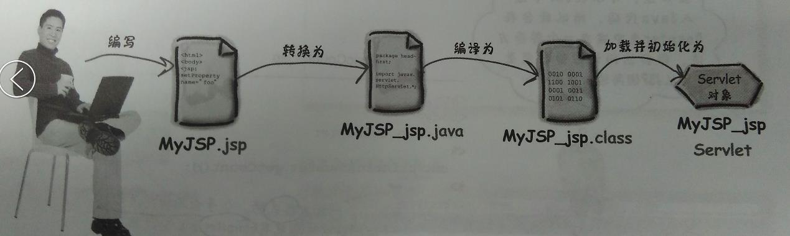

# J2EE与SSH、SSM、Springboot等之间的关系

## J2EE是什么

J2EE是一套全然不同于传统应用开发的技术架构，包含许多组件，主要可简化且规范应用系统的开发与部署，进而提高可移植性、安全与再用价值。

J2EE核心是一组技术规范与指南，其中所包含的各类组件、服务架构及技术层次，均有共同的标准及规格，让各种依循J2EE架构的不同平台之间，存在良好的兼容性，解决过去企业后端使用的信息产品彼此之间无法兼容，企业内部或外部难以互通的窘境。

J2EE组件和“标准的” Java类的不同点在于：它被装配在一个J2EE应用中，具有固定的格式并遵守J2EE规范，由J2EE服务器对其进行管理。J2EE规范是这样定义J2EE组件的：客户端应用程序和applet是运行在客户端的组件；Java Servlet和Java Server Pages (JSP) 是运行在服务器端的Web组件；Enterprise Java Bean (EJB )组件是运行在服务器端的业务组件。

简单而言：J2EE是一套规范，里面定义了`servlet`, `jdbc`, `jmx`, `jni`, `ejb`，对象持久等等大量的规范（接口），当初sun定义这些规范的目的是希望通过J2EE解决所有的问题。但是它实在太庞大了，要完全掌握和使用需要付出很多代价。而这些规范又很多具体实现，如apache的tomcat实现了`servlet`和`jsp`，jboss，weblogic实现了`ejb`等，大部分数据库里面都有jdbc驱动。

而所谓的SSH、SSM、Springboot框架是J2EE方向的一个具体结构、框架展示。J2EE是标准，SSH是技术，它吸收了部分J2EE的设计理念，但是又没有完全遵守J2EE规范，自成一套体系。

## Jsp和Servlet有什么区别？

从写代码的感光上来看，jsp就是在html里面写java代码，servlet就是在java里面写html代码。其实jsp经过容器解释之后就是servlet，只是我们自己写代码的时候尽量能让它们各司其职，jsp更注重前端显示，servlet更注重模型和业务逻辑。不要写出万能的jsp或servlet来即可。

### 什么是Servlet？

Servlet其实就是一个遵循Servlet开发的java类。Servlet是由服务器调用的，运行在服务器端。

### 什么是JSP

JSP全名为Java Server Pages，java服务器页面。JSP是一种基于文本的程序，其特点就是HTML和Java代码共同存在！

### 为什么需要JSP

JSP是为了简化Servlet的工作出现的替代品，Servlet输出HTML非常困难，JSP就是替代Servlet输出HTML的。

### 不同之处

- Servlet在Java代码中通过HttpServletResponse对象动态输出HTML内容
- JSP在静态HTML内容中嵌入Java代码，Java代码被动态执行后生成HTML内容

### 各自的特点

- Servlet能够很好地组织业务逻辑代码，但是在Java源文件中通过字符串拼接的方式生成动态HTML内容会导致代码维护困难、可读性差
- JSP虽然规避了Servlet在生成HTML内容方面的劣势，但是在HTML中混入大量、复杂的业务逻辑同样也是不可取的

### 通过MVC双剑合璧

既然JSP和Servlet都有自身的适用环境，那么能否扬长避短，让它们发挥各自的优势呢？答案是肯定的——MVC(Model-View-Controller)模式非常适合解决这一问题。

MVC模式（Model-View-Controller）是软件工程中的一种软件架构模式，把软件系统分为三个基本部分：模型（Model）、视图（View）和控制器（Controller）：

- Controller——负责转发请求，对请求进行处理
- View——负责界面显示
- Model——业务功能编写（例如算法实现）、数据库设计以及数据存取操作实现

MVC模式在Web开发中的好处是非常明显，它规避了JSP与Servlet各自的短板，Servlet只负责业务逻辑而不会通过`out.append()`动态生成HTML代码；JSP中也不会充斥着大量的业务代码。这大大提高了代码的可读性和可维护性。

### 为什么说JSP的本质就是Servlet

JSP的本质就是Servlet，JVM只能识别java的类，不能识别JSP的代码,Web容器将JSP的代码编译成JVM能够识别的java类。

JSP 工作原理： 
JSP页面在执行的时候都会被服务器端的JSP引擎转换为Servelet（.java），然后又由JSP引擎调用Java编译器，将Servelet（.java）编译为Class文件（.class），并由Java虚拟机（JVM）解释执行。



下面验证这一点：
有一个JSP页面Test.jsp，在浏览器地址栏中输入http://localhost:8080/Test.jsp,将会出现执行结果。同时在%CATALINA_HOME%/work/Catalina/localhost下多出两个文件：_Test_jsp.java和_Test_jsp.class，他们分别就是Servelet和Class文件。

## J2EE神框架-SpringBoot

### SpringBoot框架由来:

SpringBoot其实是由Spring升级而来，那Spring又是什么呢? 这个就是老历史了，在十几年前，JavaEE在企业级应用中可谓是跟.Net框架分庭抗礼，是当时开发大型项目应用中必不可少的选择。

JavaEE只是一套协议标准，本身其实不是实打实的框架，支持JavaEE协议的当时几个框架中，有Struts,Spring,等等。这其中Spring是最大而全的，完全面向对象，架构设计思路领先，它包含了Spring ORM,SpringMVC,Spring AOP等构件。

而SpringBoot,又是架构在上面这些构件上的又一层框架(听起来挺绕), 这样的主要原因是，Spring套件虽然强大，功能丰富，但也正是因为它思路的领先，要理解起来太困难了，学习起来也特别费劲，自打它诞生后的好多年，虽然已经是开发的主流选择，但开发周期还是太长太复杂，于是，SpringBoot的使命就来了:简化Spring框架的流程与生命周期，将更多与上层业务无关的技术细节做更彻底的封装。

### SpringBoot的核心特点:

- 支持微服务：

    这是必须的，微服务是现在大型应用的必然选择，使用Spring Boot可以生成独立的微服务功能单元

- 配置可以自动化：

    是的，完全不需要人工参与了，这也是之前Spring最被人诟病的地方，一堆堆的配置文件，经常可以把人整晕，而很多的配置项，其实无关业务，无关性能。终于，现在不需要再被整啰。

- 起步依赖：

    起步依赖有点Maven的意思，按需加载，告诉Spring Boot你的项目需要什么功能，它就会帮你完成加载。

- 支持命令行界面：

    这是Spring Boot的可选特性， 完全用命令行，一样可以对项目完成构建，这对命令行大神来说是一个福音。

- Actuator：

    这个能让你能够深入运行中的Spring Boot应用程序


## SSM框架——详细整合教程（Spring+SpringMVC+MyBatis）

### Spring 

Spring是一个开源框架，Spring是于2003 年兴起的一个轻量级的Java 开发框架，由Rod Johnson 在其著作Expert One-On-One J2EE Development and Design中阐述的部分理念和原型衍生而来。它是为了解决企业应用开发的复杂性而创建的。Spring使用基本的JavaBean来完成以前只可能由EJB完成的事情。然而，Spring的用途不仅限于服务器端的开发。从简单性、可测试性和松耦合的角度而言，任何Java应用都可以从Spring中受益。 简单来说，Spring是一个轻量级的控制反转（IoC）和面向切面（AOP）的容器框架。

**Spring 框架的核心是提供了依赖注入（Dependency Injection，DI）机制的控制翻转（Inversion of Control，IoC）容器。**

### SpringMVC     

Spring MVC属于SpringFrameWork的后续产品，已经融合在Spring Web Flow里面。Spring MVC 分离了控制器、模型对象、分派器以及处理程序对象的角色，这种分离让它们更容易进行定制。简单的讲：Spring MVC就是个MVC框架，和Spring天生就集成。

### MyBatis

MyBatis 本是apache的一个开源项目iBatis, 2010年这个项目由apache software foundation 迁移到了google code，并且改名为MyBatis 。MyBatis是一个基于Java的持久层框架。iBATIS提供的持久层框架包括SQL Maps和Data Access Objects（DAO）MyBatis 消除了几乎所有的JDBC代码和参数的手工设置以及结果集的检索。MyBatis 使用简单的 XML或注解用于配置和原始映射，将接口和 Java 的POJOs（Plain Old Java Objects，普通的 Java对象）映射成数据库中的记录。

## SSH框架

SSH是 struts+spring+hibernate的一个集成框架，是16年之前较为流行的一种Web应用程序开源框架。

集成SSH框架的系统从职责上分为四层：表示层、业务逻辑层、数据持久层和域模块层，以帮助开发人员在短期内搭建结构清晰、可复用性好、维护方便的Web应用程序。其中使用Struts作为系统的整体基础架构，负责MVC的分离，在Struts框架的模型部分，控制业务跳转，利用Hibernate框架对持久层提供支持，Spring做管理，管理struts和hibernate。

SSH框架是基于MVC的开发，且MVC模式已经成为现代J2EE开发中的一种常用模式，且受到越来越多JSP、PHP等开发者的欢迎。这种Struts+Hibernate+Spring的三大框架整合，契合着MVC模式的三层对象。其中Struts对应着前台的控制层，而Spring则负责实体bean的业务逻辑处理，至于Hibernate则是负责数据库的交接以及使用Dao接口来完成操作。

## Spring 、Spring Boot 和 Spring Cloud 的关系

Spring 最初最核心的两大核心功能 Spring Ioc 和 Spring Aop 成就了 Spring，Spring 在这两大核心的功能上不断的发展，才有了 Spring 事务、Spirng Mvc 等一系列伟大的产品，最终成就了 Spring 帝国，到了后期 Spring 几乎可以解决企业开发中的所有问题。

Spring Boot 是在强大的 Spring 帝国生态基础上面发展而来，发明 Spring Boot 不是为了取代 Spring ,是为了让人们更容易的使用 Spring 。所以说没有 Spring 强大的功能和生态，就不会有后期的 Spring Boot 火热, Spring Boot 使用约定优于配置的理念，重新重构了 Spring 的使用，让 Spring 后续的发展更有生命力。

Spring Cloud 是一系列框架的有序集合。它利用 Spring Boot 的开发便利性巧妙地简化了分布式系统基础设施的开发，如服务发现注册、配置中心、消息总线、负载均衡、断路器、数据监控等，都可以用 Spring Boot 的开发风格做到一键启动和部署。

Spring 并没有重复制造轮子，它只是将目前各家公司开发的比较成熟、经得起实际考验的服务框架组合起来，通过 Spring Boot 风格进行再封装屏蔽掉了复杂的配置和实现原理，最终给开发者留出了一套简单易懂、易部署和易维护的分布式系统开发工具包。

根据上面的说明我们可以看出来，Spring Cloud 是为了解决微服务架构中服务治理而提供的一系列功能的开发框架，并且 Spring Cloud 是完全基于 Spring Boot 而开发，Spring Cloud 利用 Spring Boot 特性整合了开源行业中优秀的组件，整体对外提供了一套在微服务架构中服务治理的解决方案。

综上我们可以这样来理解，正是由于 Spring Ioc 和 Spring Aop 两个强大的功能才有了 Spring ，Spring 生态不断的发展才有了 Spring Boot ，使用 Spring Boot 让 Spring 更易用更有生命力，Spring Cloud 是基于 Spring Boot 开发的一套微服务架构下的服务治理方案。

用一组不太合理的包含关系来表达它们之间的关系。

```
Spring ioc/aop -> Spring -> Spring Boot -> Spring Cloud
```

Reference:

[J2EE与SSH、SSM、Springboot之间的关系](https://blog.csdn.net/qq_38025219/article/details/82984506)

[Jsp和Servlet有什么区别？](https://www.zhihu.com/question/37962386)

[J2EE神框架-SpringBoot](https://zhuanlan.zhihu.com/p/268108743)

[SSM框架——详细整合教程（Spring+SpringMVC+MyBatis）](https://www.cnblogs.com/zyw-205520/p/4771253.html)

[ssh框架](https://baike.baidu.com/item/ssh%E6%A1%86%E6%9E%B6/8882453?fr=aladdin)

[Spring 历史](https://blog.csdn.net/u014209205/article/details/91043704)

[Spring学习指南（第三版）](https://www.zhihu.com/pub/reader/119631108/chapter/1150790784658853888)
