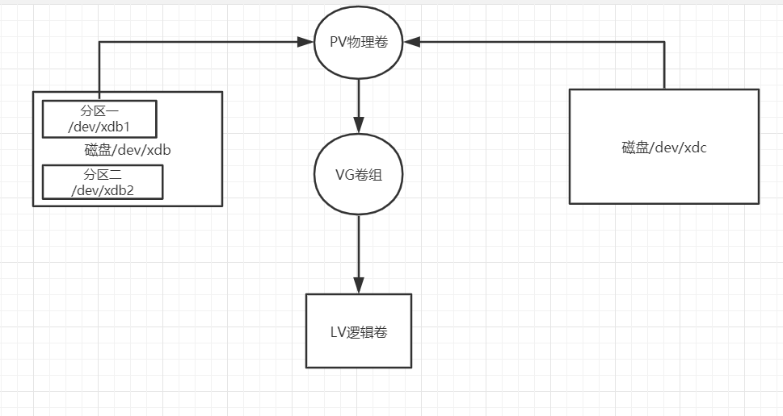
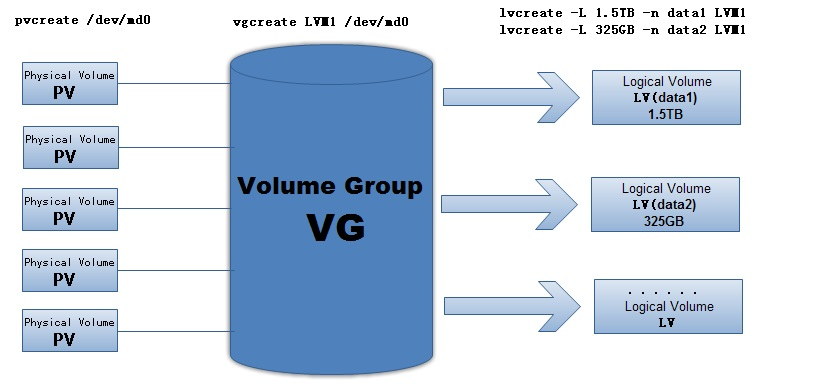

# Logical Volume Manager(逻辑卷管理)

> https://www.cnblogs.com/jackruicao/p/6258812.html

> https://www.cnblogs.com/operationhome/p/12258694.html

LVM是 Logical Volume Manager(逻辑卷管理)的简写，它是Linux环境下对磁盘分区进行管理的一种机制

## LVM优点

LVM通常用于装备大量磁盘的系统，但它同样适于仅有一、两块硬盘的小系统。

1. 硬盘的多个分区由LVM统一为卷组管理，可以方便的加入或移走分区以扩大或减小卷组的可用容量，充分利用硬盘空间；

2. 文件系统建立在逻辑卷上，可以跨分区，方便使用，而且逻辑卷可根据需要改变大小(在卷组容量范围内)以满足要求；

3. 用户／用户组的空间建立在LVM上，可以随时按要求增大，或根据使用情况对各逻辑卷进行调整。当系统空间不足而加入新的硬盘时，不必把用户的数据从原硬盘迁移到新硬盘，而只须把新的分区加入卷组并扩充逻辑卷即可。同样，使用LVM可以在不停服务的情况下。把用户数据从旧硬盘转移到新硬盘空间中去。

## 基本概念

### 1、 物理卷-----PV（Physical Volume）

物理卷在逻辑卷管理中处于最底层，它可以是实际物理硬盘上的分区，也可以是整个物理硬盘。


### 2、 卷组--------VG（Volumne Group）

卷组建立在物理卷之上，一个卷组中至少要包括一个物理卷，在卷组建立之后可动态添加物理卷到卷组中。一个逻辑卷管理系统工程中可以只有一个卷组，也可以拥有多个卷组。


### 3、 逻辑卷-----LV（Logical Volume）

逻辑卷建立在卷组之上，卷组中的未分配空间可以用于建立新的逻辑卷，逻辑卷建立后可以动态地扩展和缩小空间。系统中的多个逻辑卷要以属于同一个卷组，也可以属于不同的多个卷组。


### 4、 物理区域--PE（Physical Extent）

物理区域是物理卷中可用于分配的最小存储单元，物理区域的大小可根据实际情况在建立物理卷时指定。物理区域大小一旦确定将不能更改，同一卷组中的所有物理卷的物理区域大小需要一致。


### 5、 逻辑区域―LE（Logical Extent）

逻辑区域是逻辑卷中可用于分配的最小存储单元，逻辑区域的大小取决于逻辑卷所在卷组中的物理区域的大小。


### 6、 卷组描述区域-----（Volume Group Descriptor Area）

卷组描述区域存在于每个物理卷中，用于描述物理卷本身、物理卷所属卷组、卷组中的逻辑卷及逻辑卷中物理区域的分配等所有信息，卷组描述区域是在使用`pvcreate`建立物理卷时建立的。



## 常用命令

### 1、 物理卷命令

一般维护命令：

```
pvscan                     #在系统的所有磁盘中搜索已存在的物理卷
pvdisplay                  #用于显示指定物理卷的属性。
pvdata 物理卷全路径名称     #用于显示物理卷的卷组描述区域信息，用于调试目的。
```

建与删除命令

```
pvcreate 设备全路径名   #用于在磁盘或磁盘分区上创建物理卷初始化信息，以便对该物理卷进行逻辑卷管理。
```

### 2、 卷组命令

一般维护命令

```
vgscan                  #检测系统中所有磁盘
vgck [卷组名]           #用于检查卷组中卷组描述区域信息的一致性。
vgdisplay [卷组名]      #显示卷组的属性信息
vgrename 原卷组名 新卷组名
```

卷组的扩充与缩小命令

```
vgextend 卷组名 物理卷全路径名[物理卷全路径名]
vgreduce 卷组名 物理卷全路径名[物理卷全路径名]
```

### 3、 逻辑卷命令

一般命令

```
lvscan
lvdisplay 逻辑卷全路径名[逻辑卷全路径名]
lvrename 旧逻辑卷全路径名 新逻辑卷全路径名
lvrename 卷组名 旧逻辑卷名 新逻辑卷名
lvchange
e2fsadm -L +|- 逻辑卷增减量 逻辑卷全路径名
```

逻辑卷的创建与删除命令

```
lvcreate
lvremove
```

逻辑卷的扩充与缩小命令

```
lvextend -L|--size +逻辑卷大小增量 逻辑卷全路径名
lvreduce q -L|--size +逻辑卷减小量 逻辑卷全路径名
```

### 4、 逻辑卷管理命令

```
lvmdiskscan #检测所有的SCSI、IDE等存储设备
lvmchange -R|--reset #复位逻辑卷管理器
lvmsadc [日志文件全路径名] #收信逻辑卷管理器读写统计信息，保存到日志文件中。
lvmsar 日志文件全路径名 #从lvmsadc命令生成的日志文件中读取并报告逻辑卷管理器的读写统计信息。
```



## 原有硬盘未做分区，并且选择在线扩容磁盘（比如阿里云选择磁盘在线扩容）

扩容好了，我们可以在服务端进行使用 `fidisk -l` 查看，我们可以发现磁盘已经变大了。但是我们的物理卷没有变化。

```
[root@localhost ~]# fdisk -l
Disk /dev/sda: 16 GiB, 17179869184 bytes, 33554432 sectors
Units: sectors of 1 * 512 = 512 bytes
Sector size (logical/physical): 512 bytes / 512 bytes
I/O size (minimum/optimal): 512 bytes / 512 bytes
Disklabel type: dos
Disk identifier: 0x772bea83

Device     Boot   Start      End  Sectors Size Id Type
/dev/sda1  *       2048  2099199  2097152   1G 83 Linux
/dev/sda2       2099200 33554431 31455232  15G 8e Linux LVM


Disk /dev/sdb: 600 GiB, 644245094400 bytes, 1258291200 sectors
Units: sectors of 1 * 512 = 512 bytes
Sector size (logical/physical): 512 bytes / 512 bytes
I/O size (minimum/optimal): 512 bytes / 512 bytes


Disk /dev/mapper/cl-root: 113.8 GiB, 122201047040 bytes, 238673920 sectors
Units: sectors of 1 * 512 = 512 bytes
Sector size (logical/physical): 512 bytes / 512 bytes
I/O size (minimum/optimal): 512 bytes / 512 bytes


Disk /dev/mapper/cl-swap: 1.2 GiB, 1270874112 bytes, 2482176 sectors
Units: sectors of 1 * 512 = 512 bytes
Sector size (logical/physical): 512 bytes / 512 bytes
I/O size (minimum/optimal): 512 bytes / 512 bytes
```

查看物理卷信息，仍没有变化

```
[root@localhost ~]# pvdisplay
  --- Physical volume ---
  PV Name               /dev/sda2
  VG Name               cl
  PV Size               <15.00 GiB / not usable 3.00 MiB
  Allocatable           yes (but full)
  PE Size               4.00 MiB
  Total PE              3839
  Free PE               0
  Allocated PE          3839
  PV UUID               mEVPEI-cduP-bcsO-u3PV-Igpg-gg81-nyEWH8

  --- Physical volume ---
  PV Name               /dev/sdb
  VG Name               cl
  PV Size               100.00 GiB / not usable 4.00 MiB
  Allocatable           yes (but full)
  PE Size               4.00 MiB
  Total PE              25599
  Free PE               0
  Allocated PE          25599
  PV UUID               hJI4VR-VhFN-y0Pr-yhH9-nSBG-txyg-tC2tKm
```

### 物理卷扩容后重新识别大小

```
[root@localhost ~]# pvresize  /dev/sdb
  Physical volume "/dev/sdb" changed
  1 physical volume(s) resized or updated / 0 physical volume(s) not resized
```

重新查看物理卷大小

```
[root@localhost ~]# pvdisplay
  --- Physical volume ---
  PV Name               /dev/sda2
  VG Name               cl
  PV Size               <15.00 GiB / not usable 3.00 MiB
  Allocatable           yes (but full)
  PE Size               4.00 MiB
  Total PE              3839
  Free PE               0
  Allocated PE          3839
  PV UUID               mEVPEI-cduP-bcsO-u3PV-Igpg-gg81-nyEWH8

  --- Physical volume ---
  PV Name               /dev/sdb
  VG Name               cl
  PV Size               <600.00 GiB / not usable 3.00 MiB
  Allocatable           yes
  PE Size               4.00 MiB
  Total PE              153599
  Free PE               128000
  Allocated PE          25599
  PV UUID               hJI4VR-VhFN-y0Pr-yhH9-nSBG-txyg-tC2tKm

```

可以看到物理卷新增加的空间大小（Free PE字段）

### 将扩容的空间添加到逻辑卷

`lvextend`命令 用于在线扩展逻辑卷的空间大小，而不中断应用程序对逻辑卷的访问

```
[root@localhost ~]# lvextend -l +128000 /dev/cl/root
  Size of logical volume cl/root changed from <113.81 GiB (29135 extents) to <613.81 GiB (157135 extents).
  Logical volume cl/root successfully resized.
```

查看扩容后的逻辑卷信息

```
[root@localhost ~]# lvdisplay
  --- Logical volume ---
  LV Path                /dev/cl/swap
  LV Name                swap
  VG Name                cl
  LV UUID                wDH4e3-KyHv-CoyU-K9m0-1sgv-rQq5-alPb0Q
  LV Write Access        read/write
  LV Creation host, time localhost, 2021-01-09 17:46:03 +0800
  LV Status              available
  # open                 2
  LV Size                1.18 GiB
  Current LE             303
  Segments               1
  Allocation             inherit
  Read ahead sectors     auto
  - currently set to     8192
  Block device           253:1

  --- Logical volume ---
  LV Path                /dev/cl/root
  LV Name                root
  VG Name                cl
  LV UUID                evKeXt-TLE2-V5dT-biwO-dtO5-4VqT-SIxXrp
  LV Write Access        read/write
  LV Creation host, time localhost, 2021-01-09 17:46:04 +0800
  LV Status              available
  # open                 1
  LV Size                <613.81 GiB
  Current LE             157135
  Segments               2
  Allocation             inherit
  Read ahead sectors     auto
  - currently set to     8192
  Block device           253:0
```

### 最后，修改文件系统的大小

ext文件系统使用的命令

```
resize2fs  /dev/vg_test/lv_test
```


xfs文件系统使用的命令

```
xfs_growfs /dev/vg_test/lv_test
```

```
[root@localhost ~]# xfs_growfs /dev/mapper/cl-root
meta-data=/dev/mapper/cl-root    isize=512    agcount=33, agsize=905216 blks
         =                       sectsz=512   attr=2, projid32bit=1
         =                       crc=1        finobt=1, sparse=1, rmapbt=0
         =                       reflink=1
data     =                       bsize=4096   blocks=29834240, imaxpct=25
         =                       sunit=0      swidth=0 blks
naming   =version 2              bsize=4096   ascii-ci=0, ftype=1
log      =internal log           bsize=4096   blocks=2560, version=2
         =                       sectsz=512   sunit=0 blks, lazy-count=1
realtime =none                   extsz=4096   blocks=0, rtextents=0
data blocks changed from 29834240 to 160906240
```

最后验证文件系统大小

```
[root@localhost ~]# df -h
Filesystem           Size  Used Avail Use% Mounted on
devtmpfs              16G     0   16G   0% /dev
tmpfs                 16G     0   16G   0% /dev/shm
tmpfs                 16G  9.2M   16G   1% /run
tmpfs                 16G     0   16G   0% /sys/fs/cgroup
/dev/mapper/cl-root  614G   19G  596G   3% /
/dev/sda1            976M  209M  701M  23% /boot
tmpfs                3.1G   12K  3.1G   1% /run/user/42
tmpfs                3.1G     0  3.1G   0% /run/user/0
```


### 删除失效的pv


```
vgdisplay
  WARNING: Device for PV ljXZIV-7RI6-sxKi-Thyi-wOl3-dQWV-2c4iDB not found or rejected by a filter.
  Couldn't find device with uuid ljXZIV-7RI6-sxKi-Thyi-wOl3-dQWV-2c4iDB.
```

删除vgdisplay命令中已经失效的pv命令

```
vgreduce --removemissing --force centos
```


### 减少硬盘《未验证》

思路：用pvdisplay查看删除的硬盘的空间占用情况， 如果有文件占用硬盘，就用pvmove命令来操作,然后用vgreduce 减少物理卷

操作：`pvmove /dev/sda2` 将数据移到剩余的LV空间里，然后 `vgreduce vg00 /dev/sdb`。将sdb移除空间。

