## 深入理解overlayfs

> 2017年09月09日 16:49:04 luckyapple1028
> From: https://blog.csdn.net/luckyapple1028/article/details/77916194

## 一、初识

Overlayfs是一种类似aufs的一种堆叠文件系统(Union File System)，于2014年正式合入Linux-3.18主线内核，目前其功能已经基本稳定（虽然还存在一些特性尚未实现）且被逐渐推广，特别在容器技术中更是势头难挡。本系列博文将首先介绍overlayfs的基本概念和应用场景，然后通过若干实例描述它的使用方式，最后从源码角度结合Linux VFS Layer和Ext4fs连通分析overlayfs的实现。本文先来大致认识一下什么是Overlayfs，它有什么应用场景和使用限制。

内核版本：Linux-4.13.y

### Overlayfs概述

#### 基本概念

Overlayfs是一种堆叠文件系统，它依赖并建立在其它的文件系统之上（例如ext4fs和xfs等等），并不直接参与磁盘空间结构的划分，仅仅将原来底层文件系统中不同的目录进行“合并”，然后向用户呈现。因此对于用户来说，它所见到的overlay文件系统根目录下的内容就来自挂载时所指定的不同目录的“合集”。如下图：

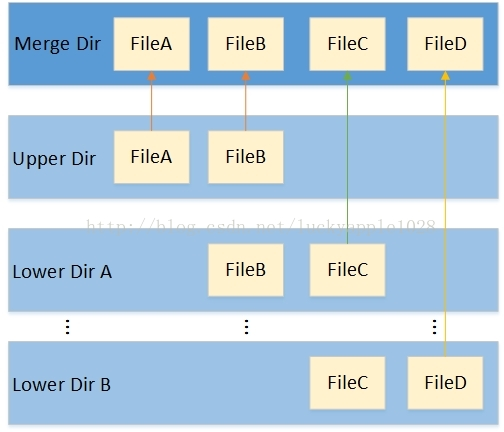

其中lower dirA / lower dirB目录和upper dir目录为来自底层文件系统的不同目录，用户可以自行指定，内部包含了用户想要合并的文件和目录，merge dir目录为挂载点。当文件系统挂载后，在merge目录下将会同时看到来自各lower和upper目录下的内容，并且用户也无法（无需）感知这些文件分别哪些来自lower dir，哪些来自upper dir，用户看见的只是一个普通的文件系统根目录而已（lower dir可以有多个也可以只有一个）。

虽然overlayfs将不同的各层目录进行合并，但是upper dir和各lower dir这几个不同的目录并不完全等价，存在层次关系。首先当upper dir和lower dir两个目录存在同名文件时，lower dir的文件将会被隐藏，用户只能看见来自upper dir的文件，然后各个lower dir也存在相同的层次关系，较上层屏蔽叫下层的同名文件。除此之外，如果存在同名的目录，那就继续合并（lower dir和upper dir合并到挂载点目录其实就是合并一个典型的例子）。

各层目录中的upper dir是可读写的目录，当用户通过merge dir向其中一个来自upper dir的文件写入数据时，那数据将直接写入upper dir下原来的文件中，删除文件也是同理；而各lower dir则是只读的，在overlayfs挂载后无论如何操作merge目录中对应来自lower dir的文件或目录，lower dir中的内容均不会发生任何的改变（理论设计如此，但实际在一些极端场景存在偏差，后面我会详细介绍）。既然lower dir是只读的，那当用户想要往来自lower层的文件添加或修改内容时，overlayfs首先会的拷贝一份lower dir中的文件副本到upper dir中，后续的写入和修改操作将会在upper dir下的copy-up的副本文件中进行，lower dir原文件被隐藏。

以上就是overlayfs最基本的特性，简单的总结为以下3点：

（1）上下层同名目录合并；

（2）上下层同名文件覆盖；

（3）lower dir文件写时拷贝。

这三点对用户都是不感知的。

### 应用


基本了解overlayfs的基本特性以后，来了解overlayfs特性所带来的好处和应用场景。在实际的使用中，我们可能会存在以下的多用户复用共享文件和目录的场景。如下图：

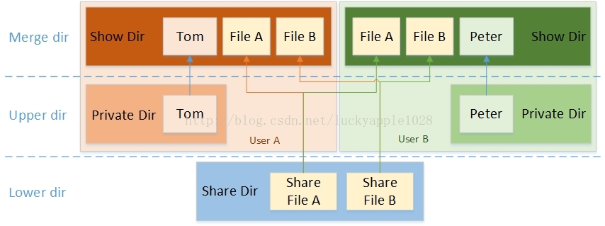

在同一个设备上，用户A和用户B有一些共同使用的共享文件（例如运行程序所依赖的动态链接库等），一般是只读的；同时也有自己的私有文件（例如系统配置文件等），往往是需要能够写入修改的；最后即使用户A修改了被共享的文件也不会影响到用户B。

对于以上的需求场景，我们并不希望每个用户都有一份完全一样的文件副本，因为这样不仅带来空间的浪费也会影响性能，因此overlayfs是一个较为完美的解决方案。我们将这些共享的文件和目录所在的目录设定为lower dir (1~n)，将用户私有的文件和目录所在的目录设定为upper dir，然后挂载到用户指定的挂载点，这样即能够保证前面列出的3点需求，同时也能够保证用户A和B独有的目录树结构。最后最为关键的是用户A和用户B在各自挂载目录下看见的共享文件其实是同一个文件，这样磁盘空间的节省自是不必说了，还有就是共享同一份cache而减少内存的使用和提高访问性能，因为只要cache不被回收，只需某个用户首次访问时创建cache，后续其他所有用户都可以通过访问cache来提高IO性能。

上面说的这种使用场景在容器技术中应用最为广泛，下面以docker容器为例来介绍overlay的两种应用方式：Overlay和Overlay2.

Docker容器将镜像层（image layer）作为lower dir，将容器层（container layer）作为upper dir，最后挂载到容器merge挂载点，即容器的根目录下。遗憾的是，早期内核中的overlayfs并不支持多lower layer，在Linux-4.0以后的内核版本中才陆续支持完善。而容器中可能存在多层镜像，所以出现了两种overlayfs的挂载方式，早期的overlay不使用多lower layer的方式挂载而overlay2则使用该方式挂载。

#### 1. Overlay Driver

Overlay挂载方式如下图。（该图引用自Miklos Szeredi的《overlayfs and containers》2017 linux内核大会演讲材料）。


本图黄色框中的部分是镜像层和容器层的组织方式，各个镜像层中，每下一层中的文件以硬链接的方式出现在它的上一层中，以此类推，最终挂载overlayfs的lower dir为最上层镜像层目录imager layer N。与此同时，容器的writable dir作为upper dir，挂载成为容器的rootfs。本图中虽然只描述了一个容器的挂载方式，但是其他容器也类似，镜像层lower dir N共享，只是各个容器的upper dir不同而已。

#### 2. Overlay2 Driver

Overlay2挂载方式如下图（该图引用自Miklos Szeredi的《overlayfs and containers》2017 linux内核大会演讲材料）


Overlay2的挂载方式比Overlay的要简单许多，它基于内核overlayfs的Multiple lower layers特性实现，不在需要硬链接，直接将镜像层的各个目录设置为overlayfs的各个lower layer即可（Overlayfs最多支持500层lower dir），对比Overlay Driver将减少inode的使用。

### 注意事项

尽管Overlayfs看起来是这么的优秀，但是当前它还并不是那么的完美，依然存在一些缺点和使用限制（还没有完全支持POSIX标准），这里简单列出一些，先认识一下，以后遇到也能心中有数：

1. Mount Overlayfs之后就不允许在对原lower dir和upper dir进行操作

当我们挂载完成overlayfs以后，对文件系统的任何操作都只能在merge dir中进行，用户不允许再直接或间接的到底层文件系统的原始lower dir或upper dir目录下修改文件或目录，否则可能会出现一些无法预料的后果（kernel crash除外）。

2. Copy-up

Overlayfs的lower layer文件写时复制机制让某一个用户在修改来自lower层的文件不会影响到其他用户（容器），但是这个文件的复制动作会显得比较慢，后面我们会看到为了保证文件系统的一致性，这个copy-up实现包含了很多步骤，其中最为耗时的就是文件数据块的复制和fsync同步。用户在修改文件时，如果文件较小那可能不一定能够感受出来，但是当文件比较大或一次对大量的小文件进行修改，那耗时将非常可观。虽然自Linux-4.11起内核引入了“concurrent copy up”特性来提高copy-up的并行性，但是对于大文件也还是没有明显的效果。不过幸运的是，如果底层的文件系统支持reflink这样的延时拷贝技术（例如xfs）那就不存在这个问题了。

3. Rename directory（POSIX标准支持问题）

如果Overlayfs的某一个目录是单纯来自lower layer或是lower layer和upper layer合并的，那默认情况下，用户无法对该目录执行rename系统调用，否则会返回-EXDEV错误。不过你会发现通过mv命令重命名该目录依然可以成功，那是因为mv命令的实现对rename系统调用的-EXDEV错误进行规避（这当然是有缺点的，先暂不展开）。在Linux-4.10起内核引入了“redirect dir”特性来修复这个问题，为此引入了一个内核选项：CONFIG_OVERLAY_FS_REDIRECT_DIR，用户想要支持该特性可以在内核中开启这个选项，否则就应避免对这两类目录使用rename系统调用。

4. Hard link break（POSIX标准支持问题）

该问题源自copy-up机制，当lower dir目录中某个文件拥有多个硬链接时，若用户在merge layer对其中一个写入了一些数据，那将触发copy-up，由此该文件将拷贝到upper dir，那么和原始文件的hard link也就断开了，变成了一个单独的文件，用户在merge layer通过stat和ls命令能够直接看到这个变化。在Linux-4.13起内核引入了“index feature”来修复这个问题，同样引入了一个内核选项：CONFIG_OVERLAY_FS_INDEX，用户想要修复该问题可以打开这个选项，不过该选项不具有向前兼容性，请谨慎使用。

5. Unconstant st_dev&st_ino（POSIX标准支持问题）

该问题同样源自copy-up机制，当原来在lower dir中的文件触发了copy-up以后，那用户在merge layer见到了将是来自upper dir的新文件，那也就意味着它俩的inode是不同的，虽然inode中很多的attr和xattr是可以copy的，但是st_dev和st_ino这两个字段却具有唯一性，是不可以复制的，所以用户可以通过ls和stat命令看到的该字段将发生变化。在Linux-4.12和Linux-4.13分别进行了部分的修复，目前在lower dir和upper dir都在同一个文件系统挂载点的场景下，问题已经修复，但lower dir和upper dir若来自不同的文件系统，问题依然存在。

6. File descriptor change（POSIX标准支持问题）

该问题也同样源自copy-up机制，用户在文件发生copy-up之前以只读方式open文件（这操作不会触发copy-up）得到的文件描述符fd1和copy-up之后open文件得到的文件描述符fd2指向不同的文件，用户通过fd2写入的新数据，将无法从fd1中获取到，只能重新open一个新的fd。该问题目前社区主线内核依然存在，暂未修复。

以上这6点列出了目前Overlayfs的主要问题和限制，将在后文中陆续展开。社区为了让Overlayfs能够更加向支持Posix标准的文件系统靠拢，做出了很多的努力，后续将进一步修复上面提到且未修复的问题，还会增加对NFS Export、freeze snapshots、overlayfs snapshots等的支持，进一步完善overlayfs。

### 小结

Overlayfs在以它特有的机制已经使用的越来越广泛，在Docker容器技术中以它优异的性能将会渐渐成为首选。不过overlayfs也尚存诸多限制，到目前为止，它还不是一个完全符合Posix规范的文件系统，但社区的开发人员们一直在努力完善，相信不久的将来我们会看到一个非常易用且成熟的Overlayfs。

## 二、使用与原理分析

在初步了解overlayfs用途之后，本文将介绍如何使用overlayfs以及理解该文件系统所特有的一些功能特性。由于目前主线内核对overlayfs正在不断的开发和完善中，因此不同的内核版本改动可能较大，本文尽量与最新的内核版本保持一致，但可能仍会存在细微的出入。

### 挂载文件系统

(Ubuntu18.04)挂载文件系统的基本命令如下：

```
mount -t overlay overlay -o lowerdir=lower1:lower2:lower3,upperdir=upper,workdir=work merged
```

or

```
sudo mount --source overlay -t overlay --target merged -o lowerdir=lower1:lower2:lower3,upperdir=upper,workdir=work
```

其中"lower1:lower2:lower3"表示不同的lower层目录，不同的目录使用":"分隔，层次关系依次为lower1 > lower2 > lower3（注：多lower层功能支持在Linux-4.0合入，Linux-3.18版本只能指定一个lower dir）；然后upper和work目录分别表示upper层目录和文件系统挂载后用于存放临时和间接文件的工作基目录（work base dir），最后的merged目录就是最终的挂载点目录。若一切顺利，在执行以上命令后，overlayfs就成功挂载到merged目录下了。

挂载选项支持（即"-o"参数）：

1）lowerdir=xxx：指定用户需要挂载的lower层目录（支持多lower，最大支持500层）；

2）upperdir=xxx：指定用户需要挂载的upper层目录；

3）workdir=xxx：指定文件系统的工作基础目录，挂载后内容会被清空，且在使用过程中其内容用户不可见；

4）default_permissions：功能未使用；

5）redirect_dir=on/off：开启或关闭redirect directory特性，开启后可支持merged目录和纯lower层目录的rename/renameat系统调用；

6）index=on/off：开启或关闭index特性，开启后可避免hardlink copyup broken问题。

其中lowerdir、upperdir和workdir为基本的挂载选项，redirect_dir和index涉及overlayfs为功能支持选项，除非内核编译时默认启动，否则默认情况下这两个选项不启用，这里先按照默认情况进行演示分析，后面这两个选项单独说明。

示例：现在以ext4文件系统作为基础文件系统挂载overlayfs。首先创建overlayfs文件系统的基础目录5个，然后分别在两个lower目录和upper目录下创建不同文件foo1、foo2和foo3，最后在这3个目录下分别创建同名目录dir并同时在dir目录下创建同名文件aa和bb。在挂载overlayfs文件系统之后，在merge目录下能够看到foo1、foo2和foo3，这就是overlayfs的上下层合并；在merge/dir目录下看到来自lower1的文件和aa来自upper层的文件bb，位于最底层lower2中的文件aa被lower1中的同名文件覆盖，位于lower1中的文件bb被upper中的同名文件覆盖，这就是overlayfs的“上下层同名目录合并与同名文件覆盖”特性，对应的组织结构如下图所示：

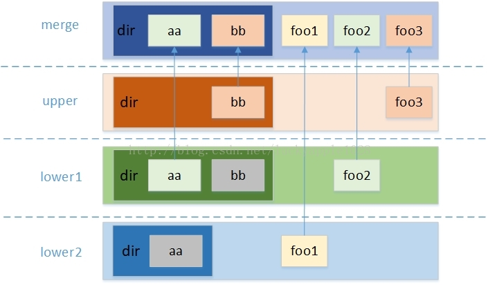

上下层同名文件覆盖和上下层同名目录合并的原理：

用户在overlayfs的merge目录中查看文件时，会调用内核的getdents系统调用。一般情况下该系统调用会调用文件系统接口，它仅会遍历当前目录中的所有目录项并返回给用户，所以用户能够看到这个目录下的所有文件或子目录。但在overlayfs中，如果目录不是仅来自单独的一层（当前时多层合并的或者其中可能存在曾经发生过合并的迹象），它会逐级遍历扫描所有层的同名目录，然后把各层目录中的内容返回给用户，因此用户就会感觉到上下层同名目录合并；与此同时，如果在遍历扫描的过程中发现了同名的文件，它会判断该文件来自那一层，从而忽略来自lower层的文件而只显示来自upper层的文件，因此用户会感觉到上下层同名文件覆盖。

挂载文件系统的特性与限制条件：

1、用户可以不指定upperdir和workdir，但同时必须保证lowerdir >= 2层，此时的文件系统为只读挂载（这也是只读挂载overlayfs的唯一方法）；如果用户指定upperdir，则必须保证upperdir所在的文件系统是可读写的，同时还需指定workdir，并且workdir不能和upperdir是父子目录关系。

2、常见的文件系统中，upperdir所在的文件系统不能是nfs、cifs、gfs2、vfat、ocfs2、fuse、isofs、jfs和另一个overlayfs等文件系统，而lowerdir所在的文件系统可以是nfs、cifs这样的远程文件系统，也可以是另一个overlayfs。因为upperdir是可以写入的，所以需要避免一些特性上的不兼容（例如vfat是大小写不敏感的文件系统），而lowerdir是只读文件系统，相对要求会低一些。

3、用户应该尽量避免多个overlayfs使用同一个upperdir或workdir，尽管默认情况下是可以挂载成功的，但是内核还是会输出告警日志来提示用户。

4、用户指定的lowerdir最多可以支持500层。虽然如此，但是由于mount的挂载选项最多支持1个page的输入（默认大小为4KB），所以如果指定的lowerdir数量较多且长度较长，会有溢出而导致挂载失败的风险（目前内核的-o挂载选项不支持超过1个内存页，即4KB大小）。

5、指定的upperdir和workdir所在的基础文件系统的readdir接口需要支持dtype返回参数，否则将会导致本应该隐藏的whiteout文件（后文介绍）暴露，当然目前ext4和xfs等主流的文件系统都是支持的，如果不支持那内核会给出警告提示但不会直接拒绝挂载。

6、指定的upperdir和workdir所在的基础文件系统需要支持xattr扩展属性，否则在功能方面会受到限制，例如后面的opaque目录将无法生成，并且redirect dir特性和index特性也无法使用。

7、如果upperdir和各lowerdir是来自同一个基础文件系统，那在文件触发copyup前后，用户在merge层通过ls命令或stat命令看到的Device和inode值保持不变，否则会发生改变。


### 删除文件和目录

删除文件和目录，看似一个简单的动作，对于overlayfs实现却需要考虑很多的场景且分很多步骤来进行。下面来分以下几个场景开分别讨论：

（1）要删除的文件或目录来自upper层，且lower层中没有同名的文件或目录

这种场景比较简单，由于upper层的文件系统是可写的，所有在overlayfs中的操作都可以直接体现在upper层所对应的文件系统中，因此直接删除upper层中对应的文件或目录即可。

（2）要删除的文件或目录来自lower层，upper层不存在覆盖文件

由于lower层中的内容对于overlayfs来说是只读的，所以并不能像之前那样直接删除lower层中的文件或目录，因此需要进行特殊的处理，让用户在删除之后即不能正真的执行删除动作又要让用户以为删除已经成功了。

Overlayfs针对这种场景设计了一套“障眼法”——**Whiteout文件**。Whiteout文件在用户删除文件时创建，用于屏蔽底层的同名文件，同时该文件在merge层是不可见的，所以用户就看不到被删除的文件或目录了。

whiteout文件并非普通文件，而是主次设备号都为0的字符设备（可以通过`mknod <name> c 0 0`命令手动创建），当用户在merge层通过ls命令（将通过readddir系统调用）检查父目录的目录项时，overlayfs会自动过过滤掉和whiteout文件自身以及和它同名的lower层文件和目录，达到了隐藏文件的目的，让用户以为文件已经被删除了。

3）要删除的文件是upper层覆盖lower层的文件，要删除的目录是上下层合并的目录

该场景就理论上来讲其实是前两个场景的合并，overlayfs即需要删除upper层对应文件系统中的文件或目录，也需要在对应位置创建同名whiteout文件，让upper层的文件被删除后不至于lower层的文件被暴露出来。

### 创建文件和目录

创建文件和目录同删除类似，overlayfs也需要针对不同的场景进行不同的处理。下面分以下几个场景进行讨论：

1）全新的创建一个文件或目录

这个场景最为简单，如果在lower层中和upper层中都不存在对应的文件或目录，那直接在upper层中对应的目录下新创建文件或目录即可。

2）创建一个在lower层已经存在且在upper层有whiteout文件的同名文件

该场景对应前文中的场景2或场景3，在lower层中之前已经存在同名的文件或目录了，同时upper层也有whiteout文件将其隐藏（显然是通过merge层删除它了），所以用户在merge层看不到它们，可以新建一个同名的文件。这种场景下，overlayfs需要删除upper层中的用新建的文件替换原有的whiteout文件，这样在merge层中看到的文件就是来自upper层的新文件了。

3）创建一个在lower层已经存在且在upper层有whiteout文件的同名目录

该场景和场景2的唯一不同是将文件转换成目录，即原lower层中存在一个目录，upper层中存在一个同名whiteout文件用于隐藏它（同样的，它是之前被用户通过merge层删除了的），然后用户在merge层中又重新创建一个同名目录。依照overlayfs同名目录上下层合并的理念，如果此处不做任何特殊的处理而仅仅是在upper层中新建一个目录，那原有lower层该目录中的内容会暴露给用户。因此，overlayfs针对这种情况引入了一种属性——**Opaque属性**，它是通过在upper层对应的目录上设置`trusted.overlay.opaque`扩展属性值为`y`来实现（所以这也就需要upper层所在的文件系统支持xattr扩展属性），overlayfs在读取上下层存在同名目录的目录项时，如果upper层的目录被设置了opaque属性，它将忽略这个目录下层的所有同名目录中的目录项，以保证新建的目录是一个空的目录。如下图所示：

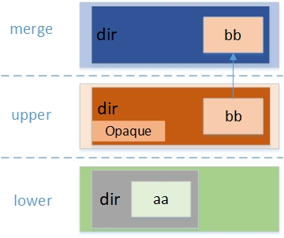

### 写时复制（copy-up）特性

用户在写文件时，如果文件来自upper层，那直接写入即可。但是如果文件来自lower层，由于lower层文件无法修改，因此需要先复制到upper层，然后再往其中写入内容，这就是overlayfs的写时复制（copy-up）特性。

当然，overlayfs的copy-up特性并不仅仅在往一个来自lower层的文件写入新内容时触发，还有很多的场景会触发，简单总结如下：

1）用户以写方式打开来自lower层的文件时，对该文件执行copyup，即open()系统调用时带有O_WRITE或O_RDWR等标识；

2）修改来自lower层文件或目录属性或者扩展属性时，对该文件或目录触发copyup，例如chmod、chown或设置acl属性等；

3）rename来自lower层文件时，对该文件执行copyup；

4）对来自lower层的文件创建硬链接时，对链接原文件执行copyup；

5）在来自lower层的目录里创建文件、目录、链接等内容时，对其父目录执行copyup；

6）对来自lower层某个文件或目录进行删除、rename、或其它会触发copy-up的动作时，其对应的父目录会至下而上递归执行copy-up。

### Rename文件和目录

用户在使用mv命令移动或rename文件时，mv工具首先会尝试调用rename系统调用直接由内核完成文件的renmae操作，但对于个别文件系统内核如果不支持rename系统调用，那由mv工具代劳，它会首先复制一个一模一样的文件到目标位置，然后删除原来的文件，从而模拟达到类似的效果，但是这有一个很大的缺点就是无法保证整个rename过程的原子性。

对于overlayfs来说，文件的rename系统调用是支持的，但是目录的rename系统调用支持需要分情况讨论。前文中看到在挂载文件系统时，内核提供了一个挂载选项"redirect_dir=on/off"，默认的启用情况由内核的OVERLAY_FS_REDIRECT_DIR配置选项决定。在未启用情况下，针对单纯来自upper层的目录是支持rename系统调用的，而对于来自lower层的目录或是上下层合并的目录则不支持，rename系统调用会返回-EXDEV，由mv工具负责处理；在启用的情况下，无论目录来自那一层，是否合并都将支持rename系统调用，但是该特性非向前兼容，目前内核中默认是关闭的，用户可手动开启。

### 原子性保证（Workdir）

前文中介绍了文件目录的创建、删除和rename等操作以及写时复制特性，描述了overlayfs处理这些操作的细节，但是有一点还没有提到，那就是overlayfs是如何保证这些操作的原子性的。例如，当用户在删除上下层都存在的文件时，overlayfs需要删除upper层的文件然后创建whiteout文件来屏蔽lower层的文件，想要创建同名文件必然需要先删除原有的文件，这删除和创建分为两个步骤，如何做到原子性以保证文件系统的一致性？我们当然不希望见到文件删除了但是whiteout文件却没有创建的情况。又例如用户在触发copyup的时候，文件并不可能在一瞬间就完整的拷贝到upper层中，如果系统崩溃，那在恢复后用户看到的就是一个被损坏的文件，也同样需要保证原子性。

对于这个问题，我们来关注前面挂载文件系统指定的workdir目录，在挂载文件系统后该目录下会创建一个为空的work目录，这个目录就是原子性保证的关键所在，下面针对不同的场景来分析overlayfs是如何使用这个目录的。

1）删除upper层文件/目录并创建whiteout的过程

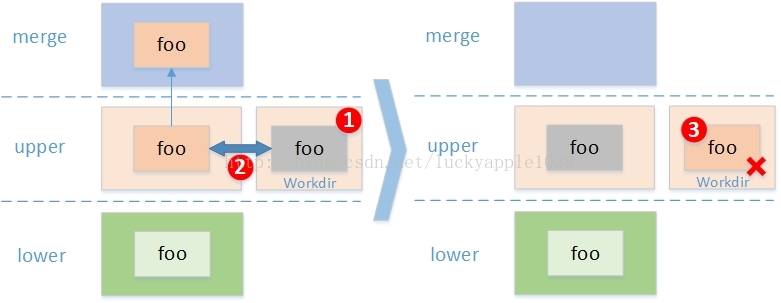

如上图所示，以文件为例，若用户删除删除文件foo，overlayfs首先（1）在workdir目录下创建用于覆盖lower层中foo文件的whiteout文件foo，然后（2）将该文件与upper中的foo文件进行rename（对于目录则为exchange rename），这样两个文件就原子的被替换了（原子性由基础文件系统保证），即使此时系统崩溃或异常掉电，磁盘上的基础文件系统中也只会是在work目录中多出了一个未被及时删除的foo文件而已（实际命名并不是foo而是一个以#开始的带有序号的文件，此处依然称之为foo是为了为了便于说明），并不影响用户看到的目录，当再次挂载overlayfs时会在挂载阶段被清除，最后（3）将work目录中的foo文件删除，这样整个upper层中的foo文件就被“原子”的删除了。

2）在whiteout上创建同名文件/目录的过程

该过程与删除类似，只是现在在upper层中的是whiteout文件，而在work目录中是新创建的文件，workdir的使用流程基本一致，不再赘述。

3）删除上下层合并目录的过程

由于上下层合并的目录中可能存在whiteout文件，因此在删除之前需要保证要删除的upper层目录是空的，不能有whiteout文件。

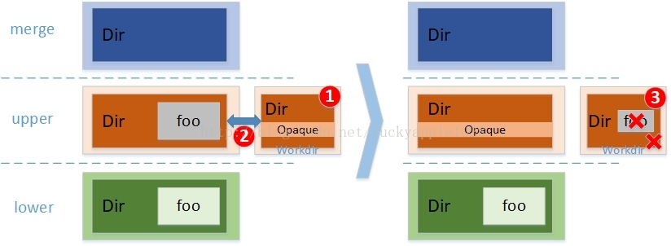

如图所示，在用户删除“空”目录Dir时，其实在upper层中Dir目录下存在一个foo的whiteout文件，因此不能直接立即通过场景1的方式进行删除。首先（1）在work目录下创建一个opaque目录，然后（2）将该目录和upper层的同名目录进行exchange rename，这样upper层中的Dir目录就变成了一个opaque目录了，它将屏蔽底层的同名Dir目录。最后（3）将workdir下的Dir目录里的whiteout文件全部清空后再删除Dir目录本身。这样就确保了Dir目录中不存在whiteout文件了，随后的步骤就同场景一一样了。需要注意的是，这一些列的流程其实对于upper层来说，包含了（1）原始目录（2）opaque目录（3）whiteout文件的这3个状态，该过程并不是原子的，但在用户看来只有两种状态，一是删除成功，此时upper层已经变成状态3，还有一种是未删除，对应upper层是状态1或状态2，所以中间的opaque目录状态并不会影响文件系统对用户的输出，依然能够保证文件系统的一致性。

4）文件/目录copyup的过程

在件的copyup过程中由于文件没有办法在一个原子操作中完成的拷贝到upper层中的对应目录下（不仅仅是数据拷贝耗时，还包含文件属性和扩展属性的拷贝动作），所以这里同样用到了work目录作为中转站。

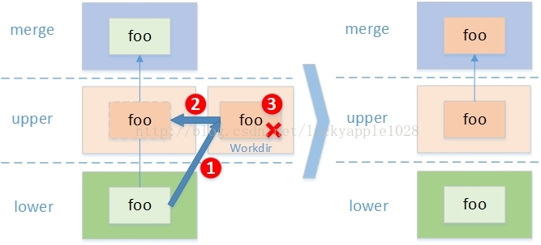

这里以文件copyup为例，首先（1）根据基础文件系统时候支持tempfile功能（将使用concurrent copy up来提升并发copyup的效率），若支持则在work目录下创建一个临时tmpfile，否则则创建一个真实foo文件，然后从lower层中的foo文件中拷贝数据、属性和扩展属性到这个文件中，接下来（2）若支持tempfile则将该temp文件链接到upper目录下形成正真的foo文件，否则在upper目录下创建一个空的dentry并通过rename将work目录下的文件转移到upper目录下（原子性由基础层文件系统保证），最后（3）释放这个临时dentry。至此，由于非原子部分全部在work目录下完成，所以文件系统的一致性得到保证。另外，这里还需要说明的一点是，如果基础层的文件系统支持flink，则此处的步骤1中的数据拷贝将使用cloneup功能，不用再大量复制数据块，copyup的时间可以大幅缩短。

### Origin扩展属性和Impure扩展属性

Overlayfs一共有5中扩展属性，前文中已经看到了opaque和redirect dir这两种扩展属性，这里介绍origin和impure扩展属性，这两种扩展属性最初是为了解决文件的st_dev和st_ino值在copyup前后发生变化问题而设计出来的。其中origin扩展属性全称为"trusted.overlay.origin"，保存的值为lower层原文件经过内核封装后的数据结构进行二进制值转换为ASCII码而成，设置在upper层的copyup之后的文件上，现在只需要知道overlayfs可以通过它获取到该文件是从哪个lower层文件copyup上来的即可。另一个impure扩展属性的全程为"trusted.overlay.impure"，它仅作用于目录，设置在upper层中的目录上，用于标记该目录中的文件曾经是从底层copyup上来的，而不是一个纯粹来自upper层的目录。

下面以一个简单的示例展示它们是如何保证st_ino的一致性的：

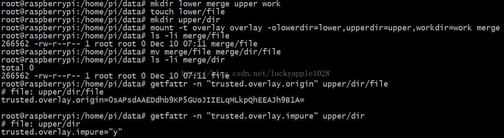

这里首先在lower目录下创建一个文件file，并在upper目录下创建目录dir，在挂载文件系统之后使用mv命令在merge目录中将文件file rename到目录dir下，这样就触发了文件file的copyup，此后用户看到的文件将来自upper/dir目录，但它的inode值在mv前后并没有发生任何变化。这就得归功于upper/dir/file上的origin属性和upper/dir目录上的impure扩展属性了，它为下图中的两个场景做了区分：

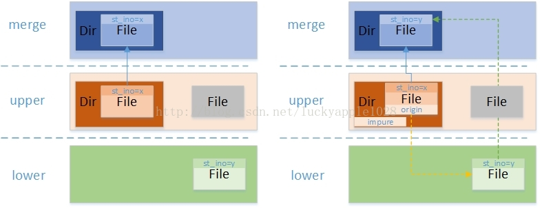

上图中左边的场景，upper目录下的Dir目录和File文件在挂载之前就已存在，它们没有origin和impure扩展属性，在用户查询目录项时，overlayfs将直接返回upper目录下file文件的st_ino值。而上图中右边的场景就是示例中构造的场景，upper/Dir/File文件从lower目录中copyup上来，此时为了保证st_ino的一致性，所以st_ino值还必须给用户显示lower目录中file文件的st_ino，因此File文件上的origin扩展属性使得overlayfs可以通过它找到lower/File并返回它的st_ino值，而DIr文件上的impure扩展属性也会使得即使目录并不是上下层合并的，也会强制其在扫描目录项时去获取可能存在的origin st_ino值。

最后总结一下哪些场景会设置和使用origin和impure扩展属性：

1）在触发文件或目录copyup时会设置origin属性，注意文件不能为多硬链接文件（启动index特性除外，下一节细述），因为这样会导致多个不同的upper层文件的origin属性指向同一个lower层原始inode，从而导致st_ino重复的问题。

2）在启动index属性之后，在挂载文件系统时会检查并设置upper层根目录的origin扩展属性指向顶层lower根目录，同时检查并设置index目录的origin扩展属性指向upper层根目录。

3）在overlayfs查找文件（ovl_lookup）时会获取origin扩展属性，找到lower层中的原始inode并和当前inode进行绑定，以便后续保证st_ino一致性时使用。

4）在upper层目录下有文件或子目录发生copyup、rename或链接一个origined的文件，将对该目录设置impure扩展属性。

5）在遍历目录项时，如果检测到目录带有impure扩展属性，在扫描其中每一个文件时，都需要检测origin扩展属性并尝试获取和更新lower层origin文件的st_ino值。

### Index特性

前文中看到overlayfs还提供了一个挂载选项“index=on/off”，可以通过勾选内核选项OVERLAY_FS_INDEX默认开启，该选项和redirect dir选项一样也不是向前兼容的。该选项在Linux-4.13正式合入内核，目前该选项的功能还在不断开发中，目前用于解决lower层硬链接copyup后断链问题，后续还会用于支持overlayfs提供NFS export和snapshot的功能。我们首先来分析index属性是如何修复硬链接断链的问题，然后再看一下开启index属性之后overlayfs会哪些变化。

1）Hard link break问题

设想以下场景，在lower层中有一个文件有2个硬链接，分别为FileA、FileB和FileC，它们共享同一个inode，如下图所示：

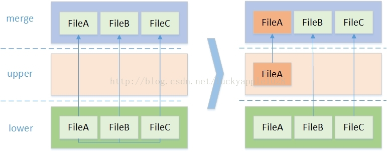

此时若其中一个hardlink FileA发生了copyup，则FileA将成为一个单独的文件展现给用户，而FileB和FileC还将是硬链接的关系。具体示例如下：

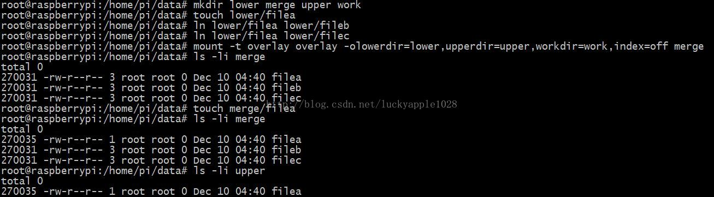

首先在lower目录下创建filea，然后依次为它创建硬链接fileb和filec。在挂载overlayfs之后，在merge层中可以看到它们的inode号都为270031，且链接数为3。在执行touch命令触发了filea文件的copyup之后，在merge目录中的filea文件将源自upper目录，它的inode和upper目录中的一致，且链接数为1，同时fileb和filec的链接数依然为3。

更进一步，如果此时删除filea或是在触发copyup之前就删除filea，那结果会是如何？显然不会得到一个满足一致性的结果，这里就不详细演示了，这个问题很明显是不满足POSIX标准的。下面来看启动index属性之后，硬链接文件的copyup过程与结果会有哪些变化：

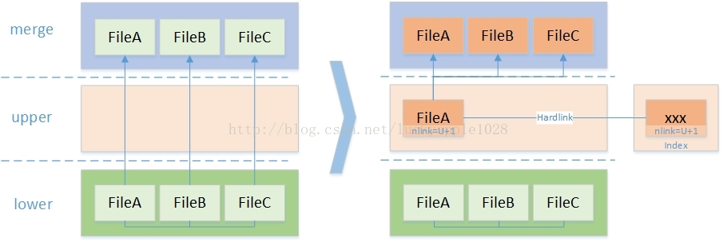

在开启index属性后，在挂载文件系统时会在用户指定的workdir目录下创建一个名为index的目录用于存放链接文件（同work目录平级），这些链接文件的名字和origin扩展属性一样是以内核数据结构按照二进制ASCII码转换形成，并不是文件的原始名字。当前场景中，当用户触发copyup后，首先的一点区别就是复制的位置不再是upper层的parent目录而是index目录，overlayfs先按照标准的copyup流程将FileA文件copyup到index目录下，文件名为一串二进制数据，可暂时不用关心；随后对该文件进行链接，链接文件FileA到正确的目的位置，最后为FileA文件设置"trusted.overlay.nlink"扩展属性值为"U+1"（这是overlayfs 5种扩展属性中的最后一种），其含义就是在merge层向用户展现链接数时使用upper层对应inode的链接数值并+1（当然也会出现其他数值和+-的情况），而此时在upper层中的FileA文件的链接数为2，因此最终展现给用户的链接数为3，与copyup之前保持一致。实际示例如下：

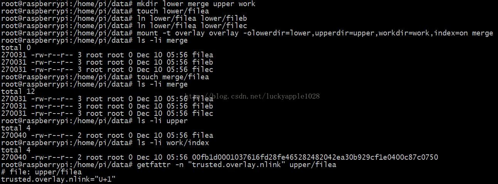

对照之前没有启用index属性的示例，此时在copyup前后merge目录中的内容完全一致。同时观察index目录创建了一个“名字古怪”的文件，它和upper目录中的filea文件为硬链接关系，链接数为2，最后查看upper目录中的filea文件的"trusted.overlay.nlink"扩展属性值为"U+1"。
2）Index属性开启后对overlay发生的变化

2.1）文件系统挂载时的变化：

（1）明确一个upperdir或workdir无法同时被多个overlayfs所使用，若被复用不再仅仅是内核输出告警日志，而是会拒绝挂载，因为潜在的并发操作会影响index属性对overlayfs的一致性从而导致不可预期的结果。

（2）要求所有的underlaying文件系统都必须支持export_operations接口，若upperdir所在的文件系统不支持会给出告警（暂时没有使用该功能所以不强制），而各lowerdir所在的文件系统若不支持则直接拒绝挂载。

（3）如果一套lowerdir、upperdir和workdir已经配套挂载过一次overlayfs，那之后的挂载也必须和之前的配套，否则拒绝挂载，原因是index属性的开启很可能之前一次挂载时设置的origin xattr扩展属性已经固化，若后续挂载不配套则会导致origin xattr变得无效而出现不可预期的结果（通过upper根目录和index目录的origin扩展属性进行验证）。

2.2）硬链接文件的copyup变化：

（1）硬链接文件在copyup时首先copyup到index目录，然后再link到目标目录，同时会在copyup后的文件中设置nlink扩展属性用于计算文件的硬链接数；

（2）硬链接文件在copyup时被可以被设置origin属性，因为此时由于已经解决了硬链接文件断链问题，不存在多个upper层文件origin属性指向同一个lower层原始inode的问题了；

（3）在创建硬链接和删除硬链接文件时，会触发重新计算和设置nlink值。

### 约束与限制

由于overlayfs依赖与底层的基础文件系统，它的工作方式也也和普通的磁盘文件系统存在着很大的不同，同时在挂载overlayfs之后，基础层的目录对用户也是可见的，为了避免文件系统的不一致，overlayfs强烈建议用户在挂载文件系统之后不同步操作基础层的目录及其中的内容。与此同时，在overlayfs在被umount的时候，也应该尽量避免手动调整其中的whiteout文件或扩展属性，否则当文件系统再次挂载后，其状态和一致性很可能会和预期的不同，甚至出现报错。

### 小结

本文介绍了目前overlayfs的常用使用方法和背后的原理与实现原理，包括文件系统的挂载、增删文件和目录等操作，详细描述了文件系统的上下层同名目录合并、同名文件覆盖和文件写时复制3大基本功能，opaque、redirect dir、origin、impure和nlink 5种扩展属性，以及redirect dir和index这两项附加特性。下一篇博文将对其中比较关键的点更进一步细化，从源码的角度分析其中的实现细节。

参考文献

1. <overlayfs and containers> by Miklos Szeredi.

2. Documentation/filesystems/overlayfs.txt

3. Linux kernel source code

--------------------- 
作者：luckyapple1028 
来源：CSDN 
原文：https://blog.csdn.net/luckyapple1028/article/details/77916194 
版权声明：本文为博主原创文章，转载请附上博文链接！

