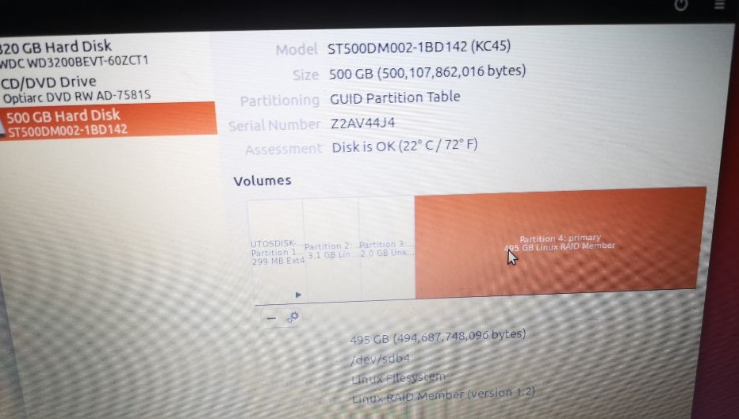

## 读取RAID1硬盘分区中的文件

> 2020.04.12

手头上有个TerraMaster的NAS（仅两盘位，做的RAID1），从中拿出一块硬盘。挂载到windows中，无法直接识别分区文件系统。

挂载到Linux系统中，显示硬盘分区信息如下：



Ubuntu自带的disks软件中显示存在一个`Linux RAID Member (version 1.2)`的分区,但是Linux系统也无法直接读取分区中的文件。

搜索后发现，可以使用`mdadm`和`lvm2`软件来解决。

### 1. 查看物理磁盘信息

```
sudo fdisk -l

Disk /dev/sda: 298.1 GiB, 320072933376 bytes, 625142448 sectors
Units: sectors of 1 * 512 = 512 bytes
Sector size (logical/physical): 512 bytes / 512 bytes
I/O size (minimum/optimal): 512 bytes / 512 bytes
Disklabel type: dos
Disk identifier: 0x95343d1c

Device     Boot     Start       End   Sectors   Size Id Type
/dev/sda1  *           63 213519039 213518977 101.8G  7 HPFS/NTFS/exFAT
/dev/sda2       213520384 215535615   2015232   984M 27 Hidden NTFS WinRE
/dev/sda3       215537664 420337663 204800000  97.7G  7 HPFS/NTFS/exFAT
/dev/sda4       420339710 625141759 204802050  97.7G  5 Extended
/dev/sda5       420339712 620955647 200615936  95.7G 83 Linux
/dev/sda6       620957696 625141759   4184064     2G 82 Linux swap / Solaris


Disk /dev/sdb: 465.8 GiB, 500107862016 bytes, 976773168 sectors
Units: sectors of 1 * 512 = 512 bytes
Sector size (logical/physical): 512 bytes / 4096 bytes
I/O size (minimum/optimal): 4096 bytes / 33553920 bytes
Disklabel type: gpt
Disk identifier: 6EC760CF-1C95-4210-A6BF-48C8D419AF4C

Device        Start       End   Sectors   Size Type
/dev/sdb1      2048    585727    583680   285M Linux filesystem
/dev/sdb2    585728   6586367   6000640   2.9G Linux filesystem
/dev/sdb3   6586368  10586111   3999744   1.9G Linux filesystem
/dev/sdb4  10586112 976773119 966187008 460.7G Linux filesystem

```

可以看到电脑上有两块硬盘，第二块就是我们组成RAID1的其中一块硬盘。


### 2. 安装`mdadm`软件

```
$ sudo apt install mdadm
```

安装完成后，可以使用如下命令挂载RAID磁盘中的数据分区

```
$ sudo mdadm --assemble --run /dev/md0 /dev/sdb4
mdadm: /dev/md0 has been started with 1 drive (out of 2).
```

挂载成功后，如果直接使用`mount`命令会出现如下错误：

```
$ sudo mount /dev/md0 tmp/
mount: unknown filesystem type 'LVM2_member'
```

如果你想卸载`mdadm`挂载的分区，可以使用如下命令：

```
$ sudo mdadm --stop /dev/md0
mdadm: stopped /dev/md0
```

Reference: https://serverfault.com/questions/383362/mount-unknown-filesystem-type-linux-raid-member

### 3. 安装`lvm2`软件

```
$ sudo apt install lvm2
```

安装完成后，查看磁盘信息。

```
$ sudo lvdisplay
  /run/lvm/lvmetad.socket: connect failed: No such file or directory
  WARNING: Failed to connect to lvmetad. Falling back to internal scanning.
  --- Logical volume ---
  LV Path                /dev/vg0/lv0
  LV Name                lv0
  VG Name                vg0
  LV UUID                EthkdV-Ul5U-M0EK-fEja-A6N0-ccfZ-ItNBF2
  LV Write Access        read/write
  LV Creation host, time TNAS-00E789, 2019-06-03 22:32:12 +0800
  LV Status              NOT available
  LV Size                460.59 GiB
  Current LE             117910
  Segments               1
  Allocation             inherit
  Read ahead sectors     auto

```

可以看出命令开始有错误信息，我们需要启动`lvm2`服务:

```
systemctl enable lvm2-lvmetad.service
systemctl enable lvm2-lvmetad.socket
systemctl start lvm2-lvmetad.service
systemctl start lvm2-lvmetad.socket
```

Reference: https://blog.csdn.net/qq_37674858/article/details/82496631

再运行如下命令，可以看到错误信息已经消失：

```
$ sudo lvdisplay
  --- Logical volume ---
  LV Path                /dev/vg0/lv0
  LV Name                lv0
  VG Name                vg0
  LV UUID                EthkdV-Ul5U-M0EK-fEja-A6N0-ccfZ-ItNBF2
  LV Write Access        read/write
  LV Creation host, time TNAS-00E789, 2019-06-03 22:32:12 +0800
  LV Status              NOT available
  LV Size                460.59 GiB
  Current LE             117910
  Segments               1
  Allocation             inherit
  Read ahead sectors     auto
```

接着我们尝试挂载下RAID硬盘

```
$ sudo mount  /dev/vg0/lv0 tmp
mount: special device /dev/vg0/lv0 does not exist
```

出现上述错误，是因为需要激活逻辑卷，具体为执行如下命令：

```
$  vgchange -ay /dev/vg0
  1 logical volume(s) in volume group "vg0" now active
```

Reference: https://blog.csdn.net/a19860903/article/details/54894534

最后，在执行mount命令，挂载指定分区：

```
$ sudo mount /dev/vg0/lv0 tmp
$ cd tmp
$ ls
appdata  application  Music  Photo  public  User  Video  @zlog
```

可以看到，已经可以正常读取RAID硬盘中的数据。

《完》