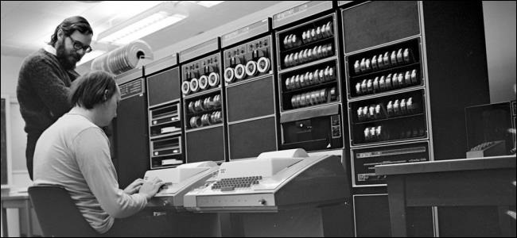
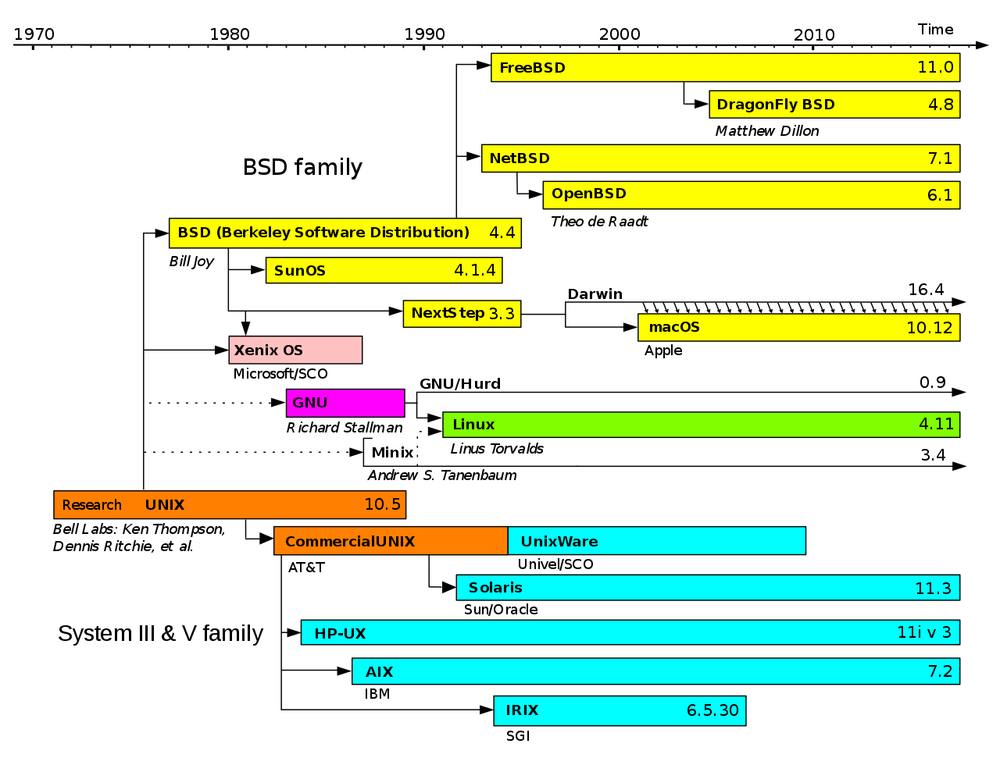
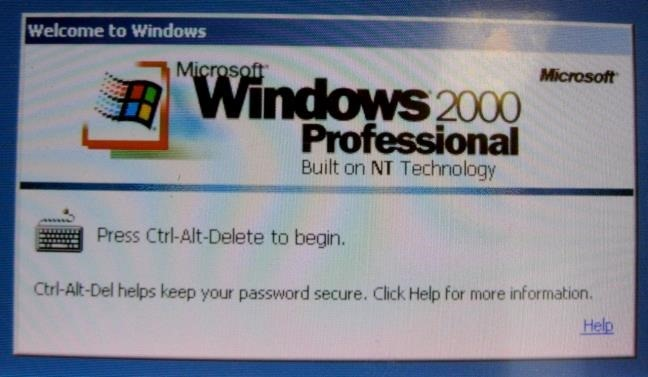

## What Is Unix, and Why Does It Matter?

> by Chris Hoffman on September 22nd, 2016

Most operating systems can be grouped into two different families. Aside from Microsoft’s Windows NT-based operating systems, nearly everything else traces its heritage back to Unix.

Linux, Mac OS X, Android, iOS, Chrome OS, Orbis OS used on the PlayStation 4, whatever firmware is running on your router — all of these operating systems are often called “Unix-like” operating systems.

### Unix’s Design Lives On Today

Unix was developed in AT&T’s Bell Labs back in the mid-to-late 1960’s. The initial release of Unix had some important design attributes that live on today.

One is the “Unix philosophy” of creating small, modular utilities that do one thing and do them well. If you’re familiar with using a Linux terminal, this should be familiar to you — the system offers a number of utilities that can be combined in different ways through pipes and other features to perform more complex tasks. Even graphical programs are likely calling simpler utilities in the background to do the heavy lifting. This also makes it easy to create shell scripts, stringing together simple tools to do complicated things.

Unix also had a single file system that programs use to communicate with each other. This is why “everything is a file” on Linux – including hardware devices and special files that provide system information or other data. It’s also why only Windows has drive letters, which it inherited from DOS — on other operating systems, every file on the system is part of a single directory hierarchy.

### Tracing the Unix Descendants

Like any history going back over 40 years, the history of Unix and its descendants is messy. To simplify things, we can roughly group Unix’s descendants into two groups.

One group of Unix descendants were developed in academia. The first was BSD (Berkeley Software Distribution), an open-source, Unix-like operating system. BSD lives on today through FreeBSD, NetBSD, and OpenBSD. NeXTStep was also based on the original BSD, Apple’s Mac OS X was based on NeXTStep, and iOS was based on Mac OS X. Many other operating systems, including the Orbis OS used on the PlayStation 4, are derived from types of BSD operating systems.

Richard Stallman’s GNU project was also started as a reaction to AT&T’s increasingly restrictive Unix software licensing terms. MINIX was a Unix-like operating system created for educational purposes, and Linux was inspired by MINIX. The Linux we know today is really GNU/Linux, as it’s made up of the Linux kernel and a lot of GNU utilities. GNU/Linux isn’t directly descended from BSD, but it is descended from Unix’s design and has its roots in academia. Many operating systems today, including Android, Chrome OS, Steam OS, and a huge amount of embedded operating systems for devices, are based on Linux.

On the other hand, there were the commercial Unix operating systems. AT&T UNIX, SCO UnixWare, Sun Microsystems Solaris, HP-UX, IBM AIX, SGI IRIX — many big corporations wanted to create and license their own versions of Unix. These aren’t quite as common today, but some of them are still out there.

### The Rise of DOS and Windows NT

Many people expected Unix to become the industry standard operating system, but DOS and “IBM PC compatible” computers eventually exploded in popularity. Microsoft’s DOS became the most successful DOS of them all. DOS was never based on Unix at all, which is why Windows uses a backslash for file paths while everything else uses a forward slash. This decision was made back in the early days of DOS, and later versions of Windows inherited it, just as BSD, Linux, Mac OS X, and other Unix-like operating systems inherited many aspects of Unix’s design.

Windows 3.1, Windows 95, Windows 98, and Windows ME were all based on DOS underneath. Microsoft was developing a more modern and stable operating system at the time, which they named Windows NT — for “Windows New Technology.” Windows NT eventually made its way to regular computer users as Windows XP, but it was available for corporations as Windows 2000 and Windows NT before that.

All of Microsoft’s operating systems are based on the Windows NT kernel today. Windows 7, Windows 8, Windows RT, Windows Phone 8, Windows Server, and the Xbox One’s operating system all use the Windows NT kernel. Unlike most other operating systems, Windows NT wasn’t developed as a Unix-like operating system.

Microsoft didn’t start with a completely clean slate, of course. To maintain compatibility with DOS and old Windows software, Windows NT inherited many DOS conventions like drive letters, backslashes for file paths, and forward slashes for command-line switches

### Why it Matters

Have you ever taken a look at the Mac OS X terminal or file system and noticed how similar it was to Linux’s, and how different they both were from Windows? Well, this is why —  both Mac OSX and Linux are Unix-like operating systems.

Knowing this bit of history helps you understand what a “Unix-like” operating system is, and why so many operating systems seem so similar to each other while Windows seems so different. This explains why the terminal on Mac OS X will feel so familiar to a Linux geek, while the Command Prompt and PowerShell on Windows are so different from other command-line environments.

This was just a quick history that will help you understand how we got to where we are today without getting bogged down in the details. If you want more information, you can find entire books on the history of Unix. For example: <a href="img/A quarter century of UNIX.pdf">A quarter century of UNIX </a>(<a href="img/A-Quarter-Century-of-UNIX-zh.pdf">中文版</a>), <a href="img/Linus Torvalds, David Diamond - Just for fun The Story of an Accidental Revolutionary.pdf">Linus Torvalds, David Diamond - Just for fun The Story of an Accidental Revolutionary</a>, 
A History of Computer Operating Systems: Unix, DOS, Lisa, Macintosh, Windows, Linux(ISBN:1934840459 9781934840450).

From: [What Is Unix, and Why Does It Matter?](https://www.howtogeek.com/182649/htg-explains-what-is-unix/)