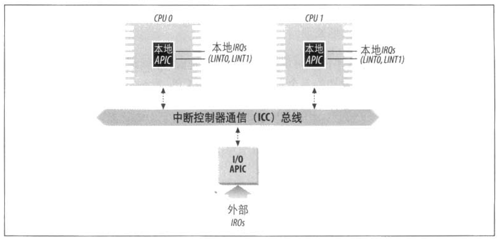
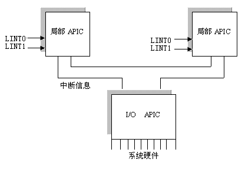
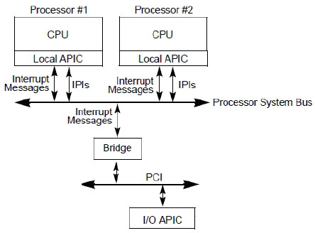
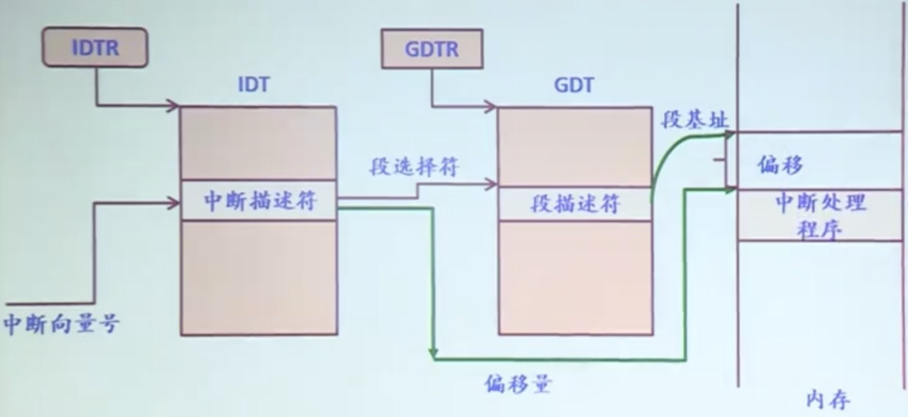
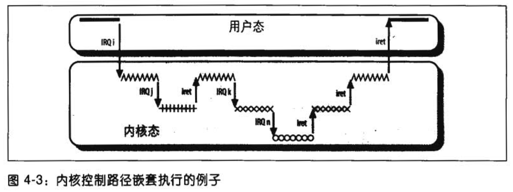
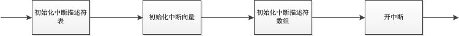
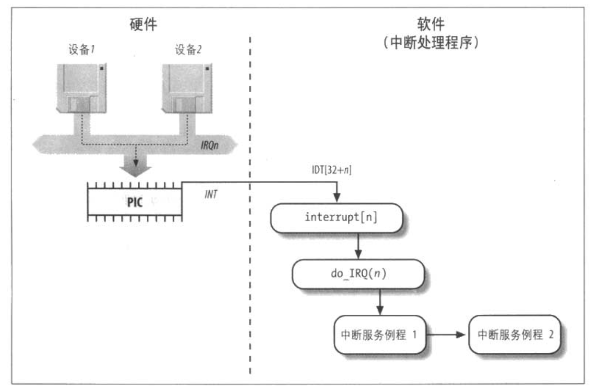

# 第四章：中断和异常

## 中断（interrupt）定义

中断（interrupt）通常被定义为一个事件，该事件改变处理器执行的指令顺序。
这样的事件与CPU芯片内外部硬件电路产生的电信号相对应。

## 中断分类

中断通常分为同步（synchronous）中断和异步（asynchronous）中断。

- 同步中断是当指令执行时由CPU控制单元产生的，之所以称为同步，是因为只有在一条指令终止执行后CPU才会发出中断。

- 异步中断是由其他硬件设备依照CPU时钟信号随机产生的。

## 中断的一些术语和习惯命名规则

Intel微处理器手册中，把同步和异步中断分别称为异常（exception）和中断（interrupt）。
《深入理解Linux内核》中也采用这种分类，当然书中也用术语“中断信号”指这两种类型（同步和异步）。

## 中断信号的来源

中断是由间隔定时器和I/O设备产生的，例如，用户的一次按键会引起一个中断。

异常是由程序的错误产生的，或者是由内核必须处理的异常条件产生的。
第一种情况下，内核通过发送一个每个Unix程序员都熟悉的信号来处理异常。
第二种情况下，内核执行恢复异常需要的所有步骤，例如缺页，或对内核服务的一个请求（通过一条int或sysenter执行）。

## 中断信号的作用
中断信息提供一种特殊的方式，使处理器转而去运行正常控制流之外的代码。
当一个中断信息达到时，CPU必须停止它当前正在做的事情，并且切换到一个新的活动。这很容易让人联线到进程上下文切换，但是，中断处理与进程切换有一个明显的差异：
由中断或异常处理程序执行的代码不是一个进程，更确切的说，它是一个内核控制路径，代表中断发生时正在运行的进程执行。

中断处理是由内核执行的最敏感的任务之一，因为它必须满足下面约束：
- 当内核正打算去完成一些别的事情时，中断随时会到来。
- 中断处理程序必须编写成使相应的内核控制路径能以嵌套的方式执行。
- 中断处理程序，应该在大部分时间内以开中断的方式运行。

## 中断和异常的进一步分类

### 中断

- 可屏蔽中断（maskable interrupt）

- 非屏蔽中断（nonmaskable interrupt）

### 异常

- 处理器探测异常（processor-detected exception）

- - 故障（fault）
        通常可以纠正。

- - 陷阱（trap）
        主要用于调试程序

- - 异常中止（abort）
        用于报告严重的错误

- 编程异常（programmed exception）
  在编程者发出请求时发生。是由int或int3指令触发。控制单元把编程异常作为陷阱处理。**编程异常通常也叫作软中断（software interrupt）**。这样的异常有两种主要用途：执行系统调用及给调试程序通报一个特定的事件。

<table border="0" cellpadding="0" cellspacing="0" class="ibm-data-table display dataTable no-footer dtr-inline ibm-widget-processed" data-widget="datatable" summary="表 1：中断类别及其行为" width="80%" id="DataTables_Table_0" role="grid" style="width: 80%;">
   <caption>
    <em>表 1：中断类别及其行为</em>
   </caption>
   <thead xmlns:xsi="http://www.w3.org/2001/XMLSchema-instance">
    <tr role="row">
     <th class="ibm-background-neutral-white-30 sorting_disabled" scope="col" rowspan="1" colspan="1" style="width: 81px;">类别</th>
     <th class="ibm-background-neutral-white-30 sorting_disabled" scope="col" rowspan="1" colspan="1" style="width: 256px;">原因</th>
     <th class="ibm-background-neutral-white-30 sorting_disabled" scope="col" rowspan="1" colspan="1" style="width: 148px;">异步/同步</th>
     <th class="ibm-background-neutral-white-30 sorting_disabled" scope="col" rowspan="1" colspan="1" style="width: 297px;">返回行为</th>
    </tr>
   </thead>
   <tbody xmlns:xsi="http://www.w3.org/2001/XMLSchema-instance">
    <tr role="row" class="odd">
     <th class="tb-row" scope="row" tabindex="0">中断</th>
     <td>来自I/O设备的信号</td>
     <td>异步</td>
     <td>总是返回到下一条指令</td>
    </tr>
    <tr role="row" class="even">
     <th class="tb-row" scope="row" tabindex="0">陷阱</th>
     <td>有意的异常</td>
     <td>同步</td>
     <td>总是返回到下一条指令</td>
    </tr>
    <tr role="row" class="odd">
     <th class="tb-row" scope="row" tabindex="0">故障</th>
     <td>潜在可恢复的错误</td>
     <td>同步</td>
     <td>返回到当前指令</td>
    </tr>
    <tr role="row" class="even">
     <th class="tb-row" scope="row" tabindex="0">终止</th>
     <td>不可恢复的错误</td>
     <td>同步</td>
     <td>不会返回</td>
    </tr>
   </tbody>
  </table>

**每一个中断和异常是有0~255之间的一个数来标识的。因为一些未知原因，Intel把这个8位的无符号整数叫做一个向量（vector）。**

非屏蔽中断的向量和异常的向量是固定的，而可屏蔽中断的向量可以通过对中断控制器的编程来改变。

## IRQ(Interrupt ReQuest)

**每个能够发出中断请求的硬件设备控制器都有一条名为IRQ(Interrupt ReQuest)的输出线。**
所以现有的IRQ线（IRQ line）都与一个名为可编程中断控制器（Programmable Interrupt Controller, PIC）的硬件电路的输入引脚相连，可编程中断控制器执行下列动作：

1. 监视IRQ线，检查产生的信号（raised signal）。如果有条或两条以上的IRQ线上产生信息，就选择引脚编号较小的IRQ线。
2. 如果一个引发信号出现在IRQ线上：
   a. 把接收到的引发信号转换成对应的向量
   b. 把这个向量存放在中断控制器的一个I/O端口，从而允许CPU通过数据总线读取此向量。
   c. 把引发信号发送到处理器的INTR引脚，即产生一个中断。
   d. 等待，直到CPU通过把这个中断信息写进可编程中断控制器的一个I/O端口来确认它；当这种情况发生时，清INTR线。
3. 返回到第1步。

IRQ线是从0开始顺序编号的，因此，第一条IRQ线通常表示为IRQ0。与IRQn关联的Intel的缺省向量是n+32。通过向中断控制器端口发布合适的指令，就可以修改IRQ和向量之间的映射。

**可以对PIC编程从而禁止IRQ，也就是说，可以告诉PIC停止对给定的IRQ线发布中断，或者激活它们。禁止的中断是丢失不了的，它们一旦被激活，PIC就又把它们发送到CPU。**

## 高级可编程中断控制器

为充分发挥SMP体系结构的并行性，能够把中断传递给系统中的每个CPU至关重要。基于此理由，Intel从Pentium III开始引入了一种名为I/O高级可编程控制器(I/O Advanced Programmable Interrupt Controller, I/O APIC)的新组件。

该组件包含两大组成部分：一是“本地 APIC”，主要负责传递中断信号到指定的处理器；举例来说，一台具有两个处理器的机器，则它必须相对的要有两个本地 APIC。每个本地APIC都有32位的寄存器、一个内部时钟、一个本地定时设备及为本地APIC中断保留的两条额外的IRQ线LINT0和LINT1。所有本地APIC都连接到一个外部I/O APIC，形成一个多APIC的系统。

<figure class="half">
        
        
</figure>

I/O APIC的组成为：一组24条IRQ线、一张24项的中断重定向表(Interrupt Redirection Table)、可编程寄存器，以及通过APIC总线发送和接收APIC信息的一个信息单元。与8259A的IRQ引脚不同，中断优先级并不与引脚号相关联：中断重定向表中的每一项都可以被单独编程以指明中断向量和优先级、目标处理器及选择处理器的方式。重定向表中的信息用于把每个外部IRQ信号转换为一条消息，然后，通过APIC总线把消息发送给一个或多个本地APIC单元。

来自外部硬件设备的中断请求以两种方式在可用CPU之前分发：

- 静态分发

- 动态分发

如果处理器正在执行最低优先级的进程，IRQ信息就传递给这种处理器的本地APIC。每个本地APIC都有一个可编程优先级寄存器（task priority register, TPR），TPR用来计算当前运行进程的优先级。

除了在处理器之间分发中断外，多APIC系统还运行CPU产生处理器间中断（interprocessor interrupt）。
当一个CPU希望把中断发给另一个CPU时，他就在自己本地APIC的中断指令寄存器（Interrupt Command Register， ICR）中存放这个中断向量和目标本地APIC的标识符。然后，通过APIC总线向目标本地APIC发送一条消息，从而向（APIC）它自己的CPU发出一个相应的中断。

## 异常

80x86发布了大约20中不同的异常，内核必须为每种异常提供一个专门的异常处理程序，对于某些异常，CPU在执行异常处理程序前会产生一个硬件出错码，并压入内核态堆栈。

下面列出几个简单的异常向量、名字、类型及其简单描述。详细的信息可以在Intel的技术文档中找到。

0 — “Divde error”（故障）

    当一个程序试图执行整数被0除操作时产生。

1 — “Debug” （陷阱或故障）

2 — 未用

    为非屏蔽中断保留（利用NMI引脚的那些中断）。

3 — “breakpoint” （陷阱）

    由int3（断点）指令（通常由debugger插入）引起。

11 - “Segment not present” （故障）

    引用一个不存在的内存段（段描述符的Segment-Present标志被清0）。

14 - “Page fault” （故障）

    寻址的页不在内存，响应的页表项为空，或者违反了一种分页保护机制。

每个异常都由专门的异常处理程序来处理，它们通常把一个Unix信号发送到引起异常的进程。

表：由异常处理程序发送的信号

|# | Exception | Exception handler | Signal |
|--|-----------|-------------------|--------|
|0 | Divide error | divide_error( ) | SIGFPE |
|1 | Debug | debug( ) | SIGTRAP |
|2 | NMI | nmi( ) | None |
|3 | Breakpoint | int3( ) | SIGTRAP |
|4 | Overflow | overflow( ) | SIGSEGV |
|5 | Bounds check | bounds( ) | SIGSEGV |
|6 | Invalid opcode | invalid_op( ) | SIGILL |
|7 | Device not available | device_not_available( ) | None |
|8 | Double fault | doublefault_fn( ) | None |
|9 | Coprocessor segment overrun | coprocessor_segment_overrun( ) | SIGFPE |
|10 | Invalid TSS | invalid_TSS( ) | SIGSEGV |
|11 | Segment not present | segment_not_present( ) | SIGBUS |
|12 | Stack segment fault | stack_segment( ) | SIGBUS |
|13 | General protection | general_protection( ) | SIGSEGV |
|14 | Page Fault | page_fault( ) | SIGSEGV |
|15 | Intel-reserved | None | None |
|16 | Floating-point error | coprocessor_error( ) | SIGFPE |
|17 | Alignment check | alignment_check( ) | SIGBUS |
|18 | Machine check | machine_check( ) | None |
|19 | SIMD floating point | simd_coprocessor_error( ) | SIGFPE |

## 中断描述符表

中断描述符表（Interrupt Description Table, IDT）是一个系统表，它与每一个中断或异常向量相联系，每一个向量在表中有相应的中断或异常处理程序的入口地址。内核在允许中断发生前，必须适当地初始化IDT。表中的每一项对应一个中断或异常向量，每个向量由8个字节组成。因此，最多需要256*8=2048字节来存放IDT。

idtr寄存器使IDT可以位于内存的任何地方，它指定IDT的线性基地址及其限制（最大长度）。在允许中断之前，必须用lidt汇编指令初始化idtr。IDT包含三种类型的描述符，在40~43位的Type字段的值表示描述符的类型，分别如下：

- 任务门（task gate）

   当中断信号发生时，必须取代当前进程的那个进程的TSS选择符存放在任务门中。

- 中断门（interrupt gate）

    包含段选择符和中断或异常处理程序的段内偏移量.当控制权转移到一个适当的段时，处理器 清IF标志，从而关闭将来会发生的可屏蔽中断。

- 陷阱门（trap gate）

    与中断门相似，只是控制权传递到一个适当的段时处理器不修改IF标志。

在一个门描述符中：

P: 代表的是段是否处于内存中，因为linux从不把整个段交换的硬盘上，所以P都被置为1。

DPL： 代表的是权限，用于限制对这个段的存取，当其为0时，只有CPL=0(内核态)才能够访问这个段，当其为3时，任何等级的CPL(用户态及内核态)都可以访问。
段选择符：除了任务门设置为TSS段，陷阱门和中断门都设置为__KERNER_CS(内核代码段)。

偏移量： 就是中断处理程序入口地址。
 
以上为Intel对中断描述符的分类。Linux采用了更细的分类方法：

- 中断门(interrupt gate)

    用户态的进程不能访问的一个lntel中断门(门的DPL字段为0)。所有的Linux中断处理程序都通过中断门激活，并全部限制在内核态。

- 系统门(syslem gate)

    用户态的进程可以访问的一个Intel陷阱门(门的DPL字段为3）。通过系统门来激活三个Linux异常处理程序，它们的向量是4，5及128，因此，在用户态下可以发布into、 bound及int $Ox80三条汇编语言指令。

- 系统中断门(system interrupt gate)

    能够被用户态进程访问的Intel中断门(门的DPL字段为3)。与向量3相关的异常处理程序是由系统中断门激活的，因此，在用户态可以使用汇编语言指令int3.

- 陷阱门(Irapgate)

    用户态的进程不能访问的一个Inte)陷阱门(门的DPL字段为0)。大部分Linux异常处理程序都通过陷阱门来激活.

- 任务门(task gate)

    不能被用户态进程访问的Intel任务门(门的DPL字段为0).Linux对"Doublefault"异常的处理程序是由任务门激活的.

## 中断和异常的硬件处理

我们从硬件的角度来看CPU如何处理中断和异常。这里假定内核已被初始化，CPU已从实模式转到保护模式。

当执行了一条指令后，CS和eip这对寄存器包含下一条将要执行的指令的逻辑地址.在处理那条指令之前，控制单元会检查在运行前一条指令时是否已经发生了一个中断或异常。如果发生了一个中断或异常，那么控制单元执行下列操作:

1）确定与中断或异常关联的向量i (0 ≤ i ≤ 255)

2）读由idtr寄存器指向的IDT表中的第i项(在下面的描述中，我们假定IDT表项中包含的是一个中断门或一个陷阱门)。

3）从gdtr寄存器获得GDT的基地址，并在GDT中查找，以读取IDT表项中的选择符所标识的段描述符.这个描述符指定中断或异常处理程序所在段的基地址.

4）确信中断是由授权的(中断)发生源发出的。首先将当前特权组CPL(存放在cs寄存器的低两位)与段描述符(存放在GDT中)的描述符特权级DPL比较，如果CPL小于DPL. 就产生一个"Generalprotection" 异常.因为中断处理程序的特权不能
低于引起中断的程序的特权.对于编程异常，则做进一步的安全检查:比较CPL与处于IDT中的门描述符的DPL，如果DPL小于CPL，就产生一个"General protection"异常。这最后一个检查可以避免用户应用程序访问特殊的陷阱门或中断门.

5）检查是否发生了特权级的变化，也就是说，CPL是否不同于所选择的段描述符的DPL. 如果是，控制单元必须开始使用与新的特权级相关的栈。通过执行以下步骤来做到这点:

    a.  读tr寄存器，以访问运行进程的TSS段.

    b.  用与新特权级相关的钱段和战指针的正确值装载ss和esp寄存器。这些值可以在TSS中找到

    c.  在新的栈中保存ss和esp以前的值. 这些值定义了与旧特权级相关的梭的逻辑地址.

6）如果故障已发生，用引起异常的指令地址装载cs和elp客存器，从而使得这条指令能再次被执行。    

7）在战中保存eflags、 cs及eip的内容.

8）如果异常产生了一个硬件出错码，则将它保存在栈中。

9）装载cs和eip寄存器，其值分别是IDT表中第i项门描述符的段选择符和偏移量字段.这些值给出了中断或者异常处理程序的第一条指令的逻辑地址。

控制单元所执行的最后一步就是跳转到中断或者异常处理程序。换句话说。处理完中断信号后。控制单元所执行的指令就是被选中处理程序的第一条指令。

中断或异常被处理完后，相应的处理程序必须产生一条iret指令，把控制权转交给被
中断的进程，这将迫使控制单元:

1） 用保存在校中的值装载cs、 eip或eflags寄存器。如果一个硬件出错码曾被压入校中，并且在eip内容的上面，那么，执行iret指令前必须先弹出这个硬件出错码.

2）检查处理程序的CPL是否等于cs中最低两位的值(这意味着被中断的进程与处理程序运行在同一特权级)。如果是，iret终止执行， 否则，转入下一步。

3）从战中装载ss和esp寄存器，因此，返回到与旧特权级相关的钱。

4） 检查ds、 es、 fs，&gs段寄存器的内容，如果其中一个寄存器包含的选择符是一个段描述符，并且其DPL值小子CPL，那么，清相应的段寄存器.控制单元这么做是为了禁止用户态的程序(CPL=3)利用内核以前所用的段客存器(DPL=O)。如果不清这些寄存器，怀有恶意的用户态程序就可能利用它们采访问内核地址空间。

## 中断和异常处理程序的嵌套执行

每个中断或异常都会引起一个内核控制路径，或者说代表当前进程在内核态执行单独的指令序列。例如：当I/O设备发出一个中断时，相应的内核控制路径的第一部分指令就是那些把寄存器的内容保存到内核堆栈的指令，而最后一部分指令就是恢复寄存器内容并让CPU返回到用户态的那些指令。

内核控制路径可以任意嵌套；一个中断处理程序可以被另一个中断处理程序”中断”，因此引起内核控制路径的嵌套执行，如下图所示。其结果是，对中断进行处理的内核控制路径，其最后一部分指令并不总能使当前进程返回到用户态；如果嵌套深度大于1，这些指令将执行上次被打断的内核控制路径，此时的CPU依然运行在内核态。

允许内核控制路径嵌套执行必须付出代价，那就是中断处理程序必须永不阻塞，换句话说，中断处理程序运行期间不能发生进程切换。事实上，嵌套的内核控制路径恢复执行时需要的所有数据都存放在内核态堆栈中，这个栈毫无疑义的属于当前进程。

假定内核没有bug，那么大多数异常就只在CPU处于用户态时发生。事实上，异常要么由编程错误引起，要么是由调试程序触发。然而，”PageFault”异常发生在内核态。这发生在当进程试图对属于其地址空间的页进行寻址，并用另一个进程代替它，真到请求的页可以使用为止。只要被挂起的进程又获得处理器，处理缺页异常的内核控制路径就恢复执行。

**因为”PageFault”异常处理程序从不进一步引起异常，所以与异常相关的至多两个内核控制路径会堆叠在一起，一个在另一个之上。**

与异常形成对照的是，尽管处理中断的内核控制路径代表当前进程运行，但由I/O设备产生的中断并不引用当前进程的专有数据结构。事实上，当一个给定的中断发生时，要预测哪个进程将会运行是不可能的。

**一个中断处理程序既可以抢占其它的中断处理程序，也可以抢占异常处理程序。相反，异常处理程序从不抢占中断处理程序。在内核态能触发的唯一异常就是刚刚描述的缺页异常。但是，中断处理程序从不执行可以导致缺页的操作。**

### 基于以下两个主要原因，Linux交错执行内核控制路径：

- 为了提高可编程中断控制器和设备控制器的吞吐量，假定设备控制器在一条IRQ线上产生了一个信号，PIC把这个信号转换成一个外部中断，然后PIC和设备控制器保持阻塞，一直到PIC从CPU处接收到一条应答信息。由于内核控制路径的交替执行，内核即使正在处理前一个中断，也能发送应答。

- 为了实现一种没有优先级的中断模型。因为每个中断处理程序都可以被另一个中断处理程序廷缓，因此，在硬件设备之间没必要建立预定义优先级。这就简化了内核代码，提高了内核的可移植性。

在多处理器系统上，几个内核控制路径可以并发执行。此外，与异常相关的内核控制路径可以开始在一个CPU上执行，并且由于进程切换而移往另一个CPU上执行。

## 初始化中断描述符表

内核启用中断前，必须把IDT表的初始地址装到idtr寄存器，并初始化表中的每一项。这项工作是在初始化系统时完成的。

## 异常处理

CPU产生的大部分异常都由LInux解释为出错条件，当其中一个异常发生时，内核就向引起异常的进程发送一个信号向它通知一个反常条件。
异常处理程序有一个标准的结构，由一下三部分组成：

- 在内核堆栈中保存大多数寄存器的内容（这部分用汇编语言实现）
- 用高级的C函数处理异常
- 通过ret_from_exception()函数从异常处理程序退出

为了利用异常，必须对IDT进行适当的初始化，使得每个被确认的异常都有一个异常处理程序。trap_init()函数的工作是将一些最终值（即处理异常的函数）插入到IDT的非屏蔽中断及异常表项中。

## 中断处理

内核只要给引起异常的进程发送一个Unix信号就能处理大多数异常。因此，要采取的行动被延迟，直到进程接收到这个信号。所以，内核能很快地处理异常。

这种方法并不适合中断，因为经常会出现一个进程，被挂起好久后中断才到达的情况，因此，一个完全无关的进程可能正在运行。所以给当前进程发送一个Unix信号是毫无意义的。

中断处理依赖中断类型：I/O中断，时钟中断，处理器间中断。

### I/O中断处理

某些I/O设备需要关注；相应的中断处理程序必须查询设备以确定适当的操作过程。

一般来说，I/O终端处理程序必须足够灵活以给多个设备同时提供服务。例如，在PCI总线的体系结构中，几个设备可以共享同一个IRQ线，这就意味着仅仅中断向量不能说明所有问题。

中断处理程序的灵活性是以两种不同的方式实现的：

IRQ共享

    中断处理程序执行多个中断服务例程(interruptservice routine. ISR). 每个ISR是一个与单独设备(共享IRQ线)相关的函数。因为不可能预先知道哪个特定的设备产生IRQ. 因此，每个ISR都被执行，以验证它的设备是否需要关注，如果是，当设备产生中断时，就执行需要执行的所有操作。

动态分配：

    一条IRQ线在可能的最后时刻才与一个设备驱动程序相关联，例如，软盘设备的IRQ线只有在用户访问软盘设备时才被分配。这样，即使几个硬件设备并不共享IRQ线.同一个IRQ向量也可以由这几个设备在不同时刻使用

**当一个中断发生时，并不是所有的操作都具有相同的急迫性**。事实上，把所有的操作都放进中断处理程序本身并不合适。需要时间长的、非重要的操作应该推后，因为当一个中断处理程序正在运行时，相应的IRQ中断线上再发出的信号就会被忽略。更重要的是，中断处理程序是代表进程执行的，它所代表的进程必需总处于TASK_RUNNING状态，否则，就可能出现系统僵死情形。因此，中断处理程序不能执行任何阻塞过程，如I/O设备操作。因此，Linux把一个中断要执行的操作分为下面的三类：

（1）紧急的（Critical）

    这样的操作诸如：中断到来时中断控制器做出应答，对中断控制器或设备控制器重新编程，或者对设备和处理器同时访问的数据结构进行修改。这些操作都是紧急的，应该被很快地执行，也就是说，紧急操作应该在一个中断处理程序内立即执行，而且是在禁用中断的状态下。

（2）非紧急的（Noncritical）

    这样的操作如修改那些只有处理器才会访问的数据结构（例如，按下一个键后，读扫描码）。这些操作也要很快地完成，因此，它们由中断处理程序立即执行，但在启用中断的状态下。

（3）非紧急可延迟的（Noncritical deferrable）

    这样的操作如，把一个缓冲区的内容拷贝到一些进程的地址空间（例如，把键盘行缓冲区的内容发送到终端处理程序的进程）。这些操作可能被延迟较长的时间间隔而不影响内核操作：有兴趣的进程会等待需要的数据。非紧急可延迟的操作由一些被称为“下半部分”(bottom halves)的函数来执行。我们将在后面讨论“下半部分”。

所有的中断处理程序都执行四个基本的操作：

- 在内核栈中保存IRQ的值和寄存器的内容。

- 给与IRQ中断线相连的中断控制器发送一个应答，这将允许在这条中断线上进一步发出中断请求。

- 执行共享这个IRQ的所有设备的中断服务例程（ISR）。

- 跳到ret_from_intr()的地址后终止。

**IRQ在多处理器系统上的分发**

Linux遵循对称多处理模型（SMP）；这就意味着，内核从本质上对任何一个CPU都不应该有偏爱。因而，内核试图以轮转的方式把来自硬件设备的IRQ信号在所有的CPU之间分发。因此，所有CPU服务于I/O中断的执行时间片几乎相同。

### 时钟中断

某种时钟（或者是一个本地APIC时钟，或者是一个外部时钟）产生一个中断；这种中断告诉内核一个固定的时间间隔已经过去。这些中断大部分是作为I/)中断来处理的；

### 处理器间中断

多处理器系统中一个CPU对另一个CPU发出一个中断。

处理器间中断允许一个CPU向系统其他的CPU发送中断信号，处理器间中断（IPI）不是通过IRQ线传输的，而是作为信号直接放在连接所有CPU本地APIC的总线上。在多处理器系统上，Linux定义了下列三种处理器间中断：

- CALL_FUNCTION_VECTOR （向量0xfb）

    发往所有的CPU，但不包括发送者，强制这些CPU运行发送者传递过来的函数，相应的中断处理程序叫做call_function_interrupt()，例如，地址存放在群居变量call_data中来传递的函数，可能强制其他所有的CPU都停止，也可能强制它们设置内存类型范围寄存器的内容。通常，这种中断发往所有的CPU，但通过smp_call_function()执行调用函数的CPU除外。

- RESCHEDULE_VECTOR （向量0xfc）

    当一个CPU接收这种类型的中断时，相应的处理程序限定自己来应答中断，当从中断返回时，所有的重新调度都自动运行。

- INVALIDATE_TLB_VECTOR （向量0xfd）

    发往所有的CPU，但不包括发送者，强制它们的转换后援缓冲器TLB变为无效。相应的处理程序刷新处理器的某些TLB表项。

处理器间中断处理程序的汇编语言代码是由BUILD_INTERRUPT宏产生的，它保存寄存器，从栈顶押入向量号减256的值，然后调用高级C函数，其名字就是第几处理程序的名字加前缀smp_，例如CALL_FUNCTION_VECTOR类型的处理器间中断的低级处理程序时call_function_interrupt()，它调用名为smp_call_function_interrupt()的高级处理程序，每个高级处理程序应答本地APIC上的处理器间中断，然后执行由中断触发的特定操作。

Linux有一组函数使得发生处理器间中断变为一件容易的事：

|函数  |	说明  |
|-----|----------|
|send_IPI_all()	|发送一个IPI到所有CPU，包括发送者|
|send_IPI_allbutself()	|发送一个IPI到所有CPU，不包括发送者|
|send_IPI_self()	|发送一个IPI到发送者的CPU|
|send_IPI_mask()	|发送一个IPI到位掩码指定的一组CPU|

## 软中断及tasklet

软中断、tasklet和工作队列并不是Linux内核中一直存在的机制，而是由更早版本的内核中的“下半部”（bottom half）演变而来。下半部的机制实际上包括五种，但2.6版本的内核中，下半部和任务队列的函数都消失了，只剩下了前三者。

上半部指的是中断处理程序，下半部则指的是一些虽然与中断有相关性但是可以延后执行的任务。举个例子：在网络传输中，网卡接收到数据包这个事件不一定需要马上被处理，适合用下半部去实现；但是用户敲击键盘这样的事件就必须马上被响应，应该用中断实现。
两者的主要区别在于：中断不能被相同类型的中断打断，而下半部依然可以被中断打断；中断对于时间非常敏感，而下半部基本上都是一些可以延迟的工作。

### 软中断

软中断作为下半部机制的代表，是随着SMP（share memory processor）的出现应运而生的，它也是tasklet实现的基础（tasklet实际上只是在软中断的基础上添加了一定的机制）。软中断一般是“可延迟函数”的总称，有时候也包括了tasklet（请读者在遇到的时候根据上下文推断是否包含tasklet）。它的出现就是因为要满足上面所提出的上半部和下半部的区别，使得对时间不敏感的任务延后执行，而且可以在多个CPU上并行执行，使得总的系统效率可以更高。它的特性包括：

- 产生后并不是马上可以执行，必须要等待内核的调度才能执行。软中断不能被自己打断(即单个cpu上软中断不能嵌套执行)，只能被硬件中断打断（上半部）。
- 可以并发运行在多个CPU上（即使同一类型的也可以）。所以软中断必须设计为可重入的函数（允许多个CPU同时操作），因此也需要使用自旋锁来保其数据结构。

> 软中断和tasklet有密切的关系，tasklet是在软中断之上实现。事实上，出现在内核代码中的“软中断（softirq)”常常表示可延迟函数的所有种类。另一种被广泛使用的术语是“中断上下文”：表示内核在当前正在执行一个中断处理程序或一个可延迟的函数。

> 软中断的分配是静态的（即在编译时定义），而tasklet的分配和初始化可以在运行时进行（例如，安装一个内核模块时）。软中断(即便是同一种类型的软中断)能够并发地运行在多个CPU上。因此，软中断是可重入函数并且必须明白地使用自旋锁保护其数据结构。tasklet不必操心这些问题。由于内核对tasklet的运行进行了更加严格的控制。同样类型的tasklet总是被串行运行。换句话说就是：不能在两个CPU上同一时候执行同样类型的tasklet。可是，类型不同的tasklet能够在几个CPU上并发执行。tasklet的串行化使tasklet函数不必是可重入的，因此简化了设备驱动程序开发者的工作。

一般而言，在可延迟函数上可以执行四种操作：初始化/激活/执行/屏蔽。

Linux 2.6使用有限个软中断。在很多场合，tasklet是足够用的，且更容易编写，因为tasklet不必是可重入的。事实上，如下表，linux目前只定义了六种软中断：

|软中断           |下标    |说明        |
|----------------|-------|-----------|
|HI_SOFTIRQ      |0      |处理高优先级的tasklet|
|TIMER_SOFTIRQ   |1      |和时钟中断相关的tasklet|
|NET_TX_SOFTIRQ  |2      |把数据包传送到网卡|
|NET_RX_SOFTIRQ  |3      |从网卡接收数据包|
|SCSI_SOFTIRQ    |4      |SCSI命令的后台中断处理|
|TASKLET_SOFTIRQ |5      |处理常规tasklet|

一个软中断的下标决定了它的优先级：低下标意味着高优先级，因为软中断函数将从下标0开始执行。

### tasklet

tasklet是I/O驱动程序中实现可延迟函数的首选方法。
tasklet建立在HI_SOFTIRQ和TASKLET_SOFTIRQ这两个软中断之上。
几个tasklet可以与同一软中断相关联，每个tasklet执行自己的函数。

### 工作队列

Linux2.6版本中引入了工作队列概念，代替Linux2.4版本中的任务队列。
它们允许内核函数（非常像可延迟函数）被激活，而且稍后由一种叫做工作者线程的特殊内核线程来执行。

尽管可延迟函数和工作队列非常相似，但是它们的区别还是很大的。主要区别在于：可延迟函数运行的中断上下文中，而工作则队列中的函数运行在进程上下文。执行可阻塞函数（例如：需要访问磁盘数据块的函数）的唯一方式是在进程上下文中运行。因为中断上下文中不能发生进程切换。不论是可延时函数还是工作队列中的函数都不能访问进程的用户态地址空间，它们都运行在内核态。事实上，可延时函数并不知道当前正在运行的进程。另一方面，工作队列中函数由内核线程执行，所以也就没有用户态地址可以访问。

也就是说，工作队列的出现就是解决tasklet不能处理可阻塞函数的弊端。并且它们都是运行在内核态的程序，不能访问用户态地址空间。

### 预定义工作队列

大部分情况下，为了运行某个函数而创建一组工作线程是多余的。因此，内核提供了一个称为events的预定义工作队列，内核开发者可以自由使用。预定义工作队列不过就是一个标准工作队列，包含不同内核和驱动层的函数。它的workqueue_struct描述符存储在keventd_wq数组中。为了使用预定义工作队列，内核提供了一些辅助函数。

当函数很少被调用时，预定义工作队列节省了系统资源。但是另一方面，在预定义工作队列中的函数不应该阻塞较长时间：因为每个CPU中的工作队列的函数执行都是串行化的，所以，长时间的阻塞耽误其它用户的使用。

### 从中断和异常返回

尽管终止阶段的主要目的很清楚，即恢复摸个程序的执行。但是我们还需要考虑到以下几个问题：

- 内核控制路径并发执行数量：如果只有一个那么CPU就必须切换到用户态。
- 挂起进程的切换请求：如果有任何请求，内核就必须执行进程调度；否则，把控制权还给当前进程。
- 挂起的信号：如果一个信号发送到当前进程，就必须处理它。
- 单步执行模式：如果调试程序正在跟踪当前进程的执行，就必须在进程切换回到用户态之前恢复单步执行。

# 缩写参照表
|缩写      |全称                                |名字    |
|----------|-----------------------------------|--------|
|IRQ       |Interrupt ReQuest                  |        |
|PIC       |Programmable Interrupt Controller  |可编程控中断制器|
|I/O APIC  | I/O Advanced Programmable Interrupt Controller |I/O高级可编程中断控制器|
|IRT       |Interrupt Redirection Table       |中断重定向表|
|TPR       |task priority register            |可编程优先级寄存器|
|IPI       |interprocessor interrupt          |处理器间中断     |
|ICR       |Interrupt Command Register        |中断指令寄存器   |
|IDT       |Interrupt Description Table       |中断描述符表     |
|IF        |Interrupt Flag           |中断标志位，标志寄存器（EFLAGS）的第9位|
|ISR       |interruptservice routine |中断服务例程    |

Reference：《深入理解Linux内核》第四章

[Linux 内核中断内幕](https://www.ibm.com/developerworks/cn/linux/l-cn-linuxkernelint/index.html)

CS: 代码段寄存器；装代码段的起始地址；

DS: 数据段寄存器；装数据段的起始地址；

SS: 堆栈段寄存器；装堆栈段的起始地址；

ES: 附加段寄存器；装附加段的起始地址。

EIP is the instruction pointer. It points to the next instruction to be executed.

ESP is the stack pointer. It points to the most-recently pushed value on the stack.

EIP寄存器，用来存储CPU要读取指令的地址，CPU通过EIP寄存器读取即将要执行的指令。每次CPU执行完相应的汇编指令之后，EIP寄存器的值就会增加。

 