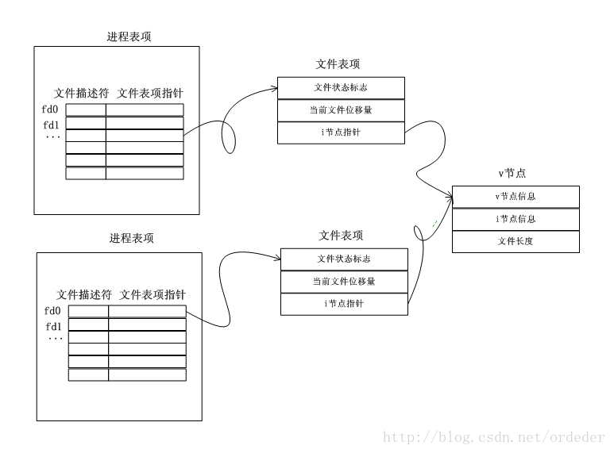
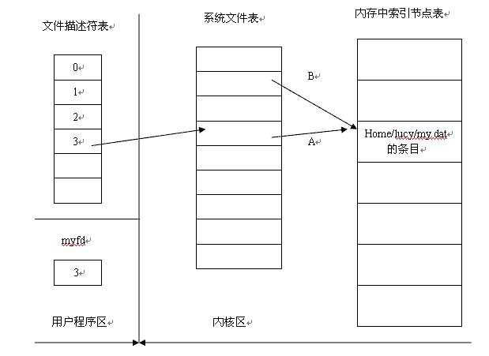
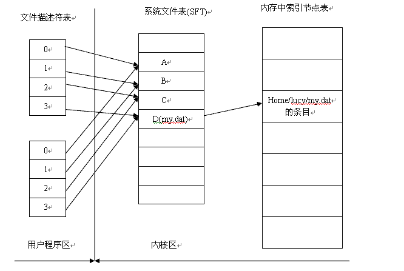
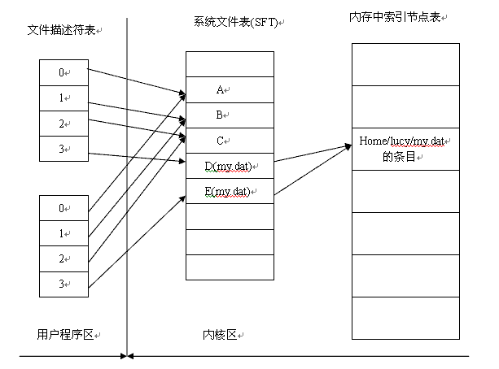
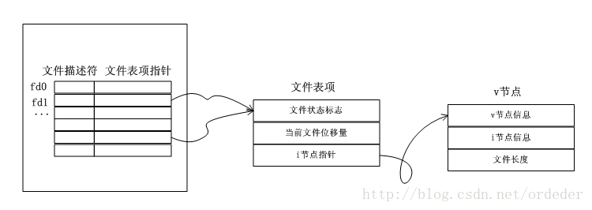

## UNIX IO——文件描述符

> 2009-06-29

> 可人

Linux中一个进程在此存在期间，会有一些文件被打开，从而会返回一些文件描述符。从shell中运行一个进程，默认会有3个文件描述符存在(0、１、2), 0与进程的标准输入相关联，１与进程的标准输出相关联，2与进程的标准错误输出相关联。一个进程当前有哪些打开的文件描述符可以通过`/proc/进程ID/fd`目录查看。

Linux的进程描述task_struct{...}中有一个数组专门用于记录该进程打开的文件。

```
/* open file information */
struct files_struct *files;
```

其中文件描述符作为该数组的下标，数组元素为指向所打开的文件所创建的文件表项。如下图所示，文件表项是用于描述文件当前被某个进程打开后的状态信息，包括文件状态标志，记录当前文件读取的位移量（可以通过接口lseek设置），以及文件的i节点指针（i节点描述文件的具体信息，如：创建，修改时间，文件大小，文件存储的块信息）。



另一篇博客中介绍文件描述符及文件表项如下：

文件描述符相当于一个逻辑句柄，而open,close等函数则是将文件或者物理设备与句柄相关联。句柄是一个整数，可以理解为进程特定的文件描述符表的索引。

先介绍下面三个概念，后面讲下open、close等操作以后，文件和文件描述符产生什么关系，以及fork后文件描述符的继承等问题。
 
##### 文件描述符表

用户区的一部分，除非通过使用文件描述符的函数，否则程序无法对其进行访问。对进程中每个打开的文件，文件描述符表都包含一个条目。
 
##### 系统文件表

为系统中所有的进程共享。对每个活动的open, 它都包含一个条目。每个系统文件表的条目都包含文件偏移量、访问模式（读、写、or 读-写）以及指向它的文件描述符表的条目计数。
 
##### 内存索引节点表

对系统中的每个活动的文件（被某个进程打开了），内存中索引节点表都包含一个条目。几个系统文件表条目可能对应于同一个内存索引节点表（不同进程打开同一个文件）。

举例: 执行myfd = open( "/home/lucy/my.dat", O_RDONLY); 以后，上述3个表的关系原理图如下：



系统文件表包含一个偏移量，给出了文件当前的位置。若2个进程同时打开一个文件（如上图A,B）做读操作，每个进程都有自己相对于文件的偏移量，而且读入整个文件是独立于另一个进程的；如果2个进程打开同一个文件做写操作，写操作是相互独立的，每个进程都可以重写另一个进程写入的内容。

如果上面进程在open以后又执行了close（）函数，操作系统会删除文件描述符表的第四个条目，和系统文件表的对应条目（若指向它的描述符表唯一），并对内存索引节点表条目中的计数减1，如果自减以后变为0，说明没有其他进程链接此文件，将索引节点表条目也删除，而这里进程B也在open这个文件，所以索引节点表条目保留。

### 文件描述符的继承

通过fork（）创建子进程时，子进程继承父进程环境和上下文的大部分内容的拷贝，其中就包括文件描述符表。
 
（1）对于父进程在fork（）之前打开的文件来说，子进程都会继承，与父进程共享相同的文件偏移量。如下图所示（0-1-2 表示 标准输入-输出-错误）：



系统文件表位于系统空间中，不会被fork()复制，但是系统文件表中的条目会保存指向它的文件描述符表的计数，fork()时需要对这个计数进行维护，以体现子进程对应的新的文件描述符表也指向它。程序关闭文件时，也是将系统文件表条目内部的计数减一，当计数值减为0时，才将其删除。

（2）相反，如果父进程先进程fork，再打开my.dat，这时父子进程关于my.dat 的文件描述符表指向不同的系统文件表条目，也不再共享文件偏移量（fork以后2个进程分别open，在系统文件表中创建2个条目）；但是关于标准输入，标准输出，标准错误，父子进程还是共享的。



可以通过一个测试实例来证实以上的描述：

```
#include <unistd.h>  
#include <stdio.h>   
#include <fcntl.h>
#include <sys/wait.h>
 
int main()
{
    int fd1,fd2,fd3,nr;
    char buff[20];
    pid_t pid;
    fd1 = open("data.in",O_RDONLY);
    pid = fork();
    if(pid == 0)
    {   
        nr = read(fd1,buff,10);
        buff[nr]='\0';
        printf("pid#%d content#%s#\n",getpid(),buff);
        exit(0);
    }   
    nr = read(fd1,buff,10);
    buff[nr]='\0';
    printf("pid#%d content#%s#\n",getpid(),buff);
    return 0;
}
```
测试用例

```
data.in
abcdefghijklmnopqrstuvwxyz1234567890
EOF
```

测试结果：

```
pid#20029 content#abcdefghij#
pid#20030 content#klmnopqrst#
```

进程20029对文件的读取后的当前位置应该为data.in的k字符所在的位置，进程20030是由20029进程之后开始读取的，他读取文件内容不是从a开始，而是从k开始，说明20030共享了20029的文件表。

### linux之dup和dup2函数，复制一个文件描述符

进程中分别调用：fd1 = open("data.in",O_RDWR); fd2 = open("data.in",O_RDWR); 那么fd1和fd2指向的文件表项是不同的。

进程中调用fd2 = dup(fd1) 产生的新的fd2所指向的文件表项和fd1指向的文件表项是相同的；

dup 和 dup2 都可以用来复制一个现存的文件描述符。经常用来重新定向进程的 STDIN, STDOUT, STDERR。



### Python中的fork操作

Python中fork操作仅在Linux平台上有效。这是因为，Python实现方式上：仅仅是对linux进程的fork操作做了简单的封装调用。所以，不在windows平台上支持该操作也是可以预见的。

在使用下面代码测试过程中发现，子线程中输出的内容总为空，即主线程输出一行后，子线程读文件时，文件指针已经到文件结尾了。

```
import os
import time
f = open("1.txt")
pid = os.fork()
count=0
if pid:
    #parent
    while True:
        x=f.readline()
        if not x:
            print("parent process(%s) count %s" %(os.getpid(), count))
            break
        print("parent process(%s) %s" %(os.getpid(), x))
        print("parent process(%s) position %s" % (os.getpid(), f.tell()))
        time.sleep(0.01)
        count+=1
else:
    #child
    while True:
        x=f.readline()
        if not x:
            print("child process(%s) count %s" %(os.getpid(), count))
            break
        print("child process(%s) %s" %(os.getpid(), x))
        print("child process(%s) position %s" % (os.getpid(), f.tell()))
        time.sleep(0.01)
        count+=1


print("process(%s) %s" % (os.getpid(), f.readline()))
```

最后发现是Python的readline()函数使用的不正确。因为readline()调用时，虽然python仅返回一行，但操作系统文件IO时，却是读取一块。因为测试文件本身比较小，直接就到文件结尾了。

将"1.txt"换成一个大文件，再执行上述代码，就可以看到：上述描述Linux中fork进程，文件IO相似的行为了。

From：

[UNIX IO---再谈文件描述符](https://blog.51cto.com/keren/170822)

[进程调用fork与文件描述符的共享(fork,dump)](https://blog.csdn.net/ordeder/article/details/21716639)

[linux之dup和dup2函数解析](https://www.cnblogs.com/BinBinStory/p/7348563.html)