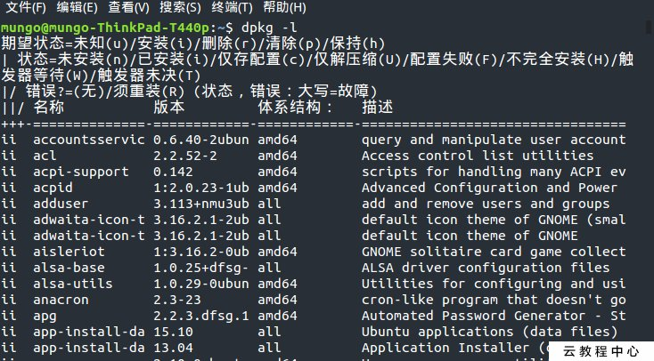

## Ubuntu软件包管理工具dpkg和apt

DEB是Debian软件包格式的文件扩展名，Debian包是Unix ar的标准归档，将包文件信息以及包内容，经过gzip和tar打包而成。
处理这些包的经典程序是dpkg，使用`dpkg -i deb-file-path-name`命令可以安装deb包。ubuntu是基于debian发行的，所以也使用Debian包。

“dpkg”是“DebianPackager”的简写。为“Debian”专门开发的套件管理系统，方便软件的安装、更新及移除，所有源自“Debian”的“Linux”发行版都使用“dpkg”。

### dpkg包管理器ii，rc含义

在使用dpkg -l列出软件列表后，看到前面有列出ii或者rc，而且有的软件安装了不同的版本，感觉很奇怪。通过查询，原来：

- ii 表示软件正常安装
- rc表示软件已卸载,可是配置文件还在。 



知道原因，那么应该只要查出配置文件就可以了，一个一个查找删除非常的麻烦，好在dpkg给我们提供了一个简单的方法，可以通过以下命令进行清理。

```
dpkg -l | grep ^rc | cut -d' ' -f3 | sudo xargs dpkg --purge
```

### 获取deb包

Ubuntu中可以使用apt或apt-get命令直接下载软件安装的deb包。如：

```
apt download packageName
```


### 解压deb包

对于本地的deb包，可以使用`ar`命令来解压缩，从而可以查看包内文件。具体命令：

```
ar -x pakname.deb
```

解压deb完毕后会发现多出几个文件，这是deb包的一般结构。如`python2.7-dev_2.7.15~rc1-1_amd64.deb`包解压后文件列表如下：

```
control.tar.xz 
debian-binary
data.tar.xz     
```


这里主要用到data.tar.gz等包，这个是放着二进制文件的包，用`tar -xf data.tar.gz`解压这个包可以查看安装包主要包含的文件。

解压control.tar.xz文件，可以查看control文件，主要描述包的依赖、描述等

### What is xxxx-dev package used for in Linux

在Linux中安装其它软件时，往往需要安装xxxx-dev包。比如Stack overflow里这位仁兄的描述：

> I recently installed lxml.

> Before that I had to install all the dependencies for that. So I tried to install liblxml2-dev, liblxslt1-dev and python-dev (google searched for what packages are required for lxml)

> but even after that I could not able to install lxml by using the command pip install lxml.

> However as because I am using Python 3.4.0, I thought that may be there are different version of python-dev (thought came due to facing some similar version conflict problem). So I tried to install python3-dev.

Then I tried to install lxml using the same command said earlier and that worked!!!

python-dev contains the header files you need to build Python extensions. **lxml is a Python C-API extension that is compiled when you do `pip install lxml`.** The lxml sources have at least something like `#include <Python.h>` in the code. The compiler looks for the Python.h file during compilation, hence those files need to be on your system such that they can be found. On Linux typically, the binary libraries and header files of packages like python are separate. Hence you can have Python installed and everything works fine but when you want to build extensions you need to install the corresponding dev package.

The header files are needed when you build the extension. The extension source code references header files of the libraries it uses. When the Python extension is built it uses the Python shared library that contains the Python API C functions and data structures. This applies not only to Python but to almost all libraries and applications you install on your system. Whenever you write a program that uses the librarie's API you need the corresponding devel package to build your program.

例如，libpython2.7-dev包里面的`usr/include`路径下面包含许多C头文件。另外，libpython2.7-dev包里control文件中的Description如下: 

```
Header files and a static library for Python (v2.7)
Header files, a static library and development tools for building
Python (v2.7) modules, extending the Python interpreter or embedding
Python (v2.7) in applications.
 .
This package contains development files. It is normally not
used on it's own, but as a dependency of python2.7-dev.
```

[dpkg包管理器ii、rc含义](https://www.aliyun.com/jiaocheng/163388.html)

[获取deb包并进行解压方法](https://blog.csdn.net/yygydjkthh/article/details/27106943)

[What is python-dev package used for](https://stackoverflow.com/questions/31002091/what-is-python-dev-package-used-for)

[Extending Python with C or C++](https://docs.python.org/2/extending/extending.html)