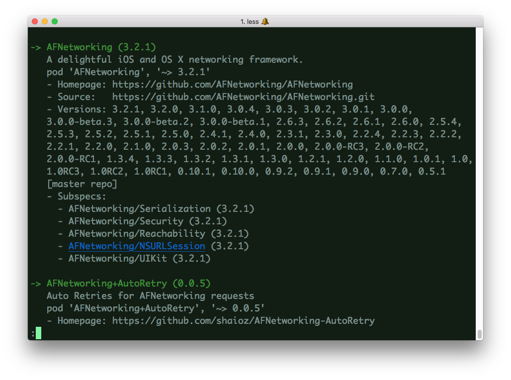
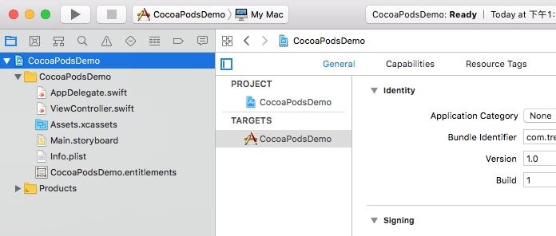
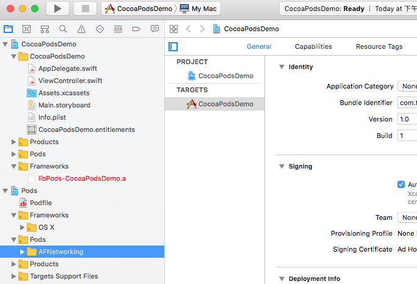

## CocoaPods安装和使用教程

> From: Code4App 原创文章。转载请注明出处：http://code4app.com/article/cocoapods-install-usage

### CocoaPods是什么？

当你开发iOS应用时，会经常使用到很多第三方开源类库，比如JSONKit，AFNetWorking等等。可能某个类库又用到其他类库，所以要使用它，必须得另外下载其他类库，而其他类库又用到其他类库，“子子孙孙无穷尽也”，这也许是比较特殊的情况。总之小编的意思就是，手动一个个去下载所需类库十分麻烦。另外一种常见情况是，你项目中用到的类库有更新，你必须得重新下载新版本，重新加入到项目中，十分麻烦。如果能有什么工具能解决这些恼人的问题，那将“善莫大焉”。所以，你需要 CocoaPods。

CocoaPods应该是iOS最常用最有名的类库管理工具了，上述两个烦人的问题，通过cocoaPods，只需要一行命令就可以完全解决，当然前提是你必须正确设置它。重要的是，绝大部分有名的开源类库，都支持CocoaPods。所以，作为iOS程序员的我们，掌握CocoaPods的使用是必不可少的基本技能了。

### 如何下载和安装CocoaPods？

在安装CocoaPods之前，首先要在本地安装好Ruby环境。至于如何在Mac中安装好Ruby环境，请google一下，本文不再涉及。

假如你在本地已经安装好Ruby环境，那么下载和安装CocoaPods将十分简单，只需要一行命令。在Terminator（也就是终端）中输入以下命令（注意，本文所有命令都是在终端中输入并运行的）：

```
sudo gem install cocoapods
```

但是，且慢。如果你在天朝，在终端中敲入这个命令之后，会发现半天没有任何反应。原因无他，因为那堵墙阻挡了cocoapods.org。（你会问，这都要墙！是的，小编也纳闷。）

但是，是的，又但是（不过是个可喜的“但是”）。我们可以用淘宝的Ruby镜像来访问cocoapods。按照下面的顺序在终端中敲入依次敲入命令：

```
$ gem sources --remove https://rubygems.org/

//等有反应之后再敲入以下命令
$ gem sources -a http://ruby.taobao.org/
```

为了验证你的Ruby镜像是并且仅是taobao，可以用以下命令查看：

```
$ gem sources -l
```

只有在终端中出现下面文字才表明你上面的命令是成功的：

```
*** CURRENT SOURCES ***

        http://ruby.taobao.org/
```

这时候，你再次在终端中运行：

```
$ sudo gem install cocoapods
```

等上十几秒钟，CocoaPods就可以在你本地下载并且安装好了，不再需要其他设置。

### 如何使用CocoaPods？

好了，安装好CocoPods之后，接下来就是使用它。所幸，使用CocoPods和安装它一样简单，也是通过一两行命令就可以搞定。

小编在这里用两种使用场景来具体说明如何使用CocoaPods。

#### 场景1：利用CocoaPods，在项目中导入AFNetworking类库

AFNetworking类库在GitHub地址是：https://github.com/AFNetworking/AFNetworking

为了确定AFNetworking是否支持CocoaPods，可以用CocoaPods的搜索功能验证一下。在终端中输入：

```
$ pod search AFNetworking
```

过几秒钟之后，你会在终端中看到关于AFNetworking类库的一些信息。比如：



这说明，AFNetworking是支持CocoaPods，所以我们可以利用CocoaPods将AFNetworking导入你的项目中。

首先，我们需要在我们的项目中加入CocoaPods的支持。你可以跟随小编的步骤，先利用Xcode创建一个名字CocoaPodsDemo的项目，用于以下的教程。创建好之后，在继续下一步之前，小编先截图，看看项目没有支持CocoaPods时的项目Xcode目录结构：



你看到这里也许会问，CocoaPods为什么能下载AFNetworking呢，而不是下载其他类库呢？这个问题的答案是，有个文件来控制CocoaPods该下载什么。这个文件就叫做“Podfile”（注意，一定得是这个文件名，而且没有后缀）。你创建一个Podfile文件，然后在里面添加你需要下载的类库，也就是告诉CocoaPods，“某某和某某和某某某，快到碗里来！”。每个项目只需要一个Podfile文件。

好吧，废话少说，我们先创建这个神奇的PodFile。在终端中进入（cd命令）你项目所在目录，然后在当前目录下，利用vim创建Podfile，运行：


```
vim Podfile
```

然后在Podfile文件中输入以下文字，然后保存退出。

```
platform :osx, '10.11'

target 'CocoaPodsDemo' do
	pod 'AFNetworking', '~> 3.0'
end
```

注意，这段文字不是小编凭空生成的，可以在AFNetworking的github页面找到。

这时候，你会发现你的项目目录中，出现一个名字为Podfile的文件，而且文件内容就是你刚刚输入的内容。注意，Podfile文件应该和你的工程文件.xcodeproj在同一个目录下。

这时候，你就可以利用CocoPods下载AFNetworking类库了。还是在终端中的当前项目目录下，运行以下命令：

```
$ pod install
```

因为是在你的项目中导入AFNetworking，这就是为什么这个命令需要你进入你的项目所在目录中运行。

运行上述命令之后，小编的终端出现以下信息：

```
Analyzing dependencies
Downloading dependencies
Installing AFNetworking (3.2.1)
Generating Pods project
Integrating client project

[!] Please close any current Xcode sessions and use `CocoaPodsDemo.xcworkspace` for this project from now on.
Sending stats
Pod installation complete! There is 1 dependency from the Podfile and 1 total pod installed.
```

注意最后一句话，意思是：以后打开项目就用 CocoaPodsDemo.xcworkspace 打开，而不是之前的.xcodeproj文件。

你也许会郁闷，为什么会出现.xcodeproj文件呢。这正是你刚刚运行$ pod install命令产生的新文件。除了这个文件，你会发现还多了另外一个文件“Podfile.lock”和一个文件夹“Pods”。 点击 CocoaPodsDemo.xcworkspace 打开之后工程之后，项目Xcode目录结构如下图：



你会惊喜地发现，AFNetwoking已经成功导入项目了！

现在，你就可以开始使用AFNetworking，看看是否出错。如果你严格按照小编上述的步骤来，是不可能出错的啦。

至此，CocoPods的第一个应用场景讲述完毕。别看小编写了这么多，其实过程是十分简单的。总结一下就是：

先在项目中创建Podfile，Podfile的内容是你想导入的类库。一般类库的原作者会告诉你导入该类库应该如何写Podfile；

运行命令：

```
$ pod install.
```

下面，小编继续讲述第二种使用场景。

### 场景2：如何正确编译运行一个包含CocoPods类库的项目

你也许曾经遇到过（特别是新手iOS开发者）这种情况，好不容易在GitHub上找到一份代码符合自己想需求，兴冲冲下载下来，一编译，傻眼了，发现有各种各样错误。一看，原来是缺失了各种其他第三方类库。这时候莫慌，你再仔细一看，会发现你下载的代码包含了Podfile。没错，这意味着你可以用CocoaPods很方便下载所需要的类库。

下面，小编以代码[UAAppReviewManager](https://github.com/UrbanApps/UAAppReviewManager)为例来说明如何正确编译运行一个包含CocoPods类库的项目。

UAAppReviewManager是一个能够让你方便地将提醒用户评分的功能加入你的应用中。当你去UAAppReviewManager的GitHub地址下载这份代码之后，打开Example工程（UAAppReviewManagerExample），编译，你会发现Xcode报告一大堆错误，基本都是说你编译的这份代码找不到某某头文件，这就意味着你要成功编译UAAppReviewManager的Example代码，必须先导入一些第三方类库。同时你会发现在UAAppReviewManagerExample文件夹下面有三个跟CocosPods相关的文件（文件夹）：Podfile，Podfile.lock和Pods，

这时候，打开终端，进入UAAppReviewManagerExample所在的目录，也就是和Podfile在同一目录下，和场景1一样，输入以下命令（由于已经有Podfile，所以不需要再创建Podfile）：

```
$ pod update
```

过几秒（也许需要十几秒，取决于你的网络状况）之后，终端出现：

```
Analyzing dependencies
        Fetching podspec for `UAAppReviewManager` from `../`
        Downloading dependencies
        Installing UAAppReviewManager (0.1.6)
        Generating Pods project
        Integrating client project

        [!] From now on use `UAAppReviewManagerExample.xcworkspace`.
```

打开UAAppReviewManagerExample.xcworkspace，编译运行，成功！

注意，这里有个小问题，如果刚刚你不是输入`$ pod update`，而是输入`$ pod install`，会发现类库导入不成功，并且终端出现下面提示：

```
[!] Required version (UAAppReviewManager (from `../`)) not found for `UAAppReviewManager`.
        Available versions: 0.1.6
```

这里的意思大概是Podfile文件过期，类库有升级，但是Podfile没有更改。`$ pod install`只会按照Podfile的要求来请求类库，如果类库版本号有变化，那么将获取失败。但是 `$ pod update`会更新所有的类库，获取最新版本的类库。而且你会发现，如果用了 `$ pod update`，再用 `$ pod install` 就成功了。

那你也许会问，什么时候用 `$ pod install`，什么时候用 `$ pod update` 呢，我又不知道类库有没有新版本。好吧，那你每次直接用 `$ pod update` 算了。或者先用 `$ pod install`，如果不行，再用 `$ pod update`。

好了，小编就啰嗦到这里吧。上述都只是CocoaPods的最基本用法。要继续研究CocoaPods其他高级用法，请点击这里[CocoaPods Wiki](https://github.com/CocoaPods/CocoaPods/wiki)。