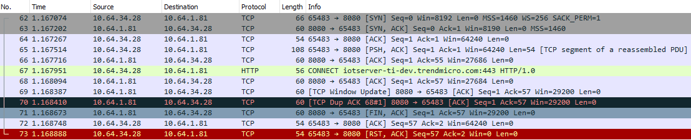

## requests BadStatusLine Error when using HTTP Proxy

> 2018.06.08

因为需要访问AWS，公司提供一个HTTTP代理。平时在Chrome浏览器中使用这个代理，也没出过什么问题。

基于某些特殊原因，希望Python代码中支持设置代理进行测试。查询Python Requests库后，发现requests支持在代码中指定proxies参数或使用环境变量。

下面是参照requests库文档写的python代理。

```
import requests
proxies = {"http": "http://cnnjproxy-gfw.tw.trendnet.org:8080", "https": "http://cnnjproxy-gfw.tw.trendnet.org:8080"}
x = requests.post("https://iotserver-ti-dev.trendmicro.com/", proxies=proxies, data="abc")
print(x.text)
```

运行后出现如下错误：

```
Traceback (most recent call last):
  File "tmp.py", line 3, in <module>
    x = requests.post("https://iotserver-ti-dev.trendmicro.com/", proxies=proxies, data="abc")
  File "C:\Python27\lib\site-packages\requests\api.py", line 107, in post
    return request('post', url, data=data, json=json, **kwargs)
  File "C:\Python27\lib\site-packages\requests\api.py", line 53, in request
    return session.request(method=method, url=url, **kwargs)
  File "C:\Python27\lib\site-packages\requests\sessions.py", line 468, in request
    resp = self.send(prep, **send_kwargs)
  File "C:\Python27\lib\site-packages\requests\sessions.py", line 576, in send
    r = adapter.send(request, **kwargs)
  File "C:\Python27\lib\site-packages\requests\adapters.py", line 426, in send
    raise ConnectionError(err, request=request)
requests.exceptions.ConnectionError: ('Connection aborted.', BadStatusLine("''",))
```

抓包发现应用程序与proxy建立连接后，proxy主动断开了连接。此时，proxy响应的内容为空，requests无法从HTTP Response获取期望的HTTP Status Line。然而将访问的域名直接替换成Server IP的话，请求又可以正常获取结果。

 

<a href="imgs/requests_proxy_BadStatusLine_error.pcapng" > wireshark包 </a>

基于上边情况，我们最后认定，客户端代码应该是没有异常。而是HTTP Proxy存在一定的问题，导致出现BadStatusLine错误。

此外，将requests请求的HTTPS协议换为HTTP协议，代码如下：

```
import requests
proxies = {"http": "http://cnnjproxy-gfw.tw.trendnet.org:8080", "https": "http://cnnjproxy-gfw.tw.trendnet.org:8080"}
x = requests.post("http://iotserver-ti-dev.trendmicro.com/", proxies=proxies, data="abc")
print(x.text)
```

那么会出现如下错误：

```
Traceback (most recent call last):
  File "tmp.py", line 3, in <module>
    x = requests.post("http://iotserver-ti-dev.trendmicro.com/", proxies=proxies, data="abc")
  File "C:\Python27\lib\site-packages\requests\api.py", line 107, in post
    return request('post', url, data=data, json=json, **kwargs)
  File "C:\Python27\lib\site-packages\requests\api.py", line 53, in request
    return session.request(method=method, url=url, **kwargs)
  File "C:\Python27\lib\site-packages\requests\sessions.py", line 468, in request
    resp = self.send(prep, **send_kwargs)
  File "C:\Python27\lib\site-packages\requests\sessions.py", line 576, in send
    r = adapter.send(request, **kwargs)
  File "C:\Python27\lib\site-packages\requests\adapters.py", line 437, in send
    raise ConnectionError(e, request=request)
requests.exceptions.ConnectionError: HTTPConnectionPool(host='cnnjproxy-gfw.tw.trendnet.org', port=8080): Max retries exceeded with url: http://iotserver-ti-dev.trendmicro.com/ (Caused by ProxyError('Cannot connect to proxy.', error(10054, 'An existing connection was forcibly closed by the remote host')))
```

如果将上述代码中域名改为服务器IP，那么请求又可以正常获取结果。

结合上边情况，我们认为真的是代理服务器存在某些原因，导致请求不能通过代理服务正常访问。

解决方案：替换代理服务器。

《完》
