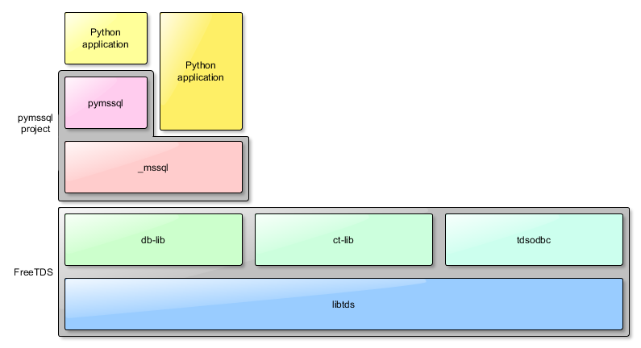

## python pyodbc，pypyodbc和pymssql库的一些区别

> 2018.10.18

### ODBC

ODBC(Open Database Connectivity,开放数据库互连)是微软公司建立了一组规范，并提供了一组对数据库访问的标准API。ODBC本身也提供了对SQL语言的支持，用户可以直接将SQL语句送给ODBC。但ODBC必须通过相应的数据库驱动来与具体的数据库通信。

### pyodbc

pyodbc就是python中实现ODBC这组API的包。通常安装pyodbc执行使用命令`pip install pyodbc`即可，但是在Linux平台中，`pip`会下载pyodbc的源代码，然后进行编译安装。编译的过程中，依赖Linux平台中的`unixodbc-dev`模块。而`unixodbc-dev`模块在Ubuntu中可以使用`apt`包管理命令安装，具体命令为

```
sudo apt install unixodbc-dev
```

在Ubuntu中安装完pyodbc后，如果使用pyodbc访问SqlServer数据库，那么还需要安装对应的驱动程序`Microsoft ODBC Driver for SQL Server on Linux`，并做相应的配置。

最后，Python程序才可以正常SqlServer数据库。

### pypyodbc

按照[pypyodbc源码页面](https://code.google.com/archive/p/pypyodbc/)的讲法，它使用纯python代码实现ODBC的API，所以不再依赖其他第三方模块（可以直接使用pip命令在支持的所有平台上安装）。

> pypyodbc - A pure Python ODBC interface module based on ctypes

但是，安装完pypyodbc后，如果使用pypyodbc访问SqlServer数据库，那么仍然需要安装对应的驱动程序`Microsoft ODBC Driver for SQL Server on Linux`，并做相应的配置。

### pymssql

一般，使用`pip install pymssql`即可在Linux和windows平台上安装使用`pymssql`，而不需要其他额外的配置。这是因为8.1.0版本之后的pip支持[PEP 513](https://www.python.org/dev/peps/pep-0513/)`Linux manylinux1 binary Wheel packages`，并且2.1.3版本之后的pymssql提供包含静态`FreeTDS`的`wheel`包，所以安装时不需要安装额外的依赖。

> First make sure you are using pip version 8.1.0 or newer so you can take advantage of its support for [PEP 513](https://www.python.org/dev/peps/pep-0513/) Linux *manylinux1* binary Wheel packages. Starting with pymssql version 2.1.3 we provide such wheel packages that bundle a static copy of FreeTDS so no additional dependency download or compilation steps are necessary.

当然，上述方式提供的FreeTDS版本存在一些限制，你也可以自己安装FreeTDS。

> The statically-linked FreeTDS version bundled with our official pymssql Linux Wheel package doesn’t have SSL support so it can’t be used to connect to Azure. Also it doesn’t have Kerberos support so it can’t be used to perform domain logins to SQL Server.



The pymssql package consists of two modules:

- pymssql – use it if you care about DB-API compliance, or if you are accustomed to DB-API syntax,
- \_mssql – use it if you care about performance and ease of use (_mssql module is easier to use than pymssql).

### what is FreeTDS

FreeTDS is a set of libraries for Unix and Linux that allows your programs to natively talk to Microsoft SQL Server and Sybase databases.

Technically speaking, FreeTDS is an open source implementation of the **TDS (Tabular Data Stream) protocol** used by these databases for their own clients. It supports many different flavors of the protocol and three APIs to access it. Additionally FreeTDS works with other software such as Perl and PHP, providing access from those languages as well.

FreeTDS has many possible uses. It has been used by Unix/Linux webservers to present data stored in SQL Server to the web, to port SQL Server database code from NT to Unix, to import data into SQL Server from a Unix source, and to provide database access on platforms (such as realtime systems) that have no native drivers.

### 总结

依上所述，安装pymssql访问SqlServer数据库应该是比较简单的方式。不过[微软官方支持pyodbc](https://docs.microsoft.com/en-us/sql/connect/sql-connection-libraries?view=sql-server-2017)，并提供相应的驱动。可以根据自己喜好进行选择，因为pypyodbc已经很多年没有更新，不推荐使用。

[pyodbc installation](https://github.com/mkleehammer/pyodbc/wiki/Install)

[Connection modules for Microsoft SQL databases](https://docs.microsoft.com/en-us/sql/connect/sql-connection-libraries?view=sql-server-2017)

[Step 1: Configure development environment for pyodbc Python development](https://docs.microsoft.com/en-us/sql/connect/python/pyodbc/step-1-configure-development-environment-for-pyodbc-python-development?view=sql-server-2017)

[Install Microsoft ODBC Driver for SQL Server on Linux](https://docs.microsoft.com/en-us/sql/connect/odbc/linux-mac/installing-the-microsoft-odbc-driver-for-sql-server?view=sql-server-2017)

[PyPyODBC （Pure Python)](https://wiki.python.org/moin/Microsoft%20Access)

[pymssql Introduction](http://www.pymssql.org/en/stable/intro.html)

[FreeTDS](http://www.freetds.org/)