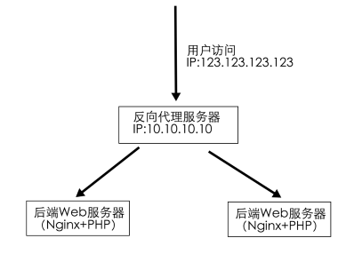

### NGX_HTTP_REALIP_MODULE使用详解

From: https://leo108.com/pid-2132.asp

realip模块的作用是：当本机的nginx处于一个反向代理的后端时获取到真实的用户IP。

如果没有realip模块，nginx的access_log里记录的IP会是反向代理服务器的IP，PHP中$_SERVER['REMOTE_ADDR']的值也是反向代理的IP。

而安装了realip模块，并且配置正确，就可以让nginx日志和php的REMOTE_ADDR都变成真实的用户IP（一层反向代理情况下）。

举一个最简单的例子，网络架构如图：



如果不做任何配置，后端web服务器nginx日志里记录的IP将会是10.10.10.10，这个时候我们增加如下nginx配置：

```
set_real_ip_from  10.10.10.10;
real_ip_header    X-Forwarded-For;
```

**set_real_ip_from指令是告诉nginx，10.10.10.10是我们的反代服务器（信任服务器，记住这个名词，下面会提到），NGX_HTTP_REALIP_MODULE会信任该服务器发送的用户真实IP信息，real_ip_header则是告诉nginx真正的用户IP是存在X-Forwarded-For请求头中。**

重新加载nginx配置之后，就可以看到nginx日志里记录的IP就是123.123.123.123了，php里的REMOTE_ADDR也是123.123.123.123。

**其中，NGX_HTTP_REALIP_MODULE模块中通过set_real_ip_from指令设置的信任该服务器必须保证能够正确传递真实用户的IP信息，否则获取到的用户IP信息将可以被任意伪造**。例如，测试服务器IP为10.64.31.101，nginx的NGX_HTTP_REALIP_MODULE模块配置如下:

```
real_ip_header X-Forwarded-For;
set_real_ip_from 10.64.0.0/16;
```

在两台电脑A(10.64.34.28)和B(10.206.132.10)上分别执行如下Python脚本：

```
import requests
headers = {"X-Forwarded-For": "28.28.28.28"}
r = requests.get("http://10.64.31.101/api/dr/1.0/getip",headers=headers)
print r.text
```

此时，电脑A(10.64.34.28)通过Server API获取自己的真实IP为28.28.28.28，而电脑B(10.206.132.10)通过Server API获取自己的真实IP为10.206.132.10。

realip模块还提供了另外一个指令real_ip_recursive，可以用来处理更加复杂的情况，架构如图：


这个时候如果还用上面的配置，后端nginx的日志里显示的IP就变成了192.168.1.10了，这个时候就需要real_ip_recursive这个指令了。

```
set_real_ip_from  10.10.10.10;
set_real_ip_from  192.168.1.10;
real_ip_header    X-Forwarded-For;
real_ip_recursive on;
```

官网文档对于real_ip_recursive指令的解释十分拗口，看了老半天才明白

**首先要明确一点，realip模块生效的前提是：直接连接nginx的ip是在set_real_ip_from中指定的。**

当real_ip_recursive为off时，nginx会把real_ip_header指定的HTTP头中的最后一个IP当成真实IP

当real_ip_recursive为on时，nginx会把real_ip_header指定的HTTP头中的最后一个不是信任服务器的IP当成真实IP

在这个例子中，当请求到达后端web服务器时，X-Forwarded-For应该是123.123.123.123, 192.168.1.10。如果real_ip_recursive为off，nginx取X-Forwarded-For的最后一个IP也就是192.168.1.10作为真实IP。如果real_ip_recursive为on，由于192.168.1.10是信任服务器IP，所以nginx会继续往前查找，发现123.123.123.123不是信任服务器IP，就认为是真实IP了。
