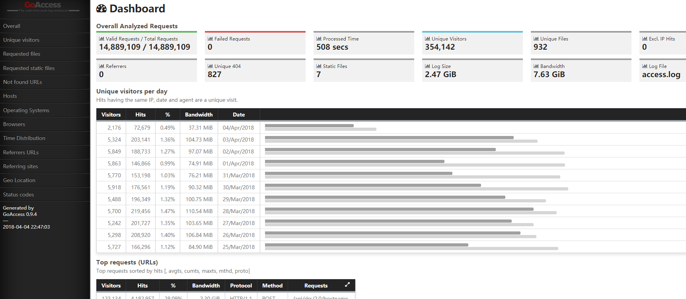

### Nginx日志分析工具goaccess

> 2018.04.06

[goaccess](https://goaccess.io)是一个专业的实时日志分析工具，是用c语言写的，功能强大，能分析nginx，apache等日志。它能够分析访问的来源，访问所有的浏览器，操作系统，它的统计信息不输于一个专业的浏览量统计网站，而且它还能导出成csv、html等格式。

#### 1. 安装goaccess

##### 1.1 通过源代码进行编译安装

```
$ wget http://tar.goaccess.io/goaccess-1.2.tar.gz
$ tar -xzvf goaccess-1.2.tar.gz
$ cd goaccess-1.2/
$ ./configure --enable-utf8 --enable-geoip=legacy
$ make
# make install
```

> The only dependency is ncurses. If outputting real-time HTML, ensure port 7890 is opened. 

> 2018.08.20 another dependency maybe required(Ubuntu 14.04LTS).
Here are the dependencies needed to install and use GoAccess on your VPS. Acquire them using the apt-get package manager.

```
sudo apt-get install libncursesw5-dev libglib2.0-dev libgeoip-dev libtokyocabinet-dev
```

##### 1.2 通过包管理器进行安装

对于Debian/Ubuntu发行版，可以使用如下命令直接安装

```
# apt-get install goaccess
```


Official GoAccess' Debian/Ubuntu Repository

```
$ echo "deb http://deb.goaccess.io/ $(lsb_release -cs) main" | sudo tee -a /etc/apt/sources.list.d/goaccess.list
$ wget -O - https://deb.goaccess.io/gnugpg.key | sudo apt-key add -
$ sudo apt-get update
$ sudo apt-get install goaccess
```

#### 2. 运行goaccess

goaccess解析Log时支持常见Web服务器的默认格式，如果是自定义格式的Log，那么需要在goaccess的配置文件或运行时指定`--log-format`参数。

这里我们自定义的LOG格式如下：


```
1.55.45.132 - - [04/Apr/2018:11:04:45 +0000] "POST /api/drs/2.0/dhcp HTTP/1.1" 200 568 "-" "SpeedTest/1.9.6 (iPhone; iOS 11.2.6; Scale/3.00)" "-" "-" "-" "-" "-" "-" "-"
```

对应的，我们写出LOG解析的格式化字符串


```
#log-format %h %^ %^ [%d:%t %^] "%r" %s %b "%^" "%u" "%^" "%^" "%^" "%^" "%^" "%^" "%^"
```

最终我们运行如下命令，可以得到HTML表示的统计结果。

```
goaccess -f access.log -o report.html --no-global-config --date-format %d/%b/%Y  --time-format  %H:%M:%S  --log-format "%h %^ %^ [%d:%t %^] \"%r\" %s %b \"%^\" \"%u\" \"%^\" \"%^\" \"%^\" \"%^\" \"%^\" \"%^\" \"%^\""
```

上述命令中，其他参数含义如下：

`--no-global-config` 忽略全局配置文件

`--date-format` Log中日期的格式，此处使用`%d/%b/%Y `

`--time-format` Log中时间的格式，此处使用`%H:%M:%S`


`log-format`的格式化字符串可以参考goaccess的帮助页面，The log-format variable followed by a space or \t for tab-delimited, specifies the log format string.

如果一切顺利，那么你将会得到一个如下图所示的HTML结果页面




[GoAccess Installation](https://goaccess.io/download)

[GoAccess Manual Page](https://goaccess.io/man#custom-log)