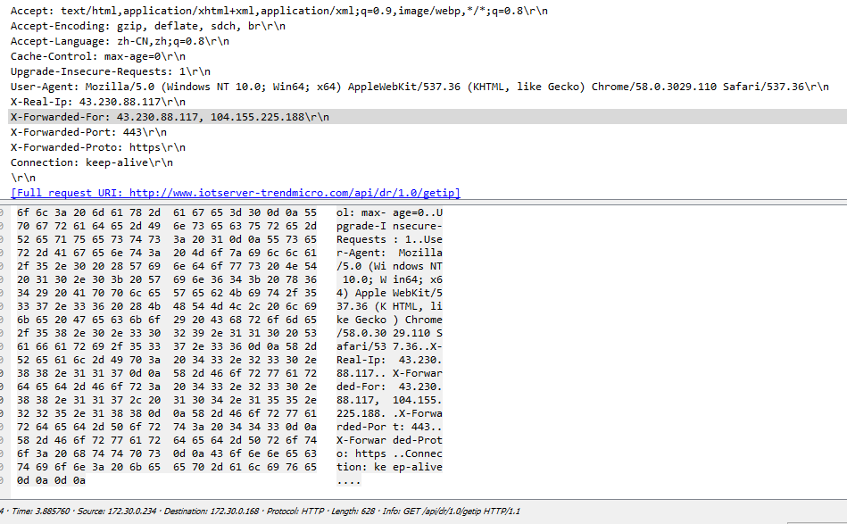

### flask中HTTP Header的获取和处理方式

uWSGI会把接收到的请求按照指定协议解析，然后把解析的结果（譬如：HTTP各请求头数据）设置到environ变量中，接着按照WSGI规范回调web应用（uWSGI默认回调application函数，并且传递environ和start_response两个参数），最终web应用开始处理请求，并把结果返回给uWSGI。 

对于flask中，取客户端IP Address可以使用如下代码：

```
from flask import request
request.remote_addr
```

但当用户与服务器间存在代理服务器时，那么`request.remote_addr`获取到的将会是代理服务器的IP。
这种情况可以使用`X-Forwarded-For` HTTP Header来处理，并且Nginx中包含一个`NGX_HTTP_REALIP_MODULE`模块，可以获取用户的真实IP并放置在`X_Real_Ip`头中。

Nginx安装了realip模块，并且配置正确，就可以使用如下代码获取客户端IP：

```
from flask import request
request.environ.get('HTTP_X_REAL_IP', request.remote_addr)
```

`X_Real_Ip`头为realip模块中自定义的。上述代码为：如果`X_Real_Ip`头的值为空，那么就使用request.remote_addr的值作为客户端IP。

`HTTP_X_REAL_IP`猜测为flask将HTTP 请求头写入environ字典中时的命名规则。

可以使用如下代码直接查看`X-Forwarded-For` HTTP header的值：

```
from flask import request
request.headers.get('X-Forwarded-For')
request.environ.get('HTTP_X_FORWARDED_FOR')
```

当存在三层代理（最后一个为Nginx代理与flask位于同一台服务器上并使用unix socket通信），最后一个代理安装并配置好realip模块后，在最后一个服务器抓取的数据包如下图：



此时各个代码输出结果如下：
```
request.headers.get('X-Forwarded-For'): "157.119.234.163, 104.155.225.188"
request.environ.get('HTTP_X_FORWARDED_FOR'): "157.119.234.163, 104.155.225.188"
request.remote_addr: "104.155.225.188"
request.environ.get('HTTP_X_REAL_IP'): "157.119.234.163"
request.environ.get('HTTP_X_REAL_IP', request.remote_addr): "157.119.234.163"
```
