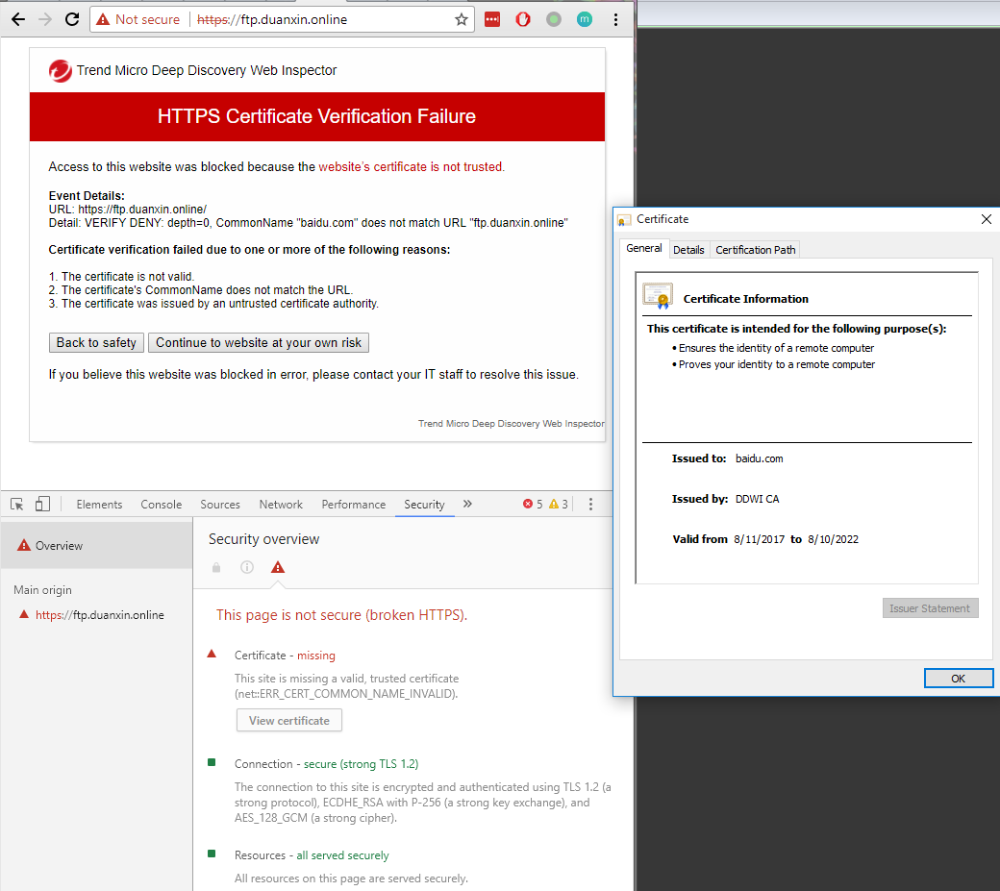

### 域名的CNAME与SSL证书的关系

如存在两个域名AAA.com和BBB.com，解析如下配置时

```
AAA.com    CNAME -->  BBB.com
BBB.com    A记录 -->  IP Address
```

在浏览器中访问是，如果输入域名AAA.com，那么服务器必须返回AAA.com的证书，SSL证书校验才能通过。

如果输入BBB.com，那么服务器必须返回BBB.com的证书，SSL证书校验才能通过。



简单说，域名DNS解析和浏览器校验SSL证书是两个不独立的过程。

所以即使AAA.com的CNAME解析为BBB.com，用户在浏览器中通过AAA.com访问web服务器是，仍然需要AAA.com的SSL证书，如果不能获取到AAA.com的证书，那么SSL证书校验就会失败。

如果Web服务器支持SNI (Server Name Indication)，那么根据不同的域名返回不同的证书，就可以解决上述问题。

Reference：[新域名通过 cname 绑定一个已部署 SSL 的域名，数据是否被 SSL 加密？](https://www.v2ex.com/amp/t/287903)