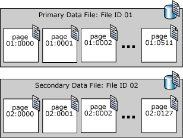

##### 数据库文件和文件组

每个 SQL Server 数据库至少具有两个操作系统文件：一个数据文件和一个日志文件。 数据文件包含数据和对象，例如表、索引、存储过程和视图。 日志文件包含恢复数据库中的所有事务所需的信息。 为了便于分配和管理，可以将数据文件集合起来，放到文件组中。

###### 数据库文件

SQL Server 数据库具有三种类型的文件，如下表所示：

| 文件   | 说明   |
|--------|--------|
|主      |主要数据文件包含数据库的启动信息，并指向数据库中的其他文件。 用户数据和对象可存储在此文件中，也可以存储在次要数据文件中。 每个数据库有一个主要数据文件。<br /> 主要数据文件的建议文件扩展名是 .mdf。|
|辅助副本|   次要数据文件是可选的，由用户定义并存储用户数据。 通过将每个文件放在不同的磁盘驱动器上，次要文件可用于将数据分散到多个磁盘上。 另外，如果数据库超过了单个 Windows 文件的最大大小，可以使用次要数据文件，这样数据库就能继续增长。 <br />次要数据文件的建议文件扩展名是 .ndf。|
|事务日志|  事务日志文件保存用于恢复数据库的日志信息。 每个数据库必须至少有一个日志文件。 事务日志的建议文件扩展名是 .ldf。|

例如，可以创建一个简单的数据库 **Sales** ，其中包括一个包含所有数据和对象的主要文件和一个包含事务日志信息的日志文件。 也可以创建一个更复杂的数据库 **Orders** ，其中包括一个主要文件和五个次要文件。 数据库中的数据和对象分散在所有六个文件中。

**默认情况下，数据和事务日志被放在同一个驱动器上的同一个路径下。 这是为处理单磁盘系统而采用的方法。 但是，在生产环境中，这可能不是最佳的方法。 建议将数据和日志文件放在不同的磁盘上。**

###### 逻辑和物理文件名称

SQL Server 文件有两个名称：

**logical_file_name: logical_file_name** 是在所有 Transact-SQL 语句中引用物理文件时所使用的名称。 逻辑文件名必须符合 SQL Server 标识符规则，而且在数据库中的逻辑文件名中必须唯一。

**os_file_name: os_file_name** 是包括目录路径的物理文件的名称。 它必须符合操作系统文件命名规则。

SQL Server 数据和日志文件可保存在 FAT 或 NTFS 文件系统中。 由于 NTFS 在安全方面具有优势，因此，我们建议您使用 NTFS 文件系统。 可读/写数据文件组和日志文件不能保存在 NTFS 压缩文件系统中。 只有只读数据库和只读次要文件组可以保存在 NTFS 压缩文件系统中。

###### 数据文件页

SQL Server 数据文件中的页面按顺序编号，文件的首页以零 (0) 开头。 数据库中的每个文件都有一个唯一的文件 ID 号。 若要唯一标识数据库中的页，需要同时使用文件 ID 和页码。 下例显示了包含 4-MB 主数据文件和 1-MB 次要数据文件的数据库中的页码。



每个文件的第一页是一个包含有关文件属性信息的文件的页首页。 在文件开始处的其他几页也包含系统信息（例如分配映射）。 有一个存储在主数据文件和第一个日志文件中的系统页是包含数据库属性信息的数据库引导页。 

###### 文件大小

SQL Server 文件可从其最初指定的大小开始自动增长。在定义文件时，您可以指定一个特定的增量。每次填充文件时，其大小均按此增量来增长。 如果文件组中有多个文件，则它们在所有文件被填满之前不会自动增长。填满后，这些文件会循环增长。

每个文件还可以指定一个最大大小。如果没有指定最大大小，文件可以一直增长到用完磁盘上的所有可用空间。 如果 SQL Server 作为数据库嵌入某应用程序，而该程序的用户无法迅速与系统管理员联系，此功能会特别有用。 用户可以使文件根据需要自动增长，以减轻监视数据库中的可用空间和手动分配额外空间的管理负担。

###### 数据库快照文件

数据库快照存储其“写入时复制”的数据。数据库快照文件格式取决于快照是由用户创建，还是在内部使用：

- 用户创建的数据库快照将其数据存储在一个或多个稀疏文件中。稀疏文件技术是 NTFS 文件系统的一项功能。首先，稀疏文件不包含任何用户数据，并且没有为稀疏文件分配用于用户数据的磁盘空间。若要大致了解如何在数据库快照中使用稀疏文件以及数据库快照如何增长，请参阅[查看数据库快照的稀疏文件的大小](https://msdn.microsoft.com/zh-cn/library/ms175823.aspx)。

- 数据库快照通过特定的 DBCC 命令在内部使用。 这些命令包括 DBCC CHECKDB、DBCC CHECKTABLE、DBCC CHECKALLOC 和 DBCC CHECKFILEGROUP。 内部数据库快照使用原始数据库文件的稀疏备用数据流。 和稀疏文件一样，备用数据库流也是 NTFS 文件系统的一项功能。 使用稀疏备用数据流，可以进行多项数据分配，使其与单个文件或文件夹进行关联，但不影响文件大小或卷统计信息。

###### 文件组
每个数据库有一个主要文件组。此文件组包含主要数据文件和未放入其他文件组的所有次要文件。可以创建用户定义的文件组，用于将数据文件集合起来，以便于管理、数据分配和放置。

例如，可以分别在三个磁盘驱动器上创建三个文件 Data1.ndf、Data2.ndf 和 Data3.ndf，然后将它们分配给文件组 fgroup1。 然后，可以明确地在文件组 fgroup1上创建一个表。 对表中数据的查询将分散到三个磁盘上，从而提高了性能。 通过使用在 RAID（独立磁盘冗余阵列）条带集上创建的单个文件也能获得同样的性能提高。但是，文件和文件组使您能够轻松地在新磁盘上添加新文件。

下表列出了存储在文件组中的所有数据文件。

|文件组 |说明  |
|-------|------|
|主     |包含主要文件的文件组。 所有系统表都被分配到主要文件组中。|
|用户定义|用户首次创建数据库或以后修改数据库时明确创建的任何文件组。|

**默认文件组**如果在数据库中创建对象时没有指定对象所属的文件组，对象将被分配给默认文件组。不管何时，只能将一个文件组指定为默认文件组。默认文件组中的文件必须足够大，能够容纳未分配给其他文件组的所有新对象。

**PRIMARY**文件组是默认文件组，除非使用 ALTER DATABASE 语句进行了更改。但系统对象和表仍然分配给 PRIMARY 文件组，而不是新的默认文件组。

###### 文件和文件组示例
以下示例在 SQL Server 实例上创建了一个数据库。 该数据库包括一个主数据文件、一个用户定义文件组和一个日志文件。 主数据文件在主文件组中，而用户定义文件组包含两个次要数据文件。 ALTER DATABASE 语句将用户定义文件组指定为默认文件组。 然后通过指定用户定义文件组来创建表。 （此示例使用通用路径 c:\Program Files\Microsoft SQL Server\MSSQL.1 来避免指定 SQL Server 版本。）

```
USE master;
GO
-- Create the database with the default data
-- filegroup and a log file. Specify the
-- growth increment and the max size for the
-- primary data file.
CREATE DATABASE MyDB
ON PRIMARY
  ( NAME='MyDB_Primary',
    FILENAME=
       'c:\Program Files\Microsoft SQL Server\MSSQL.1\MSSQL\data\MyDB_Prm.mdf',
    SIZE=4MB,
    MAXSIZE=10MB,
    FILEGROWTH=1MB),
FILEGROUP MyDB_FG1
  ( NAME = 'MyDB_FG1_Dat1',
    FILENAME =
       'c:\Program Files\Microsoft SQL Server\MSSQL.1\MSSQL\data\MyDB_FG1_1.ndf',
    SIZE = 1MB,
    MAXSIZE=10MB,
    FILEGROWTH=1MB),
  ( NAME = 'MyDB_FG1_Dat2',
    FILENAME =
       'c:\Program Files\Microsoft SQL Server\MSSQL.1\MSSQL\data\MyDB_FG1_2.ndf',
    SIZE = 1MB,
    MAXSIZE=10MB,
    FILEGROWTH=1MB)
LOG ON
  ( NAME='MyDB_log',
    FILENAME =
       'c:\Program Files\Microsoft SQL Server\MSSQL.1\MSSQL\data\MyDB.ldf',
    SIZE=1MB,
    MAXSIZE=10MB,
    FILEGROWTH=1MB);
GO
ALTER DATABASE MyDB 
  MODIFY FILEGROUP MyDB_FG1 DEFAULT;
GO

-- Create a table in the user-defined filegroup.
USE MyDB;
CREATE TABLE MyTable
  ( cola int PRIMARY KEY,
    colb char(8) )
ON MyDB_FG1;
GO
```

下图总结上述示例的结果。


From: [数据库文件和文件组](https://msdn.microsoft.com/zh-cn/library/ms189563.aspx)