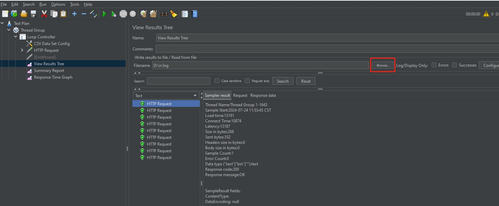

# JMeter View Results Tree 组件

利用View Results Tree组件可以很方便的查看请求的数据，响应的数据，并且该组件可以很方便低写入和读取日志问题，当出现问题的时候可以用来分析问题，在jmeter中使用的频率很高。`View Results Tree`的添加路径：`Test Plan / Thread Group / 取样器->Add->Listener->View Results Tree`

使用JMeter命令进行压力测试时`.\jmeter -l rr.log`参数可以指定保存日志文件路径。如下是一次运行rr.log的样例数据

```
timeStamp,elapsed,label,responseCode,responseMessage,threadName,dataType,success,failureMessage,bytes,sentBytes,grpThreads,allThreads,URL,Latency,IdleTime,Connect
1721793225178,13191,HTTP Request,200,OK,Thread Group 1-1643,text,true,,268,352,2000,2000,https://baidu.com,13187,0,10874
1721793225444,12971,HTTP Request,200,OK,Thread Group 1-142,text,true,,268,352,2000,2000,https://baidu.com,12971,0,12915
1721793225719,12702,HTTP Request,200,OK,Thread Group 1-1897,text,true,,268,352,2000,2000,https://baidu.com,12702,0,12647
1721793238382,69,HTTP Request,200,OK,Thread Group 1-1643,text,true,,268,352,2000,2000,https://baidu.com,69,0,0
1721793225131,13311,HTTP Request,200,OK,Thread Group 1-1622,text,true,,268,352,2000,2000,https://baidu.com,13311,0,13236
1721793225840,12602,HTTP Request,200,OK,Thread Group 1-961,text,true,,268,352,2000,2000,https://baidu.com,12602,0,10202
1721793224856,13586,HTTP Request,200,OK,Thread Group 1-611,text,true,,268,352,2000,2000,https://baidu.com,13586,0,11189
1721793225413,13024,HTTP Request,200,OK,Thread Group 1-100,text,true,,268,351,2000,2000,https://baidu.com,13024,0,12959
1721793225121,13322,HTTP Request,200,OK,Thread Group 1-1602,text,true,,268,350,2000,2000,https://baidu.com,13322,0,13264
```

使用`View Results Tree`组件打开现有的rr.log日志文件，显示如下：



其中，显示的`Load time`对应日志文件中的`elapsed`。日志中几个时间相关字段详细含义分别如下：

In JMeter, we can get the Load time of a sample by adding "View Results Tree" listener in the test plan or thread group. Along with "Load time" we also get "Latency" and "Connect Time" values in "View Results Tree" listener under "Sampler Result" tab of JMeter.

Below is difference between Load time, Latency and Connect Time:

`Load time`（`elapsed`）:
- Load time is total time taken from start of a request and when the request is complete.
- Load time will always be greater than Latency and Connect time.

`Latency`:
- Latency the time taken from sending a request to server and the first byte of the data is collected.
- Latency time will be greater than Connect time.

`Connect Time`（`Connect`）:
- Connect Time is the waiting time taken from sending of a request and the connection is established with the server.

在JMeter中，Connect值通常指的是建立连接所花费的时间，这个时间包括与服务器建立TCP连接所需的时间，以及（在需要时）SSL/TLS握手的时间。这个值对于评估网络延迟和服务器连接性能非常重要。

具体来说，Connect时间包括以下几个部分：

1. TCP连接建立时间：从JMeter客户端发起TCP连接请求到服务器确认连接建立的时间。这个时间取决于网络延迟、服务器负载和TCP/IP协议栈的处理速度。

2. SSL/TLS握手时间（如果适用）：如果请求是安全的（即使用HTTPS协议），那么在TCP连接建立之后，还需要进行SSL/TLS握手以建立加密的通信通道。SSL/TLS握手时间包括协商加密算法、验证服务器证书等步骤所需的时间。

Connect时间通常小于Latency时间和Elapsed时间。Latency时间是从发送请求到收到响应的第一个字节的时间，而Elapsed时间是从发送请求到收到完整响应的时间。因此，Connect时间只是整个请求-响应周期中的一部分。

值得注意的是，JMeter的官方文档和界面可能并不直接显示“Connect”这个值，而是通过其他方式（如Latency和Elapsed时间）来间接反映连接时间。然而，在一些情况下（如使用特定的监听器或插件），JMeter可能提供直接测量Connect时间的功能。


## Apache JMete 官网更详细解释

`Elapsed time`. JMeter measures the elapsed time from just before sending the request to just after the last response has been received. JMeter does not include the time needed to render the response, nor does JMeter process any client code, for example Javascript.

`Latency`. JMeter measures the latency from just before sending the request to just after the first response has been received. Thus the time includes all the processing needed to assemble the request as well as assembling the first part of the response, which in general will be longer than one byte. Protocol analysers (such as Wireshark) measure the time when bytes are actually sent/received over the interface. The JMeter time should be closer to that which is experienced by a browser or other application client.

`Connect Time`. JMeter measures the time it took to establish the connection, including SSL handshake. **Note that connect time is not automatically subtracted from `latency`.** In case of connection error, the metric will be equal to the time it took to face the error, for example in case of Timeout, it should be equal to connection timeout.

> As of JMeter 3.1, this metric is only computed for TCP Sampler, HTTP Request and JDBC Request.


参考：

[What is JMeter’s load time?](https://www.quora.com/What-is-JMeter-s-load-time)

[Apache JMete Glossary](https://jmeter.apache.org/usermanual/glossary.html)

[JMeter: Latency vs. Load Time](https://www.baeldung.com/java-jmeter-latency-vs-load-time)
