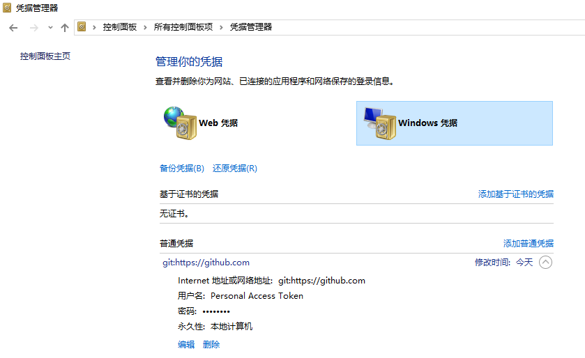

###git cli向服务器push代码时用户身份切换问题

>keywords: git 用户切换 凭据切换 用户错误 凭据错误

由于各种原因自己持有两个github的账号，就说userA和userB吧。

一天突然需要往userB的账号下已有的一个项目中推送代码，结果git总是提示权限拒绝错误。错误信息如下

```
remote: Permission to userB/notes.git denied to userA.
fatal: unable to access 'https://github.com/userB/notes.git/': The requested URL returned error: 403
```

错误提示很明显，git push时使用了userA的凭据信息，所以server拒绝了请求。

然而，查看一圈后一直没能找到如何在git push操作时让git正确使用userB凭据的方法。包括下面修改user.name和user.email的方法并不起作用。

```
git config user.name userB
git config user.email userB@gmail.com
```

一般在Linux终端中，如果因为修改了用户密码，可以使用命令`git config --global --unset core.askpass`允许自己提交时输入新密码，但这条命令对于这种情况也不能起到帮助作用。

最后，在一篇[GitHub changing user account on windows](https://nirklars.wordpress.com/tag/git-push-wrong-username/)文章中找到答案。
原来git在windows 10上安装后，默认使用windows的“凭据管理器”来管理用户使用git时输入的用户名和密码凭据。



一般情况下用户只使用一个github账号，所以并不会察觉到什么问题。当需要使用另一个账号推送代码时就会出现上述问题（实质上是git credential-manager的问题）。

然而我并没有找到切换用户的简单方法，只是简单的在“凭据管理器”中删除git在“windows凭据”中存储github网址的凭据，这样在下次git push操作时，就有机会输入新的用户名和密码。


Reference:
[(git-push-wrong-username)GitHub changing user account on windows](https://nirklars.wordpress.com/tag/git-push-wrong-username/)

[remove credentials from git](http://stackoverflow.com/questions/15381198/remove-credentials-from-git)